# Technical Design Document — Client Onboarding Feature

## 1. Architecture & Component Hierarchy

```mermaid
graph TD
    subgraph Client_Flow [Client Intake Flow]
        A[WhatsApp / Call Link] --> B[Public Web Form: /onboard]
        B --> C[Bot Protection & Zod Validation]
        C --> D[Database: client_onboardings]
        D --> E1[Resend: Admin Alert Email]
        D --> E2[Resend: Client Acknowledgment Email]
    end

    subgraph Admin_Flow [Admin Conversion Flow]
        F[Admin: /relationships/onboarding] --> G[Onboarding Submissions Table]
        G --> H[Review Drawer + Duplicate Check]
        H --> I[Atomic 1-Click Server Action]
        I --> J[(Database Transaction)]
        J --> K1[Insert: clients table]
        J --> K2[Update: client_onboardings status='converted']
        K1 --> L[Optional: Send Portal Invitation]
    end
```



---

## 2. Database Design & Entity Alignments

### A. Schema Updates to `clients` (`packages/db/src/schema/clients.ts`)
To hold complete business and billing data natively without fragmented lookup tables:

```typescript
// Additions to clients table in packages/db/src/schema/clients.ts
registrationNumber: text('registration_number'),
vatNumber: text('vat_number'),
billingEmail: text('billing_email'),
billingAddress: text('billing_address'),
city: text('city'),
postalCode: text('postal_code'),
province: text('province'),
website: text('website'),
```

### B. New Staging Table `client_onboardings` (`packages/db/src/schema/onboarding.ts`)

```typescript
export const onboardingStatusEnum = pgEnum('onboarding_status', [
  'pending',
  'converted',
  'rejected',
  'archived',
]);

export const clientOnboardings = pgTable(
  'client_onboardings',
  {
    id: uuid('id').primaryKey().defaultRandom(),
    divisionId: uuid('division_id').references(() => divisions.id, { onDelete: 'set null' }),
    
    // Contact Info
    contactName: text('contact_name').notNull(),
    contactEmail: text('contact_email').notNull(),
    contactPhone: text('contact_phone').notNull(),
    
    // Business Info
    companyName: text('company_name').notNull(),
    tradingName: text('trading_name'),
    registrationNumber: text('registration_number'),
    vatNumber: text('vat_number'),
    websiteUrl: text('website_url'),
    
    // Billing & Address
    billingEmail: text('billing_email'),
    billingAddress: text('billing_address'),
    city: text('city'),
    postalCode: text('postal_code'),
    province: text('province'),
    
    // Service & Notes
    serviceInterests: text('service_interests'),
    notes: text('notes'),
    
    // Workflow Status
    status: onboardingStatusEnum('status').notNull().default('pending'),
    convertedClientId: uuid('converted_client_id').references(() => clients.id, { onDelete: 'set null' }),
    reviewedBy: text('reviewed_by').references(() => user.id, { onDelete: 'set null' }),
    reviewedAt: timestamp('reviewed_at', { withTimezone: true }),
    
    createdAt: timestamp('created_at', { withTimezone: true }).defaultNow().notNull(),
    updatedAt: timestamp('updated_at', { withTimezone: true }),
  },
  (t) => [
    index('onboarding_status_idx').on(t.status),
    index('onboarding_created_at_idx').on(t.createdAt),
    index('onboarding_contact_email_idx').on(t.contactEmail),
  ]
);
```

---

## 3. Server Actions & Backend Contract

### A. Public Submission (`submitClientOnboarding`)
- **Location**: Public route / Astro action / Next.js API.
- **Security**: Verifies Turnstile token, honeypot (`_website`), and submission timestamp (> 2s elapsed).
- **Validation**: Zod schema validating email formats, South African phone normalization (`+27...`), and required fields.
- **Persistence**: Inserts `client_onboardings` row with status `pending`.
- **Side-effects**: Asynchronously triggers admin alert and client receipt via `@pmg/emails`.

### B. 1-Click Conversion (`convertOnboardingToClient`)
- **Location**: `apps/admin/src/actions/crm/onboarding.ts`
- **Auth**: Requires active admin session (`getSessionOrRedirect`).
- **Transaction Protocol**:
  1. `SELECT ... FOR UPDATE` on `client_onboardings` by ID.
  2. Verify record exists and `status === 'pending'`.
  3. Check uniqueness of `contactEmail` against `clients.email`.
  4. `INSERT INTO clients` with full contact, business, tax, and address fields.
  5. `UPDATE client_onboardings` setting `status = 'converted'`, `convertedClientId = client.id`, `reviewedBy = session.user.id`, `reviewedAt = NOW()`.
  6. If `sendPortalInvite === true`, invoke `sendPortalInvitation(client.id)`.
  7. Revalidate Next.js cache paths (`/relationships/onboarding`, `/relationships/clients`, `/dashboard`).

---

## 4. UI / UX Design & Components

### A. Public Onboarding View (`apps/pmg/src/pages/onboard/index.astro`)
- Multi-step state: Contact (Step 1) → Business Legal (Step 2) → Invoicing Address (Step 3).
- Responsive down to 320px mobile screens without overflow.
- Dynamic theme switching depending on division query param:
  - `pmg`: Deep Slate / Violet primary accents.
  - `tes`: High-contrast Gold / Black compliance theme.
  - `aws`: Tech Blue / Teal modern accent.

### B. Admin Submissions View (`apps/admin/src/app/(admin)/relationships/onboarding`)
- Tab navigation: `Pending (N)` | `Converted` | `All`.
- Quick-Share WhatsApp link generator modal.
- Submission Card / Row with 1-click **"Review & Convert"** trigger.
- Review Drawer displaying:
  - Client Details Preview & live Duplicate Check banner.
  - **"⚡ Save as Client"** primary button with pending/optimistic loading feedback.
