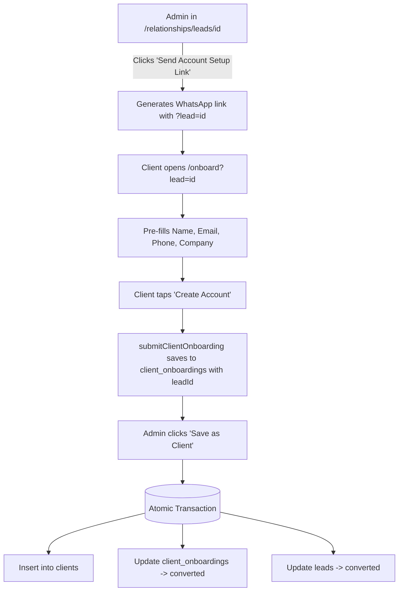

# Technical Design — Ultra-Lean Client Account Creation

## 1. Minimalist Schema & Lead Pre-Fill Architecture



---

## 2. Table Specifications

### A. Additions to `clients` (`packages/db/src/schema/clients.ts`)

```typescript
registrationNumber: text('registration_number'),
website: text('website'),
billingAddress: text('billing_address'),
city: text('city'),
postalCode: text('postal_code'),
province: text('province'),
```

### B. Staging Table `client_onboardings` (`packages/db/src/schema/onboarding.ts`)

```typescript
export const clientOnboardings = pgTable(
  'client_onboardings',
  {
    id: uuid('id').primaryKey().defaultRandom(),
    divisionId: uuid('division_id').references(() => divisions.id, { onDelete: 'set null' }),
    leadId: uuid('lead_id').references(() => leads.id, { onDelete: 'set null' }),

    // Core Profile Essentials
    contactName: text('contact_name').notNull(),
    companyName: text('company_name').notNull(),
    email: text('email').notNull(),
    phone: text('phone').notNull(),

    // Optional
    registrationNumber: text('registration_number'),
    notes: text('notes'),

    // Status
    status: onboardingStatusEnum('status').notNull().default('pending'),
    convertedClientId: uuid('converted_client_id').references(() => clients.id, {
      onDelete: 'set null',
    }),
    reviewedBy: text('reviewed_by').references(() => user.id, { onDelete: 'set null' }),
    reviewedAt: timestamp('reviewed_at', { withTimezone: true }),
    createdAt: timestamp('created_at', { withTimezone: true }).defaultNow().notNull(),
    updatedAt: timestamp('updated_at', { withTimezone: true }),
  },
  (t) => [
    index('onboarding_status_idx').on(t.status),
    index('onboarding_lead_id_idx').on(t.leadId),
  ],
);
```
