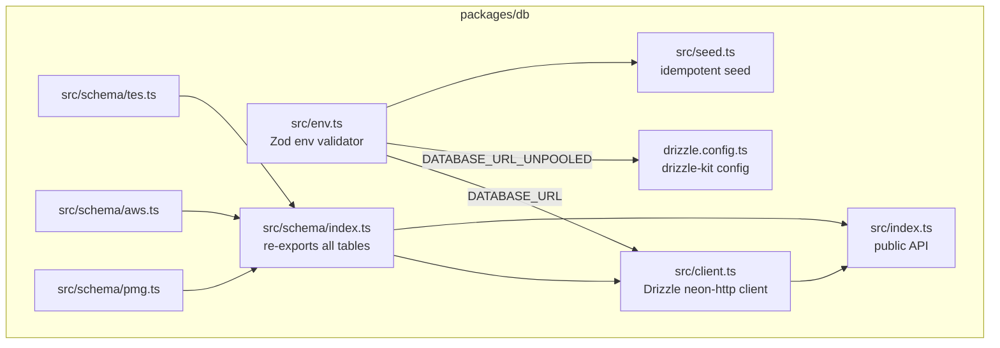

# Design Document: database-integration

## Overview

The `@pmg/db` package is the single shared database layer for the PMG Hub monorepo. It uses [Neon](https://neon.tech) (serverless PostgreSQL) with [Drizzle ORM](https://orm.drizzle.team) and the `neon-http` driver.

This design covers only the `packages/db` package itself:

- Package structure and file layout
- Environment validation
- Schema definitions (tables, enums, indexes, TypeScript types)
- `drizzle.config.ts` configuration
- Migration workflow (`drizzle-kit generate` + `drizzle-kit push`)
- Seed script for `aws_pricing`
- Package exports
- Turborepo pipeline wiring

App integration (consuming `@pmg/db` in individual apps) is out of scope.

---

## Architecture



Two environment variables are required:

- `DATABASE_URL` — Neon pooled connection string (PgBouncer). Used by the runtime `db` client for all application queries.
- `DATABASE_URL_UNPOOLED` — Neon direct connection string. Used exclusively by `drizzle.config.ts` for `drizzle-kit` commands, because Neon's PgBouncer pooler does not support DDL transactions.

No build step is needed. Bun resolves workspace packages directly to `src/index.ts` via the `exports` field in `package.json`.

---

## Components and Interfaces

### `src/env.ts` — Environment Validator

Validates both connection strings at import time using Zod. Throws immediately with a descriptive error if either variable is missing or not a valid URL. All other modules import `env` from here rather than reading `process.env` directly.

```ts
// Public shape
export const env: {
  DATABASE_URL: string;        // pooled — runtime queries
  DATABASE_URL_UNPOOLED: string; // direct — migrations only
}
```

### `src/client.ts` — Drizzle Client

Constructs the Drizzle ORM client using the `neon-http` driver and `DATABASE_URL`.

```ts
export const db: NeonHttpDatabase<typeof schema>
```

### `src/schema/tes.ts` — TES Schema

Exports:
- `tesServiceEnum` — `pgEnum("tes_service", [...])`
- `tesLeadStatusEnum` — `pgEnum("tes_lead_status", [...])`
- `tesLeads` — `pgTable("tes_leads", {...})`
- `TesLead` — `typeof tesLeads.$inferSelect`
- `NewTesLead` — `typeof tesLeads.$inferInsert`

### `src/schema/aws.ts` — AWS Schema

Exports:
- `awsPackageTypeEnum` — `pgEnum("aws_package_type", [...])`
- `awsMessageStatusEnum` — `pgEnum("aws_message_status", [...])`
- `awsBookingStatusEnum` — `pgEnum("aws_booking_status", [...])`
- `awsMessages` — `pgTable("aws_messages", {...})`
- `awsBookings` — `pgTable("aws_bookings", {...})`
- `awsPricing` — `pgTable("aws_pricing", {...})`
- `AwsMessage`, `NewAwsMessage`
- `AwsBooking`, `NewAwsBooking`
- `AwsPricing`, `NewAwsPricing`

### `src/schema/pmg.ts` — PMG Schema

Exports:
- `pmgLeadServiceEnum` — `pgEnum("pmg_lead_service", [...])`
- `pmgLeadStatusEnum` — `pgEnum("pmg_lead_status", [...])`
- `pmgLeads` — `pgTable("pmg_leads", {...})`
- `PmgLead` — `typeof pmgLeads.$inferSelect`
- `NewPmgLead` — `typeof pmgLeads.$inferInsert`

### `src/schema/index.ts` — Schema Barrel

Re-exports everything from `tes.ts`, `aws.ts`, and `pmg.ts`. The `connection_test` table is removed entirely.

### `src/index.ts` — Public Entry Point

```ts
export * from "./client";
export * from "./schema";
```

### `src/seed.ts` — Seed Script

Standalone script (run directly with `bun packages/db/src/seed.ts`). Inserts initial `aws_pricing` rows using `onConflictDoNothing()` for idempotence. Does not export anything.

### `drizzle.config.ts` — Drizzle Kit Config

```ts
export default defineConfig({
  schema: "./src/schema/index.ts",
  out: "./src/migrations",
  dialect: "postgresql",
  dbCredentials: {
    url: env.DATABASE_URL_UNPOOLED,  // direct connection required for DDL
  },
});
```

---

## Data Models

### Enums

| Enum name | Values |
|---|---|
| `tes_service` | `bid_preparation`, `tender_tracking`, `compliance_docs`, `method_statements`, `pricing_boq`, `post_award`, `project_management`, `full_service` |
| `tes_lead_status` | `new`, `contacted`, `converted`, `archived` |
| `aws_package_type` | `monthly`, `once_off` |
| `aws_message_status` | `new`, `read`, `replied`, `archived` |
| `aws_booking_status` | `new`, `contacted`, `active`, `completed`, `cancelled` |
| `pmg_lead_service` | `tendering`, `web_dev`, `both`, `general` |
| `pmg_lead_status` | `new`, `contacted`, `referred_tes`, `referred_aws`, `converted`, `archived` |

### `tes_leads`

| Column | Type | Constraints |
|---|---|---|
| `id` | uuid | PK, defaultRandom |
| `name` | text | not null |
| `email` | text | not null |
| `phone` | text | not null |
| `company` | text | nullable |
| `service_interest` | `tes_service` | nullable |
| `message` | text | not null |
| `newsletter_opt_in` | boolean | default false |
| `status` | `tes_lead_status` | not null, default `new` |
| `is_read` | boolean | not null, default false |
| `notes` | text | nullable |
| `created_at` | timestamp | not null, defaultNow |

Indexes: `status`, `email`

### `aws_messages`

| Column | Type | Constraints |
|---|---|---|
| `id` | uuid | PK, defaultRandom |
| `name` | text | not null |
| `email` | text | not null |
| `phone` | text | nullable |
| `subject` | text | nullable |
| `message` | text | not null |
| `newsletter_opt_in` | boolean | default false |
| `status` | `aws_message_status` | not null, default `new` |
| `is_read` | boolean | not null, default false |
| `notes` | text | nullable |
| `created_at` | timestamp | not null, defaultNow |

Indexes: `status`, `email`

### `aws_bookings`

| Column | Type | Constraints |
|---|---|---|
| `id` | uuid | PK, defaultRandom |
| `name` | text | not null |
| `email` | text | not null |
| `phone` | text | not null |
| `package_name` | text | not null |
| `package_price` | integer | not null (ZAR cents) |
| `package_type` | `aws_package_type` | not null |
| `newsletter_opt_in` | boolean | default false |
| `status` | `aws_booking_status` | not null, default `new` |
| `is_read` | boolean | not null, default false |
| `notes` | text | nullable |
| `created_at` | timestamp | not null, defaultNow |

Indexes: `status`, `email`

### `aws_pricing`

| Column | Type | Constraints |
|---|---|---|
| `id` | uuid | PK, defaultRandom |
| `name` | text | not null |
| `price` | integer | not null (ZAR cents) |
| `period` | text | nullable (e.g. `/month`) |
| `upfront` | integer | nullable (setup fee, ZAR cents) |
| `description` | text | not null |
| `features` | jsonb | not null, typed as `string[]` |
| `cta` | text | not null |
| `popular` | boolean | default false |
| `type` | `aws_package_type` | not null |
| `sort_order` | integer | default 0 |
| `is_active` | boolean | default true |

### `pmg_leads`

| Column | Type | Constraints |
|---|---|---|
| `id` | uuid | PK, defaultRandom |
| `name` | text | not null |
| `email` | text | not null |
| `phone` | text | nullable |
| `company` | text | nullable |
| `service_interest` | `pmg_lead_service` | not null, default `general` |
| `message` | text | nullable |
| `newsletter_opt_in` | boolean | not null, default false |
| `status` | `pmg_lead_status` | not null, default `new` |
| `is_read` | boolean | not null, default false |
| `notes` | text | nullable |
| `created_at` | timestamp | not null, defaultNow |

Indexes: `status`, `email`

### Seed Data — `aws_pricing`

| name | price (cents) | period | upfront (cents) | type | popular |
|---|---|---|---|---|---|
| Starter | 29900 | /month | — | monthly | false |
| Growth | 59900 | /month | 150000 | monthly | true |
| Pro | 99900 | /month | 250000 | monthly | false |
| Landing Page | 250000 | — | — | once_off | false |
| Business Website | 650000 | — | — | once_off | false |

Idempotence is achieved via `onConflictDoNothing()` keyed on `name`.

### Migration Workflow

```
bun db:generate   →  drizzle-kit generate  →  writes SQL to src/migrations/
bun db:migrate    →  drizzle-kit push      →  applies schema to Neon via DATABASE_URL_UNPOOLED
bun db:studio     →  drizzle-kit studio    →  opens Drizzle Studio UI
```

`drizzle-kit push` is used (not `migrate`) because it directly synchronises the schema without requiring a separate migration history table, which is appropriate for this project's workflow.

### Turborepo Pipeline

Root `package.json` scripts delegate to the `@pmg/db` package:

```json
"db:generate": "bun --filter @pmg/db db:generate",
"db:migrate":  "bun --filter @pmg/db db:migrate",
"db:studio":   "bun --filter @pmg/db db:studio"
```

`turbo.json` adds a `db:generate` task so it participates in the pipeline:

```json
"db:generate": {
  "cache": false
}
```

---

## Correctness Properties

*A property is a characteristic or behavior that should hold true across all valid executions of a system — essentially, a formal statement about what the system should do. Properties serve as the bridge between human-readable specifications and machine-verifiable correctness guarantees.*

### Property 1: Env validator rejects invalid inputs

*For any* object passed to the env validator where `DATABASE_URL`, `DATABASE_URL_UNPOOLED`, or both are missing or not valid URL strings, the validator SHALL throw (or return a failure result) and SHALL include the name of each invalid field in the error output.

**Validates: Requirements 1.1, 1.2, 1.3**

### Property 2: Seed script is idempotent

*For any* initial state of the `aws_pricing` table, running the seed logic twice SHALL produce the same set of rows as running it once — no duplicate rows are created on the second run.

**Validates: Requirements 11.5**

---

## Error Handling

| Scenario | Behaviour |
|---|---|
| `DATABASE_URL` missing or invalid | `env.ts` throws at import time with field-level error message |
| `DATABASE_URL_UNPOOLED` missing or invalid | `env.ts` throws at import time with field-level error message |
| Seed run on already-seeded table | `onConflictDoNothing()` silently skips existing rows; script exits 0 |
| `drizzle-kit push` run without `DATABASE_URL_UNPOOLED` | `env.ts` throws before drizzle-kit connects |
| Schema type mismatch at compile time | TypeScript compiler error via `$inferSelect` / `$inferInsert` types |

---

## Testing Strategy

Testing is scoped entirely to `packages/db`. No live database connection is required for unit or property tests.

### Unit Tests

Located in `packages/db/src/__tests__/`. Run with `vitest run`.

Focus areas:
- `env.ts`: specific examples of valid and invalid env objects
- Schema exports: verify expected table and type names are exported from `src/index.ts`
- Seed data: verify the seed rows array contains the expected 5 entries with correct field values

### Property-Based Tests

Uses [fast-check](https://fast-check.io) with vitest. Minimum 100 runs per property.

Each property test is tagged with a comment in the format:
`// Feature: database-integration, Property {N}: {property_text}`

**Property 1 — Env validator rejects invalid inputs**

```
// Feature: database-integration, Property 1: Env validator rejects invalid inputs
```

Generate arbitrary objects where one or both URL fields are: absent, empty string, non-URL string, or a number. Assert the validator throws and the error message contains the offending field name. Also generate valid URL pairs and assert the validator succeeds.

**Property 2 — Seed script is idempotent**

```
// Feature: database-integration, Property 2: Seed script is idempotent
```

Extract the seed rows array and the upsert logic into a pure function that accepts an existing table state (array of rows) and returns the resulting state. Generate arbitrary existing states (including states that already contain some or all seed rows). Assert that applying the seed function twice produces the same result as applying it once.

### Configuration

```ts
// vitest.config.ts in packages/db
import { defineConfig } from "vitest/config";
export default defineConfig({
  test: {
    environment: "node",
  },
});
```

fast-check is added as a dev dependency:
```
bun add -D fast-check --filter @pmg/db
```
