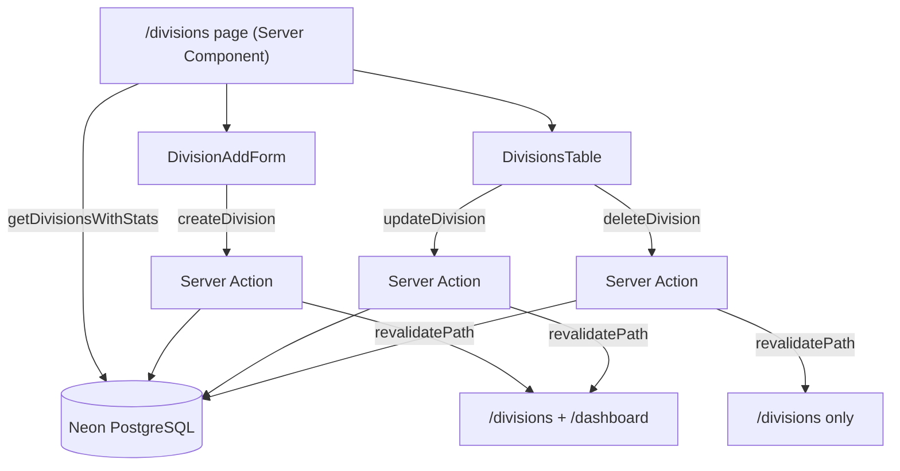

# Design Document: Division Management

## Overview

Division Management is Phase 6 of the PMG Control Center admin app. It provides a single-route interface at `/divisions` for creating, renaming, and deleting business divisions. Each division row displays a financial summary - total income, total expenses, net profit, and lead count - aggregated via LEFT JOINs in a dedicated query helper.

The feature follows the established PMG admin pattern:

```
DB query helpers (packages/db/src/queries.ts)
  → Server Actions (apps/admin/src/app/actions/divisions.ts)
  → Client Components (apps/admin/src/components/divisions/)
  → Server Component page (apps/admin/src/app/(admin)/divisions/page.tsx)
```

No separate detail page is needed - all interactions (add, rename, delete) happen inline on the list page.

## Architecture



The Server Component page fetches all data in a single `getDivisionsWithStats()` call, then passes the result to the two Client Components. No `searchParams` are needed - this page has no filtering. All mutations go through Server Actions that return `Promise<{ error?: string }>` and never throw.

## Components and Interfaces

### DB Query Helper - `packages/db/src/queries.ts`

```ts
export type DivisionRow = {
  id: string;
  name: string;
  totalIncome: number;
  totalExpenses: number;
  netProfit: number;
  leadCount: number;
};

getDivisionsWithStats(): Promise<DivisionRow[]>
```

Uses LEFT JOINs to `income`, `expenses`, and `leads` tables. Groups by `divisions.id` and `divisions.name`. Uses `COALESCE(SUM(...), 0)` for zero defaults. Computes `netProfit` as `totalIncome - totalExpenses` in the query. Orders by `divisions.name ASC`.

`getAllDivisions()` already exists and is NOT replaced or duplicated - `getDivisionsWithStats()` is a separate, stats-enriched helper.

Both `DivisionRow` and `getDivisionsWithStats` are exported from `packages/db/src/index.ts`.

### Server Actions - `apps/admin/src/app/actions/divisions.ts`

```ts
'use server'

const DivisionSchema = z.object({
  name: z.string()
    .min(1, 'Division name is required')
    .max(100, 'Division name must be 100 characters or fewer'),
})

createDivision(formData: FormData): Promise<{ error?: string }>
updateDivision(id: string, formData: FormData): Promise<{ error?: string }>
deleteDivision(id: string): Promise<{ error?: string }>
```

All three actions follow the same error-handling contract as `income.ts`:
- Wrap the entire body in `try/catch`
- Validate with `DivisionSchema.safeParse` before any DB write
- Return `{ error: issues[0]?.message }` on validation failure
- Return `{ error: message }` on DB error
- Return `{}` on success

`createDivision` and `updateDivision` call `revalidatePath('/divisions')` and `revalidatePath('/dashboard')`.
`deleteDivision` calls `revalidatePath('/divisions')` only.

`deleteDivision` does NOT pre-check for FK references - it attempts the delete directly and catches the FK constraint error, returning `{ error: 'Cannot delete division with existing income or expense records.' }`.

### Client Components - `apps/admin/src/components/divisions/`

**`division-add-form.tsx`** - `'use client'`

```ts
interface DivisionAddFormProps {
  createAction: (formData: FormData) => Promise<{ error?: string }>
}
```

Uses `useTransition` + `useRef` pattern (same as `income-add-form.tsx`). Single field: `name`. On success: `formRef.current?.reset()`. On error: inline error display below the submit button. Input and button disabled while `isPending`.

**`divisions-table.tsx`** - `'use client'`

```ts
interface DivisionsTableProps {
  divisions: DivisionRow[]
  updateAction: (id: string, formData: FormData) => Promise<{ error?: string }>
  deleteAction: (id: string) => Promise<{ error?: string }>
}
```

Renders a shadcn `Table` with columns: Name, Total Income, Total Expenses, Net Profit, Lead Count, Actions.

Currency columns (Total Income, Total Expenses, Net Profit) use `formatZAR`. Net Profit text is green (`text-green-600`) when `> 0`, red (`text-red-600`) when `<= 0`.

Inline rename state per row:
- Edit button → switches row to edit mode with a text input pre-populated with the current name
- Save button + Cancel button (or Escape key) in edit mode
- `useTransition` for pending state; input and buttons disabled while pending
- Inline error display below the input on failure

Inline delete state per row:
- Delete button → switches row to confirmation mode (inline, not a modal)
- Confirm and Cancel buttons in confirmation mode
- `useTransition` for pending state; buttons disabled while pending
- Inline error display on failure

### Server Component Page - `apps/admin/src/app/(admin)/divisions/page.tsx`

```ts
// No props needed - no searchParams
export default async function DivisionsPage() {
  const divisions = await getDivisionsWithStats()
  return (
    <>
      {/* header */}
      <DivisionAddForm createAction={createDivision} />
      {divisions.length === 0
        ? <p>No divisions yet. Add one above.</p>
        : <DivisionsTable divisions={divisions} updateAction={updateDivision} deleteAction={deleteDivision} />
      }
    </>
  )
}
```

## Data Models

### Existing Schema - no changes needed

The `divisions` table already has `id`, `name`, and `updatedAt` columns. No migration is required for this phase.

### DivisionRow Shape

| Field | Type | Source |
|---|---|---|
| id | string | `divisions.id` |
| name | string | `divisions.name` |
| totalIncome | number | `COALESCE(SUM(income.amount), 0)` |
| totalExpenses | number | `COALESCE(SUM(expenses.amount), 0)` |
| netProfit | number | `totalIncome - totalExpenses` |
| leadCount | number | `COALESCE(COUNT(leads.id), 0)` |

### Export - `packages/db/src/index.ts`

Add to existing exports:
```ts
export type { DivisionRow } from './queries';
```

(`export * from './queries'` already covers the new function.)

## Correctness Properties

*A property is a characteristic or behavior that should hold true across all valid executions of a system - essentially, a formal statement about what the system should do. Properties serve as the bridge between human-readable specifications and machine-verifiable correctness guarantees.*

### Property 1: getDivisionsWithStats shape and sort order

*For any* array of division rows returned by `getDivisionsWithStats`, every entry must have the correct `DivisionRow` shape (all six fields with correct types) and the results must be ordered by `name` ascending.

**Validates: Requirements 1.1, 1.2, 1.5, 7.1, 7.2**

### Property 2: getDivisionsWithStats zero defaults

*For any* division that has no income records, no expense records, or no leads, `getDivisionsWithStats` must return `0` for `totalIncome`, `totalExpenses`, and `leadCount` respectively for that division.

**Validates: Requirements 7.3, 7.4, 7.5**

### Property 3: netProfit computed correctly

*For any* `DivisionRow` returned by `getDivisionsWithStats`, `netProfit` must equal `totalIncome - totalExpenses`.

**Validates: Requirements 7.6**

### Property 4: createDivision round-trip

*For any* valid division name (length 1–100), calling `createDivision` must return `{}` (no error), and the new division must subsequently appear in the results of `getDivisionsWithStats`.

**Validates: Requirements 2.3, 2.5, 5.4**

### Property 5: updateDivision round-trip

*For any* existing division and any valid new name (length 1–100), calling `updateDivision` must return `{}` (no error), and a subsequent call to `getDivisionsWithStats` must reflect the updated name and a non-null `updatedAt`.

**Validates: Requirements 3.3, 3.5, 5.4**

### Property 6: deleteDivision round-trip

*For any* division id with no FK references, calling `deleteDivision` must return `{}` (no error), and the division must no longer appear in the results of `getDivisionsWithStats`.

**Validates: Requirements 4.3, 4.5, 8.4**

### Property 7: deleteDivision FK block

*For any* division id where the database returns a foreign key constraint violation, `deleteDivision` must return `{ error: 'Cannot delete division with existing income or expense records.' }` without throwing.

**Validates: Requirements 4.4, 4.7, 8.1, 8.2, 8.3**

### Property 8: Invalid input to createDivision/updateDivision always returns { error }

*For any* name that is empty (length 0) or exceeds 100 characters, calling `createDivision` or `updateDivision` must return `{ error: <non-empty string> }` without writing to the database, and must not throw.

**Validates: Requirements 2.4, 3.4, 5.2, 6.1, 6.2**

### Property 9: DivisionSchema round-trip

*For any* valid name string (length 1–100), parsing `{ name }` with `DivisionSchema` must succeed and the output `name` must equal the input `name`.

**Validates: Requirements 6.3**

### Property 10: getDivisionsWithStats after create - newly created division appears sorted

*For any* newly created division name, after `createDivision` succeeds, the division must appear in the results of `getDivisionsWithStats` at the correct position in the name-ascending sort order.

**Validates: Requirements 1.5, 2.3, 7.1**

**Property Reflection:** Properties 4 and 10 both test the create round-trip, but P10 specifically validates sort position after insertion. P4 validates presence; P10 validates sort order. These are distinct enough to keep separate. Properties 7 and 8 are distinct: P7 tests FK constraint handling (DB-level error), P8 tests Zod validation failure (pre-DB). No redundancy found.

## Error Handling

### Server Actions

All three actions follow the same contract:

1. **Validation failure** - `DivisionSchema.safeParse` returns `success: false` → return `{ error: issues[0]?.message ?? 'Validation error' }`. No DB write, no `revalidatePath`.
2. **FK constraint violation** (`deleteDivision` only) - caught in `catch` block, detected by checking if the error message contains the Postgres FK violation code (`23503`) or message → return `{ error: 'Cannot delete division with existing income or expense records.' }`.
3. **Other DB error** - `catch` block → return `{ error: err instanceof Error ? err.message : 'Unknown error' }`.
4. **Success** - call `revalidatePath` for relevant paths, return `{}`.

None of the three actions throw under any condition.

### Client Components

- `DivisionAddForm` displays the `error` string inline below the submit button when the action returns `{ error }`. Clears on next submission attempt.
- `DivisionsTable` displays inline errors per-row below the active control (rename input or delete confirmation). Each row manages its own error state independently.
- Controls are disabled via `useTransition`'s `isPending` flag during submission.

### Page-level

- `getDivisionsWithStats` errors propagate as unhandled exceptions to Next.js error boundaries (consistent with other pages in the app).

## Testing Strategy

### Property-Based Testing (fast-check + Vitest)

File: `apps/admin/src/__tests__/divisions.test.ts`

Follows the same pattern as `income.test.ts` and `leads.test.ts`. All DB functions and server actions are mocked with `vi.mock`. Each property test runs a minimum of 100 iterations (`{ numRuns: 100 }`).

**DivisionRow arbitrary:**
```ts
const divisionRowArb = fc.record({
  id: fc.uuid(),
  name: fc.string({ minLength: 1, maxLength: 100 }),
  totalIncome: fc.float({ min: 0, max: 999999, noNaN: true }),
  totalExpenses: fc.float({ min: 0, max: 999999, noNaN: true }),
  netProfit: fc.float({ min: -999999, max: 999999, noNaN: true }),
  leadCount: fc.integer({ min: 0, max: 1000 }),
})
```

**Property tests (P1–P10):** Each maps directly to a Correctness Property above. Tag format: `Feature: division-management, Property N: <property_text>`.

### Unit Tests

- `DivisionsTable` renders correct column headers (Name, Total Income, Total Expenses, Net Profit, Lead Count, Actions)
- `DivisionsTable` applies `formatZAR` to currency columns
- `DivisionsTable` applies green class to positive net profit, red class to zero/negative net profit
- Inline rename: clicking Edit shows pre-populated input; clicking Cancel reverts to display state; pressing Escape reverts to display state
- Inline delete: clicking Delete shows confirmation prompt; clicking Cancel reverts to display state
- `DivisionAddForm` resets the form on successful submission
- `DivisionAddForm` displays inline error when action returns `{ error }`
- Empty-state message renders when `divisions.length === 0`
- `deleteDivision` returns `{ error }` on FK constraint violation
- `createDivision` and `updateDivision` return `{ error }` on validation failure

### Balance

Unit tests cover specific UI states, conditional rendering, and error branches. Property tests cover the universal correctness of data shape, sort order, zero defaults, computation, and persistence round-trips. Together they provide comprehensive coverage without redundancy.
