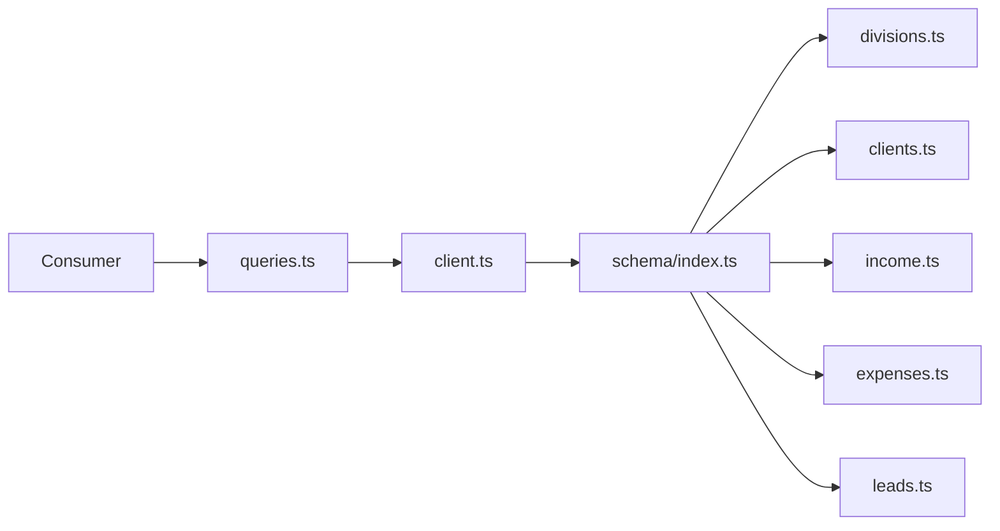
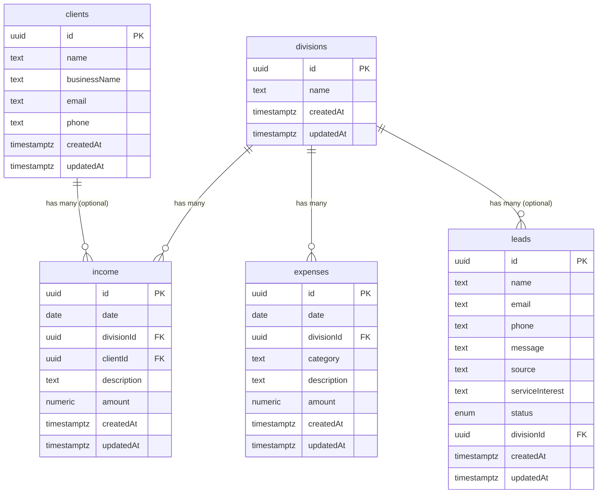

# Design Document: drizzle-db-schema

## Overview

This design establishes a domain-oriented schema layer within the existing `packages/db` (`@pmg/db`) workspace package. The package already uses Drizzle ORM with a Neon PostgreSQL serverless driver, has `drizzle-kit` configured, and exports three per-app schema files (`aws.ts`, `pmg.ts`, `tes.ts`).

The feature adds five new schema modules (`divisions`, `clients`, `income`, `expenses`, `leads`), Drizzle relations, an updated barrel index, a seed script extension, and reusable query utilities. All new files follow the conventions already established in the existing schema files.

Key design decisions:
- The existing Neon HTTP driver (`drizzle-orm/neon-http`) in `src/client.ts` is retained unchanged.
- `src/env.ts`, `src/client.ts`, `src/index.ts`, and `drizzle.config.ts` are not modified.
- `src/migrations/0000_magical_blade.sql` and `src/migrations/0001_hard_bedlam.sql` are live applied migrations - they must not be touched.
- `src/schema/tes.ts` and `src/schema/pmg.ts` are deleted - their tables (`tes_leads`, `pmg_leads`) are superseded by the new unified `leads` table.
- `src/schema/aws.ts` is rewritten to keep only `awsPricing`, `awsPackageTypeEnum`, `AwsPricing`, and `NewAwsPricing`. All messaging and booking tables/enums are removed.
- `updatedAt` is managed by the application layer only. A code comment is required above every `updatedAt` column definition documenting this tradeoff.
- All monetary values in Phase 0 are ZAR (South African Rand). No currency column is required (Requirement 12.11).
- The runtime is Bun in a Turborepo monorepo. Scripts use `bun` not `node` or `ts-node`.

---

## Architecture

```
packages/db/
├── drizzle.config.ts          # existing - unchanged, points to src/schema/index.ts
├── package.json               # existing - add db:seed script
├── .env.example               # new - environment variable template for onboarding
├── vitest.config.ts           # existing - unchanged
├── tsconfig.json              # existing - unchanged
└── src/
    ├── env.ts                 # existing - unchanged, Zod-validated DATABASE_URL
    ├── client.ts              # existing - unchanged, Neon HTTP driver
    ├── index.ts               # existing - unchanged, re-exports client + schema
    ├── seed.ts                # rewrite - preserve aws_pricing block, add financial tables in transaction
    ├── queries.ts             # new - 5 typed query utility functions
    ├── migrations/
    │   ├── 0000_magical_blade.sql   # existing - DO NOT TOUCH
    │   ├── 0001_hard_bedlam.sql     # existing - DO NOT TOUCH
    │   └── 0002_*.sql               # generated after bun db:generate - review before applying
    └── schema/
        ├── index.ts           # rewrite - new barrel (aws + 5 new domain files)
        ├── aws.ts             # rewrite - keep awsPricing + awsPackageTypeEnum only
        ├── divisions.ts       # new
        ├── clients.ts         # new
        ├── income.ts          # new
        ├── expenses.ts        # new
        └── leads.ts           # new
        # DELETED: tes.ts, pmg.ts
```

Data flow for query utilities:



Foreign key relationships:



---

## Migration Strategy

The existing migrations (`0000_magical_blade.sql`, `0001_hard_bedlam.sql`) created `tes_leads`, `aws_messages`, `aws_bookings`, `aws_pricing`, and `pmg_leads` tables. These are live and must not be modified.

After all schema file changes are complete, run:
```
bun db:generate
```

This produces a new migration (e.g. `0002_*.sql`) that:
- DROPs: `tes_leads`, `aws_messages`, `aws_bookings`, `pmg_leads`
- CREATEs: `divisions`, `clients`, `income`, `expenses`, `leads`

**Before applying the generated migration to production:**
1. Confirm no application code still imports or queries the dropped tables
2. Confirm any data requiring retention has been manually migrated or exported
3. Review the generated SQL carefully before running `bun db:migrate`

Drizzle-kit automatically orders new table creation based on the FK dependency graph (`divisions` and `clients` before `income`, `expenses`, `leads`).

A CI check in `__tests__/db.test.ts` should confirm no imports of the deleted schema files (`tes.ts`, `pmg.ts`, `aws` messages/bookings) remain anywhere in the codebase.

---

## Components and Interfaces

### Schema Modules

Each schema module follows the pattern established in `aws.ts`:
- Named exports only (no default exports)
- Imports exclusively from `drizzle-orm/pg-core`
- Inferred types defined immediately after the table definition
- Index names follow the pattern `{table}_{column}_idx`

**aws.ts** (rewritten - pricing only)
```typescript
// Keep only:
export const awsPackageTypeEnum = pgEnum("aws_package_type", ["monthly", "once_off"])
export const awsPricing = pgTable("aws_pricing", { ... })
export type AwsPricing = typeof awsPricing.$inferSelect
export type NewAwsPricing = typeof awsPricing.$inferInsert
// Removed: awsMessageStatusEnum, awsBookingStatusEnum, awsMessages, awsBookings
```

**divisions.ts**
```typescript
export const divisions = pgTable("divisions", { ... }, (t) => [...])
export type Division = typeof divisions.$inferSelect
export type NewDivision = typeof divisions.$inferInsert
export const divisionsRelations = relations(divisions, ({ many }) => ({ ... }))
```

**clients.ts**
```typescript
export const clients = pgTable("clients", { ... }, (t) => [...])
export type Client = typeof clients.$inferSelect
export type NewClient = typeof clients.$inferInsert
export const clientsRelations = relations(clients, ({ many }) => ({ ... }))
```

**income.ts**
```typescript
export const income = pgTable("income", { ... }, (t) => [...])
export type Income = typeof income.$inferSelect
export type NewIncome = typeof income.$inferInsert
export const incomeRelations = relations(income, ({ one }) => ({ ... }))
```

**expenses.ts**
```typescript
export const expenses = pgTable("expenses", { ... }, (t) => [...])
export type Expense = typeof expenses.$inferSelect
export type NewExpense = typeof expenses.$inferInsert
export const expensesRelations = relations(expenses, ({ one }) => ({ ... }))
```

**leads.ts**
```typescript
export const leadStatusEnum = pgEnum("lead_status", ["new", "contacted", "converted", "lost"])
export const leads = pgTable("leads", { ... }, (t) => [...])
export type Lead = typeof leads.$inferSelect
export type NewLead = typeof leads.$inferInsert
export const leadsRelations = relations(leads, ({ one }) => ({ ... }))
```

### Query Utilities (`src/queries.ts`)

```typescript
export async function getTotalRevenue(): Promise<number>
export async function getTotalExpenses(): Promise<number>
export async function getRevenueByDivision(): Promise<{ divisionName: string; total: number }[]>
export async function getExpensesByDivision(): Promise<{ divisionName: string; total: number }[]>
export async function getLeadsByStatus(): Promise<{ status: string; count: number }[]>
```

All functions use Drizzle's `sql` aggregate helpers (`sum`, `count`) and return typed results. Empty tables return `0` for totals and `[]` for grouped results. Grouped results are ordered by total/count DESC. Numeric column values returned by the driver are explicitly cast to JavaScript `number` before being returned.

### Barrel Index (`src/schema/index.ts`)

```typescript
// src/schema/index.ts - full replacement
export * from "./aws";        // awsPricing + awsPackageTypeEnum only
export * from "./divisions";
export * from "./clients";
export * from "./income";
export * from "./expenses";
export * from "./leads";
```

### Seed Script Structure (`src/seed.ts`)

The seed script is split into two independent blocks:

**Block 1 - aws_pricing** (preserved exactly as-is): Uses `.onConflictDoNothing()` upsert. Unaffected by Block 2 failures.

**Block 2 - financial tables** (new, wrapped in `db.transaction()`):
1. Insert 2 divisions: `TES` and `AWS` - query by name before inserting, skip if exists
2. Insert 2–3 clients - query by name before inserting, skip if exists
3. Insert 3 income records referencing seeded divisions and clients - deterministic check before inserting
4. Insert 3 expense records referencing seeded divisions - deterministic check before inserting
5. Insert 3 lead records - check by email or phone before inserting

If any insert in Block 2 fails, the entire Block 2 transaction rolls back. Block 1 is unaffected.

---

## Data Models

### divisions

| Column    | Type        | Constraints                    |
|-----------|-------------|--------------------------------|
| id        | uuid        | PK, defaultRandom()            |
| name      | text        | NOT NULL, UNIQUE               |
| createdAt | timestamptz | NOT NULL, defaultNow()         |
| updatedAt | timestamptz | nullable                       |

Indexes: `divisions_name_idx` on `name`

### clients

| Column       | Type        | Constraints             |
|--------------|-------------|-------------------------|
| id           | uuid        | PK, defaultRandom()     |
| name         | text        | NOT NULL                |
| businessName | text        | nullable                |
| email        | text        | nullable                |
| phone        | text        | nullable                |
| createdAt    | timestamptz | NOT NULL, defaultNow()  |
| updatedAt    | timestamptz | nullable                |

Indexes: `clients_name_idx` on `name`; partial unique index on `email WHERE email IS NOT NULL`

### income

| Column      | Type          | Constraints                                              |
|-------------|---------------|----------------------------------------------------------|
| id          | uuid          | PK, defaultRandom()                                      |
| date        | date          | NOT NULL (transaction date - no default)                 |
| divisionId  | uuid          | NOT NULL, FK → divisions.id, onDelete: RESTRICT (inline comment: // restrict: prevent division deletion while financial records exist) |
| clientId    | uuid          | nullable, FK → clients.id, onDelete: SET NULL            |
| description | text          | nullable                                                 |
| amount      | numeric(12,2) | NOT NULL, CHECK (amount > 0)                             |
| createdAt   | timestamptz   | NOT NULL, defaultNow()                                   |
| updatedAt   | timestamptz   | nullable                                                 |

Indexes: `income_date_idx` on `date`, `income_division_id_idx` on `divisionId`, `income_client_id_idx` on `clientId`

### expenses

| Column      | Type          | Constraints                                              |
|-------------|---------------|----------------------------------------------------------|
| id          | uuid          | PK, defaultRandom()                                      |
| date        | date          | NOT NULL (transaction date - no default)                 |
| divisionId  | uuid          | NOT NULL, FK → divisions.id, onDelete: RESTRICT (inline comment: // restrict: prevent division deletion while financial records exist) |
| category    | text          | NOT NULL                                                 |
| description | text          | nullable                                                 |
| amount      | numeric(12,2) | NOT NULL, CHECK (amount > 0)                             |
| createdAt   | timestamptz   | NOT NULL, defaultNow()                                   |
| updatedAt   | timestamptz   | nullable                                                 |

Indexes: `expenses_date_idx` on `date`, `expenses_division_id_idx` on `divisionId`, `expenses_category_idx` on `category`

### leads

| Column          | Type        | Constraints                                                    |
|-----------------|-------------|----------------------------------------------------------------|
| id              | uuid        | PK, defaultRandom()                                            |
| name            | text        | nullable                                                       |
| email           | text        | nullable (lowercased at app layer before insert)               |
| phone           | text        | nullable                                                       |
| message         | text        | nullable                                                       |
| source          | text        | nullable                                                       |
| serviceInterest | text        | nullable                                                       |
| status          | lead_status | NOT NULL, default "new"                                        |
| divisionId      | uuid        | nullable, FK → divisions.id, onDelete: SET NULL (inline comment: // set null: leads are soft-linked; division deletion should not block or cascade) |
| createdAt       | timestamptz | NOT NULL, defaultNow()                                         |
| updatedAt       | timestamptz | nullable                                                       |

CHECK constraint: `(email IS NOT NULL OR phone IS NOT NULL)`

Indexes: `leads_status_idx` on `status`, `leads_created_at_idx` on `createdAt`, `leads_email_idx` on `email`, `leads_division_id_idx` on `divisionId`; partial unique index on `email WHERE email IS NOT NULL`; partial unique index on `phone WHERE phone IS NOT NULL`

### Drizzle Relations

```
divisions  → hasMany income (via income.divisionId)
divisions  → hasMany expenses (via expenses.divisionId)
divisions  → hasMany leads (via leads.divisionId)
clients    → hasMany income (via income.clientId)
income     → belongsTo divisions (via divisionId)
income     → belongsTo clients (via clientId, optional)
expenses   → belongsTo divisions (via divisionId)
leads      → belongsTo divisions (via divisionId, optional)
```

---

## Correctness Properties

*A property is a characteristic or behavior that should hold true across all valid executions of a system - essentially, a formal statement about what the system should do. Properties serve as the bridge between human-readable specifications and machine-verifiable correctness guarantees.*

### Property 1: Barrel index completeness

*For any* symbol exported from any of the domain schema modules (`divisions`, `clients`, `income`, `expenses`, `leads`), that symbol should be accessible by importing from the barrel index (`src/schema/index.ts`).

**Validates: Requirements 7.2, 7.3**

### Property 2: Positive amount enforcement

*For any* financial record (income or expense) where the `amount` field is zero or negative, attempting to insert that record into the database should result in a check constraint error being propagated to the caller, and the record should not be persisted.

**Validates: Requirements 3.10, 4.10, 2.8**

### Property 3: Foreign key violation propagation

*For any* income or expense record that references a `divisionId` or `clientId` that does not exist in the corresponding parent table, attempting to insert that record should result in a referential integrity error being propagated to the caller without being swallowed.

**Validates: Requirements 3.13, 3.14, 4.13, 2.8**

### Property 4: Total aggregation correctness

*For any* set of income records with known amounts, `getTotalRevenue()` should return a value equal to the arithmetic sum of all `amount` values. Likewise, *for any* set of expense records, `getTotalExpenses()` should equal the sum of all expense amounts. When no records exist, both functions should return `0`.

**Validates: Requirements 10.2, 10.3, 10.7**

### Property 5: Grouped aggregation correctness

*For any* set of income records distributed across divisions, `getRevenueByDivision()` should return one entry per division whose `total` equals the sum of income amounts for that division. The same holds for `getExpensesByDivision()` with expense records. When no records exist, both functions should return an empty array.

**Validates: Requirements 10.4, 10.5, 10.7**

### Property 6: Lead status count correctness

*For any* set of lead records distributed across status values, `getLeadsByStatus()` should return one entry per status whose `count` equals the number of leads with that status. When no leads exist, the function should return an empty array.

**Validates: Requirements 10.6, 10.7**

### Property 7: Seed idempotency

*For any* number of sequential seed script executions against the same database, the resulting row counts for `divisions`, `clients`, `income`, `expenses`, and `leads` should be identical after the first run and after all subsequent runs - no duplicate records should be created.

**Validates: Requirements 9.7, 9.9**

### Property 8: Clients email partial unique constraint

*For any* two client records with the same non-null email address, attempting to insert the second should fail with a unique constraint error, and only the first record should be persisted.

**Validates: Requirements 3a.11**

### Property 9: Leads email normalization

*For any* lead inserted with a mixed-case email address, the value stored in the database should equal the lowercase version of that email - normalization is applied at the application layer before insert.

**Validates: Requirements 5.16**

### Property 10: Seed transaction atomicity

*For any* seed script execution that fails mid-way (e.g., due to a constraint violation on a later insert), no partial records from that run should be committed - the database should remain in its prior state as if the seed had not run.

**Validates: Requirements 9.10**

### Property 11: Grouped query result ordering

*For any* non-empty result set returned by `getRevenueByDivision`, `getExpensesByDivision`, or `getLeadsByStatus`, the results should be ordered in descending order by total amount (or count for leads) - the first element should have the highest value.

**Validates: Requirements 10.10**

### Property 12: Leads phone partial unique constraint

*For any* two lead records with the same non-null phone number, attempting to insert the second should fail with a unique constraint error, and only the first record should be persisted.

**Validates: Requirements 5.17**

### Property 13: Leads email partial unique constraint

*For any* two lead records with the same non-null email address, attempting to insert the second should fail with a unique constraint error, and only the first record should be persisted.

**Validates: Requirements 5.18**

---

## Error Handling

**Missing environment variable**: `src/env.ts` uses Zod to validate `DATABASE_URL` and `DATABASE_URL_UNPOOLED` at module load time. If either is absent or malformed, a descriptive error is thrown before any connection attempt. No changes needed here - new modules reuse this.

**Database constraint violations**: Drizzle ORM does not catch or transform database errors. Errors from check constraints (`amount > 0`), NOT NULL violations, and foreign key violations are thrown as-is from the underlying driver. Callers are responsible for catching and handling these errors. This is the intended behavior per requirements 2.8, 3.13, 3.14, 4.13.

**updatedAt staleness**: The `updatedAt` column is managed by the application layer, not the database. Any operation that bypasses the application (direct SQL, migrations, external services) will leave `updatedAt` stale. A code comment above every `updatedAt` column definition documents this tradeoff. Teams requiring guaranteed accuracy should implement a PostgreSQL trigger.

**Query utilities with empty tables**: All aggregate queries use `coalesce(sum(...), 0)` to handle the NULL-on-empty-table case for totals. Grouped queries return an empty array naturally when no rows match.

**Seed script failures**: The seed script runs all inserts within a single database transaction. Before each insert, it performs a deterministic pre-insert check (e.g., querying by `name`) to skip records that already exist. If any error occurs during the transaction, the entire transaction is rolled back, leaving the database in its prior state.

**Migration ordering**: `divisions` and `clients` must be created before `income` and `expenses` to satisfy FK constraints. Drizzle-kit respects table dependency order when generating migrations, so no manual ordering is required.

---

## Testing Strategy

### Dual Testing Approach

Both unit tests and property-based tests are used. They are complementary:
- Unit tests verify specific examples, integration points, and edge cases
- Property tests verify universal correctness across many generated inputs

### Property-Based Testing

**Library**: `fast-check` (already installed as a dev dependency in `packages/db`)

**Configuration**: Each property test runs a minimum of 100 iterations via `fc.assert(fc.property(...), { numRuns: 100 })`.

**Tag format**: Each property test is annotated with a comment:
```
// Feature: drizzle-db-schema, Property {N}: {property_text}
```

Each correctness property is implemented by exactly one property-based test:

| Property | Test description |
|----------|-----------------|
| Property 1 | Generate random symbol names from each module; verify all are present in barrel index exports |
| Property 2 | Generate random amounts ≤ 0; verify insert throws a constraint error |
| Property 3 | Generate random UUIDs not present in parent tables; verify FK insert throws |
| Property 4 | Generate random arrays of positive amounts; verify sum matches getTotalRevenue / getTotalExpenses |
| Property 5 | Generate random income/expense records across divisions; verify per-division sums match |
| Property 6 | Generate random leads across status values; verify per-status counts match |
| Property 7 | Run seed twice against a test DB; verify row counts are equal after both runs |
| Property 8 | Generate two clients with the same non-null email; verify second insert throws a unique constraint error |
| Property 9 | Generate leads with mixed-case emails; verify stored email equals the lowercased input |
| Property 10 | Simulate a mid-seed failure; verify no partial records are committed |
| Property 11 | Generate non-empty grouped result sets; verify results are ordered descending by total/count |
| Property 12 | Generate two leads with the same non-null phone; verify second insert throws a unique constraint error |
| Property 13 | Generate two leads with the same non-null email; verify second insert throws a unique constraint error |

### Unit Tests

Unit tests focus on:
- Schema export verification (all tables, enums, and types exported from barrel index)
- `leadStatusEnum` contains exactly `["new", "contacted", "converted", "lost"]`
- `awsPackageTypeEnum` is exported and contains exactly `["monthly", "once_off"]`
- `tesLeads`, `awsMessages`, `awsBookings`, `pmgLeads` are NOT exported from the barrel index (confirms deletion)
- A comment/grep-based test confirms no imports of `tes.ts`, `pmg.ts`, or aws messages/bookings remain in the codebase
- `leads` table has a `divisionId` column that is a nullable FK referencing `divisions.id` (Requirement 5.13)
- Query utilities return `0` / `[]` on empty tables (edge case for Property 4–6)
- `env.ts` throws when `DATABASE_URL` is missing (edge case for Requirement 1.4)
- `leads` CHECK constraint (`email OR phone NOT NULL`) is enforced at the database level; deduplication is the application layer's responsibility (Requirement 5.16)

### Test File Location

```
packages/db/__tests__/
├── db.test.ts          # rewrite - remove deleted table assertions, add new table assertions
├── schema.test.ts      # new - unit tests for new schema modules
├── queries.test.ts     # new - unit + property tests for query utilities
└── seed.test.ts        # new - property test for seed idempotency
```

---

## Verification Checklist

After completing all changes, confirm:
- [ ] `bun test --filter @pmg/db` passes with updated test assertions
- [ ] `src/schema/tes.ts` and `src/schema/pmg.ts` are deleted
- [ ] `src/schema/aws.ts` contains only `awsPricing`, `awsPackageTypeEnum`, and their types
- [ ] All 5 new schema files exist with correct tables, types, and relations exported
- [ ] `src/schema/index.ts` exports exactly 6 files (`aws` + 5 new domain files)
- [ ] `src/queries.ts` exists with all 5 typed query utility functions
- [ ] `src/seed.ts` preserves `aws_pricing` seed and adds financial table seed in a transaction
- [ ] `package.json` includes `db:seed` script (`"db:seed": "bun src/seed.ts"`)
- [ ] `bun db:generate` produces a new migration without errors
- [ ] Existing migration files are untouched
