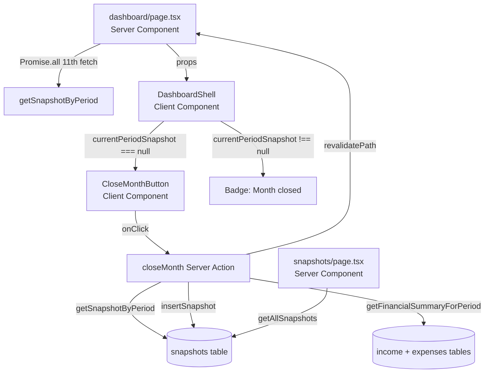

# Design Document: Financial Snapshots

## Overview

Financial Snapshots (Phase 7) adds point-in-time locking of monthly financial figures to the PMG Control Center. Without snapshots, any retroactive edit to income or expense data silently changes every historical dashboard number. This feature solves that by persisting a computed `PeriodSummary` into a dedicated `snapshots` table when an admin explicitly closes a month.

The feature is deliberately narrow in scope: one new DB table, three query helpers, one Server Action, one client component, and one new page. No existing financial logic is modified - snapshots sit alongside live data and are read instead of recomputed when they exist.

### Key Design Decisions

- **Immutability by omission**: No `updateSnapshot` or `deleteSnapshot` helpers are exposed. The unique constraint on `period` enforces one-snapshot-per-month at the DB level.
- **No separate read path on dashboard**: The dashboard continues to show live-computed figures for the current period. The snapshot is only used to determine whether the "Close Month" button or "Month closed" badge is shown.
- **Parallel fetch**: `getSnapshotByPeriod(currentPeriod)` is added as the 11th entry in the dashboard's existing `Promise.all` - no sequential round-trips added.
- **Zod validation in Server Action**: The `closeMonth` action validates the `YYYY-MM` format before touching the DB, consistent with all other Server Actions in the codebase.

---

## Architecture



The data flow is unidirectional: Server Components fetch, Client Components render and trigger mutations, Server Actions mutate and revalidate.

---

## Components and Interfaces

### packages/db/src/schema/snapshots.ts

Drizzle table definition. Uses `.defaultRandom()` for UUID (consistent with `income.ts`).

```ts
export const snapshots = pgTable(
  "snapshots",
  {
    id: uuid("id").primaryKey().defaultRandom(),
    period: text("period").notNull().unique(),
    revenue:    numeric("revenue",     { precision: 12, scale: 2 }).notNull(),
    expenses:   numeric("expenses",    { precision: 12, scale: 2 }).notNull(),
    pmgShare:   numeric("pmg_share",   { precision: 12, scale: 2 }).notNull(),
    profitPool: numeric("profit_pool", { precision: 12, scale: 2 }).notNull(),
    salary:     numeric("salary",      { precision: 12, scale: 2 }).notNull(),
    reinvest:   numeric("reinvest",    { precision: 12, scale: 2 }).notNull(),
    reserve:    numeric("reserve",     { precision: 12, scale: 2 }).notNull(),
    flex:       numeric("flex",        { precision: 12, scale: 2 }).notNull(),
    createdAt:  timestamp("created_at", { withTimezone: true }).defaultNow().notNull(),
  },
  (t) => [
    index("snapshots_period_idx").on(t.period),
  ],
)
```

### packages/db/src/queries.ts - new additions

Three new helpers appended to the existing file:

| Helper | Signature | Returns |
|---|---|---|
| `getAllSnapshots` | `() => Promise<SnapshotRow[]>` | All rows, ordered by `period DESC` |
| `getSnapshotByPeriod` | `(period: string) => Promise<SnapshotRow \| null>` | Matching row or `null` |
| `insertSnapshot` | `(period: string, summary: PeriodSummary) => Promise<SnapshotRow>` | Inserted row |

`SnapshotRow` type mirrors the DB columns with numeric fields as `string` (Drizzle returns `numeric` as string):

```ts
export type SnapshotRow = {
  id: string
  period: string
  revenue: string
  expenses: string
  pmgShare: string
  profitPool: string
  salary: string
  reinvest: string
  reserve: string
  flex: string
  createdAt: Date
}
```

### apps/admin/src/app/actions/snapshots.ts

Server Action with Zod validation and duplicate-check guard:

- Validates `period` matches `/^\d{4}-\d{2}$/`
- Checks for existing snapshot via `getSnapshotByPeriod` before inserting
- Calls `revalidatePath('/dashboard')` and `revalidatePath('/snapshots')` on success
- Never throws - all errors returned as `{ error: string }`

### apps/admin/src/components/dashboard/close-month-button.tsx

`'use client'` component accepting `{ period: string }`. Uses `useTransition` for pending state and `useRouter().refresh()` on success. Displays `toast.error(error)` on failure via sonner.

### apps/admin/src/app/(admin)/snapshots/page.tsx

Server Component. Calls `getAllSnapshots()` and renders either a table (rows ordered DESC) or an empty-state message. Period column formatted with `new Date(period + '-01').toLocaleString('en-ZA', { month: 'long', year: 'numeric' })`. All numeric columns formatted with `formatZAR`.

---

## Data Models

### snapshots table

| Column | Type | Constraints |
|---|---|---|
| `id` | `uuid` | PK, default `gen_random_uuid()` |
| `period` | `text` | NOT NULL, UNIQUE |
| `revenue` | `numeric(12,2)` | NOT NULL |
| `expenses` | `numeric(12,2)` | NOT NULL |
| `pmg_share` | `numeric(12,2)` | NOT NULL |
| `profit_pool` | `numeric(12,2)` | NOT NULL |
| `salary` | `numeric(12,2)` | NOT NULL |
| `reinvest` | `numeric(12,2)` | NOT NULL |
| `reserve` | `numeric(12,2)` | NOT NULL |
| `flex` | `numeric(12,2)` | NOT NULL |
| `created_at` | `timestamptz` | NOT NULL, default `now()` |

The `period` unique constraint is the primary integrity mechanism - it prevents duplicate snapshots at the DB level, independent of application-layer checks.

### Financial Model (read-only reference)

These formulas are implemented in the existing `getFinancialSummaryForPeriod` and are not reimplemented in the snapshot feature:

```
pmgShare   = revenue × 0.20
profitPool = revenue − expenses − pmgShare
salary     = profitPool × 0.35
reinvest   = profitPool × 0.30
reserve    = profitPool × 0.30
flex       = profitPool × 0.05
```

---

## Correctness Properties

*A property is a characteristic or behavior that should hold true across all valid executions of a system - essentially, a formal statement about what the system should do. Properties serve as the bridge between human-readable specifications and machine-verifiable correctness guarantees.*

### Property 1: getAllSnapshots ordering invariant

*For any* set of snapshots inserted in any order, `getAllSnapshots()` SHALL return them sorted by `period` in descending lexicographic order (which equals descending chronological order for `YYYY-MM` strings).

**Validates: Requirements 2.1, 5.3**

### Property 2: getSnapshotByPeriod returns null for non-existent period

*For any* `YYYY-MM` string that has not been inserted as a snapshot, `getSnapshotByPeriod(period)` SHALL return `null` without throwing an error.

**Validates: Requirements 2.2, 2.4**

### Property 3: Numeric round-trip - insert then retrieve preserves values

*For any* valid `PeriodSummary` object with finite numeric fields, inserting it as a snapshot via `insertSnapshot(period, summary)` and then retrieving it via `getSnapshotByPeriod(period)` SHALL return a row where `Number(row.revenue) === summary.revenue`, `Number(row.expenses) === summary.expenses`, and the same equality holds for all eight numeric fields (`pmgShare`, `profitPool`, `salary`, `reinvest`, `reserve`, `flex`).

**Validates: Requirements 2.2, 2.3, 6.2, 6.3**

### Property 4: Duplicate period insert returns 'Month already closed'

*For any* valid `YYYY-MM` period that already has a snapshot, calling `closeMonth(period)` a second time SHALL return `{ error: 'Month already closed' }` and SHALL NOT insert a second row.

**Validates: Requirements 1.2, 1.4, 3.4**

### Property 5: Invalid period format returns validation error

*For any* string that does NOT match the pattern `/^\d{4}-\d{2}$/`, calling `closeMonth(invalidPeriod)` SHALL return `{ error: string }` (never `{}`, never throw).

**Validates: Requirements 3.5, 3.6**

### Property 6: closeMonth success - valid period returns {} and snapshot is retrievable

*For any* valid `YYYY-MM` period string for which no snapshot yet exists, calling `closeMonth(period)` SHALL return `{}` and a subsequent call to `getSnapshotByPeriod(period)` SHALL return a non-null `SnapshotRow`.

**Validates: Requirements 3.2, 3.3**

### Property 7: Period formatting produces correct month name and year

*For any* valid `YYYY-MM` string, the expression `new Date(period + '-01').toLocaleString('en-ZA', { month: 'long', year: 'numeric' })` SHALL produce a string containing the correct full month name and the correct four-digit year.

**Validates: Requirements 5.9**

### Property 8: Financial model formula invariants

*For any* non-negative `revenue` and `expenses` values, the `PeriodSummary` computed by `getFinancialSummaryForPeriod` SHALL satisfy:
- `pmgShare === revenue * 0.20`
- `profitPool === revenue - expenses - pmgShare`
- `salary === profitPool * 0.35`
- `reinvest === profitPool * 0.30`
- `reserve === profitPool * 0.30`
- `flex === profitPool * 0.05`
- `salary + reinvest + reserve + flex === profitPool` (within floating-point tolerance)

**Validates: Requirements 6.4**

---

## Error Handling

| Scenario | Handling |
|---|---|
| `closeMonth` called with invalid period format | Zod `safeParse` fails → return `{ error: 'Period must be YYYY-MM' }` |
| `closeMonth` called for already-closed period | `getSnapshotByPeriod` returns non-null → return `{ error: 'Month already closed' }` |
| DB error during `insertSnapshot` | Caught in try/catch → return `{ error: err.message }` |
| `getAllSnapshots` DB error | Propagates as Next.js error boundary (Server Component) |
| `getSnapshotByPeriod` called with non-existent period | Returns `null` - not an error |
| CloseMonthButton receives `{ error }` | `toast.error(error)` via sonner |
| CloseMonthButton receives `{}` | `router.refresh()` - page re-fetches, button replaced by badge |

The Server Action never throws. All error paths return `{ error: string }`. This is consistent with `recordWithdrawal` and other existing Server Actions in the codebase.

---

## Testing Strategy

### Test file

`apps/admin/src/__tests__/snapshots.test.ts`

### Property-Based Tests (fast-check, minimum 100 iterations each)

fast-check is the property-based testing library for TypeScript. Each test is tagged with its design property reference.

**P1 - getAllSnapshots ordering invariant**
```
// Feature: financial-snapshots, Property 1: getAllSnapshots ordering invariant
fc.assert(fc.asyncProperty(
  fc.array(fc.string({ minLength: 7, maxLength: 7 }).filter(isValidPeriod), { minLength: 1, maxLength: 20 }),
  async (periods) => {
    // insert snapshots in random order, verify getAllSnapshots returns DESC order
  }
), { numRuns: 100 })
```

**P2 - getSnapshotByPeriod returns null for non-existent period**
```
// Feature: financial-snapshots, Property 2: getSnapshotByPeriod returns null for non-existent period
fc.assert(fc.asyncProperty(
  fc.string().filter(s => !insertedPeriods.has(s)),
  async (period) => {
    const result = await getSnapshotByPeriod(period)
    return result === null
  }
), { numRuns: 100 })
```

**P3 - Numeric round-trip**
```
// Feature: financial-snapshots, Property 3: Numeric round-trip
fc.assert(fc.asyncProperty(
  fc.record({ revenue: fc.float({ min: 0, max: 1_000_000 }), expenses: fc.float({ min: 0, max: 500_000 }) }),
  async ({ revenue, expenses }) => {
    const summary = computeSummary(revenue, expenses)
    await insertSnapshot(period, summary)
    const row = await getSnapshotByPeriod(period)
    return allFieldsMatch(row, summary)
  }
), { numRuns: 100 })
```

**P4 - Duplicate period returns 'Month already closed'**
```
// Feature: financial-snapshots, Property 4: Duplicate period returns 'Month already closed'
fc.assert(fc.asyncProperty(
  validPeriodArbitrary,
  async (period) => {
    await closeMonth(period)
    const result = await closeMonth(period)
    return result.error === 'Month already closed'
  }
), { numRuns: 100 })
```

**P5 - Invalid period format returns error**
```
// Feature: financial-snapshots, Property 5: Invalid period format returns error
fc.assert(fc.asyncProperty(
  fc.string().filter(s => !/^\d{4}-\d{2}$/.test(s)),
  async (invalidPeriod) => {
    const result = await closeMonth(invalidPeriod)
    return typeof result.error === 'string' && result.error.length > 0
  }
), { numRuns: 100 })
```

**P6 - closeMonth success round-trip**
```
// Feature: financial-snapshots, Property 6: closeMonth success round-trip
fc.assert(fc.asyncProperty(
  validPeriodArbitrary,
  async (period) => {
    const result = await closeMonth(period)
    if (result.error) return false
    const snapshot = await getSnapshotByPeriod(period)
    return snapshot !== null && snapshot.period === period
  }
), { numRuns: 100 })
```

**P7 - Period formatting**
```
// Feature: financial-snapshots, Property 7: Period formatting
fc.assert(fc.property(
  fc.integer({ min: 2000, max: 2099 }),
  fc.integer({ min: 1, max: 12 }),
  (year, month) => {
    const period = `${year}-${String(month).padStart(2, '0')}`
    const formatted = new Date(period + '-01').toLocaleString('en-ZA', { month: 'long', year: 'numeric' })
    return formatted.includes(String(year)) && formatted.length > 4
  }
), { numRuns: 100 })
```

**P8 - Financial model formula invariants**
```
// Feature: financial-snapshots, Property 8: Financial model formula invariants
fc.assert(fc.property(
  fc.float({ min: 0, max: 1_000_000, noNaN: true }),
  fc.float({ min: 0, max: 500_000, noNaN: true }),
  (revenue, expenses) => {
    const s = computeSummary(revenue, expenses)
    const eps = 0.001
    return (
      Math.abs(s.pmgShare - revenue * 0.20) < eps &&
      Math.abs(s.profitPool - (revenue - expenses - s.pmgShare)) < eps &&
      Math.abs(s.salary - s.profitPool * 0.35) < eps &&
      Math.abs(s.reinvest - s.profitPool * 0.30) < eps &&
      Math.abs(s.reserve - s.profitPool * 0.30) < eps &&
      Math.abs(s.flex - s.profitPool * 0.05) < eps
    )
  }
), { numRuns: 100 })
```

### Unit Tests (example-based)

- `CloseMonthButton` renders "Close Month" label when not pending
- `CloseMonthButton` is disabled and shows "Closing…" during transition
- Snapshots page renders empty-state message when `snapshots = []`
- Snapshots page renders one table row per snapshot
- Period `'2026-03'` formats to `'March 2026'` (en-ZA locale)
- `closeMonth` with valid period returns `{}` (mocked DB)
- Duplicate insert for same period throws unique constraint error

### Integration Tests

- Reset → migrate → seed completes without errors and `snapshots` table contains one row per fully elapsed month in the seed range
- `getAllSnapshots` returns rows in DESC order against a real (test) DB

### What is NOT tested with PBT

- UI rendering and layout (snapshot page table structure) - use snapshot tests
- Nav item wiring - smoke test (import check)
- Schema column definitions - smoke test (Drizzle introspection)
- `revalidatePath` calls - mock-based unit test
