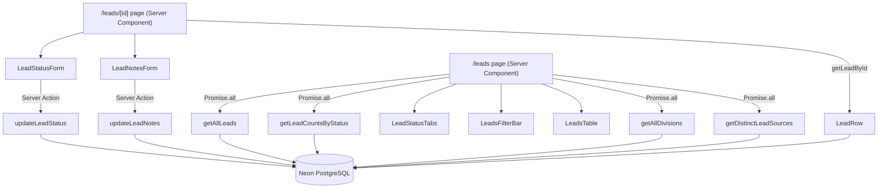

# Design Document: Leads Management

## Overview

Leads Management is Phase 5 of the PMG Control Center admin app. It provides a read-and-update interface for incoming business leads that are created externally by the public Astro apps. Admins can view all leads, filter by status/division/source, update a lead's status, and add internal notes.

The feature follows the established PMG admin pattern:

```
DB query helpers (packages/db/src/queries.ts)
  → Server Actions (apps/admin/src/app/actions/leads.ts)
  → Client Components (apps/admin/src/components/leads/)
  → Server Component pages (apps/admin/src/app/(admin)/leads/)
```

No lead creation or deletion exists in the admin - this is a read-and-update interface only.

## Architecture



URL search params drive filtering: `?status=`, `?divisionId=`, `?source=`. The Server Component page reads `searchParams`, passes filters to `getAllLeads`, and renders the appropriate Client Components. No client-side state management is needed beyond `useTransition` in the forms.

## Components and Interfaces

### DB Query Helpers - `packages/db/src/queries.ts`

```ts
export type LeadRow = {
  id: string;
  name: string | null;
  email: string | null;
  phone: string | null;
  message: string | null;
  source: string | null;
  serviceInterest: string | null;
  status: string;
  divisionId: string | null;
  divisionName: string | null;
  notes: string | null;
  createdAt: Date;
  updatedAt: Date | null;
};

getAllLeads(filters?: { status?: string; divisionId?: string; source?: string }): Promise<LeadRow[]>
getLeadById(id: string): Promise<LeadRow | null>
getLeadCountsByStatus(): Promise<{ all: number; new: number; contacted: number; converted: number; lost: number }>
getDistinctLeadSources(): Promise<string[]>
```

`getAllLeads` uses a LEFT JOIN to `divisions` (leads may have no division), applies `and(...conditions)` for active filters, and orders by `createdAt DESC`. `getLeadCountsByStatus` uses a single SQL query with conditional aggregation to return all five counts in one round-trip.

### Server Actions - `apps/admin/src/app/actions/leads.ts`

```ts
'use server'

// Schemas
const LeadStatusSchema = z.object({
  status: z.enum(['new', 'contacted', 'converted', 'lost'], {
    errorMap: () => ({ message: 'Status must be one of: new, contacted, converted, or lost' }),
  }),
})
const LeadNotesSchema = z.object({ notes: z.string().optional() })

updateLeadStatus(id: string, formData: FormData): Promise<{ error?: string }>
updateLeadNotes(id: string, formData: FormData): Promise<{ error?: string }>
```

Both actions follow the same pattern as `updateIncome`: parse FormData with `Object.fromEntries`, validate with Zod `safeParse`, write to DB with Drizzle, call `revalidatePath`, return `{}` on success or `{ error: message }` on failure. Neither action throws.

`updateLeadStatus` revalidates `/leads`, `/leads/${id}`, and `/dashboard`.
`updateLeadNotes` revalidates `/leads/${id}` only.

### Client Components - `apps/admin/src/components/leads/`

**`lead-status-tabs.tsx`** - `'use client'`
```ts
interface LeadStatusTabsProps {
  counts: { all: number; new: number; contacted: number; converted: number; lost: number }
  currentStatus?: string
  currentDivisionId?: string
  currentSource?: string
}
```
Renders five shadcn `Tabs` items. The active tab is derived from `currentStatus` prop (matches URL param). On tab change, constructs `URLSearchParams` that preserves `currentDivisionId` and `currentSource` if present, sets `status` (or omits it for "All"), then calls `router.push('/leads?' + params.toString())`:

```ts
function handleTabChange(value: string) {
  const params = new URLSearchParams()
  if (value !== 'all') params.set('status', value)
  if (currentDivisionId) params.set('divisionId', currentDivisionId)
  if (currentSource) params.set('source', currentSource)
  router.push('/leads?' + params.toString())
}
```

The `/leads/page.tsx` must pass `currentDivisionId={divisionId}` and `currentSource={source}` from `searchParams` into `LeadStatusTabs` alongside `counts` and `currentStatus`.

**`leads-filter-bar.tsx`** - `'use client'`
```ts
interface LeadsFilterBarProps {
  divisions: { id: string; name: string }[]
  sources: string[]
  currentDivisionId?: string
  currentSource?: string
}
```
Mirrors `income/filter-bar.tsx`. Two shadcn `Select` controls. On change, reconstructs the full query string preserving other active params and calls `router.push`.

**`leads-table.tsx`** - `'use client'`
```ts
interface LeadsTableProps {
  entries: LeadRow[]
}
```
Renders a shadcn `Table`. Columns: name, email/phone (email preferred, phone as fallback), division name, source, status badge (colour-coded by status), detail link (`/leads/${entry.id}`). Read-only - no delete or inline edit.

**`lead-status-form.tsx`** - `'use client'`
```ts
interface LeadStatusFormProps {
  id: string
  currentStatus: string
  updateAction: (id: string, formData: FormData) => Promise<{ error?: string }>
}
```
Uses `useTransition`. Select pre-populated with `currentStatus`. Disables select and submit while `isPending`. Displays inline error on failure.

**`lead-notes-form.tsx`** - `'use client'`
```ts
interface LeadNotesFormProps {
  id: string
  currentNotes: string | null
  updateAction: (id: string, formData: FormData) => Promise<{ error?: string }>
}
```
Uses `useTransition`. Textarea pre-populated with `currentNotes ?? ''`. Disables textarea and submit while `isPending`. Displays inline error on failure.

### Server Component Pages

**`apps/admin/src/app/(admin)/leads/page.tsx`**
```ts
interface LeadsPageProps {
  searchParams: Promise<{ status?: string; divisionId?: string; source?: string }>
}
```
Awaits `searchParams`, runs `Promise.all([getAllLeads(filters), getLeadCountsByStatus(), getAllDivisions(), getDistinctLeadSources()])`, renders header + `LeadStatusTabs` (with `counts`, `currentStatus`, `currentDivisionId`, `currentSource`) + `LeadsFilterBar` + (`LeadsTable` or empty-state message).

**`apps/admin/src/app/(admin)/leads/[id]/page.tsx`**
```ts
interface LeadDetailPageProps {
  params: Promise<{ id: string }>
}
```
Awaits `params`, calls `getLeadById(id)`, calls `notFound()` if null. Renders back link, lead detail fields (name, email, phone, message, source, serviceInterest, divisionName, status, createdAt formatted), `LeadStatusForm`, `LeadNotesForm`.

## Data Models

### Schema Change - `packages/db/src/schema/leads.ts`

Add `notes` column after `updatedAt`:

```ts
notes: text("notes"),
```

Nullable, no default. Existing rows will have `notes = null` after migration.

### Migration Steps

1. Add `notes: text("notes")` to `packages/db/src/schema/leads.ts`
2. Run `bun db:generate` - produces migration SQL: `ALTER TABLE leads ADD COLUMN notes text;`
3. Run `bun db:migrate` - applies the migration to Neon PostgreSQL

### Export - `packages/db/src/index.ts`

Add to existing exports:
```ts
export type { LeadRow } from './queries';
```

(`export * from './queries'` already covers the new functions.)

### LeadRow Shape

| Field | Type | Notes |
|---|---|---|
| id | string | UUID |
| name | string \| null | |
| email | string \| null | |
| phone | string \| null | |
| message | string \| null | |
| source | string \| null | |
| serviceInterest | string \| null | |
| status | string | 'new' \| 'contacted' \| 'converted' \| 'lost' |
| divisionId | string \| null | |
| divisionName | string \| null | LEFT JOIN result |
| notes | string \| null | new column |
| createdAt | Date | |
| updatedAt | Date \| null | |

## Correctness Properties

*A property is a characteristic or behavior that should hold true across all valid executions of a system - essentially, a formal statement about what the system should do. Properties serve as the bridge between human-readable specifications and machine-verifiable correctness guarantees.*

### Property 1: getAllLeads shape and sort order

*For any* array of lead rows returned by `getAllLeads` with no filters, every entry must have the correct `LeadRow` shape and the results must be ordered by `createdAt` descending.

**Validates: Requirements 1.1, 1.2, 10.1, 10.7**

### Property 2: Status filter excludes entries with other statuses

*For any* status filter value passed to `getAllLeads`, no returned entry shall have a `status` different from the filter value.

**Validates: Requirements 2.3, 10.6**

### Property 3: divisionId filter excludes entries from other divisions

*For any* `divisionId` filter value passed to `getAllLeads`, no returned entry shall have a `divisionId` different from the filter value.

**Validates: Requirements 3.3**

### Property 4: Source filter excludes entries from other sources

*For any* `source` filter value passed to `getAllLeads`, no returned entry shall have a `source` different from the filter value.

**Validates: Requirements 3.4**

### Property 5: getLeadById returns correct entry or null

*For any* lead id, `getLeadById(id)` shall return the entry with that id and all correct field values, or `null` if no entry with that id exists.

**Validates: Requirements 4.1, 10.2**

### Property 6: getLeadCountsByStatus counts sum to total lead count

*For any* set of leads, the sum of `new + contacted + converted + lost` counts returned by `getLeadCountsByStatus` shall equal the `all` count.

**Validates: Requirements 2.2, 10.3**

### Property 7: getDistinctLeadSources returns only non-null sources, sorted ASC

*For any* set of leads with varying source values (including nulls and duplicates), `getDistinctLeadSources` shall return only non-null source strings, with no duplicates, sorted alphabetically ascending.

**Validates: Requirements 3.2, 10.4**

### Property 8: updateLeadStatus round-trip - valid status persisted, updatedAt updated

*For any* valid status value (`new`, `contacted`, `converted`, `lost`) submitted to `updateLeadStatus`, the action shall return `{}` (no error), and a subsequent `getLeadById` call shall return the lead with the updated `status` and a non-null `updatedAt`.

**Validates: Requirements 5.2, 5.3, 6.3**

### Property 9: updateLeadNotes round-trip - notes persisted, updatedAt updated

*For any* notes string (including empty string) submitted to `updateLeadNotes`, the action shall return `{}` (no error), and a subsequent `getLeadById` call shall return the lead with the updated `notes` value and a non-null `updatedAt`.

**Validates: Requirements 7.2, 7.3, 8.3, 8.6**

### Property 10: Invalid status to updateLeadStatus always returns { error }

*For any* string that is not one of the four valid status values, calling `updateLeadStatus` shall return `{ error: <non-empty string> }` without writing to the database, and shall not throw.

**Validates: Requirements 6.1, 6.2, 6.6**

### Property 11: LeadStatusSchema round-trip for all four valid values

*For any* of the four valid status strings (`new`, `contacted`, `converted`, `lost`), parsing `{ status }` with `LeadStatusSchema` shall succeed and the output `status` shall equal the input.

**Validates: Requirements 9.1, 9.3**

### Property 12: Notes column nullable - existing leads unaffected after migration

*For any* lead row that existed before the `notes` column migration, the `notes` field shall be `null` after migration, and all other fields shall be unchanged.

**Validates: Requirements 11.1**

## Error Handling

### Server Actions

Both `updateLeadStatus` and `updateLeadNotes` follow the same error-handling contract:

1. **Validation failure** - Zod `safeParse` returns `success: false` → return `{ error: issues[0]?.message ?? 'Validation error' }`. No DB write, no `revalidatePath`.
2. **DB error** - `try/catch` around the Drizzle update → return `{ error: err instanceof Error ? err.message : 'Unknown error' }`. No `revalidatePath`.
3. **Success** - call `revalidatePath` for all relevant paths, return `{}`.

Neither action throws under any condition.

### Client Components

- `LeadStatusForm` and `LeadNotesForm` display the `error` string inline below the submit button when the action returns `{ error }`.
- Controls are disabled via `useTransition`'s `isPending` flag during submission.
- No toast notifications for leads forms (status/notes updates are silent on success - the page revalidates and reflects the change).

### Page-level

- `getLeadById` returning `null` triggers `notFound()` from `next/navigation`, rendering the Next.js 404 page.
- `getAllLeads` errors propagate as unhandled exceptions to Next.js error boundaries (consistent with income/expense pages).

## Testing Strategy

### Property-Based Testing (fast-check + Vitest)

File: `apps/admin/src/__tests__/leads.test.ts`

Follows the same pattern as `income.test.ts` and `expenses.test.ts`. All DB functions and server actions are mocked with `vi.mock`. Each property test runs a minimum of 100 iterations (`{ numRuns: 100 }`).

**LeadRow arbitrary:**
```ts
const leadArb = fc.record({
  id: fc.uuid(),
  name: fc.option(fc.string({ minLength: 1, maxLength: 100 }), { nil: null }),
  email: fc.option(fc.emailAddress(), { nil: null }),
  phone: fc.option(fc.string({ minLength: 7, maxLength: 20 }), { nil: null }),
  message: fc.option(fc.string({ maxLength: 500 }), { nil: null }),
  source: fc.option(fc.string({ minLength: 1, maxLength: 50 }), { nil: null }),
  serviceInterest: fc.option(fc.string({ maxLength: 100 }), { nil: null }),
  status: fc.constantFrom('new', 'contacted', 'converted', 'lost'),
  divisionId: fc.option(fc.uuid(), { nil: null }),
  divisionName: fc.option(fc.string({ minLength: 1, maxLength: 50 }), { nil: null }),
  notes: fc.option(fc.string({ maxLength: 1000 }), { nil: null }),
  createdAt: fc.date({ min: new Date('2020-01-01'), max: new Date('2030-12-31') }),
  updatedAt: fc.option(fc.date({ min: new Date('2020-01-01'), max: new Date('2030-12-31') }), { nil: null }),
})
```

**Property tests (P1–P12):** Each maps directly to a Correctness Property above. Tag format: `Feature: leads-management, Property N: <property_text>`.

### Unit Tests

- `LeadStatusTabs` renders correct tab as active from URL param
- `LeadsTable` renders detail links with correct `/leads/<id>` hrefs
- `LeadStatusForm` disables controls while pending
- `LeadNotesForm` pre-populates textarea with existing notes value
- `updateLeadStatus` returns `{ error }` on DB throw
- `updateLeadNotes` returns `{ error }` on DB throw
- Empty-state renders when `entries.length === 0`

### Balance

Unit tests cover specific UI states and error branches. Property tests cover the universal correctness of data flow, filtering, and persistence. Together they provide comprehensive coverage without redundancy.
