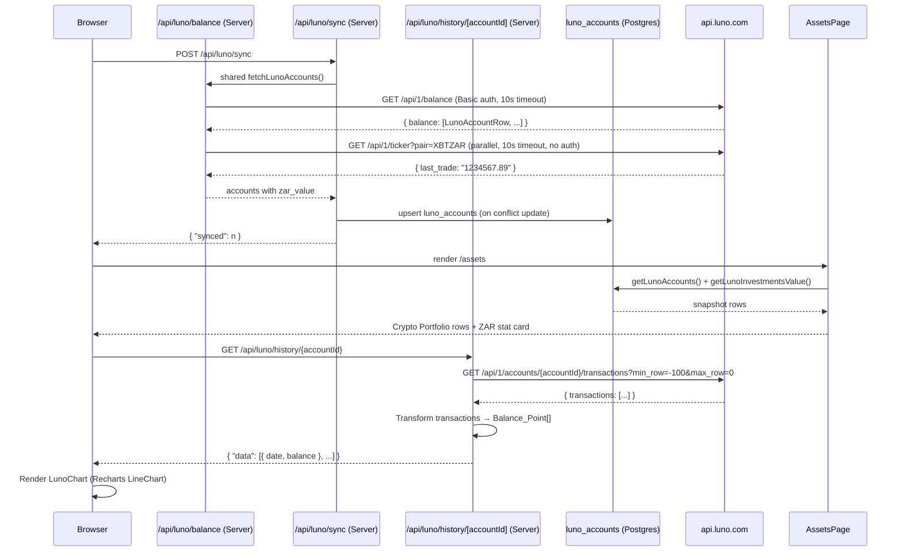

# Design Document

## Overview

The Luno Portfolio Dashboard integrates the Luno cryptocurrency exchange API into the existing PMG admin app (`apps/admin`) and makes Luno the single source of truth for all investments. The feature replaces the manual investment register (cost, valuations, deposits/withdrawals) with a live, synced view: a one-time **Archive_Migration** copies the existing manual investment rows into `archived_*` backup tables and deletes them from the register, a **Balance_Route** fetches all accounts from `/api/1/balance` and enriches each with a ZAR value from the public ticker endpoint, a **Sync_Route** upserts that enriched snapshot into a new `luno_accounts` table, and the `/assets` page renders investments from that snapshot with a balance-over-time chart per account on `/assets/luno/[accountId]`. Fixed assets remain manually recorded and untouched.

The feature consists of four tightly coupled server pieces and two client pieces:

1. **A `Balance_Route`** (`src/app/api/luno/balance/route.ts`) that authenticates against Luno's REST API using HTTP Basic Auth, fetches all accounts from `/api/1/balance`, converts each crypto balance to ZAR via `GET /api/1/ticker?pair={ASSET}ZAR` (`zar_value = balance × last_trade`), and returns `LunoAccountRow[]` — without ever exposing credentials to the client.
2. **A `Sync_Route`** (`src/app/api/luno/sync/route.ts`) that calls the same enriched balance fetch and upserts the `luno_accounts` snapshot table.
3. **A `History_Route`** (`src/app/api/luno/history/[accountId]/route.ts`) that fetches the last 100 transactions for a given Luno account, transforms the raw data into a `{ date, balance }` time series, and returns it as JSON.
4. **A client-side `LunoChart` React component** (`src/components/luno-chart.tsx`) that accepts an `accountId` prop, fetches from the History_Route, and renders the time series as a Recharts `LineChart` with `type="stepAfter"`.

On the UI side, the `/assets` page gains a **Crypto Portfolio** section rendered from `luno_accounts` (server-rendered, with a client "Refresh" control that re-runs the sync), the **Investments Value** stat card is sourced from `getLunoInvestmentsValue()`, and the register table narrows to fixed assets only. The manual investment UI (`ValuationHistory`, `TransactionHistory`, the investment branch of `/assets/[id]`) is removed as dead code.

---

## Architecture



**Key architectural decisions:**

- **Proxy pattern over direct client fetch**: Credentials never leave the server. The client has no knowledge of the Luno API URL, key IDs, or secrets.
- **Luno is the single source of truth for investments**: The Archive_Migration removes manual investment rows; the register holds fixed assets only. No new `investment` rows are ever created.
- **Snapshot over live-only rendering**: `luno_accounts` stores the latest enriched balance so the assets page renders from the DB (fast, resilient to Luno outages), with a manual "Refresh" control and a visible `synced_at` timestamp. Ticker failures degrade to `zar_value: null` rather than failing the page.
- **Ticker conversion is public and unauthenticated**: `last_trade` from `/api/1/ticker?pair={ASSET}ZAR` converts crypto balances to ZAR. Ticker calls are issued in parallel and never block the whole response on a single pair's failure.
- **`LUNO_ACCOUNT_ID` is optional**: Only `LUNO_API_KEY_ID` and `LUNO_API_KEY_SECRET` are mandatory. When `LUNO_ACCOUNT_ID` is set it filters the Balance_Route (and thus the snapshot) to that one account; when absent, all accounts are returned.
- **No background scheduler (for now)**: The sync runs on demand (page "Refresh" control, and can be wired to a cron later) without changing the interface.
- **Additive safety for fixed assets**: Fixed-asset register flows (table, `AddAssetDialog`, `/assets/[id]`) keep working unchanged; only investment-specific code paths are removed.

---

## Components and Interfaces

### 1. Balance Route — `src/app/api/luno/balance/route.ts`

Exports only a `GET` function; all other methods return 405.

```typescript
export async function GET(request: Request): Promise<Response>;
```

The route delegates the upstream work to a shared `fetchLunoAccounts()` helper in `src/lib/luno.ts` (server-only usage), which:

1. Validates credentials (`getCredentials()`), returning null on missing/empty env vars.
2. Fetches `https://api.luno.com/api/1/balance` with `Authorization: Basic <base64>` and a 10s timeout.
3. Maps the `balance` array via `mapAccountRow(entry)`.
4. Applies the optional `LUNO_ACCOUNT_ID` filter.
5. For each unique `asset`, fetches `https://api.luno.com/api/1/ticker?pair={ASSET}ZAR` in parallel (10s timeout, no auth) and computes `zar_value = Math.round(parseFloat(balance) * last_trade * 1e8) / 1e8`; a failed/invalid ticker yields `zar_value: null` for that asset's accounts.

**Internal helper functions** (pure, unit-testable in isolation):

```typescript
/**
 * Validates that LUNO_API_KEY_ID and LUNO_API_KEY_SECRET are non-empty strings.
 * Returns the credential object or null if either is missing/empty.
 */
function getCredentials(): { keyId: string; keySecret: string } | null;

/**
 * Encodes Luno credentials as an HTTP Basic Auth header value.
 * Returns "Basic <base64(keyId:keySecret)>"
 */
function buildAuthHeader(keyId: string, keySecret: string): string;

/**
 * Maps a raw Luno balance entry to a LunoAccountRow.
 * Omits the `name` field when it is absent or empty in the upstream entry.
 */
function mapAccountRow(entry: unknown): LunoAccountRow;

/**
 * Constructs the Luno ticker URL for an asset.
 * Returns "https://api.luno.com/api/1/ticker?pair={asset}ZAR"
 */
function buildTickerUrl(asset: string): string;

/**
 * Extracts `last_trade` from a ticker response body as a finite non-negative
 * number, or null when missing/invalid.
 */
function mapTickerPrice(body: unknown): number | null;

/**
 * Fetches the enriched balance (accounts + zar_value) from Luno.
 * Throws typed errors: ConfigError (500), TimeoutError (504),
 * UpstreamError (502), InvalidResponseError (502). Never leaks credentials.
 */
async function fetchLunoAccounts(): Promise<LunoAccountRow[]>;
```

**Error response table:**

| Condition                        | HTTP Status | Body                                         |
| -------------------------------- | ----------- | -------------------------------------------- |
| Non-GET method                   | 405         | `{ "error": "Method Not Allowed" }`          |
| Missing/empty credential env var | 500         | `{ "error": "Server configuration error" }`  |
| Upstream timeout (>10s)          | 504         | `{ "error": "Upstream timeout" }`            |
| Luno non-2xx response            | 502         | `{ "error": "Upstream error", "status": N }` |
| Missing/invalid `balance` array  | 502         | `{ "error": "Invalid upstream response" }`   |
| Ticker failure for one asset     | 200         | account included with `zar_value: null`      |
| Success                          | 200         | `{ "accounts": LunoAccountRow[] }`           |

### 2. Sync Route — `src/app/api/luno/sync/route.ts`

Exports only a `POST` function; all other methods return 405.

```typescript
export async function POST(request: Request): Promise<Response>;
```

Calls `fetchLunoAccounts()` and upserts each account into `luno_accounts` via `upsertLunoAccounts(accounts)` from `@pmg/db`. Returns `{ "synced": count }` with HTTP 200. Errors map exactly like the Balance_Route (500/504/502).

### 3. History Route — `src/app/api/luno/history/[accountId]/route.ts`

Exports only a `GET` function; all other methods return 405.

```typescript
export async function GET(
  request: Request,
  context: { params: Promise<{ accountId: string }> },
): Promise<Response>;
```

**Internal helper functions:**

```typescript
/**
 * Constructs the Luno transactions URL for a given account ID.
 * Returns "https://api.luno.com/api/1/accounts/{accountId}/transactions?min_row=-100&max_row=0"
 */
function buildLunoUrl(accountId: string): string;

/**
 * Transforms a single Luno transaction into a Balance_Point.
 * Throws with field name if required fields are missing or invalid.
 */
function transformTransaction(tx: unknown): BalancePoint;

/**
 * Maps an array of raw Luno transactions to Balance_Point[].
 * Returns Result type: { ok: true, data: BalancePoint[] } | { ok: false, field: string }
 */
function transformTransactions(transactions: unknown[]): TransformResult;
```

**Error response table:**

| Condition                          | HTTP Status | Body                                                               |
| ---------------------------------- | ----------- | ------------------------------------------------------------------ |
| Non-GET method                     | 405         | `{ "error": "Method Not Allowed" }`                                |
| Missing/empty credential env var   | 500         | `{ "error": "Server configuration error" }`                        |
| Invalid `accountId` format         | 400         | `{ "error": "Invalid account ID" }`                                |
| Upstream timeout (>10s)            | 504         | `{ "error": "Upstream timeout" }`                                  |
| Luno non-2xx response              | 502         | `{ "error": "Upstream error", "status": N }`                       |
| Missing/invalid `transactions` arr | 502         | `{ "error": "Invalid upstream response" }`                         |
| Invalid transaction data           | 422         | `{ "error": "Invalid transaction data", "field": "<field_name>" }` |
| Success                            | 200         | `{ "data": BalancePoint[] }`                                       |

### 4. Luno Accounts Snapshot — `packages/db`

New schema module `src/schema/luno.ts`:

```typescript
export const lunoAccounts = pgTable(
  "luno_accounts",
  {
    accountId: text("account_id").primaryKey(),
    asset: text("asset").notNull(),
    name: text("name"),
    balance: text("balance").notNull(),        // decimal string from Luno
    reserved: text("reserved").notNull(),
    unconfirmed: text("unconfirmed").notNull(),
    zarValue: numeric("zar_value", { precision: 20, scale: 8 }), // nullable
    syncedAt: timestamp("synced_at", { withTimezone: true }).defaultNow().notNull(),
  },
  (t) => [index("luno_accounts_asset_idx").on(t.asset)],
);
```

New query module `src/queries/luno.ts`:

```typescript
getLunoAccounts(): Promise<LunoAccountRow[]>        // order by zar_value DESC NULLS LAST
getLunoAccountById(accountId: string): Promise<LunoAccountRow | null>
getLunoInvestmentsValue(): Promise<number>          // sum(coalesce(zar_value, 0))
upsertLunoAccounts(accounts: LunoAccountRow[]): Promise<number> // returns count
```

### 5. Client Component — `src/components/luno-chart.tsx`

```typescript
'use client';

interface LunoChartProps {
  accountId: string;
}

export function LunoChart({ accountId }: LunoChartProps): JSX.Element;

// Exported for isolated unit/property testing
export function balanceFormatter(value: number): string;
```

The component manages four UI states:

| State     | Trigger                                      | Rendered output                                                   |
| --------- | -------------------------------------------- | ----------------------------------------------------------------- |
| `idle`    | `accountId` is empty or undefined at mount   | `"No account selected."` centred in container                     |
| `loading` | Fetch in-flight                              | Skeleton `div` with `width="100%"` and `height="400px"`           |
| `error`   | Fetch rejected, timeout, or non-2xx response | Error message string centred in container                         |
| `empty`   | HTTP 200 but `data.length === 0`             | `"No transaction history available."` centred in container        |
| `ready`   | HTTP 200 and `data.length > 0`               | `<ResponsiveContainer width="100%" height="400px">` + `LineChart` |

**Recharts imports** (all from `recharts`):

```typescript
import {
  LineChart,
  Line,
  XAxis,
  YAxis,
  Tooltip,
  CartesianGrid,
  ResponsiveContainer,
} from 'recharts';
```

### 6. Assets Page — `src/app/(admin)/assets/page.tsx`

Server component. Changes:

- **Stat cards**: `Investments Value` reads `getLunoInvestmentsValue()`; `Fixed Assets Value` and `Total Active Assets` read the fixed-asset register via `getAllAssets`/`getAssetsSummary` (investments group is empty post-migration).
- **Crypto Portfolio card** (between stat cards and the register table): server-renders rows from `getLunoAccounts()` inside a `<Card>` with `<CardHeader>` titled `"Crypto Portfolio"` and a `synced_at` caption; each row shows `asset`, `name` (or `—`), `balance` (8 dp), `zar_value` (ZAR or `—`). Rows link to `/assets/luno/{account_id}`.
- **Refresh control**: a small client island (`LunoSyncButton`) calls `POST /api/luno/sync` and then `router.refresh()` to re-render the server data; shows `"Sync now"` when the snapshot is empty and `"Refresh"` otherwise. Reserved space avoids layout shift.
- **Register table**: fixed assets only. The `Investments` kind filter is removed; `AddAssetDialog` creates `fixed_asset` rows only.

### 7. Luno Detail Page — `src/app/(admin)/assets/luno/[accountId]/page.tsx`

A server component (with client islands) at `/assets/luno/[accountId]`.

Layout:

- **Summary card** (right sidebar): `getLunoAccountById(accountId)`; displays `asset`, `balance` (8 dp), `zar_value` (ZAR or `—`), and `name`; shows `"Luno account not found."` if no match.
- **`LunoChart`** (main area): client component with the `accountId` prop.
- Back button to `/assets`.

### 8. LunoSyncButton — `src/components/luno-sync-button.tsx`

`'use client'` component. On click, `POST /api/luno/sync`; on success calls `router.refresh()`. Disabled while in flight with a spinner; surfaces the sync error inline (non-fatal) per the client error-handling policy below.

---

## Data Models

### `LunoAccountRow`

```typescript
interface LunoAccountRow {
  account_id: string;
  asset: string; // e.g., "XBT", "ETH"
  balance: string; // Decimal string from Luno upstream
  reserved: string; // Decimal string from Luno upstream
  unconfirmed: string; // Decimal string from Luno upstream
  name?: string; // Omitted entirely when absent/empty in upstream
  zar_value: number | null; // balance × last_trade, rounded to 8 dp; null when ticker unavailable
}
```

### `BalancePoint`

```typescript
interface BalancePoint {
  date: string; // ISO-8601 date, UTC, format: "YYYY-MM-DD"
  balance: number; // Numeric balance after the transaction, rounded to 8 decimal places
}
```

### `LunoTransaction` (upstream shape, validated at runtime)

```typescript
interface LunoTransaction {
  timestamp: number; // Non-negative integer, Unix milliseconds
  balance: string; // Decimal number as string (e.g., "0.00350000")
  // ...other fields ignored
}
```

### `LunoTickerResponse` (upstream ticker shape)

```typescript
interface LunoTickerResponse {
  last_trade: string; // Decimal price of one unit of the base asset in ZAR
  // ...other fields ignored
}
```

### `LunoBalanceApiResponse` (upstream `/api/1/balance` response)

```typescript
interface LunoBalanceApiResponse {
  balance: LunoAccountRow[];
}
```

### `LunoTransactionsApiResponse` (upstream transactions response)

```typescript
interface LunoTransactionsApiResponse {
  transactions: LunoTransaction[];
}
```

### `ApiBalanceResponse` (Balance_Route success response)

```typescript
interface ApiBalanceResponse {
  accounts: LunoAccountRow[];
}
```

### `ApiHistoryResponse` (History_Route success response)

```typescript
interface ApiHistoryResponse {
  data: BalancePoint[];
}
```

### `ApiSyncResponse` (Sync_Route success response)

```typescript
interface ApiSyncResponse {
  synced: number;
}
```

### Transformation Logic

The transformation from `LunoTransaction` → `BalancePoint` is:

```
date    = new Date(transaction.timestamp).toISOString().slice(0, 10)
          // e.g., timestamp 1700000000000 → "2023-11-14"

balance = Math.round(parseFloat(transaction.balance) * 1e8) / 1e8
          // Rounds to 8 decimal places
```

The ZAR conversion on a `LunoAccountRow` is:

```
zar_value = Math.round(parseFloat(row.balance) * last_trade * 1e8) / 1e8
            // last_trade from /api/1/ticker?pair={ASSET}ZAR; null on ticker failure
```

**Validation rules** (checked before transformation; returns 422 on first failure):

- `timestamp` must be present, a finite integer, and non-negative (> 0)
- `balance` must be present and `parseFloat(balance)` must not be `NaN`

Order is preserved: the output array indices correspond 1:1 to the input array indices.

---

## Correctness Properties

_Property-based tests (PBT) apply to the pure helpers (`buildAuthHeader`, `buildLunoUrl`, `transformTransaction`, `transformTransactions`, `balanceFormatter`, `mapTickerPrice`) and to the branching HTTP logic. UI rendering states use example-based tests._

### Property 1: Non-GET methods are rejected with 405

For any HTTP method that is not `GET` (and not `POST` for the Sync_Route), the Balance_Route, History_Route, and Sync_Route SHALL respond with HTTP 405 and the body `{ "error": "Method Not Allowed" }`.

**Validates: Requirements 1.1, 1.2, 5.1**

### Property 2: Credentials are never leaked in responses

For any combination of random strings used as `LUNO_API_KEY_ID` and `LUNO_API_KEY_SECRET`, neither string SHALL appear in any response body JSON or response headers, regardless of whether the request succeeds or fails.

**Validates: Requirements 1.3**

### Property 3: Missing or empty env vars produce HTTP 500 without outbound request

For any subset of `{ LUNO_API_KEY_ID, LUNO_API_KEY_SECRET }` where at least one is absent or empty, all routes SHALL return HTTP 500 with `{ "error": "Server configuration error" }` and SHALL NOT make any outbound network call.

**Validates: Requirements 1.7, 9.2**

### Property 4: Auth header is correctly Base64-encoded

For any `keyId` string and `keySecret` string, `buildAuthHeader(keyId, keySecret)` SHALL return `"Basic " + Buffer.from(keyId + ":" + keySecret).toString("base64")`.

**Validates: Requirements 1.4**

### Property 5: Account ID is placed verbatim in the upstream URL

For any non-empty `accountId` string, `buildLunoUrl(accountId)` SHALL return a URL that uses HTTPS, targets `api.luno.com`, contains the exact `accountId` string as a path segment, and includes `min_row=-100&max_row=0`.

**Validates: Requirements 1.6**

### Property 6: Transaction transformation preserves order

For any array of valid Luno transactions, `transformTransactions` SHALL return a `BalancePoint` array of the same length in the same order, where each output element's index corresponds to the same-index input transaction.

**Validates: Requirements 2.1, 2.2**

### Property 7: Invalid transaction fields produce a 422 with the offending field name

For any array of valid transactions where exactly one entry has a missing, non-integer, or non-positive `timestamp`, or a non-parseable `balance`, the History_Route SHALL return HTTP 422 with `{ "error": "Invalid transaction data", "field": "<field_name>" }` and SHALL NOT return partial data.

**Validates: Requirements 2.6**

### Property 8: Balance formatter always produces two decimal places

For any finite JavaScript number, `balanceFormatter(v)` SHALL return a string matching `/^-?\d+\.\d{2}$/`.

**Validates: Requirements 3.7, 3.8**

### Property 9: Non-2xx upstream responses always produce HTTP 502

For any HTTP status code in `[100,199] ∪ [300,599]` returned by a mocked upstream, the Balance_Route and History_Route SHALL return HTTP 502 with `{ "error": "Upstream error", "status": <code> }`.

**Validates: Requirements 1.8**

### Property 10: Invalid upstream response bodies produce HTTP 502

For any upstream response body that is either non-JSON or valid JSON that lacks the expected array field (`balance` for Balance_Route, `transactions` for History_Route), the respective route SHALL return HTTP 502 with `{ "error": "Invalid upstream response" }`.

**Validates: Requirements 1.9**

### Property 11: Invalid accountId format returns 400

For any `accountId` path segment containing characters outside `[A-Za-z0-9_-]` or exceeding 64 characters, the History_Route SHALL return HTTP 400 with `{ "error": "Invalid account ID" }` and SHALL NOT make an outbound call.

**Validates: Requirements 1.12**

### Property 12: Ticker URL construction

For any non-empty `asset` string, `buildTickerUrl(asset)` SHALL return a URL that uses HTTPS, targets `api.luno.com`, contains the path `/api/1/ticker`, and has `pair={asset}ZAR` in its query string.

**Validates: Requirements 4.3**

### Property 13: Ticker price extraction

For any ticker response body that is non-JSON or lacks a parseable, finite, non-negative `last_trade`, `mapTickerPrice(body)` SHALL return `null`; for any valid body, it SHALL return the parsed numeric value of `last_trade`.

**Validates: Requirements 4.4, 4.5**

### Property 14: ZAR value never exceeds precision and degrades to null on ticker failure

For any valid account and any mocked ticker failure (timeout, non-2xx, invalid body), the Balance_Route SHALL return the account with `zar_value: null` and STILL return HTTP 200 for the request as a whole. For any valid ticker, `zar_value` SHALL equal `Math.round(parseFloat(balance) * last_trade * 1e8) / 1e8`.

**Validates: Requirements 4.4, 4.5**

### Property 15: Sync upserts exactly the fetched accounts

For any enriched accounts array, `upsertLunoAccounts(accounts)` SHALL result in `getLunoAccounts()` returning the same set of `account_id`s with the same `zar_value`s, and repeated syncs with the same data SHALL NOT change row counts.

**Validates: Requirements 5.2**

---

## Error Handling

### Balance Route Error Flow

```mermaid
flowchart TD
    A[GET /api/luno/balance] --> B{Env vars present?}
    B -- No --> E500[500 Server configuration error]
    B -- Yes --> C[Fetch api.luno.com/api/1/balance — 10s timeout]
    C -- Timeout --> E504[504 Upstream timeout]
    C -- Non-2xx --> E502a[502 Upstream error + status]
    C -- Network error --> E502b[502 Upstream error]
    C -- 2xx --> D{Has balance array?}
    D -- No --> E502c[502 Invalid upstream response]
    D -- Yes --> E[Map to LunoAccountRow[]]
    E --> F{LUNO_ACCOUNT_ID set?}
    F -- Yes --> G[Filter to matching account_id]
    F -- No --> H[All accounts]
    G --> H
    H --> I[Parallel ticker fetch per unique asset]
    I --> J[Compute zar_value = balance × last_trade]
    J --> K{All tickers ok?}
    K -- Yes --> OK[200 { accounts: [...zar_value] }]
    K -- No --> L[zar_value: null for failed assets]
    L --> OK
```

### History Route Error Flow

```mermaid
flowchart TD
    A[GET /api/luno/history/:accountId] --> B{Env vars present?}
    B -- No --> E500[500 Server configuration error]
    B -- Yes --> C{accountId valid format?}
    C -- No --> E400[400 Invalid account ID]
    C -- Yes --> D[Fetch Luno transactions — 10s timeout]
    D -- Timeout --> E504[504 Upstream timeout]
    D -- Non-2xx --> E502a[502 Upstream error + status]
    D -- Network error --> E502b[502 Upstream error]
    D -- 2xx --> E{Has transactions array?}
    E -- No --> E502c[502 Invalid upstream response]
    E -- Yes --> F[Transform transactions]
    F -- Invalid entry --> E422[422 Invalid transaction data + field]
    F -- All valid --> OK[200 { data: BalancePoint[] }]
```

All error responses are serialised via `Response.json()` with `Content-Type: application/json`. No stack traces or internal paths appear in error bodies.

### Client Component Error Handling

`LunoChart` and `LunoSyncButton` handle errors non-fatally — they degrade to inline error messages rather than throwing to the nearest error boundary. This prevents a failing Luno widget from crashing the rest of the assets page. Error messages are sourced from the response body's `error` field if available, with a safe fallback string.

Fetch calls use `AbortController` with a client-side timeout (30s for `LunoChart`, 15s for `LunoSyncButton`) to prevent indefinite loading states.

---

## UI Design Direction (Premium)

The feature follows the existing admin design language — shadcn/ui components (`Card`, `Table`, `EmptyState`), `lucide-react` icons, Tailwind v4 tokens, dark-mode-aware `dark:` variants, `tabular-nums` for all figures — with one deliberate signature per surface:

- **Crypto Portfolio card**: a subtle pulsing **"Live" badge** in the card header signals the rows are synced from Luno rather than manually entered. An **amber accent** (`amber-500` / `dark:amber-400`, ≥4.5:1 contrast) is used sparingly on asset ticker chips and row hover — grounded in the crypto subject (Bitcoin's orange family) and distinct from the emerald "value" and blue "fixed asset" accents already in use.
- **Rows**: `cursor-pointer`, `hover:bg-muted`, a trailing `ChevronRight`, right-aligned `tabular-nums` balances and ZAR values; each row is a real link (keyboard-focusable, `focus-visible` ring retained) navigating to `/assets/luno/{account_id}`.
- **Chart**: `stepAfter` line (honest for balance snapshots), subtle grid, Y-axis ticks via `balanceFormatter` (always 2 dp), a Tooltip showing `date` + formatted balance, and a highlighted end dot for the latest balance. The line/grid colours use **theme tokens** (CSS variables) rather than hard-coded light/dark values so the chart reads well in both modes.
- **States**: loading skeletons reserve exact space (no layout shift); errors are inline, actionable, and non-fatal; emptiness ("No Luno accounts found.") is paired with a **"Sync now"** action — direction, not a dead end.
- **Motion**: restrained — pulse on the Live badge, 150–300ms row hover transitions, spinner while syncing. Respects `prefers-reduced-motion` via existing Tailwind utilities.

---

## Testing Strategy

### Unit Tests (Vitest)

Test the pure helper functions in isolation:

- `buildAuthHeader(keyId, keySecret)` — correctness of Base64 encoding
- `buildLunoUrl(accountId)` — URL structure and account ID placement
- `buildTickerUrl(asset)` — URL structure and pair construction
- `mapTickerPrice(body)` — extraction, null on invalid input
- `transformTransaction(tx)` — field validation, date conversion, balance rounding
- `transformTransactions(txs)` — array mapping, order preservation, error propagation
- `balanceFormatter(v)` — 2-decimal-place output for edge cases

### Property-Based Tests (Vitest + fast-check)

Each property runs a minimum of 100 iterations.

| Test                           | Property    | fast-check arbitraries                                                                          |
| ------------------------------ | ----------- | ----------------------------------------------------------------------------------------------- |
| Non-GET method rejection       | Property 1  | `fc.constantFrom('POST','PUT','DELETE','PATCH','HEAD','OPTIONS')`                               |
| Credential leak prevention     | Property 2  | `fc.tuple(fc.string(), fc.string())` for credential values                                      |
| Missing env var → 500          | Property 3  | `fc.subarray(['keyId','keySecret'], { minLength: 1 })` for which vars to omit                   |
| Auth header encoding           | Property 4  | `fc.tuple(fc.string(), fc.string())` for keyId/keySecret pairs                                  |
| URL construction               | Property 5  | `fc.string({ minLength: 1 })` for accountId                                                     |
| Transform preserves order      | Property 6  | `fc.array(validTransactionArb)`                                                                 |
| Invalid field → 422            | Property 7  | `fc.array(validTransactionArb, { minLength: 1 })` + corruption of one entry                     |
| Balance formatter              | Property 8  | `fc.float({ noNaN: true, noDefaultInfinity: true })`                                            |
| Non-2xx upstream → 502         | Property 9  | `fc.integer({ min: 100, max: 599 }).filter(s => s < 200 \|\| s >= 300)`                         |
| Invalid upstream body → 502    | Property 10 | `fc.oneof(fc.string(), fc.object().filter(o => !Array.isArray(o?.balance ?? o?.transactions)))` |
| Invalid accountId format → 400 | Property 11 | `fc.string()` filtered to contain non-`[A-Za-z0-9_-]` chars or length > 64                      |
| Ticker URL construction        | Property 12 | `fc.string({ minLength: 1 })` for asset                                                         |
| Ticker price extraction        | Property 13 | `fc.oneof(fc.string(), fc.object())` for invalid bodies; `fc.string()` for valid last_trade     |
| ZAR value / ticker degradation | Property 14 | `fc.record(...)` for accounts + `fc.constantFrom` of ticker failure modes                        |
| Sync upsert idempotence        | Property 15 | `fc.array(accountArb)` for accounts                                                             |

### Example-Based / Integration Tests

- `GET /api/luno/balance` with valid mocked upstream + tickers → HTTP 200 with `accounts` incl. correct `zar_value`
- `GET /api/luno/balance` with a failing ticker → HTTP 200, affected account has `zar_value: null`
- `GET /api/luno/balance` with `LUNO_ACCOUNT_ID` set → filters to matching account only (and only fetches that asset's ticker)
- `POST /api/luno/sync` with valid mocked upstream → upserts rows; `getLunoAccounts()` returns them; response `{ synced: n }`
- `POST /api/luno/sync` with missing credentials → 500 and no DB writes
- `POST /api/luno/sync` twice with same data → idempotent (same row count)
- `GET /api/luno/history/{accountId}` with valid mocked upstream → HTTP 200 with correct `data` shape
- Upstream timeout mock → HTTP 504
- Empty array upstream → HTTP 200 with empty array
- Archive migration SQL: run against a fixture with investment + fixed_asset rows → investments copied to `archived_*` and deleted from `assets`; fixed assets untouched; `luno_accounts` created
- `LunoChart` renders skeleton during loading / error / empty / `"No account selected."` / `LineChart` with `stepAfter`
- Assets page stat card shows `getLunoInvestmentsValue()`; register table excludes investments
- `LunoSyncButton` syncs and refreshes; surfaces errors inline

### Dependency Smoke Test

- Verify `recharts` is in `apps/admin/package.json` `dependencies` at `3.8.0`
- Verify `@types/recharts` is absent from both `dependencies` and `devDependencies`

---

## Implementation Notes

### File Locations

| File                                                     | Purpose                                        |
| -------------------------------------------------------- | ---------------------------------------------- |
| `packages/db/src/schema/luno.ts`                         | `luno_accounts` table schema                   |
| `packages/db/src/queries/luno.ts`                        | Snapshot queries + upsert                     |
| `packages/db/src/migrations/0043_luno_investments.sql`   | Archive manual investments + create snapshot  |
| `apps/admin/src/app/api/luno/balance/route.ts`           | Balance proxy route (accounts + ZAR)          |
| `apps/admin/src/app/api/luno/sync/route.ts`              | Sync proxy route (upsert snapshot)            |
| `apps/admin/src/app/api/luno/history/[accountId]/route.ts` | History proxy route (per-account)           |
| `apps/admin/src/components/luno-chart.tsx`               | Client chart component                        |
| `apps/admin/src/components/luno-sync-button.tsx`         | Client refresh/sync button island             |
| `apps/admin/src/app/(admin)/assets/page.tsx`             | Assets page (Crypto Portfolio + stat cards)   |
| `apps/admin/src/app/(admin)/assets/luno/[accountId]/page.tsx` | Luno account detail page (new route)    |
| `apps/admin/src/app/(admin)/assets/[id]/page.tsx`        | Fixed-asset detail page (investment branch removed) |
| `apps/admin/src/app/(admin)/assets/[id]/transaction-history.tsx` | Deleted (dead code)                  |
| `apps/admin/src/app/(admin)/assets/[id]/valuation-history.tsx`   | Deleted (dead code)                  |
| `apps/admin/.env.local`                                  | Local environment variables (not committed)    |

### Environment Variables

```
LUNO_API_KEY_ID=<your-luno-api-key-id>       # required
LUNO_API_KEY_SECRET=<your-luno-api-key-secret> # required
LUNO_ACCOUNT_ID=                               # optional — filters to one account when set
```

These are read exclusively via `process.env` in the route handlers. They are not prefixed with `NEXT_PUBLIC_` and are therefore never bundled into client-side code by Next.js.

### Migration Notes

- Migration `0043_luno_investments.sql` is generated with `drizzle-kit generate` for the `luno_accounts` DDL (keeps the snapshot/journal consistent), then hand-extended with the archive statements:
  1. `CREATE TABLE archived_assets (LIKE assets INCLUDING ALL)` (+ valuations, transactions variants)
  2. `INSERT INTO archived_* SELECT ... WHERE kind = 'investment'` (join valuations/transactions on `asset_id`)
  3. `DELETE FROM assets WHERE kind = 'investment'` (cascades to valuations/transactions)
- The `archived_*` tables are intentionally **not** part of the Drizzle schema — they are a one-time data safety net and are never read by the app.
- The `asset_kind` enum keeps its `investment` value (removing enum values is risky and unnecessary); the app simply stops creating investment rows.

### Recharts Integration Notes

- `recharts@3.8.0` is already installed in `apps/admin` — no installation step required.
- Do not add `@types/recharts`; types are bundled with `recharts` v2+.
- `ResponsiveContainer` requires a parent element with an explicit height. `LunoChart` uses `height="400px"` on the `ResponsiveContainer` and an appropriately sized container `div`.
- `LunoChart` must use `"use client"` since Recharts renders client-side only.

### Placement in Assets Page

The **Crypto Portfolio** card sits between the stat cards and the fixed-assets register table. It is wrapped in a `<Card>` with a `<CardHeader>` titled `"Crypto Portfolio"` (with the Live badge and `synced_at` caption) and a `<CardContent>` rendering the account rows server-side. The `LunoSyncButton` client island lives in the card header. The register table below shows fixed assets only.
