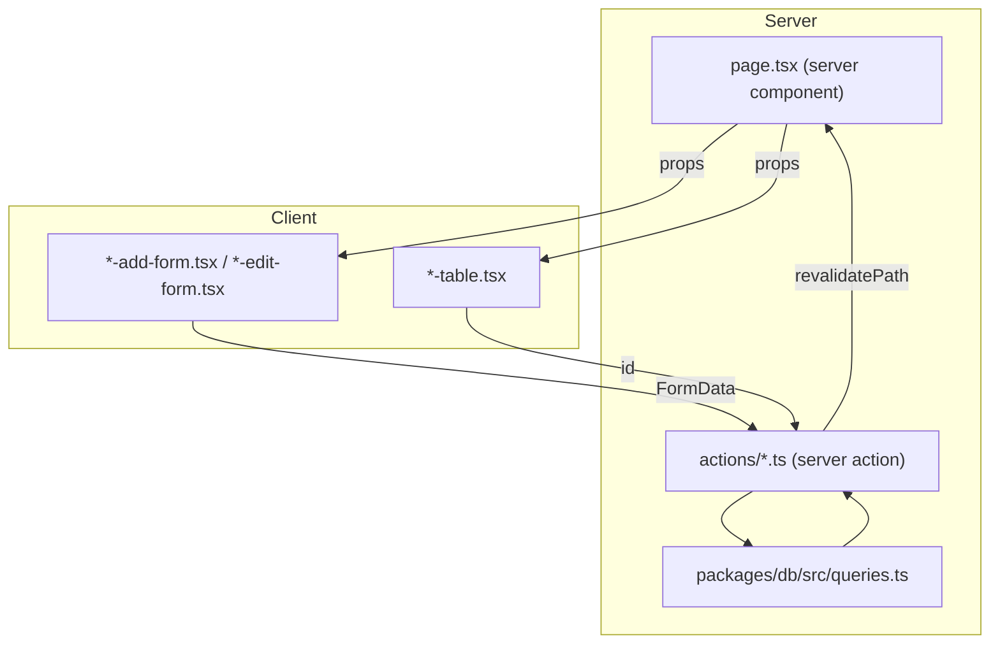

# Design Document: MVP Stage 2 High Priority

## Overview

This document covers the technical design for eight high-priority items (H1–H7, mapped to
Requirements 1–8) that close UX and data-integrity gaps before the PMG Control Center handles
sustained real financial data.

The work falls into three buckets:

- **New CRUD surfaces** - Withdrawal History (Req 1 + 2) and Lead Create/Delete (Req 3)
- **UX feedback** - Delete loading states (Req 4), success toasts (Req 5), date defaults (Req 6)
- **Data integrity / visual correctness** - Withdrawal over-limit guard (Req 7), close-month flash fix (Req 8)

All items except Req 7 are independent. Req 7 depends on Req 1+2 (the `WithdrawModal` must
exist before the `maxAmount` prop can be added).

---

## Architecture

The app follows a strict server/client split:

- **Server components** (`page.tsx`) fetch data and pass it as props to client components.
- **Server actions** (`app/actions/*.ts`) handle all mutations: Zod validation → DB call →
  `revalidatePath` → return `{ error?: string }`. They never throw.
- **Client components** use `useTransition` + `useRef` for forms, `useState` for inline error
  and delete-confirm state, and `toast.error` / `toast.success` from Sonner for feedback.

No new architectural patterns are introduced. Every new file follows the exact conventions
already established in `income.ts`, `income-table.tsx`, and `income-add-form.tsx`.



---

## Components and Interfaces

### Req 1 - Withdrawal History Data Layer

**`packages/db/src/queries.ts`** - two new query functions:

```ts
export type WithdrawalRow = {
  id: string;
  date: string;          // ISO date string e.g. "2026-03-15"
  amount: string;        // numeric from DB - caller converts with Number()
  description: string | null;
  createdAt: Date | null;
};

export async function getAllWithdrawals(): Promise<WithdrawalRow[]>
// SELECT id, date::text, amount, description, created_at
// FROM withdrawals ORDER BY date DESC, created_at DESC

export async function getWithdrawalById(id: string): Promise<WithdrawalRow | null>
// SELECT ... FROM withdrawals WHERE id = $id
// returns first row or null
```

**`apps/admin/src/app/actions/withdrawals.ts`** - new file, two server actions:

```ts
'use server'
// updateWithdrawal(id: string, formData: FormData): Promise<{ error?: string }>
//   Zod schema: { date: z.string().min(1), amount: z.coerce.number().positive(),
//                 description: z.string().optional() }
//   On success: db.update, revalidatePath('/withdrawals'), revalidatePath('/dashboard')
//   On any error: return { error: string }, never throw

// deleteWithdrawal(id: string): Promise<{ error?: string }>
//   db.delete where id, revalidatePath('/withdrawals'), revalidatePath('/dashboard')
//   On any error: return { error: string }, never throw
```

The existing `apps/admin/src/app/actions/withdraw.ts` (`recordWithdrawal`) is left unchanged.
The new `withdrawals.ts` file handles edit/delete only.

**`packages/db/src/index.ts`** - export `getAllWithdrawals`, `getWithdrawalById`, and
`WithdrawalRow` type.

---

### Req 2 - Withdrawal History Pages and Components

**`apps/admin/src/app/(admin)/withdrawals/page.tsx`** - server component:

```ts
// Fetches: getAllWithdrawals()
// Derives: ytdTotal = withdrawals
//   .filter(w => w.date.startsWith(new Date().getFullYear().toString()))
//   .reduce((sum, w) => sum + Number(w.amount), 0)
// Renders: page header, Badge with formatZAR(ytdTotal) + "YTD", WithdrawalsTable or EmptyState
```

**`apps/admin/src/app/(admin)/withdrawals/[id]/page.tsx`** - server component:

```ts
// Fetches: getWithdrawalById(params.id)
// Calls notFound() if null
// Renders: back link to /withdrawals, WithdrawalEditForm
```

**`apps/admin/src/components/withdrawals/withdrawals-table.tsx`** - client component:

```ts
interface WithdrawalsTableProps {
  entries: WithdrawalRow[]
  deleteAction: (id: string) => Promise<{ error?: string }>
}
// Columns: Date | Amount (formatZAR) | Description | Actions
// Actions: edit link (Pencil icon → /withdrawals/[id]) + delete inline confirm/cancel
// Delete pattern: pendingDeleteId state, isPendingDelete boolean, toast.error on error
// isPendingDelete: useState(false), set true before action, false in finally
```

**`apps/admin/src/components/withdrawals/withdrawal-edit-form.tsx`** - client component:

```ts
interface WithdrawalEditFormProps {
  entry: WithdrawalRow
  updateAction: (formData: FormData) => Promise<{ error?: string }>
}
// Fields: date (pre-populated from entry.date), amount (pre-populated), description (optional)
// useTransition, on success: router.push('/withdrawals')
// toast.error on error
// date defaultValue: entry.date (NOT today - edit forms pre-populate from record)
```

**`apps/admin/src/components/layout/app-sidebar.tsx`** - add nav item:

```ts
import { ..., Wallet } from 'lucide-react'
// Add to navItems array:
{ href: '/withdrawals', label: 'Withdrawals', icon: Wallet }
```

---

### Req 3 - Lead Create and Delete

**`apps/admin/src/app/actions/leads.ts`** - add two new exports to the existing file:

```ts
// createLead(formData: FormData): Promise<{ error?: string }>
// Zod schema:
//   name: z.string().min(1)
//   email: z.string().email().optional()
//   phone: z.string().optional()
//   source: z.string().optional()
//   serviceInterest: z.string().optional()
//   divisionId: z.string().uuid().optional()
//   message: z.string().optional()
// .refine: at least one of email or phone present
//   → { error: 'At least one of email or phone is required' }
// On success: db.insert(leads).values({ ...parsed, status: 'new' })
//   revalidatePath('/leads'), revalidatePath('/dashboard')

// deleteLead(id: string): Promise<{ error?: string }>
// db.delete(leads).where(eq(leads.id, id))
// revalidatePath('/leads'), revalidatePath('/dashboard')
// On error: return { error: string }, never throw
```

**`apps/admin/src/components/leads/lead-add-form.tsx`** - new client component:

```ts
interface LeadAddFormProps {
  divisions: { id: string; name: string }[]
  createAction: (formData: FormData) => Promise<{ error?: string }>
}
// useTransition + useRef for reset
// Fields: name (required), email, phone, source, serviceInterest,
//         divisionId (Select from divisions prop), message (textarea)
// On success: formRef.current?.reset(), clear controlled Select state
// On error: inline error message below form
// No success toast (Req 5 does not include createLead)
```

**`apps/admin/src/components/leads/leads-table.tsx`** - update existing component:

```ts
// Add deleteAction prop: (id: string) => Promise<{ error?: string }>
// Add pendingDeleteId state + isPendingDelete boolean state
// Add Actions column with inline confirm/cancel matching income-table.tsx pattern
// toast.error on delete error
```

**`apps/admin/src/app/(admin)/leads/page.tsx`** - update existing page:

```ts
// Add to Promise.all: getAllDivisions() (already fetched - verify it's passed through)
// Pass createLead to LeadAddForm
// Pass deleteLead to LeadsTable
// Render LeadAddForm above the table
```

---

### Req 4 - Delete Button Loading States

Three existing client components need the `isPendingDelete` pattern added. The pattern is
identical in all three:

```ts
// Before action call:
const [isPendingDelete, setIsPendingDelete] = React.useState(false)

// In handleConfirmDelete:
setIsPendingDelete(true)
try {
  const result = await deleteAction(id)
  if (result.error) toast.error(result.error)
  setPendingDeleteId(null)
} finally {
  setIsPendingDelete(false)
}

// On the Confirm button:
<Button
  variant="destructive"
  size="sm"
  disabled={isPendingDelete}
  onClick={() => handleConfirmDelete(entry.id)}
>
  {isPendingDelete ? 'Deleting…' : 'Confirm'}
</Button>
```

Files to update:
- `apps/admin/src/components/income/income-table.tsx`
- `apps/admin/src/components/expenses/expense-table.tsx` - already has `inFlightId` / `useTransition`; replace with the simpler `isPendingDelete` boolean pattern for consistency
- `apps/admin/src/components/divisions/divisions-table.tsx` - already has `isDeletePending` via `useTransition`; already shows "Deleting…" - verify it matches the spec exactly

Note: `expense-table.tsx` already has a partial implementation using `useTransition` +
`inFlightId`. The update aligns it to the canonical `isPendingDelete` boolean pattern.
`divisions-table.tsx` already uses `isDeletePending` from `useTransition` and shows
"Deleting…" - it already satisfies Req 4 criteria 5–6 and needs only a review pass.

---

### Req 5 - Success Toasts

Seven existing client components need a single line added after the `!result.error` check:

| File | Toast message |
|------|--------------|
| `income-add-form.tsx` | `toast.success('Income added')` |
| `income-edit-form.tsx` | `toast.success('Income updated')` |
| `expense-add-form.tsx` | `toast.success('Expense added')` |
| `expense-edit-form.tsx` | `toast.success('Expense updated')` |
| `division-add-form.tsx` | `toast.success('Division created')` |
| `lead-status-form.tsx` | `toast.success('Status updated')` |
| `lead-notes-form.tsx` | `toast.success('Notes saved')` |

Pattern (same in all files):

```ts
const result = await createAction(fd)
if (result.error) {
  setErrorMessage(result.error)
} else {
  toast.success('Income added')   // ← add this line
  formRef.current?.reset()
}
```

`import { toast } from 'sonner'` must be added to any file that doesn't already import it.

---

### Req 6 - Date Defaults

Two existing add forms and the new `withdrawal-edit-form.tsx` (for the add/record flow) need
a `defaultValue` on their date inputs:

```ts
// Defined once at component top, outside render:
const today = new Date().toISOString().split('T')[0]

// On the date Input:
<Input name="date" type="date" defaultValue={today} ... />
```

Files to update:
- `apps/admin/src/components/income/income-add-form.tsx`
- `apps/admin/src/components/expenses/expense-add-form.tsx`

The new `withdrawal-edit-form.tsx` (Req 2) uses `entry.date` as `defaultValue` since it is
an edit form. The withdrawal recording flow (via `WithdrawModal`) will gain a date field
defaulting to today as part of Req 2 implementation.

Edit forms (`income-edit-form.tsx`, `expense-edit-form.tsx`) are explicitly NOT touched.

---

### Req 7 - Withdrawal Over-Limit Guard

**`apps/admin/src/components/dashboard/withdraw-modal.tsx`** - add `maxAmount` prop:

```ts
interface WithdrawModalProps {
  open: boolean
  onClose: () => void
  onSuccess: () => void
  withdrawAction: (amount: number) => Promise<{ error?: string }>
  maxAmount: number   // ← new prop
}
```

Inside the component, track the entered amount via controlled state:

```ts
const [enteredAmount, setEnteredAmount] = React.useState<number | null>(null)
const isOverLimit = enteredAmount !== null && enteredAmount > maxAmount

// On the amount input:
<Input
  ref={inputRef}
  type="number"
  onChange={(e) => setEnteredAmount(parseFloat(e.target.value) || null)}
  ...
/>

// Below the input, before existing error messages:
{isOverLimit && (
  <p className="text-sm text-destructive">
    This exceeds your remaining balance of {formatZAR(maxAmount)}
  </p>
)}
```

The warning is advisory - form submission is not blocked.

**`apps/admin/src/components/dashboard/salary-card.tsx`** - compute and pass `maxAmount`:

```ts
// Existing: const withdrawn = withdrawals?.total ?? 0
// Add:
const remaining = Math.max(0, salary - withdrawn)

// Pass to WithdrawModal:
<WithdrawModal
  ...
  maxAmount={remaining}
/>
```

---

### Req 8 - Close Month Flash Fix

**`apps/admin/src/app/(admin)/dashboard/page.tsx`** - derive `hasSnapshot`:

```ts
// Already fetches: currentPeriodSnapshot via getSnapshotByPeriod(currentPeriod)
// Add:
const hasSnapshot = currentPeriodSnapshot !== null

// Pass to DashboardShell:
<DashboardShell
  ...
  hasSnapshot={hasSnapshot}
/>
```

**`apps/admin/src/components/dashboard/dashboard-shell.tsx`** - accept and use `hasSnapshot`:

```ts
type Props = {
  ...
  hasSnapshot: boolean   // ← new prop (replaces currentPeriodSnapshot usage for rendering)
}

// Replace the existing conditional:
// Before: {currentPeriodSnapshot === null ? <CloseMonthButton .../> : <Badge>Month closed</Badge>}
// After:
{hasSnapshot ? (
  <Badge variant="secondary">Month closed</Badge>
) : (
  <CloseMonthButton period={currentPeriod} hasSnapshot={hasSnapshot} />
)}
```

`currentPeriodSnapshot` prop can be removed from `DashboardShell` if it is no longer used
elsewhere in the component; otherwise keep it for any other usages.

**`apps/admin/src/components/dashboard/close-month-button.tsx`** - accept `hasSnapshot`:

```ts
export default function CloseMonthButton({
  period,
  hasSnapshot,
}: {
  period: string
  hasSnapshot: boolean
}) {
  // Use hasSnapshot as initial render state to avoid flash
  // No client-side fetch needed
  ...
}
```

If the snapshot-conditional section cannot be resolved synchronously (e.g. due to streaming),
wrap it in a `Suspense` boundary with `fallback={null}` to prevent layout shift.

---

## Data Models

No new database tables or schema changes are required. All new functionality uses the
existing `withdrawals` and `leads` tables.

### Existing `withdrawals` table (relevant columns)

| Column | Type | Notes |
|--------|------|-------|
| `id` | `uuid` | PK, auto-generated |
| `date` | `date` | NOT NULL |
| `amount` | `numeric(12,2)` | NOT NULL, positive check constraint |
| `description` | `text` | nullable |
| `created_at` | `timestamptz` | defaultNow() |

### New `WithdrawalRow` type (queries.ts)

```ts
export type WithdrawalRow = {
  id: string;
  date: string;           // date::text cast
  amount: string;         // numeric - caller uses Number()
  description: string | null;
  createdAt: Date | null;
};
```

### Existing `leads` table (relevant columns for createLead)

| Column | Type | Notes |
|--------|------|-------|
| `id` | `uuid` | PK |
| `name` | `text` | nullable |
| `email` | `text` | nullable |
| `phone` | `text` | nullable |
| `source` | `text` | nullable |
| `service_interest` | `text` | nullable |
| `division_id` | `uuid` | FK, nullable |
| `message` | `text` | nullable |
| `status` | `enum` | 'new' \| 'contacted' \| 'converted' \| 'lost' |

---

## Correctness Properties

*A property is a characteristic or behavior that should hold true across all valid executions
of a system - essentially, a formal statement about what the system should do. Properties
serve as the bridge between human-readable specifications and machine-verifiable correctness
guarantees.*

### Property Reflection

Before listing properties, redundancies are eliminated:

- 1.7 (never throw) is subsumed by 1.4 and 1.6 - removed.
- 7.3 (amount ≤ maxAmount shows no warning) is the complement of 7.2 - merged into Property 5.
- 7.6 (remaining non-negative) is guaranteed by `Math.max(0, ...)` in Property 6 - removed.
- 8.3 and 8.4 (hasSnapshot true/false rendering) are two sides of the same conditional - merged into Property 7.

### Property 1: getAllWithdrawals ordering invariant

*For any* set of withdrawal records with varying dates and `created_at` timestamps, calling
`getAllWithdrawals()` SHALL return them ordered by `date DESC`, then `created_at DESC`.

**Validates: Requirements 1.1**

---

### Property 2: getWithdrawalById round-trip

*For any* valid withdrawal record inserted into the database, calling `getWithdrawalById(id)`
with that record's id SHALL return a row with the same `date`, `amount`, and `description`.
Calling it with an id that does not exist SHALL return `null`.

**Validates: Requirements 1.2**

---

### Property 3: updateWithdrawal validation gate

*For any* payload where `date` is empty or `amount` is zero or negative, calling
`updateWithdrawal` SHALL return `{ error: string }` without mutating the database row.

**Validates: Requirements 1.4**

---

### Property 4: createLead contact requirement

*For any* lead payload where both `email` and `phone` are absent (undefined, null, or empty
string), calling `createLead` SHALL return `{ error: 'At least one of email or phone is required' }`
without inserting a row into the `leads` table.

**Validates: Requirements 3.2**

---

### Property 5: WithdrawModal over-limit warning visibility

*For any* numeric `maxAmount` and any amount entered into the `WithdrawModal` input, the
over-limit warning SHALL be visible if and only if `enteredAmount > maxAmount`.

**Validates: Requirements 7.2, 7.3**

---

### Property 6: SalaryCard remaining balance computation

*For any* `salary` and `withdrawn` values, the `remaining` value passed as `maxAmount` to
`WithdrawModal` SHALL equal `Math.max(0, salary - withdrawn)`, ensuring it is always
non-negative.

**Validates: Requirements 7.5, 7.6**

---

### Property 7: DashboardShell snapshot-conditional rendering

*For any* value of `hasSnapshot`, `DashboardShell` SHALL render the `"Month closed"` badge
when `hasSnapshot` is `true` and SHALL render `CloseMonthButton` when `hasSnapshot` is
`false` - never both simultaneously.

**Validates: Requirements 8.3, 8.4**

---

## Error Handling

All server actions follow the same contract:

1. **Validation errors** - Zod `safeParse` failure → return `{ error: issues[0].message }` immediately, no DB call.
2. **Constraint errors** - DB throws (e.g. positive-amount check, FK violation) → caught in `try/catch`, return `{ error: 'Failed to save. Please try again.' }`.
3. **Never throw** - the `try/catch` wraps the entire action body; the catch block always returns `{ error }`.

Client components handle errors in two ways:
- **Inline error state** - `setErrorMessage(result.error)` displayed below the form.
- **Toast error** - `toast.error(result.error)` for delete failures in table components.

The `createLead` `.refine` check (email or phone required) is evaluated before the DB call
and returns the specific message `'At least one of email or phone is required'`.

---

## Testing Strategy

### Unit Tests (example-based)

Focus on specific behaviors and edge cases:

- `updateWithdrawal` with valid payload updates the correct row
- `deleteWithdrawal` with valid id removes the row
- `createLead` with valid payload inserts with `status: 'new'`
- `deleteLead` with valid id removes the row
- `WithdrawModal` renders over-limit warning when amount > maxAmount
- `WithdrawModal` does not render warning when amount ≤ maxAmount
- `DashboardShell` renders badge when `hasSnapshot=true`
- `DashboardShell` renders `CloseMonthButton` when `hasSnapshot=false`
- Success toasts fire after successful form submission (one test per form)
- Date inputs on add forms default to today's date

### Property-Based Tests

Property-based testing is applicable here for the data layer and pure logic. Use
[fast-check](https://github.com/dubzzz/fast-check) (TypeScript-native, works with Vitest).

Each property test runs a minimum of **100 iterations**.

Tag format: `// Feature: mvp-stage2-high-priority, Property {N}: {property_text}`

**Property 1** - `getAllWithdrawals` ordering:
Generate arbitrary arrays of `{ date, createdAt }` pairs, insert them, call
`getAllWithdrawals()`, assert the result is sorted by `date DESC` then `createdAt DESC`.

**Property 2** - `getWithdrawalById` round-trip:
Generate arbitrary `{ date, amount, description }` values, insert, retrieve by id, assert
field equality. Also assert unknown UUIDs return `null`.

**Property 3** - `updateWithdrawal` validation gate:
Generate invalid payloads (empty date, non-positive amount), assert `{ error }` returned and
DB row unchanged.

**Property 4** - `createLead` contact requirement:
Generate lead payloads with `email: undefined` and `phone: undefined`, assert error returned
and no row inserted.

**Property 5** - `WithdrawModal` warning visibility:
Generate arbitrary `(maxAmount: number, enteredAmount: number)` pairs, render the component,
assert warning is shown iff `enteredAmount > maxAmount`.

**Property 6** - `SalaryCard` remaining computation:
Generate arbitrary `(salary: number, withdrawn: number)` pairs (including cases where
`withdrawn > salary`), assert `remaining === Math.max(0, salary - withdrawn)`.

**Property 7** - `DashboardShell` conditional rendering:
Generate arbitrary `hasSnapshot: boolean`, render `DashboardShell`, assert exactly one of
badge or button is rendered, matching the `hasSnapshot` value.
