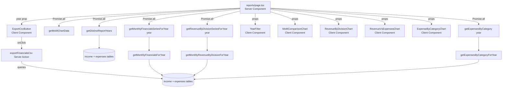

# Design Document: Reporting & Insights

## Overview

Phase 8 wires the three pre-built chart components in `components/reports/` to the
`/reports` route, adds a year filter that scopes all charts to a single calendar
year, introduces an expense-by-category bar chart, and provides a CSV export of
the full monthly financial summary via a Server Action.

No new database tables are required. All data is derived from the existing
`income` and `expenses` tables using new year-scoped query helpers.

### Key Design Decisions

- **Year filter via URL query param**: The selected year is stored in `?year=YYYY`
  so the page is fully server-rendered and shareable. The `YearFilter` client
  component calls `router.push` on change, consistent with `FilterBar` in the
  income page.
- **Single `Promise.all` fetch**: All four chart datasets plus the distinct-years
  list are fetched in parallel in the Server Component, matching the dashboard
  pattern.
- **No new DB tables**: `getExpensesByCategoryForYear`, `getDistinctYears`,
  `getMonthlyFinancialsForYear`, and `getMonthlyRevenueByDivisionForYear` are
  appended to the existing `packages/db/src/queries.ts`.
- **CSV as a string return**: `exportFinancialsCsv` returns a plain `string` (or
  `{ error }`) rather than a `Response` or `ReadableStream`. The client component
  constructs the `Blob` and triggers the download — this keeps the Server Action
  compatible with the existing `Promise<{ error?: string }>` pattern.
- **Financial model computed inline in CSV action**: The action reuses the same
  formula constants already established in Phase 1 rather than calling
  `getFinancialSummaryForPeriod` twelve times, avoiding twelve sequential DB
  round-trips.

---

## Architecture



Data flow is unidirectional: the Server Component fetches everything, passes data
down as props, and client components handle interactions (year selection, CSV
download).

---

## Components and Interfaces

### packages/db/src/queries.ts — new additions

| Helper | Signature | Returns |
|---|---|---|
| `getExpensesByCategoryForYear` | `(year: number) => Promise<{ category: string; total: number }[]>` | Expenses grouped by category for the year, ordered by `total` DESC |
| `getDistinctYears` | `() => Promise<number[]>` | Union of distinct years from `income.date` and `expenses.date`, sorted DESC |
| `getMonthlyFinancialsForYear` | `(year: number) => Promise<{ month: string; revenue: number; expenses: number }[]>` | Monthly revenue + expenses for the year, ordered by month ASC |
| `getMonthlyRevenueByDivisionForYear` | `(year: number) => Promise<{ month: string; divisionName: string; total: number }[]>` | Monthly revenue per division for the year |

All four are exported from `packages/db/src/index.ts` via `export * from './queries'`.

### apps/admin/src/lib/financial.ts — new additions

| Helper | Signature | Returns |
|---|---|---|
| `getExpensesByCategory` | `(year: number) => Promise<{ category: string; total: number }[]>` | Thin wrapper over `getExpensesByCategoryForYear` |
| `getDistinctReportYears` | `() => Promise<number[]>` | Thin wrapper over `getDistinctYears` |
| `getMonthlyFinancialsSeriesForYear` | `(year: number) => Promise<MonthlyFinancials[]>` | Wrapper over `getMonthlyFinancialsForYear` |
| `getRevenueByDivisionSeriesForYear` | `(year: number) => Promise<DivisionSeriesChart>` | Calls `getMonthlyRevenueByDivisionForYear(year)` and passes rows through `buildDivisionSeries` |

### apps/admin/src/app/actions/reports.ts

```ts
'use server'

export async function exportFinancialsCsv(
  year: number
): Promise<string | { error: string }>
```

- Validates `year` is an integer in range 1000–9999; returns `{ error: 'Invalid year' }` otherwise.
- Queries `getMonthlyFinancialsForYear(year)` once to get all revenue/expense rows.
- Builds a 12-row result (one per calendar month), filling missing months with zeros.
- Computes all Financial_Model fields inline for each row.
- Returns the CSV string (header + 12 data rows). Never throws.

### apps/admin/src/components/reports/year-filter.tsx

`'use client'` component. Props: `{ years: number[]; currentYear: number }`.
Renders a shadcn `<Select>` populated with the provided years. On change calls
`router.push('/reports?year=' + value)`.

### apps/admin/src/components/reports/expense-by-category-chart.tsx

`'use client'` component. Props: `{ data: { category: string; total: number }[] }`.
Renders a horizontal recharts `BarChart`. Empty state: `"No expense data for this year."`.
Bar fill: `var(--chart-3)`. All monetary values formatted with `formatZAR`.

### apps/admin/src/components/reports/export-csv-button.tsx

`'use client'` component. Props: `{ year: number }`.
Uses `useTransition` for pending state. On click: calls `exportFinancialsCsv(year)`,
creates a `Blob`, triggers download as `pmg-financials-{year}.csv`.
On error: `toast.error(error)` via sonner.

### apps/admin/src/app/(admin)/reports/page.tsx

Async Server Component. Reads `searchParams.year`, validates it, defaults to
`new Date().getFullYear()` if absent or invalid. Fires all fetches in a single
`Promise.all`. Renders page header with title "Reports & Insights", `YearFilter`,
`ExportCsvButton`, and all four chart components in a single-column layout.

---

## Data Models

No new database tables. All data is derived from existing `income` and `expenses`
tables.

### Query result shapes

```ts
// getExpensesByCategoryForYear
{ category: string; total: number }[]

// getDistinctYears
number[]

// getMonthlyFinancialsForYear
{ month: string; revenue: number; expenses: number }[]  // month = 'YYYY-MM'

// getMonthlyRevenueByDivisionForYear
{ month: string; divisionName: string; total: number }[]
```

### CSV row shape (internal to exportFinancialsCsv)

```ts
{
  month: string        // e.g. 'January'
  revenue: number
  expenses: number
  pmgShare: number     // revenue × 0.20
  profitPool: number   // revenue − expenses − pmgShare
  salary: number       // profitPool × 0.35
  reinvest: number     // profitPool × 0.30
  reserve: number      // profitPool × 0.30
  flex: number         // profitPool × 0.05
}
```

### Financial Model (reference)

```
pmgShare   = revenue × 0.20
profitPool = revenue − expenses − pmgShare
salary     = profitPool × 0.35
reinvest   = profitPool × 0.30
reserve    = profitPool × 0.30
flex       = profitPool × 0.05
```

---

## Correctness Properties

*A property is a characteristic or behavior that should hold true across all valid
executions of a system — essentially, a formal statement about what the system
should do. Properties serve as the bridge between human-readable specifications
and machine-verifiable correctness guarantees.*

### Property 1: getDistinctReportYears returns sorted, distinct years

*For any* set of income and expense entries spanning multiple calendar years,
`getDistinctReportYears()` SHALL return an array where: (a) all values are
distinct, (b) the array is sorted in descending order, and (c) every year that
appears in at least one `income.date` or `expenses.date` entry is present in the
result.

**Validates: Requirements 2.5, 6.2, 6.5**

### Property 2: getExpensesByCategory returns valid, ordered data

*For any* calendar year that has at least one expense entry, `getExpensesByCategory(year)`
SHALL return an array where: (a) every `total` is a positive number, (b) every
`category` is a non-empty string, and (c) the array is ordered by `total`
descending (i.e. `result[i].total >= result[i+1].total` for all valid `i`).

**Validates: Requirements 3.2, 6.1, 6.4, 6.6**

### Property 3: CSV export correctness — structure and financial model

*For any* valid four-digit year (1000–9999), `exportFinancialsCsv(year)` SHALL
return a string (not `{ error }`) whose: (a) first line equals exactly
`Month,Revenue,Expenses,PMG Share,Profit Pool,Salary,Reinvest,Reserve,Flex`,
(b) there are exactly 12 subsequent data rows (one per calendar month), and
(c) for every row, the Financial_Model invariants hold:
`pmgShare = revenue × 0.20`, `profitPool = revenue − expenses − pmgShare`,
`salary = profitPool × 0.35`, `reinvest = profitPool × 0.30`,
`reserve = profitPool × 0.30`, `flex = profitPool × 0.05`
(within floating-point tolerance of 0.01).

**Validates: Requirements 4.2, 4.3, 4.4**

### Property 4: CSV export error safety — invalid year and never throws

*For any* integer outside the range 1000–9999, `exportFinancialsCsv(year)` SHALL
return `{ error: 'Invalid year' }` and SHALL NOT throw. Additionally, *for any*
input whatsoever (including non-integer values), the action SHALL never throw —
all error conditions are returned as `{ error: string }`.

**Validates: Requirements 4.5, 4.6**

### Property 5: Year filter falls back to current year for invalid query params

*For any* string that is not a valid four-digit integer (i.e. does not match
`/^\d{4}$/` or parses to a value outside 1000–9999), the Reports_Page year
resolution logic SHALL produce `new Date().getFullYear()` as the effective year,
identical to the result when no `year` query parameter is present.

**Validates: Requirements 2.3, 2.6**

---

## Error Handling

| Scenario | Handling |
|---|---|
| `year` query param absent | Default to `new Date().getFullYear()` |
| `year` query param invalid (non-numeric, wrong length) | Silent fallback to current year |
| `exportFinancialsCsv` called with year outside 1000–9999 | Return `{ error: 'Invalid year' }` |
| DB error inside `exportFinancialsCsv` | Caught in try/catch → return `{ error: err.message }` |
| `ExportCsvButton` receives `{ error }` | `toast.error(error)` via sonner |
| `getDistinctReportYears` returns empty array | `YearFilter` renders only the current year as the sole option |
| Chart data arrays are empty | Each chart component renders its own empty-state message (existing behaviour) |
| `getExpensesByCategory` returns empty array | `ExpenseByCategoryChart` renders "No expense data for this year." |

The `exportFinancialsCsv` Server Action follows the same never-throw contract as
all other Server Actions in the codebase (`income.ts`, `snapshots.ts`).

---

## Testing Strategy

### Test file

`apps/admin/src/__tests__/reports.test.ts`

### Property-Based Tests (fast-check, minimum 100 iterations each)

fast-check is the existing property-based testing library used throughout the
codebase. Each test is tagged with its design property reference.

**P1 — getDistinctReportYears returns sorted, distinct years**
```ts
// Feature: reporting-insights, Property 1: getDistinctReportYears returns sorted, distinct years
fc.assert(fc.asyncProperty(
  fc.array(
    fc.record({
      table: fc.constantFrom('income', 'expenses'),
      year: fc.integer({ min: 2020, max: 2030 }),
    }),
    { minLength: 1, maxLength: 30 }
  ),
  async (entries) => {
    // Insert entries into the appropriate tables, call getDistinctReportYears(),
    // verify sorted DESC, distinct, and all input years are present
  }
), { numRuns: 100 })
```

**P2 — getExpensesByCategory returns valid, ordered data**
```ts
// Feature: reporting-insights, Property 2: getExpensesByCategory returns valid, ordered data
fc.assert(fc.asyncProperty(
  fc.integer({ min: 2020, max: 2030 }),
  fc.array(
    fc.record({
      category: fc.string({ minLength: 1, maxLength: 50 }),
      amount: fc.float({ min: 0.01, max: 100_000, noNaN: true }),
    }),
    { minLength: 1, maxLength: 20 }
  ),
  async (year, expenseEntries) => {
    // Insert expense entries for the year, call getExpensesByCategory(year),
    // verify all totals > 0, all categories non-empty, sorted by total DESC
  }
), { numRuns: 100 })
```

**P3 — CSV export correctness**
```ts
// Feature: reporting-insights, Property 3: CSV export correctness — structure and financial model
fc.assert(fc.asyncProperty(
  fc.integer({ min: 1000, max: 9999 }),
  async (year) => {
    const result = await exportFinancialsCsv(year)
    if (typeof result !== 'string') return false
    const lines = result.trim().split('\n')
    if (lines[0] !== 'Month,Revenue,Expenses,PMG Share,Profit Pool,Salary,Reinvest,Reserve,Flex') return false
    if (lines.length !== 13) return false  // header + 12 months
    const eps = 0.01
    for (const line of lines.slice(1)) {
      const [, rev, exp, pmg, profit, sal, reinv, res, flex] = line.split(',').map(Number)
      if (Math.abs(pmg - rev * 0.20) > eps) return false
      if (Math.abs(profit - (rev - exp - pmg)) > eps) return false
      if (Math.abs(sal - profit * 0.35) > eps) return false
      if (Math.abs(reinv - profit * 0.30) > eps) return false
      if (Math.abs(res - profit * 0.30) > eps) return false
      if (Math.abs(flex - profit * 0.05) > eps) return false
    }
    return true
  }
), { numRuns: 100 })
```

**P4 — CSV export error safety**
```ts
// Feature: reporting-insights, Property 4: CSV export error safety — invalid year and never throws
fc.assert(fc.asyncProperty(
  fc.oneof(
    fc.integer({ max: 999 }),
    fc.integer({ min: 10000 }),
  ),
  async (invalidYear) => {
    const result = await exportFinancialsCsv(invalidYear)
    return typeof result === 'object' && result.error === 'Invalid year'
  }
), { numRuns: 100 })
```

**P5 — Year filter fallback**
```ts
// Feature: reporting-insights, Property 5: Year filter falls back to current year for invalid query params
fc.assert(fc.property(
  fc.oneof(
    fc.string().filter(s => !/^\d{4}$/.test(s)),
    fc.integer({ max: 999 }).map(String),
    fc.integer({ min: 10000 }).map(String),
  ),
  (invalidParam) => {
    const resolved = resolveYear(invalidParam)
    return resolved === new Date().getFullYear()
  }
), { numRuns: 100 })
// Note: resolveYear is the pure year-resolution helper extracted from the page
```

### Unit Tests (example-based)

- `YearFilter` renders a `<Select>` with one option per year in the `years` array
- `YearFilter` calls `router.push('/reports?year=2024')` when 2024 is selected
- `ExpenseByCategoryChart` renders "No expense data for this year." when `data = []`
- `ExpenseByCategoryChart` renders a bar for each category in the data array
- `ExportCsvButton` is disabled and shows "Exporting…" while `isPending` is true
- `ExportCsvButton` calls `toast.error` when the action returns `{ error }`
- `ExportCsvButton` triggers a download with filename `pmg-financials-2025.csv`
- Reports page renders heading "Reports & Insights"
- `exportFinancialsCsv(2025)` with no DB data returns a string with 12 zero-value rows

### Integration Tests

- `getDistinctYears()` against the seeded test DB returns years present in seed data, sorted DESC
- `getExpensesByCategoryForYear(year)` against seeded data returns correct category totals
- `getMonthlyFinancialsForYear(year)` returns only rows for the specified year

### What is NOT tested with PBT

- UI layout (single-column chart order) — snapshot test
- Nav item wiring (`/reports`, `BarChart3` icon) — already implemented, smoke check
- `var(--chart-3)` bar fill colour — code review / snapshot test
- `revalidatePath` calls — mock-based unit test
- `Promise.all` parallelism — architectural constraint, code review
