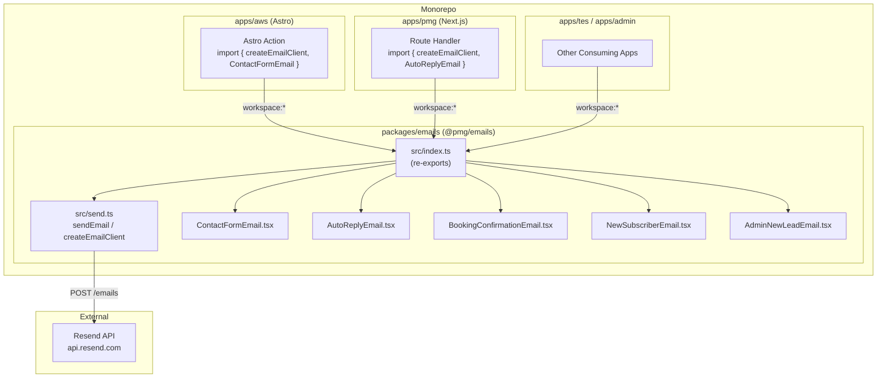

# Design Document: shared-email-package

## Overview

This design extracts the five React Email templates currently living in `apps/aws/emails/` into a new shared workspace package `packages/emails` (`@pmg/emails`). The package exposes:

- All five email templates as named React component exports
- A typed `sendEmail` function and `createEmailClient` factory that wrap the Resend SDK
- A `BrandingProps` interface so any consuming app can pass its own branding at call time
- A `react-email` dev preview server via the `email:dev` script

The package is source-first: Bun resolves `.tsx` files directly via the `exports` map, so no build step is needed for consuming apps. All Resend credentials are supplied by the consuming app at call time - the package itself contains no environment variable reads.

---

## Architecture



Each consuming app:
1. Adds `"@pmg/emails": "workspace:*"` to its `package.json`
2. Reads its own env vars (`RESEND_API_KEY`, `FROM_EMAIL`, `ADMIN_EMAIL`)
3. Calls `createEmailClient(config)` once and reuses the returned `sendEmail` function

---

## File Tree

```
packages/emails/
├── package.json          # name: @pmg/emails, exports: {"." : "./src/index.ts"}
├── tsconfig.json         # extends @pmg/typescript-config/react-library.json
├── README.md
└── src/
    ├── index.ts          # re-exports everything from send.ts and all templates
    ├── send.ts           # ResendConfig, sendEmail, createEmailClient
    └── templates/
        ├── ContactFormEmail.tsx
        ├── AutoReplyEmail.tsx
        ├── BookingConfirmationEmail.tsx
        ├── NewSubscriberEmail.tsx
        └── AdminNewLeadEmail.tsx
```

---

## Components and Interfaces

### `src/send.ts` - Full TypeScript Signatures

```typescript
import { Resend } from "resend";
import type React from "react";

export interface ResendConfig {
  apiKey: string;
  from: string;
  adminEmail: string;
}

export interface EmailPayload {
  to: string;
  subject: string;
  react: React.ReactElement;
}

export interface SendResult {
  data: { id: string } | null;
  error: { message: string; name: string } | null;
}

/**
 * Sends a single email via the Resend API.
 * Instantiates a new Resend client per call using the provided config.
 * Never throws - errors are returned in the `error` field.
 */
export async function sendEmail(
  config: ResendConfig,
  payload: EmailPayload
): Promise<SendResult>;

/**
 * Factory that closes over a ResendConfig and returns a bound sendEmail.
 * Use this to avoid repeating config on every call.
 */
export function createEmailClient(
  config: ResendConfig
): (payload: EmailPayload) => Promise<SendResult>;
```

**Implementation notes for `sendEmail`:**
- Instantiates `new Resend(config.apiKey)` on each call (stateless, safe for serverless)
- Calls `resend.emails.send({ from: config.from, to, subject, react })`
- Wraps the entire call in `try/catch`; returns `{ data: null, error }` on failure
- Never reads `process.env` - all config comes from the caller

**Implementation notes for `createEmailClient`:**
- Returns `(payload) => sendEmail(config, payload)`
- The returned function is typed as `(payload: EmailPayload) => Promise<SendResult>`

### `src/index.ts` - Exports

```typescript
// Send utilities
export { sendEmail, createEmailClient } from "./send";
export type { ResendConfig, EmailPayload, SendResult } from "./send";

// Shared branding interface
export type { BrandingProps } from "./types";

// Templates
export { default as ContactFormEmail } from "./templates/ContactFormEmail";
export { default as AutoReplyEmail } from "./templates/AutoReplyEmail";
export { default as BookingConfirmationEmail } from "./templates/BookingConfirmationEmail";
export { default as NewSubscriberEmail } from "./templates/NewSubscriberEmail";
export { default as AdminNewLeadEmail } from "./templates/AdminNewLeadEmail";

// Template prop types
export type { ContactFormEmailProps } from "./templates/ContactFormEmail";
export type { AutoReplyEmailProps } from "./templates/AutoReplyEmail";
export type { BookingConfirmationEmailProps } from "./templates/BookingConfirmationEmail";
export type { NewSubscriberEmailProps } from "./templates/NewSubscriberEmail";
export type { AdminNewLeadEmailProps } from "./templates/AdminNewLeadEmail";
```

### Consuming App Pattern

```typescript
// In any Astro Action or Next.js route handler:
import { createEmailClient, ContactFormEmail } from "@pmg/emails";
import React from "react";

const email = createEmailClient({
  apiKey: import.meta.env.RESEND_API_KEY,
  from: import.meta.env.FROM_EMAIL,
  adminEmail: import.meta.env.ADMIN_EMAIL,
});

const { error } = await email({
  to: import.meta.env.ADMIN_EMAIL,
  subject: "New contact form submission",
  react: React.createElement(ContactFormEmail, { name, email, subject, message }),
});

if (error) {
  console.error("Email send failed:", error.message);
}
```

---

## Data Models

### `BrandingProps`

Defined once (in `src/index.ts` or a `src/types.ts` file) and intersected into every template's props type:

```typescript
export interface BrandingProps {
  companyName?: string;   // default: "Apex Web Solutions"
  logoUrl?: string;       // default: undefined (no logo rendered)
  primaryColor?: string;  // default: "#1d4ed8" (Tailwind blue-700)
  websiteUrl?: string;    // default: "https://apexwebsolutions.co.za"
}
```

### Template Prop Types

Each template's full props type is `ContentProps & BrandingProps`:

| Template | Content Props |
|---|---|
| `ContactFormEmail` | `name: string; email: string; subject: string; message: string` |
| `AutoReplyEmail` | `name: string` |
| `BookingConfirmationEmail` | `name: string; package_name: string; package_price: string; package_type: string` |
| `NewSubscriberEmail` | `email: string` |
| `AdminNewLeadEmail` | `name: string; email: string; phone: string; package_name: string; package_price: string; package_type: string` |

### Branding Rendering Rules

- **`logoUrl` provided**: render `` in the email header section
- **`primaryColor` provided**: apply via inline `style={{ color: primaryColor }}` or `style={{ backgroundColor: primaryColor }}` to buttons and headings (inline styles are required for email client compatibility - Tailwind class-based color overrides are unreliable in email clients)
- **`companyName` / `websiteUrl`**: used in footer text and `<Link>` href

### `PreviewProps` (preserved on all templates)

Each template retains its static `PreviewProps` property so the react-email preview server can render a default state:

```typescript
ContactFormEmail.PreviewProps = {
  name: "John Smith", email: "john.smith@example.com",
  subject: "Website Inquiry - New Project", message: "Hello, ..."
};
AutoReplyEmail.PreviewProps = { name: "Sarah Johnson" };
BookingConfirmationEmail.PreviewProps = {
  name: "Sarah Johnson", package_name: "Professional Tender Management",
  package_price: "R2,500/month", package_type: "Premium"
};
NewSubscriberEmail.PreviewProps = { email: "sarah.johnson@example.com" };
AdminNewLeadEmail.PreviewProps = {
  name: "John Smith", email: "john.smith@example.com",
  phone: "+27 11 123 4567", package_name: "Professional Tender Management",
  package_price: "R2,500/month", package_type: "Premium"
};
```

### Monorepo Configuration Changes

**`packages/emails/package.json`**
```json
{
  "name": "@pmg/emails",
  "version": "0.0.1",
  "private": true,
  "exports": { ".": "./src/index.ts" },
  "scripts": {
    "email:dev": "email dev --dir src/templates"
  },
  "dependencies": {
    "@react-email/components": "^1.0.1",
    "resend": "^4.0.0"
  },
  "devDependencies": {
    "react-email": "latest",
    "@pmg/typescript-config": "workspace:*"
  },
  "peerDependencies": {
    "react": "^19.0.0",
    "react-dom": "^19.0.0"
  }
}
```

**`packages/emails/tsconfig.json`**
```json
{
  "extends": "@pmg/typescript-config/react-library.json",
  "include": ["src"]
}
```

**Root `package.json` - additions to `overrides`**
```json
{
  "overrides": {
    "@react-email/components": "^1.0.1",
    "resend": "^4.0.0"
  }
}
```

**`turbo.json` - new task**
```json
{
  "tasks": {
    "email:dev": {
      "cache": false,
      "persistent": true
    }
  }
}
```

**`packages/db/src/reset.ts` - add `withdrawals`**
```sql
drop table if exists
  leads,
  expenses,
  income,
  clients,
  divisions,
  aws_pricing,
  withdrawals
cascade
```

---

## Correctness Properties

*A property is a characteristic or behavior that should hold true across all valid executions of a system - essentially, a formal statement about what the system should do. Properties serve as the bridge between human-readable specifications and machine-verifiable correctness guarantees.*

### Property 1: Rendered HTML contains all provided props

*For any* template in the package and *for any* valid set of content props and branding props passed to that template, the rendered HTML string should contain each provided string value (name, email, subject, message, companyName, websiteUrl, primaryColor, logoUrl, etc.).

**Validates: Requirements 2.2, 2.4, 3.3, 3.4**

### Property 2: Branding defaults applied when props omitted

*For any* template rendered without branding props, the rendered HTML should contain the default `companyName` ("Apex Web Solutions") and the default `websiteUrl` ("https://apexwebsolutions.co.za").

**Validates: Requirements 3.2**

### Property 3: sendEmail always returns a result object, never throws

*For any* `ResendConfig` and `EmailPayload` (including cases where the Resend API returns an error or throws), calling `sendEmail` should return an object with both `data` and `error` fields and should never propagate an exception to the caller.

**Validates: Requirements 4.3, 4.4**

### Property 4: createEmailClient closes over config

*For any* `ResendConfig`, calling `createEmailClient(config)` and then calling the returned function should produce the same result as calling `sendEmail(config, payload)` directly with the same payload.

**Validates: Requirements 7.3**

---

## Error Handling

| Scenario | Behavior |
|---|---|
| Resend API returns error response | `sendEmail` returns `{ data: null, error: { message, name } }` |
| Resend SDK throws (network failure, timeout) | `try/catch` in `sendEmail` catches and returns `{ data: null, error }` |
| Missing required content props | TypeScript compile error - no runtime guard needed |
| Missing `ResendConfig` fields | TypeScript compile error - no runtime guard needed |
| Invalid `apiKey` | Resend returns 401; surfaced via `error` field |
| Template renders with partial branding props | Defaults fill in missing fields; no error |

The package deliberately does **not** throw on send failure. This keeps consuming app code simple - callers always check the `error` field rather than wrapping in `try/catch`.

---

## Testing Strategy

### Dual Testing Approach

Both unit tests and property-based tests are required. They are complementary:
- Unit tests catch concrete bugs with specific known inputs
- Property tests verify general correctness across the full input space

### Unit Tests

Focus on:
- Verifying all expected named exports exist (`sendEmail`, `createEmailClient`, all five template components)
- Verifying each template has a `PreviewProps` static property
- Verifying `sendEmail` returns `{ data, error }` shape for a known mock response
- Verifying `sendEmail` returns `{ data: null, error }` when Resend throws
- Snapshot tests for each template rendered with its `PreviewProps`

### Property-Based Tests

Use **fast-check** (TypeScript-native, works with Bun/Vitest).

Each property test runs a minimum of **100 iterations**.

Each test is tagged with a comment in the format:
`// Feature: shared-email-package, Property {N}: {property_text}`

**Property 1 test - Rendered HTML contains all provided props**
```typescript
// Feature: shared-email-package, Property 1: rendered HTML contains all provided props
fc.assert(
  fc.property(
    fc.record({ name: fc.string({ minLength: 1 }), email: fc.emailAddress(), subject: fc.string({ minLength: 1 }), message: fc.string({ minLength: 1 }) }),
    fc.record({ companyName: fc.option(fc.string({ minLength: 1 })), primaryColor: fc.option(fc.hexaString({ minLength: 6, maxLength: 6 }).map(h => `#${h}`)), websiteUrl: fc.option(fc.webUrl()) }),
    (contentProps, brandingProps) => {
      const html = render(React.createElement(ContactFormEmail, { ...contentProps, ...brandingProps }));
      expect(html).toContain(contentProps.name);
      expect(html).toContain(contentProps.email);
      if (brandingProps.companyName) expect(html).toContain(brandingProps.companyName);
    }
  ),
  { numRuns: 100 }
);
```

**Property 2 test - Branding defaults applied when props omitted**
```typescript
// Feature: shared-email-package, Property 2: branding defaults applied when props omitted
fc.assert(
  fc.property(
    fc.constant(AutoReplyEmail.PreviewProps),
    (props) => {
      const html = render(React.createElement(AutoReplyEmail, props));
      expect(html).toContain("Apex Web Solutions");
      expect(html).toContain("apexwebsolutions.co.za");
    }
  ),
  { numRuns: 100 }
);
```

**Property 3 test - sendEmail never throws**
```typescript
// Feature: shared-email-package, Property 3: sendEmail always returns result object, never throws
fc.assert(
  fc.property(
    fc.record({ apiKey: fc.string(), from: fc.emailAddress(), adminEmail: fc.emailAddress() }),
    fc.record({ to: fc.emailAddress(), subject: fc.string({ minLength: 1 }) }),
    async (config, payload) => {
      // Mock Resend to randomly succeed or throw
      const result = await sendEmail(config, { ...payload, react: React.createElement("div") });
      expect(result).toHaveProperty("data");
      expect(result).toHaveProperty("error");
    }
  ),
  { numRuns: 100 }
);
```

**Property 4 test - createEmailClient closes over config**
```typescript
// Feature: shared-email-package, Property 4: createEmailClient closes over config
fc.assert(
  fc.property(
    fc.record({ apiKey: fc.string(), from: fc.emailAddress(), adminEmail: fc.emailAddress() }),
    fc.record({ to: fc.emailAddress(), subject: fc.string({ minLength: 1 }) }),
    async (config, payload) => {
      const boundSend = createEmailClient(config);
      const r1 = await boundSend({ ...payload, react: React.createElement("div") });
      const r2 = await sendEmail(config, { ...payload, react: React.createElement("div") });
      // Both should have the same shape
      expect(Object.keys(r1).sort()).toEqual(Object.keys(r2).sort());
    }
  ),
  { numRuns: 100 }
);
```

### Test File Location

```
packages/emails/src/__tests__/
  send.test.ts          # unit + property tests for sendEmail / createEmailClient
  templates.test.tsx    # unit + property tests for all five templates
```
