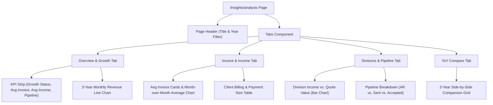

# Business Growth Analysis Dashboard - Audit & Implementation Plan

> `pmg-hub / docs / analisis / analysis_audit_plan.md` · July 2026
>
> **Scope:** Architectural and UI/UX audit for implementing a single-page, tabbed business analysis dashboard with Year-over-Year (YoY) comparison capabilities.

---

## 1. Executive Summary

This plan outlines the audit and design for a single-page, tabbed **Business Growth Analysis Dashboard** in the PMG Hub Admin portal. Since this business is currently a side hustle, the core objective is to provide a clean, high-impact view of key financial health indicators.

The dashboard will enable you to immediately answer:
1. **Are we growing or not?** (Top-level Growth Status indicator comparing YTD periods).
2. **What is our average invoice size?** (Average invoice amount trends over time).
3. **Which divisions are generating quotes and converting them to income?** (Quote breakdown + actual cash income per division).
4. **What is our average transaction and monthly income?** (Cash flow averages).
5. **What is our future revenue pipeline?** (Potential growth from outstanding invoices and pending/accepted quotes).

---

## 2. Core Metric Definitions & Calculations

### 2.1 Grow / Not Growing Status
To accurately assess growth, we must align metrics with the company's financial year (which begins on **March 1st**, as established by the codebase's financial period calculations).
* **Current YTD Revenue**: Sum of payments in the `income` table from March 1st of the selected year to the current date/month.
* **Prior YTD Revenue**: Sum of payments in the `income` table in the previous financial year for the exact same elapsed period (e.g., if analyzing March–July of FY2026, compare it to March–July of FY2025).
* **Growth rate % Formula**:
  $$\text{YoY Growth Rate \%} = \frac{\text{Current YTD Revenue} - \text{Prior YTD Revenue}}{\text{Prior YTD Revenue}} \times 100$$
* **Visual Indicator**: A high-level status badge:
  * **Growing** (Green, $\ge 5\%$ YoY growth)
  * **Stable** (Blue, $-5\%$ to $+5\%$ YoY)
  * **Declining** (Red, $\le -5\%$ YoY decline)

### 2.2 Average Invoice Amount
Tracks the average size of client bills.
* **Formula**:
  $$\text{Average Invoice Amount} = \frac{\sum \text{Invoice Totals}}{\text{Count of Invoices}}$$
* **Filter Rule**: Exclude `draft` and `void` invoices; count only billing documents with statuses `issued`, `partially_paid`, `paid`, or `overdue`.
* **YoY Metric**: Show how this average has shifted compared to the last two years.

### 2.3 Quotes & Division Income
Splits quote values, conversion metrics, and actual cash income by business division.
* **Division Quotes Volume**: Sum of quotation totals (`quotations.total`) per division.
* **Division Quote Conversion Rate**:
  $$\text{Quote Conversion Rate \%} = \frac{\text{Count of Converted/Accepted Quotes}}{\text{Total Count of Quotes}} \times 100$$
* **Division Income**: Actual cash received per division (from `income` table records linked to each division).
* **YoY Trend**: Compare how much each division's income and pipeline value have grown year-over-year.

### 2.4 Average Income
Provides cash collection metrics.
* **Average Monthly Income**: Total income for the year divided by active months (or 12 for completed years).
* **Average Receipt/Transaction Size**: Average amount per entry in the `income` table (`Sum of income / Count of records`).

### 2.5 Potential Growth (Pipeline)
A forward-looking metric showing money expected in the short-to-medium term.
* **Formula**:
  $$\text{Potential Growth (Pipeline)} = \text{Outstanding Receivables} + \text{Accepted (Uninvoiced) Quotes} + (\text{Sent Quotes} \times \text{Est. Win Rate})$$
* **Component Breakdown**:
  * **Outstanding Invoices (AR)**: Sum of remaining balances on `issued`, `partially_paid`, and `overdue` invoices.
  * **Pending Quotes (Sent)**: Total value of active quotations sent to clients but not yet accepted.
  * **Accepted Quotes (Uninvoiced)**: Total value of accepted quotes that have not yet had invoices generated against them.

---

## 3. Database & Schema Audit

All required data points are already captured by the database schema. **No database migrations or schema additions are required.** This keeps the implementation purely application-level, minimizing risk.

The following tables and fields will be utilized:

| Entity | DB Table | Fields Used | Audit & Data Availability Status |
|--------|----------|-------------|----------------------------------|
| **Invoices** | `invoices` | `id`, `total`, `invoiceDate`, `status`, `divisionId`, `clientId` | Available. Excludes `void` and `draft` statuses for financial calculations. |
| **Income (Cash)** | `income` | `id`, `amount`, `date`, `divisionId`, `clientId` | Available. Tracks actual cash receipts. |
| **Quotes** | `quotations` | `id`, `total`, `quoteDate`, `status`, `divisionId`, `clientId` | Available. Tracks active sales pipeline (`sent`, `accepted`, `converted`). |
| **Divisions** | `divisions` | `id`, `name`, `isActive` | Available. Groups financial documents by business units. |

---

## 4. Database Queries to Implement

Three optimized query functions should be added to `@pmg/db` (specifically under `packages/db/src/queries/general.ts` or a new `analysis.ts` file) to aggregate this data:

### 4.1 `getAnalysisOverview(year: number)`
Retrieves key KPI metrics and calculations for the selected financial year, including YTD matching for previous years.
* **Calculations**:
  * Total & average invoice amounts for current vs previous financial year.
  * Total & average income transactions.
  * Pipeline valuations (Outstanding AR, Sent quotes, Accepted quotes).
  * YoY YTD Growth percentage.

### 4.2 `getDivisionQuotesMetrics(year: number)`
Aggregates quotes and actual income by division.
* **Calculations**:
  * Group `income` amount by `divisionId` and join with `divisions.name`.
  * Group `quotations` total by `divisionId` and calculate conversion percentages (Status = `converted` or `accepted` vs total).

### 4.3 `getThreeYearYoYComparison(currentYear: number)`
Returns side-by-side summaries for the selected year ($N$), last year ($N-1$), and two years ago ($N-2$).
* **Data returned**:
  * Total Revenue (Income)
  * Total Invoiced Amount
  * Average Invoice Size
  * Average Transaction Size
  * Total Expenses & Profit Pool
  * Count of Quotes vs. Quote Conversion Rate

---

## 5. UI/UX Page Design

The page will reside in the **Admin App** at `/insights/analysis` and will be integrated into the sidebar navigation under the **Insights** section. It will consist of a **Sticky Header** with a year-filter dropdown and a **4-Tab Layout**.

### Tab 1: Overview & Growth
Focuses on immediate health indicators and multi-year trends.
1. **KPI Indicator Strip**:
   * **Growth Status**: Large text displaying "GROWING" (Green) or "STABLE" (Blue) or "DECLINING" (Red) along with the YTD growth percentage (e.g. `+12.4% YoY`).
   * **Average Invoice Size**: E.g., `R 12,450.00` (with a small sub-text comparing it to last year's average).
   * **Average Income**: E.g., `R 8,900.00` per cash transaction.
   * **Pipeline/Potential Growth**: E.g., `R 45,000.00` potential cash in pipeline.
2. **3-Year Revenue Trend Chart**:
   * A multi-line chart using `recharts` showing monthly cash income for the last 3 financial years overlaid on top of each other (Month 1 to 12 along the X-axis: March to February). This makes it incredibly easy to see if the current year's line is consistently above previous years' lines.

### Tab 2: Invoice & Income Details
Provides deep dive statistics into billing and transactions.
1. **Billing Averages Grid**:
   * Total Invoiced vs. Total Paid.
   * Average invoice value by month.
   * Growth trend of invoice values (are clients purchasing larger packages?).
2. **Transaction Size Analysis**:
   * Average size of a cash receipt.
   * Total number of transactions (indicates volume of client activity).

### Tab 3: Divisions & Pipeline (Quotes & Potential Growth)
Breaks down how divisions perform and shows what is waiting to close.
1. **Division Performance Chart**:
   * Grouped bar chart comparing **Actual Cash Received** vs. **Total Sent Quotes Value** per division. This highlights which divisions have the most potential vs. actual cash flow.
2. **Quote Conversion Rates Grid**:
   * Table displaying: Division | Quote Count | Win Rate % | Total Quote Value | Converted Cash.
3. **Pipeline Breakdown Cards**:
   * **Unpaid Invoices (Receivables)**: Cash that is already legally owed (low risk).
   * **Accepted Quotes (Uninvoiced)**: Deals won but not yet billed (medium risk).
   * **Sent Quotes (Pending)**: Deals in negotiation (high risk).

### Tab 4: YoY Multi-Year Compare
A clean, grid-based dashboard that compares the last 3 years side-by-side.

| Metric | FY 2026 (YTD) | FY 2025 | FY 2024 | Trend |
|--------|--------------|---------|---------|-------|
| **Total Income** | R 340,000.00 | R 520,000.00 | R 410,000.00 | 📈 Growing |
| **Total Expenses** | R 110,000.00 | R 190,000.00 | R 160,000.00 | 📉 Stable |
| **Average Invoice** | R 15,200.00 | R 12,100.00 | R 10,500.00 | 📈 Growing |
| **Average Transaction** | R 9,800.00 | R 8,200.00 | R 7,100.00 | 📈 Growing |
| **Quotes Issued** | 32 | 58 | 42 | 📈 Growing |
| **Quote Conversion Rate** | 68.7% | 61.2% | 55.4% | 📈 Growing |
| **Net Profit Pool** | R 145,000.00 | R 200,000.00 | R 147,500.00 | 📈 Growing |

---

## 6. Multi-Page Evaluation

* **Recommendation**: **Keep everything under 1 page with tabs.**
* **Why**: For a side-hustle stage, navigation complexity should be minimal. Tabs keep the load times fast, prevent cognitive overload, and allow all metrics to share the top-level **Year Filter** and export functions.
* **Future Expansion Paths**: If the business scales (e.g. multiple sales reps, 100+ active quotes), you could split this into:
  1. `/insights/analysis/pipeline`: A dedicated pipeline page with a kanban board for quotes and deal stages.
  2. `/insights/analysis/clients`: A page evaluating average client lifetime value (LTV), client-specific invoice sizes, and churn risk.

---

## 7. Implementation Timeline & Next Steps

1. **Phase 1: DB Query Implementation (1-2 days)**
   * Write the aggregation functions in `packages/db/src/queries/analysis.ts` and export them.
2. **Phase 2: Add Route & Navigation (0.5 days)**
   * Create the directory `apps/admin/src/app/(admin)/insights/analysis/` and add the `page.tsx` boilerplate.
   * Add the link to the `Insights` sidebar navigation in `nav-data.ts`.
3. **Phase 3: Build UI Components (3-4 days)**
   * Implement the YoY Multi-Line Recharts component.
   * Implement the Division Performance Bar Chart.
   * Write the tab content panels using existing UI primitives (Shadcn cards, tables, badges).
4. **Phase 4: Verification & Testing (1 day)**
   * Ensure custom fiscal year (March 1st) offsets work correctly.
   * Validate average calculations with manual database queries.
