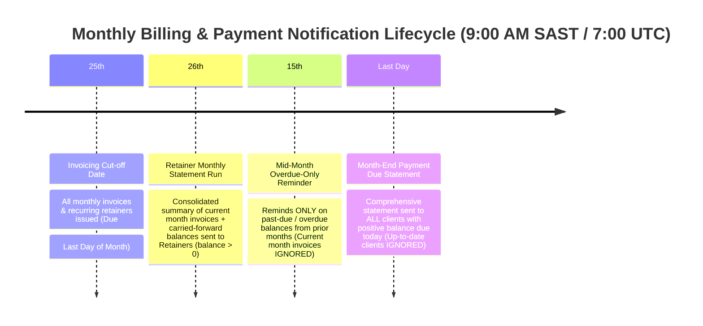

# Strategic Billing Reminders & Statement Schedule Specification

**Document Version:** 1.0  
**Status:** In Review / Ready for Implementation  
**Target Applications:** `apps/admin`, `packages/db`, `packages/billing`, `packages/emails`

---

## 1. Executive Summary

To prevent client email fatigue, respect B2B payment routines, and maintain clean accounting records across all Playhouse Media Group divisions, the billing system is transitioning to a **3-Stage Monthly Billing & Statement Lifecycle**.

This replaces indiscriminate multi-shot invoice reminder emails with predictable, consolidated statements tailored specifically to **Retainer** and **Ad-Hoc (Project)** clients.

---

## 2. Monthly Lifecycle & Operational Calendar

---

## 3. Core Business Rules & Cadence

| Calendar Date | Target Audience | Trigger & Logic | Content & Email Summary | Exclusions / Conditions |
| :--- | :--- | :--- | :--- | :--- |
| **25th of Month** | All Clients | Invoicing cut-off. All retainer & recurring invoices issued. | Official Invoice Delivery. Due date set to **Last Day of Month**. | Draft invoices remain internal until issued. |
| **26th of Month (09:00 SAST)** | **Retainer Clients** (`isRetainer = true`) | Sweeps all active retainer clients with `totalOutstanding > 0`. | **Monthly Retainer Statement Package**: Opening balance + current month invoices + payments + net balance due. Attached Statement PDF. | Clients with balance `<= 0` (paid / in credit) are **completely skipped**. |
| **15th of Month (09:00 SAST)** | **All Clients** (with overdue debt) | Sweeps invoices where `dueDate < today` (strictly prior period debt). | **Overdue Balance Notice**: Highlights aged debt that has passed its due date. | **Current month invoices are strictly ignored**. Clients with zero overdue debt receive **no email**. |
| **Last Day of Month (09:00 SAST)** | **All Active Clients** (Retainer & Ad-Hoc) | Sweeps all clients with `totalOutstanding > 0`. | **Month-End Statement & Payment Due Notice**: Final statement reminding clients of balances due today. | Up-to-date clients (`balance <= 0`) receive **no email**. |

---

## 4. Universal Due Date Standard

> [!IMPORTANT]
> **Universal Month-End Rule**: By default, every invoice created across the system must have its `dueDate` set to the **last calendar day of the invoice's month** (e.g. Jan 31, Feb 28/29, Apr 30, Aug 31).

### Scope of Enforcement:
1. **Manual Invoice Form (`InvoiceFormClient`)**: Initial state and dynamic `invoiceDate` changes automatically calculate the month's final calendar day.
2. **Server Actions (`createInvoice`)**: Defaults missing or null `dueDate` to `getEndOfMonth(invoiceDate)`.
3. **Quotation Conversion (`convertQuoteToInvoice`)**: Sets `dueDate` directly to `getEndOfMonth(invoiceDate)` instead of adding static term offsets.
4. **Recurring Billing Generator (`triggerRecurringBillingRun`)**: Generates invoices with `dueDate = getEndOfMonth(invoiceDate)`.

---

## 5. Architectural Implementation Details

### A. Segmentation & Cron Dispatcher (`/api/cron/outstanding-reminders`)
* The daily cron runs at `07:00 UTC` (`09:00 SAST`).
* On the **15th**: Evaluates and triggers overdue-only reminders (`dueDate < today`).
* On the **26th**: Evaluates and triggers retainer statements (`isRetainer = true` and `balance > 0`).
* On the **Last Day of the Month**: Evaluates and triggers month-end statements (`balance > 0`).
* On all other days: Evaluates ad-hoc milestone notifications where applicable without duplicating retainer pings.

### B. Statement Data Structure
The email context and PDF for statements include:
* **Opening / Carried-forward Balance**: Unpaid invoices from preceding months minus unallocated credits.
* **Current Month Invoices**: Invoices issued during the current monthly cycle (up to the 25th).
* **Payments Received**: Payments allocated during the current cycle.
* **Net Balance Due**: Total closing balance payable by the last day of the month.
* **Banking Details & Secure Portal Link**: Direct access for client verification and download.

### C. Admin UI Controls
* In the Admin **Overdue Reminders** dialog:
  * Filter tabs: **All**, **Ad-Hoc (Recommended)**, and **Retainers**.
  * Visual badges indicating retainer client status.
  * Clear warnings if an admin attempts to manually bulk-ping retainer clients outside the monthly statement cycle.
