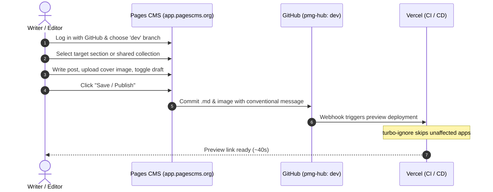

# Pages CMS Integration & Multi-Site Architecture Guide for `pmg-hub`

> **Target Apps:** `apps/tes` (TenderEdge Solutions), `apps/aws` (Apex Web Solutions), and `apps/pmg` (Playhouse Media Group)  
> **Status:** Architectural Reference & Pre-Implementation Plan  
> **Reference Documentation:** [Pages CMS Docs](https://pagescms.org/docs/) | [GitHub Repository](https://github.com/pages-cms/pages-cms)

---

## 1. Executive Summary

**[Pages CMS](https://pagescms.org/)** is an open-source, Git-native headless content management system tailored for static and server-rendered sites stored in GitHub repositories.

Unlike traditional CMS platforms (e.g. WordPress, Strapi, Sanity) that require a separate database, API server, or subscription tier to store articles:
- **Zero Content Database:** All blog posts, drafts, and media are committed as Markdown/MDX and static assets directly into the `pmg-hub` Git repository.
- **Native Fit for Astro:** `apps/tes`, `apps/aws`, and `apps/pmg` are all built with **Astro**. Astro's Content Collections (`astro:content`) read directly from the filesystem with type-safe Zod validation.
- **Granular Monorepo Change Detection:** Coupled with our configured `ignoreCommand: "npx turbo-ignore"` in `vercel.json`, publishing a blog post in `apps/tes` will only trigger a Vercel deployment for `tenderedgesolutions.co.za`, leaving unaffected apps untouched.

---

## 2. Multi-Site Publishing: Can 1 Blog Post Be Published to 2+ Sites at Once?

### **Yes, absolutely.**

In a standard standalone repo, Pages CMS only commits a file to one directory. **However, in a Turborepo monorepo, we have full architectural control over shared packages.**

We have two distinct options for how you want your editorial workflow to operate:

---

### Option A: Shared Content Hub (Write Once, Checkbox Multi-Publish) — *Recommended for Cross-Posting*

Instead of keeping separate markdown folders in each app, we create a shared workspace: `packages/content/blog/*.md`.

```mermaid
flowchart TD
    CMS["Pages CMS (app.pagescms.org)"]
    File["packages/content/blog/my-article.md<br/><b>sites: ['tes', 'pmg']</b><br/><b>canonicalSite: 'tes'</b>"]
    
    CMS -->|Commit 1 file| File
    
    File -->|Astro glob loader| TES["apps/tes (TenderEdge Solutions)"]
    File -->|Astro glob loader| PMG["apps/pmg (Playhouse Media Group)"]
    File -.->|Filtered out (not in sites list)| AWS["apps/aws (Apex Web Solutions)"]
```

#### How it works:
1. In Pages CMS, you have a **single "Articles" collection**.
2. When creating a post, you fill out the article content, and check the target websites:
   ```yaml
   sites:
     - tes
     - pmg
   canonicalSite: tes
   ```
3. When you hit **Save**, Pages CMS writes **one single `.md` file** to `packages/content/blog/`.
4. Both `apps/tes` and `apps/pmg` query that shared folder and display the article.
5. `apps/aws` filters it out automatically because `'aws'` wasn't checked.
6. If you fix a typo or update the text later, **it updates across both sites simultaneously with one edit**.

#### Critical SEO Requirement: Duplicate Content Protection
If the exact same article text appears on two different domains (`tenderedgesolutions.co.za` and `playhousemedia.co.za`), Google will flag it as duplicate content unless you specify a **canonical URL**.

In our schema, we include `canonicalSite: tes`.
* On `tenderedgesolutions.co.za/blog/my-post`, the canonical URL points to itself:  
  `<link rel="canonical" href="https://tenderedgesolutions.co.za/blog/my-post" />`
* On `playhousemedia.co.za/blog/my-post`, the canonical URL points back to TES:  
  `<link rel="canonical" href="https://tenderedgesolutions.co.za/blog/my-post" />`

This preserves SEO integrity, prevents duplicate-content penalties, and gives full SEO authority to the primary site.

---

### Option B: Isolated App Folders (Independent Editorial Sections)

If you want completely segregated blogs for each brand with separate folders:
- `apps/tes/src/content/blog/`
- `apps/aws/src/content/blog/`
- `apps/pmg/src/content/blog/`

Pages CMS will show 3 distinct navigation tabs in the sidebar:
- **TenderEdge Solutions** → Blog Posts
- **Apex Web Solutions** → Blog Posts
- **Playhouse Media Group** → Blog Posts

*Note:* Under Option B, if you want a post to appear on two sites, you would create or copy the markdown file in both folders.

---

## 3. How You Will Use Pages CMS (Daily Editorial Workflow)



1. **Sign In:** Navigate to [app.pagescms.org](https://app.pagescms.org) and authenticate with GitHub.
2. **Select Scope:** Select `jchademwiri/pmg-hub` and working branch `dev`.
3. **Sidebar Navigation:** The sidebar shows all configured sites:
   * **TenderEdge Solutions**
   * **Apex Web Solutions**
   * **Playhouse Media Group**
4. **Drafting & Writing:**
   * Fill out the form fields: Title, Meta Description, Publish Date, Author, Tags, and Draft switch.
   * Format text using the WYSIWYG editor (headers, lists, tables, callouts).
   * Drag-and-drop cover images and inline graphics. Pages CMS slugifies filenames and stores them in the designated `public/images/blog/` directory.
5. **Publishing:** Click **Save**. The commit is pushed to `dev`. Once ready for production, promote to `master` via `/release` and `/tag`.

---

## 4. Hosting: Hosted Cloud vs. Self-Hosted

| Aspect | Option 1: Hosted Cloud ([app.pagescms.org](https://app.pagescms.org)) | Option 2: Self-Hosted (Vercel / Docker / Node.js) |
| :--- | :--- | :--- |
| **Hosting Cost** | **$0 (Free)** | Cloud server / DB cost |
| **Maintenance** | **Zero** | Requires managing Node app, database & updates |
| **Database** | **None** (stateless client calling GitHub API) | Requires PostgreSQL (for user sessions & app state) |
| **Authentication** | Built-in GitHub OAuth | Requires creating a custom GitHub App |
| **Domain** | `app.pagescms.org` | Custom (e.g. `cms.playhousemedia.co.za`) |
| **Recommendation** | **Start here.** Zero setup, identical `.pages.yml`. | Only if internal hosting policies require a private domain. |

---

## 5. Configuration Specification (`.pages.yml`)

Here is the `.pages.yml` configured for **all three brands** (`tes`, `aws`, and `pmg`), supporting both independent posts and shared publishing:

```yaml
# .pages.yml — pmg-hub Monorepo Configuration

# Global repository settings
settings:
  commit:
    identity: user
    templates:
      create: "feat(blog): add {filename}"
      update: "fix(blog): update {filename}"
      delete: "chore(blog): remove {filename}"
      rename: "chore(blog): rename {oldFilename} to {newFilename}"

# Media sources: mapped to each app's public directory
media:
  - name: tes-media
    label: "TES Media"
    input: apps/tes/public/images/blog
    output: /images/blog
    rename: safe
    categories: [image]

  - name: aws-media
    label: "AWS Media"
    input: apps/aws/public/images/blog
    output: /images/blog
    rename: safe
    categories: [image]

  - name: pmg-media
    label: "PMG Media"
    input: apps/pmg/public/images/blog
    output: /images/blog
    rename: safe
    categories: [image]

# Content structure with sidebar navigation grouping
content:
  # ============================================================================
  # TenderEdge Solutions (apps/tes)
  # ============================================================================
  - name: tes-group
    label: "TenderEdge Solutions"
    type: group
    items:
      - name: tes-blog
        label: "TES Blog Posts"
        type: collection
        path: apps/tes/src/content/blog
        format: yaml-frontmatter
        filename: "{year}-{month}-{day}-{primary}.md"
        view:
          primary: title
          fields: [title, publishedAt, draft]
          sort: publishedAt
          order: desc
        fields:
          - name: title
            label: "Title"
            type: string
            required: true
          - name: description
            label: "Meta Description"
            type: text
            required: true
          - name: publishedAt
            label: "Publish Date"
            type: date
            required: true
          - name: author
            label: "Author"
            type: string
            default: "TenderEdge Team"
          - name: draft
            label: "Draft"
            type: boolean
            default: false
          - name: coverImage
            label: "Cover Image"
            type: image
            options:
              media: tes-media
          - name: tags
            label: "Tags"
            type: list
            default: ["Tenders", "Compliance"]
          - name: body
            label: "Article Body"
            type: rich-text

  # ============================================================================
  # Apex Web Solutions (apps/aws)
  # ============================================================================
  - name: aws-group
    label: "Apex Web Solutions"
    type: group
    items:
      - name: aws-blog
        label: "AWS Blog Posts"
        type: collection
        path: apps/aws/src/content/blog
        format: yaml-frontmatter
        filename: "{year}-{month}-{day}-{primary}.md"
        view:
          primary: title
          fields: [title, publishedAt, draft]
          sort: publishedAt
          order: desc
        fields:
          - name: title
            label: "Title"
            type: string
            required: true
          - name: description
            label: "Meta Description"
            type: text
            required: true
          - name: publishedAt
            label: "Publish Date"
            type: date
            required: true
          - name: author
            label: "Author"
            type: string
            default: "Apex Team"
          - name: draft
            label: "Draft"
            type: boolean
            default: false
          - name: coverImage
            label: "Cover Image"
            type: image
            options:
              media: aws-media
          - name: tags
            label: "Tags"
            type: list
            default: ["Web Development", "Next.js"]
          - name: body
            label: "Article Body"
            type: rich-text

  # ============================================================================
  # Playhouse Media Group (apps/pmg)
  # ============================================================================
  - name: pmg-group
    label: "Playhouse Media Group"
    type: group
    items:
      - name: pmg-blog
        label: "PMG Blog Posts"
        type: collection
        path: apps/pmg/src/content/blog
        format: yaml-frontmatter
        filename: "{year}-{month}-{day}-{primary}.md"
        view:
          primary: title
          fields: [title, publishedAt, draft]
          sort: publishedAt
          order: desc
        fields:
          - name: title
            label: "Title"
            type: string
            required: true
          - name: description
            label: "Meta Description"
            type: text
            required: true
          - name: publishedAt
            label: "Publish Date"
            type: date
            required: true
          - name: author
            label: "Author"
            type: string
            default: "PMG Editorial"
          - name: draft
            label: "Draft"
            type: boolean
            default: false
          - name: coverImage
            label: "Cover Image"
            type: image
            options:
              media: pmg-media
          - name: tags
            label: "Tags"
            type: list
            default: ["Company News", "Insights"]
          - name: body
            label: "Article Body"
            type: rich-text
```

---

## 6. Astro Content Collections Setup

Each Astro app (`apps/tes`, `apps/aws`, `apps/pmg`) configures its collection schema:

```typescript
// apps/pmg/src/content.config.ts (identical pattern for tes and aws)
import { defineCollection, z } from 'astro:content';
import { glob } from 'astro/loaders';

const blog = defineCollection({
  loader: glob({ pattern: '**/*.md', base: './src/content/blog' }),
  schema: z.object({
    title: z.string(),
    description: z.string(),
    publishedAt: z.coerce.date(),
    author: z.string().default('PMG Editorial'),
    draft: z.boolean().default(false),
    coverImage: z.string().optional(),
    tags: z.array(z.string()).default([]),
    // Optional canonical link for syndicated/cross-posted articles:
    canonicalUrl: z.string().url().optional(),
  }),
});

export const collections = { blog };
```

---

## 7. Pre-Implementation Checklist

When ready to implement:
- [ ] **Step 1:** Create `apps/tes/src/content/blog/`, `apps/aws/src/content/blog/`, and `apps/pmg/src/content/blog/`.
- [ ] **Step 2:** Add initial sample markdown posts in the targeted apps.
- [ ] **Step 3:** Define `content.config.ts` in each Astro app.
- [ ] **Step 4:** Add Astro blog index (`/blog`) and post detail (`/blog/[slug]`) pages.
- [ ] **Step 5:** Create `.pages.yml` at the root of `pmg-hub`.
- [ ] **Step 6:** Log into [app.pagescms.org](https://app.pagescms.org), grant access to `pmg-hub`, and perform a test post.
- [ ] **Step 7:** Run standard release flow (`/ship` → `/release` → `/tag`).

---

## 8. Official Documentation & References

1. **Official Website:** [https://pagescms.org/](https://pagescms.org/)
2. **Official Introduction:** [https://pagescms.org/docs/](https://pagescms.org/docs/)
3. **Configuration Reference:** [https://pagescms.org/docs/configuration/](https://pagescms.org/docs/configuration/)
4. **Media Configuration:** [https://pagescms.org/docs/configuration/media/](https://pagescms.org/docs/configuration/media/)
5. **Content & Groups:** [https://pagescms.org/docs/configuration/content/](https://pagescms.org/docs/configuration/content/)
6. **Commit Templates & Settings:** [https://pagescms.org/docs/configuration/settings/](https://pagescms.org/docs/configuration/settings/)
7. **Self-Hosting Guide:** [https://pagescms.org/docs/guides/installing/self-host/](https://pagescms.org/docs/guides/installing/self-host/)
8. **Deploy on Vercel:** [https://pagescms.org/docs/guides/installing/vercel/](https://pagescms.org/docs/guides/installing/vercel/)
9. **GitHub Source Code:** [https://github.com/pages-cms/pages-cms](https://github.com/pages-cms/pages-cms)
