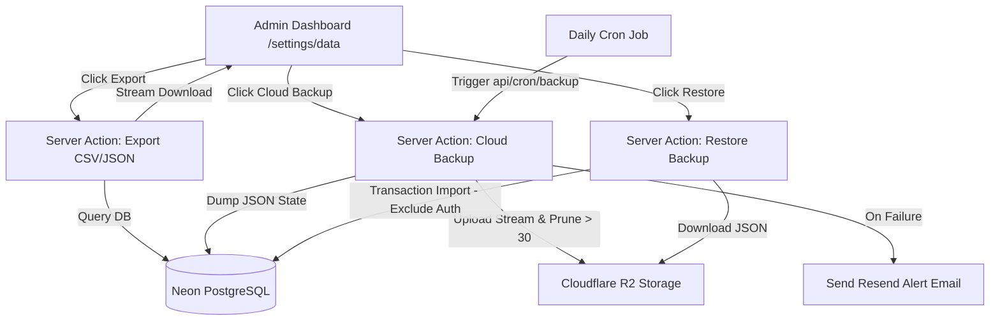

# Implementation Plan: Data Export, Cloud Backup & Restore

This implementation plan outlines the architectural design and step-by-step changes required to implement **Ad-hoc Data Exports** and **Automated/Manual Cloud Backups and Restore** for the PMG Hub application.

---

## Final Decisions & Aligned Architecture

We aligned on the following core design choices through our interactive alignment process:

1. **Storage Target**: **Cloudflare R2 Storage (Confirmed)**
   - **Reason**: Fully S3-compatible, ultra-low storage fees, and **$0 egress fees**, meaning database restoration and manual downloads will never incur bandwidth charges.
   - **Library**: Official AWS SDK S3 client (`@aws-sdk/client-s3`), allowing the codebase to remain standard and compatible with other providers.

2. **Retention Policy**: **Rolling 30-Backup Limit (Confirmed)**
   - **Mechanism**: Every time a backup is successfully generated (whether manual or automated), the backup runner will automatically query the R2 bucket for existing files and prune any backups older than the 30 most recent runs to keep storage neat and cost-free.

3. **Restore Safety & Auth Preservation**: **Business Data Only (Confirmed)**
   - **Mechanism**: Wipes and restores business-centric tables only. It **preserves** the `user`, `session`, `account`, and `verification` tables.
   - **Benefits**: Wards off lockout risks, prevents active admins from being logged out during restoration, and leaves administrative access configurations intact.
   - **Table Restore Order**: Evaluated in transaction dependency order to respect all foreign key relations. **Note**: The new `payment_allocations` table has been integrated at the end of the chain as it depends on both `income` and `invoices`.

4. **Alerts & Notifications**: **Failure-only Email Alerts (Confirmed)**
   - **Mechanism**: If a daily automated backup cron job fails, it will instantly dispatch a failure alert email using your existing **Resend** integration directly to the Super Admin's inbox. Successful runs will log quietly to console/monitoring logs to prevent email fatigue.

---

## Technical Architecture



---

## Proposed Changes

We will implement this feature across two primary components: `@pmg/db` (shared database schema and queries) and `apps/admin` (Next.js admin portal UI and server actions).

### 1. Storage Wrapper (`apps/admin`)

We will install `@aws-sdk/client-s3` in `apps/admin` and initialize our bucket client.

#### [NEW] [s3.ts](file:///D:/websites/pmg-hub/apps/admin/src/lib/s3.ts)
A helper to initialize the S3 client using environment variables:
```typescript
import { S3Client } from '@aws-sdk/client-s3';

const bucketName = process.env.BACKUP_BUCKET_NAME;
const endpoint = process.env.BACKUP_ENDPOINT;
const accessKeyId = process.env.BACKUP_ACCESS_KEY_ID;
const secretAccessKey = process.env.BACKUP_SECRET_ACCESS_KEY;
const region = process.env.BACKUP_REGION || 'auto';

export function getS3Client() {
  if (!bucketName || !endpoint || !accessKeyId || !secretAccessKey) {
    throw new Error('S3 backup storage environment variables are not fully configured.');
  }

  return {
    s3: new S3Client({
      region,
      endpoint,
      credentials: {
        accessKeyId,
        secretAccessKey,
      },
      forcePathStyle: true,
    }),
    bucketName,
  };
}
```

#### [MODIFY] [.env.example](file:///D:/websites/pmg-hub/.env.example)
Add the required backup configuration environment keys:
```env
# ── Cloud Backup Storage (Cloudflare R2) ──
BACKUP_BUCKET_NAME=pmg-backups
BACKUP_ENDPOINT=https://<account-id>.r2.cloudflarestorage.com
BACKUP_ACCESS_KEY_ID=your-access-key-id
BACKUP_SECRET_ACCESS_KEY=your-secret-access-key
BACKUP_REGION=auto
BACKUP_CRON_SECRET=super-secret-token-for-cron-endpoint
SUPER_ADMIN_EMAIL=admin@pmg-hub.co.za
```

---

### 2. Export & Backup Server Actions (`apps/admin`)

#### [NEW] [data-actions.ts](file:///D:/websites/pmg-hub/apps/admin/src/app/actions/data-actions.ts)
This file will contain eight server-side functions:
1. **`exportIncomeExpensesCsv()`**: 
   - Combines both `income` and `expenses` tables.
   - Joins `divisions` and `clients` names.
   - Sorts records chronologically by `date` desc.
   - Formats columns: `Date,Type,Division,Client,Category,Description,Amount`.
2. **`exportInvoicesCsv()`**: 
   - Joins `invoices` with `clients` and `divisions`.
   - Formats columns: `Invoice Number,Client,Division,Status,Invoice Date,Due Date,Subtotal,Discount,VAT,Total,Paid At`.
3. **`exportClientsCsv()`**:
   - Fetches all `clients`.
   - Formats columns: `Client Name,Business Name,Email,Phone,Status,Created At`.
4. **`exportFullJson()`**:
   - Queries all business data tables: `clients`, `divisions`, `income`, `expenses`, `invoices`, `billingLineItems`, `billingItems`, `snapshots`, `organisationSettings`, `divisionBillingSettings`, `documentSequences`, `ledger`, `leads`, and **`payment_allocations` (Added)**.
   - Excludes auth-sensitive tables (`user`, `session`, `account`, `verification`).
   - Formats everything into a single structured JSON object.
5. **`triggerCloudBackup()`**:
   - Compiles the full JSON export.
   - Uploads to the S3 bucket under the key `backups/backup-YYYY-MM-DD_HH-mm-ss.json` with MIME type `application/json`.
   - **Pruning Check**: Lists all keys under `backups/`. If the count exceeds 30, it automatically issues `DeleteObjectCommand` for the oldest items until exactly 30 remain.
   - Returns a success status.
6. **`listCloudBackups()`**:
   - Uses S3 `ListObjectsV2Command` to retrieve all keys starting with `backups/`.
   - Returns details: `key`, `size` (formatted in MB), and `lastModified`.
7. **`deleteCloudBackup(key)`**:
   - Deletes a selected backup object from the bucket.
8. **`restoreFromCloudBackup(key)`**:
   - **Role enforcement**: Verifies the current user has the `super_admin` role.
   - Downloads the JSON content of the selected backup file from S3.
   - **Transaction block**: Initializes a Drizzle transaction (`db.transaction()`).
   - Wipes all business tables inside the transaction. **IMPORTANT**: Does NOT wipe `user`, `session`, `account`, or `verification` tables.
   - Inserts records in a precise table dependency hierarchy:
     1. `divisions` (no dependencies)
     2. `clients` (no dependencies)
     3. `organisationSettings` (no dependencies)
     4. `divisionBillingSettings` (depends on divisions)
     5. `documentSequences` (depends on divisions)
     6. `billingItems` (no dependencies)
     7. `snapshots` (no dependencies)
     8. `ledger` (no dependencies)
     9. `leads` (depends on divisions)
     10. `income` (depends on divisions, clients)
     11. `expenses` (depends on divisions, clients)
     12. `invoices` (depends on divisions, clients, income)
     13. `billingLineItems` (depends on invoices/quotations)
     14. `quotations` (depends on divisions, clients)
     15. **`payment_allocations` (Integrated: depends on both income and invoices)**
   - Commits the transaction. If any insert or format check fails, the transaction auto-rolls back instantly.

---

### 3. Settings UI Enhancement (`apps/admin`)

#### [MODIFY] [page.tsx](file:///D:/websites/pmg-hub/apps/admin/src/app/(admin)/settings/data/page.tsx)
- Connect the **Export Data** cards directly to client components calling the new CSV and JSON export actions.
- Incorporate a **Cloud Backups & Restore** interface card:
  - Add status indicators showing configuration status (active bucket name, endpoint).
  - Add a **[ Backup Now ]** button with dynamic spinner/loading states.
  - Implement a tabular dashboard showing the backup history list (retrieved directly from S3).
  - Provide a **[ Download ]** icon button, a **[ Delete ]** trash button, and a prominent **[ Restore ]** button for each item.
  - For the **Restore** action: Render a warning dialog modal. The modal informs the user of the severity of the operation and requires them to type the word `RESTORE` inside an input before enabling the red "Confirm Restore" button.

---

### 4. Automated Backup Endpoint (Cron support)

#### [NEW] [route.ts](file:///D:/websites/pmg-hub/apps/admin/src/app/api/cron/backup/route.ts)
A Next.js API Route handler that:
- Listens for GET requests on `/api/cron/backup`.
- Verifies authorization using a secure token: `Authorization: Bearer <BACKUP_CRON_SECRET>`.
- Triggers the cloud backup operation inside a `try/catch` block.
- **On Failure**: Sends an urgent alert email via **Resend** directly to the `SUPER_ADMIN_EMAIL` address.
- Returns a successful status JSON or error status JSON.

---

## Verification Plan

We will verify both ad-hoc downloads and cloud backups/restores through the following validation routes:

### Automated Tests
We will add unit test cases to verify JSON data serialization and table clearing routines:
- Run all project tests with:
  ```bash
  bun --filter admin test
  ```
- Specific tests will check:
  - Valid CSV syntax on exports (checking that fields with commas are properly quoted).
  - Complete JSON schema structure representing all required database tables.
  - Orderly database inserts (testing restoration sequence on a test database instance).

### Manual Verification
1. **Ad-hoc CSV Downloads**:
   - Click "Export" on **Income & Expenses**, **Invoices**, and **Clients**. Verify that correct files (e.g. `pmg-clients.csv`) download to your local machine and open successfully in Excel or Google Sheets.
2. **Ad-hoc JSON Download**:
   - Click "Export" on **Full Data Export**. Open the downloaded JSON and confirm that it contains all expected tables and records.
3. **Cloud Backup Creation**:
   - Configure credentials for R2 in `.env.local`.
   - Click **[ Backup Now ]**. Validate that a success toast appears and a new backup entry instantly populates the history table with the exact size and timestamp.
   - Verify that the backup file appears in the S3 bucket dashboard.
4. **Data Restoration**:
   - Create a dummy client record in the database.
   - Click **[ Restore ]** on a backup taken *before* the dummy record was created.
   - Enter `RESTORE` in the input and click confirm.
   - Confirm that the dummy client record is gone and the database has returned strictly to the previous backup state.
   - Intentionally edit a backup file to contain invalid data, attempt to restore, and confirm that the database safely rolls back with no changes written.
