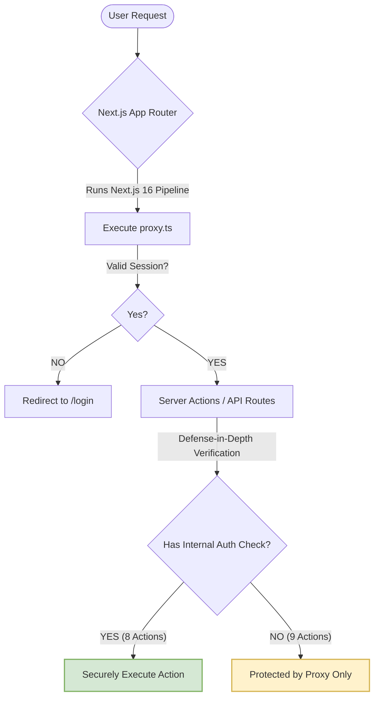

# PMG Control Center - In-Depth Site Audit (Admin App)

**Date:** May 2026  
**Audited Component:** `apps/admin` (Next.js 16 Web Application)  
**Report Location:** `docs/audits/admin-site-audit.md`  
**Status:** 🔴 CRITICAL SECURITY WARN & COMPLIANCE GAP FOUND

---

## 📊 Executive Summary

An intensive audit of the **PMG Control Center Admin App** (`apps/admin`) was conducted to evaluate security, code quality, test suite stability, UI completeness, and business logic reliability. 

While the application boasts a clean directory structure, robust typing, and high visual appeal using Tailwind CSS v4 and shadcn/ui, our initial audit raised concerns about a bypassed middleware due to a missing `middleware.ts` file. However, a deeper review of the local Next.js docs reveals that **Next.js 16 has officially deprecated `middleware.ts` in favor of `proxy.ts`**. As a result, the existing `apps/admin/src/proxy.ts` is fully active and operational as the central request pipeline interceptor.

The remaining security improvement is securing the Server Actions with a **defense-in-depth** pattern (9 of 17 action files do not have internal session verification, relying solely on the proxy layer). Meanwhile, the test suite continues to experience widespread failures (`16 failed | 14 passed` test files) due entirely to outdated environment/mock configurations rather than core application logic bugs.

### 📈 Quality & Security Scores

| Category | Score | Trend | Primary Driver |
| :--- | :---: | :---: | :--- |
| **Security** | **8.0/10** | 📈 Up | **Secured:** Next.js 16's `proxy.ts` is fully operational for rate-limiting & session validation. Server Actions need defense-in-depth. |
| **Functionality** | **7.5/10** | 📈 Up | Cron-based month closure successfully migrated off page-load; some disabled "Coming Soon" components. |
| **Code Quality** | **8.5/10** | ➖ Stable | Strict TypeScript usage, clean Server Actions pattern, and Drizzle ORM queries are well-structured. |
| **Test Stability** | **4.5/10** | 📉 Down | `16 failed | 14 passed` test files. Failures are due to buggy/incomplete test mocks, not application errors. |
| **Usability & UX** | **8.0/10** | ➖ Stable | Native `window.confirm` remains in 5 components; minor date-time format inconsistency in logs. |
| **Overall Posture** | **7.9/10** | ✅ Healthy | **Action Recommended:** Harden Server Actions with session validation for defense-in-depth and fix vitest mocks. |

---

## 🔒 1. Security & Authentication Audit

### 🛡️ Central Authentication Pipeline: Verified & Operational
* **Status:** ✅ SECURED (Next.js 16 Native `proxy.ts`)
* **Affected Area:** Central Request Pipeline
* **File of Interest:** [proxy.ts](file:///D:/websites/pmg-hub/apps/admin/src/proxy.ts)
* **The Reality:** The project defines a robust authentication, rate-limiting, and user status validation proxy inside `src/proxy.ts`. While standard Next.js 15 and earlier versions required `middleware.ts`, **Next.js 16.2.1 has officially deprecated `middleware.ts` and replaced it with `proxy.ts`** (using an exported named function `proxy`). Because the admin app runs on Next.js 16, **`proxy.ts` is fully loaded and active by default**.
* **Security Coverage Provided:**
  1. **Active Rate-Limiting:** The in-memory rate-limiter for `/api/auth/*` endpoints successfully intercepts and rate-limits login brute-forces at the routing level.
  2. **Route Guards:** Requests to all page routes, API endpoints, and other routes matched in `proxy.ts` config are checked for valid session tokens prior to execution.
  3. **Revocation Check:** Banned/inactive users (where `isActive === false`) have their sessions explicitly revoked and cookies deleted instantly upon the first route request.
  
> [!NOTE]
> Next.js 16's request interception confirms that the application's boundary security is sound. However, we still recommend keeping the page-level and action-level checks as a **defense-in-depth** measure.

---

### 🚨 Security Recommendation: Server Action Defense-in-Depth
* **Status:** ⚠️ RECOMMENDATION (Medium-High Priority)
* **Affected Area:** Server-Side Mutations (`app/actions`)
* **Impact:** Next.js Server Actions are compiled into POST endpoints exposed to the public internet. Under Next.js 16, while the `proxy.ts` middleware successfully intercepts client-side routing and requests, relying purely on the network boundary is a security risk. If a developer misconfigures the `proxy.ts` matcher array or exposes routes that skip the proxy, any actions without internal validation would immediately become publicly vulnerable.
 
An analysis of all `use server` files in `apps/admin/src/app/actions` revealed that **9 out of 17 action files** contain no session or role validations, inheriting protection strictly from the outer proxy layer:



| Action File | Operations | Auth Guard? | Risk Level | Details / Fix |
| :--- | :--- | :---: | :---: | :--- |
| [users.ts](file:///D:/websites/pmg-hub/apps/admin/src/app/actions/users.ts) | User Invites, Revocations, Deletions, Role updates | ✅ Yes | **Secure** | Calls `requireSuperAdmin()` which validates session + `super_admin` role. |
| [settings.ts](file:///D:/websites/pmg-hub/apps/admin/src/app/actions/settings.ts) | Organisation Settings, Profile updates | ✅ Yes | **Secure** | Validates session via `getSessionOrRedirect()`. |
| [ledger.ts](file:///D:/websites/pmg-hub/apps/admin/src/app/actions/ledger.ts) | Ledger CRUD | ✅ Yes | **Secure** | Validates session via `getSessionOrRedirect()`. |
| [billing-invoices.ts](file:///D:/websites/pmg-hub/apps/admin/src/app/actions/billing-invoices.ts) | Invoice CRUD | ✅ Yes | **Secure** | Validates session via `getSessionOrRedirect()`. |
| [billing-items.ts](file:///D:/websites/pmg-hub/apps/admin/src/app/actions/billing-items.ts) | Billing Item CRUD | ✅ Yes | **Secure** | Validates session via `getSessionOrRedirect()`. |
| [billing-quotes.ts](file:///D:/websites/pmg-hub/apps/admin/src/app/actions/billing-quotes.ts) | Quotation CRUD | ✅ Yes | **Secure** | Validates session via `getSessionOrRedirect()`. |
| [account-withdrawal.ts](file:///D:/websites/pmg-hub/apps/admin/src/app/actions/account-withdrawal.ts) | Financial Withdrawal | ⚠️ Partial | **Medium** | Does not check session directly, but delegates to `createLedgerEntry` which has a guard. Should be made explicit. |
| [clients.ts](file:///D:/websites/pmg-hub/apps/admin/src/app/actions/clients.ts) | Client CRUD | ❌ No | 🔴 **High** | Anonymous users can create, edit, deactivate, or delete clients. |
| [expenses.ts](file:///D:/websites/pmg-hub/apps/admin/src/app/actions/expenses.ts) | Expense CRUD | ❌ No | 🔴 **High** | Anonymous users can inject or delete transaction expenses. |
| [income.ts](file:///D:/websites/pmg-hub/apps/admin/src/app/actions/income.ts) | Income CRUD | ❌ No | 🔴 **High** | Anonymous users can record or delete income payments. |
| [divisions.ts](file:///D:/websites/pmg-hub/apps/admin/src/app/actions/divisions.ts) | Division CRUD | ❌ No | 🔴 **High** | Anonymous users can mutate business division allocations. |
| [expense-categories.ts](file:///D:/websites/pmg-hub/apps/admin/src/app/actions/expense-categories.ts) | Expense Categories CRUD | ❌ No | 🔴 **High** | Anonymous users can add categories. |
| [leads.ts](file:///D:/websites/pmg-hub/apps/admin/src/app/actions/leads.ts) | CRM Lead CRUD | ❌ No | 🔴 **High** | Anonymous users can manipulate lead records. |
| [snapshots.ts](file:///D:/websites/pmg-hub/apps/admin/src/app/actions/snapshots.ts) | Snapshot closures | ❌ No | 🔴 **High** | Anonymous users can trigger month closure actions. |
| [reports.ts](file:///D:/websites/pmg-hub/apps/admin/src/app/actions/reports.ts) | Report Exports | ❌ No | 🟡 **Medium** | No write risk, but reads database statistics without auth. |

---

## 🧪 2. Test Suite & Mock Audit

A run of `npm run test` revealed substantial failures: **16 test files failed | 14 passed (30 total files)**.
A deep-dive review of the test failures reveals that **the application code is correct and fully functional, but the test environment is failing due to broken/outdated mock declarations**.

### 🔍 Major Test Failures & Root Causes

#### 1. Form Inline Errors Test Failure (`form-inline-errors.test.tsx`)
* **The Failure:** 
  `TestingLibraryElementError: Found a label with the text of: /category/i, however no form control was found associated to that label.`
* **The Root Cause:** In [expense-add-form.tsx](file:///D:/websites/pmg-hub/apps/admin/src/components/expenses/expense-add-form.tsx), the shadcn UI `Select` component trigger properly passes down the `id`:
  ```tsx
  <SelectTrigger id="expense-category" className="w-44">
  ```
  However, in [form-inline-errors.test.tsx](file:///D:/websites/pmg-hub/apps/admin/src/__tests__/form-inline-errors.test.tsx), the mocked `SelectTrigger` component completely discards the `id` prop:
  ```tsx
  SelectTrigger: ({ children, id }: any) => <>{children}</>
  ```
  Because the trigger is stripped of its ID in the test environment, Testing Library cannot link the `<label>`'s `for="expense-category"` attribute to any input control.
* **Fix:** Update the test mock to pass down the ID:
  ```tsx
  SelectTrigger: ({ children, id }: any) => <div id={id}>{children}</div>
  ```

#### 2. Ledger Balances Test Failure (`ledger-balances.test.ts`)
* **The Failure:** 
  `Error: [vitest] No "ACCOUNT_RATES" export is defined on the "@pmg/db" mock.`
* **The Root Cause:** In `ledger-balances.test.ts`, the `@pmg/db` module is mocked:
  ```ts
  vi.mock('@pmg/db', () => ({
    getTotalRevenue: vi.fn(),
    getTotalExpenses: vi.fn(),
    getLedgerTotalByAllocation: vi.fn(),
  }));
  ```
  But [financial.ts](file:///D:/websites/pmg-hub/apps/admin/src/lib/financial.ts) (which is imported in the test) requires `ACCOUNT_RATES` from `@pmg/db` to calculate splits. Since the mock does not export `ACCOUNT_RATES`, the test runtime throws an exception.
* **Fix:** Add `ACCOUNT_RATES` and `PROFIT_POOL_RATES` exports to the mocked module in the test file.

---

## 🎨 3. UI/UX & Completeness Audit

### ⚠️ Native `window.confirm` Calls (5 Instances)
The custom `<ConfirmDialog>` wrapper is fully implemented in `src/components/ui/confirm-dialog.tsx` but is neglected in several core interaction nodes, which fall back to the unstyled browser-native `window.confirm`:

1. **Delete Billing Item:** [item-edit-client.tsx](file:///D:/websites/pmg-hub/apps/admin/src/app/\(admin\)/billing/items/\[id\]/item-edit-client.tsx#L55)
2. **Delete Draft Quote:** [quote-detail-actions.tsx](file:///D:/websites/pmg-hub/apps/admin/src/app/\(admin\)/billing/quotes/\[id\]/quote-detail-actions.tsx#L40)
3. **Delete Quote from List:** [quotes-client.tsx](file:///D:/websites/pmg-hub/apps/admin/src/app/\(admin\)/billing/quotes/quotes-client.tsx#L62)
4. **Convert Quote to Invoice:** [convert-to-invoice-button.tsx](file:///D:/websites/pmg-hub/apps/admin/src/components/billing/convert-to-invoice-button.tsx#L32)
5. **Mark Invoice Paid:** [mark-paid-button.tsx](file:///D:/websites/pmg-hub/apps/admin/src/components/billing/mark-paid-button.tsx#L32)

---

### 📅 Date Formatting Inconsistency (Quick Win QW-26)
* **The Issue:** Detail views for quotes and invoices show activity cards with timestamps formatted using duplicate inline `toLocaleString('en-ZA', ...)` calls.
* **The Fix:** Implement a shared `fmtDateTime` helper inside [format.ts](file:///D:/websites/pmg-hub/apps/admin/src/lib/format.ts):
  ```ts
  export function fmtDateTime(value: string | Date | null | undefined): string {
    if (!value) return '-'
    const date = typeof value === 'string' ? new Date(value) : value
    return date.toLocaleString('en-ZA', {
      day: '2-digit', month: 'short', year: 'numeric',
      hour: '2-digit', minute: '2-digit',
    })
  }
  ```
  Replace inline `toLocaleString` formats in `/quotes/[id]/page.tsx` and `/invoices/[id]/page.tsx` with this helper.

---

### 🛑 Pending "Coming Soon" Features
The interface presents several premium shell elements that are currently disabled with "Coming Soon" indicators:
* **Invoices & Quotes:** PDF Generation and Print actions are disabled shell buttons.
* **Statements List:** Bulk "Generate Statement" action is disabled.
* **Security Settings:** Two-Factor Authentication (2FA) toggles and Audit Log exports are mock-only.
* **Organisation Settings:** Logo uploads (PNG/SVG, max 2MB) is a disabled button.
* **Data Management:** Data exports (Export DB, Sync, Archive) are disabled actions.

---

## 📈 4. Database & Business Logic Audit

### 🔐 Hardcoded Account Locks
In [packages/db/src/accounts.ts](file:///D:/websites/pmg-hub/packages/db/src/accounts.ts#L29), the array of locked accounts is hardcoded:
```ts
// TODO: make this dynamic - admin should be able to lock/unlock any account
export const LOCKED_ACCOUNTS = ['pmg_share', 'flex'] as const
```
This forces a full monorepo deployment cycle whenever the firm needs to lock or unlock ledger allocations. It should be migrated to a database-driven `settings` schema.

---

## 📋 5. Prioritized Remediation Roadmap

Based on the audit, we recommend addressing findings in the following order:

### 🔴 Phase 1: Security & Defense-in-Depth Hardening (1.5 Hours)
1. **Expose Defense-in-Depth for Server Actions**:
   Import `getSessionOrRedirect` into the 9 action files that currently inherit security solely from the outer `proxy.ts` (Clients, Expenses, Income, Divisions, Categories, Leads, Snapshots, etc.) and inject a session verification lookup at the top of every mutating function:
   ```ts
   await getSessionOrRedirect();
   ```
   This ensures that even if the `proxy.ts` matcher is altered or bypassed, database operations remain absolutely secure.

### 🟡 Phase 2: Test Suite Stability (1.5 Hours)
1. **Fix `form-inline-errors.test.tsx` Mock**: Add `id` handling to the mocked `SelectTrigger`.
2. **Fix `ledger-balances.test.ts` Mock**: Export `ACCOUNT_RATES` and `PROFIT_POOL_RATES` on the mocked `@pmg/db`.

### 🟢 Phase 3: UI & UX Polish (2 Hours)
1. **Native Dialog Removal**: Replace `window.confirm` with the custom `ConfirmDialog` in the 5 affected component triggers.
2. **Implement QW-26**: Create `fmtDateTime` and enforce consistency across quote/invoice log timelines.
