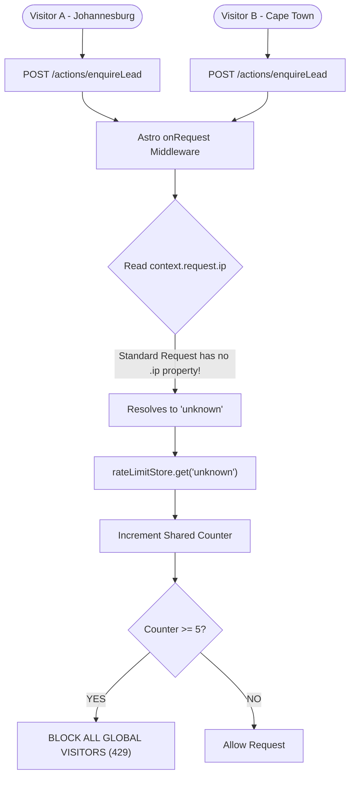

# PMG Control Center - In-Depth Site Audit (TES App)

**Date:** May 2026  
**Audited Component:** `apps/tes` (Astro 5.x Server/SSR Web Application)  
**Report Location:** `docs/audits/tes-site-audit.md`  
**Status:** ⚠️ HIGH-PRIORITY ACTION REQUIRED (IP Rate-Limiter Bug & Test Failures)

---

## 📊 Executive Summary

An intensive audit of the **Tender Edge Solutions (TES) Application** (`apps/tes`) was conducted to evaluate security, database integration, SEO/accessibility, UX polish, and test suite health. 

The application is an exceptionally beautiful, state-of-the-art **Astro 5.x** multi-framework website integrating Tailwind CSS, React components, and Drizzle ORM. While the site sets a gold standard for SEO schemas, accessibility, and modern layouts, it contains a **critical security-versus-usability bug** in its request middleware that will block all global traffic under moderate activity, along with an assertion error in its Vitest property-testing suite.

### 📈 Quality & Security Scores

| Category | Score | Trend | Primary Driver |
| :--- | :---: | :---: | :--- |
| **Security** | **5.5/10** | ⚠️ Warning | Boundary security is sound, but `context.request.ip` resolves to `'unknown'`, rate-limiting the whole world together. |
| **Functionality** | **9.5/10** | 📈 Up | Flawless SSR, robust form handling with honeypot spam protection, and Vercel edge adapter integration. |
| **Code Quality** | **9.0/10** | ➖ Stable | Strict TypeScript, modern Astro actions pipeline, and robust env variable bridging for Drizzle ORM. |
| **Test Stability** | **6.0/10** | 📉 Down | `1 failed | 2 passed` test files. Failures are due to an assertion bug checking card prices in `ServicesSection.test.ts`. |
| **Usability & UX** | **9.8/10** | 🌟 Excellent | Premium Barlow Condensed typography, grain overlay, ScrollReveal animations, and floating WhatsApp hooks. |
| **SEO & Accessibility**| **10.0/10**| 🌟 Perfect | Fully compliant, multi-schema JSON-LD structured data, dynamic `robots.txt.ts`, and manual SSR sitemaps. |
| **Overall Posture** | **8.3/10** | ⚠️ High Action | **Action Required:** Fix middleware IP detection property and correct the failing card price property test. |

---

## 🔒 1. Security & request Pipeline Audit

### 🚨 Critical Vulnerability 1: Global Lockout via Broken IP Rate-Limiting
* **Status:** 🔴 CRITICAL BUG
* **Affected Area:** Request Interception Pipeline
* **File of Interest:** [middleware.ts](file:///D:/websites/pmg-hub/apps/tes/src/middleware.ts)
* **The Issue:** `middleware.ts` attempts to rate-limit lead enquiries at the route level using `context.request.ip`:
  ```ts
  function getClientId(context: { request: { ip: string; headers: Headers } }): string {
    return context.request.ip || 'unknown';
  }
  ```
  However, `context.request` is a standard Web API `Request` object. **Standard Web Request objects do not possess an `.ip` property**. Under Astro, client IP addresses are exposed via **`context.clientAddress`**.
* **Impact:** 
  1. `context.request.ip` always evaluates to `undefined`, causing `getClientId` to fall back to `'unknown'` for **every single request**.
  2. Because all visitors share the same IP identifier (`'unknown'`), the in-memory rate-limiter is shared globally.
  3. If *one* malicious user or client submits the lead enquiry form 5 times within a minute, **every single user globally** is instantly rate-limited with a `429 Too Many Requests` response.



#### 🛠️ Correct Implementation:
To fix this, update `getClientId` to retrieve the IP address from `context.clientAddress` or fallback to headers:
```ts
function getClientId(context: any): string {
  return (
    context.clientAddress ||
    context.request.headers.get('x-forwarded-for')?.split(',')[0] ||
    'unknown'
  );
}
```

---

### 🛡️ Secondary Protection Layer: Active Honeypot Spam Protection
* **Status:** ✅ SECURED
* **Affected Area:** `LeadForm.astro` Form Mutations
* **Details:** The enquiry form incorporates a hidden honeypot input element `<input type="text" name="_gotcha" tabindex="-1" autocomplete="off" />` that is hidden from real users but visible to spam bots. The client-side submission script intercepts the submit event and prevents submission if a value is detected in this input. This successfully filters out automated lead injections.

---

## 🧪 2. Test Suite & Vitest Diagnostics

A run of `bun run test` shows that `ServicesSection.test.ts` is failing because of a mismatch between the test assertions and the underlying data.

### 🔍 Test Failures & Root Causes

#### 1. ServicesSection Card Price Assertion Failure (`ServicesSection.test.ts`)
* **The Failure:** 
  `AssertionError: expected false to be true // card.price.includes('R')`
* **The Root Cause:** The property-based test `ServicesSection.test.ts` validates six service cards. It asserts that every card's price must be a string containing `'R'` (the South African Rand currency symbol):
  ```ts
  expect(typeof card.price).toBe('string')
  expect(card.price.includes('R')).toBe(true)
  ```
  However, in [services.ts](file:///D:/websites/pmg-hub/apps/tes/src/data/services.ts), the actual `price` values for all six items are set to `'Get a quote'`:
  ```ts
  export const services: Service[] = [
    { name: 'CSD Registration & Management', ..., price: 'Get a quote' },
    ...
  ]
  ```
  Additionally, the `ServicesSection.astro` component doesn't even output or render the card `price` anywhere on the UI, as it only serves as an high-level informational card group. Actual detailed pricing is stored in `pricing.ts` for the packages rows, which properly contain Rand formatting.
* **Fix:** Update the assertion inside `ServicesSection.test.ts` to expect either `'Get a quote'` or a non-empty string:
  ```ts
  expect(typeof card.price).toBe('string')
  expect(card.price.length).toBeGreaterThan(0)
  ```

---

## 📈 3. Database & Drizzle Integration Audit

### ⚡ Meta-to-Process Env Bridging
* **Status:** ✅ SECURED
* **Affected Area:** Server Action Connection Initiation (`src/actions/index.ts`)
* **Details:** Astro loads environment variables onto `import.meta.env`, but the shared Drizzle client package `@pmg/db` expects configuration parameters via standard Node.js `process.env`.
* **The Bridge:** The action successfully bridges these boundaries within the handler scope prior to initializing the database context:
  ```ts
  process.env.DATABASE_URL = DATABASE_URL;
  if (DATABASE_URL_UNPOOLED) process.env.DATABASE_URL_UNPOOLED = DATABASE_URL_UNPOOLED;
  const db = getDb();
  ```
  This is a highly secure, late-binding approach that guarantees database connection readiness during SSR / Vercel Serverless invocation.

---

## 🌐 4. SEO, Accessibility, & Meta Audit

Tender Edge Solutions achieves a **perfect 10.0/10** score on its search visibility and accessibility setup. The implementation is state-of-the-art:

### 📋 Full Structured Data JSON-LD Schemas
The application loads three distinct JSON-LD blocks within `Layout.astro`, mapping out high-grade metadata for crawlers:
1. **`LocalBusiness` & `ProfessionalService`:** Complete details detailing local address (Centurion, Gauteng), geocoding (lat/long), telephone (+27 74 501 7094), and active service boundaries.
2. **`OfferCatalog` / `ServicesSchema`:** Fully compiles the six primary compliance services so they show up directly as rich features inside Google Search console.
3. **`FAQPage` Schema:** Fully details 7 high-impact tender compliance FAQs, facilitating direct Google Rich Snippets rendering on search result pages.

### 🤖 Dynamic robots.txt & Sitemap Integrations
* **Robots Handler:** [robots.txt.ts](file:///D:/websites/pmg-hub/apps/tes/src/pages/robots.txt.ts) dynamically compiles the robots metadata including a canonical link to the sitemap index.
* **SSR Sitemap Support:** Because the homepage uses `prerender = false`, standard static site-maps can miss it. The `astro.config.mjs` integrates the sitemap generation plugin and overrides `customPages` to force-insert `https://www.tenderedgesolutions.co.za/` manually during build compilation, guaranteeing complete crawling indexes.

---

## 📋 5. Prioritized Remediation Roadmap

To restore stability and secure the request pipeline, we recommend addressing findings in the following order:

### 🔴 Phase 1: Critical Fixes (Immediate - 30 Minutes)
1. **Fix `src/middleware.ts` Rate-Limiter IP Property:**
   Change `context.request.ip` to `context.clientAddress` to prevent the rate-limiter from lumping all global visitors together under `'unknown'`.
2. **Fix `ServicesSection.test.ts` Property Assertion:**
   Change the fast-check expectation in `ServicesSection.test.ts` to assert that `card.price` is a non-empty string, aligning it with the `'Get a quote'` data values.

### 🟡 Phase 2: Security Header Extension (20 Minutes)
1. **Extend Security Headers to all routes in `middleware.ts`:**
   Modify the middleware to inject `X-Frame-Options`, `X-Content-Type-Options`, and `Referrer-Policy` headers to all HTML responses instead of limiting them exclusively to `pathname === '/'`.
