# PMG Hub — Database & Implementation Audit Report

This report presents a comprehensive audit of the database schema, query patterns, transactions, and script integrity for the **PMG Hub** codebase. The audit was conducted with a focus on data consistency, referential integrity, double-entry ledger accuracy, and developer onboarding experience.

---

## 1. Database Architecture & Tech Stack

PMG Hub uses a modern, database-agnostic yet PostgreSQL-tailored database layer structured as a shared monorepo package:

*   **ORM**: [Drizzle ORM](https://orm.drizzle.team/) (`^0.45.1`) for type-safe SQL construction and schema definition.
*   **Database**: [Neon PostgreSQL](https://neon.tech/) Serverless.
*   **Drivers**:
    *   `drizzle-orm/neon-serverless` combined with `@neondatabase/serverless` (WebSocket-based `Pool` client) for runtime queries, supporting transactions.
    *   `node-postgres` (`pg` and `drizzle-orm/node-postgres`) for migration and resetting scripts, allowing direct connection via `DATABASE_URL_UNPOOLED` to bypass connection pool state limitations.
*   **Monorepo Integration**: The database logic is encapsulated in the [@pmg/db](file:///D:/websites/pmg-hub/packages/db) package and consumed across applications, such as the [admin application](file:///D:/websites/pmg-hub/apps/admin).

### Database Schema Dependency Map

```mermaid
graph TD
    classDef auth fill:#f9d5e5,stroke:#333,stroke-width:2px;
    classDef core fill:#eeac99,stroke:#333,stroke-width:2px;
    classDef billing fill:#e0b115,stroke:#333,stroke-width:2px;
    classDef ledger fill:#b5e7a0,stroke:#333,stroke-width:2px;

    %% Auth Module
    user[user]:::auth
    session[session]:::auth
    account[account]:::auth
    verification[verification]:::auth
    user --> session
    user --> account

    %% Core Module
    divisions[divisions]:::core
    clients[clients]:::core
    divisions --> clients
    user --> clients

    %% Invoicing & Billing Module
    invoices[invoices]:::billing
    quotations[quotations]:::billing
    billing_line_items[billing_line_items]:::billing
    billing_items[billing_items]:::billing
    income[income]:::billing
    expenses[expenses]:::billing
    payment_allocations[payment_allocations]:::billing
    credit_notes[credit_notes]:::billing
    credit_applications[credit_applications]:::billing
    credit_refunds[credit_refunds]:::billing

    divisions --> quotations
    clients --> quotations
    divisions --> invoices
    clients --> invoices
    income --> invoices
    billing_items --> billing_line_items
    %% Note: billing_line_items has polymorphic document_id matching invoices/quotations (no physical FK)

    %% Ledger & Accounting Module
    chart_accounts[chart_accounts]:::ledger
    accounting_periods[accounting_periods]:::ledger
    journal_entries[journal_entries]:::ledger
    journal_lines[journal_lines]:::ledger
    snapshots[snapshots]:::ledger

    journal_entries --> journal_lines
    chart_accounts --> journal_lines
    invoices --> payment_allocations
    income --> payment_allocations
```


---

## 2. Key Audit Findings & Vulnerabilities

| Finding ID | Title | Severity | Affected Files | Impact |
| :--- | :--- | :--- | :--- | :--- |
| **DB-01** | [Snapshot `created_by` Type Mismatch](#db-01-snapshot-created_by-type-mismatch-auto-close-failure) | **CRITICAL** | [snapshots.ts](file:///D:/websites/pmg-hub/packages/db/src/schema/snapshots.ts)<br>[snapshots.ts (Action)](file:///D:/websites/pmg-hub/apps/admin/src/app/actions/snapshots.ts) | Prevents manual month closures and breaks the automated month closure system entirely. |
| **DB-02** | [Non-Transactional Multi-Step Mutations](#db-02-non-transactional-multi-step-mutations-ledger-mismatches) | **HIGH** | [billing-invoices.ts](file:///D:/websites/pmg-hub/apps/admin/src/app/actions/billing-invoices.ts)<br>[billing-payments.ts](file:///D:/websites/pmg-hub/apps/admin/src/app/actions/billing-payments.ts) | Ghost invoices, subledger/general ledger mismatches, and failed credit allocations. |
| **DB-03** | [Missing Database Seed Script](#db-03-missing-database-seed-script) | **MEDIUM** | [package.json](file:///D:/websites/pmg-hub/packages/db/package.json)<br>[seed.test.ts](file:///D:/websites/pmg-hub/packages/db/__tests__/seed.test.ts) | Breaks developer onboarding and prevents database re-initialization. |
| **DB-04** | [Incomplete Database Truncation (`reset.ts`)](#db-04-incomplete-database-truncation-resetts-data-corruption-risk) | **MEDIUM** | [reset.ts](file:///D:/websites/pmg-hub/packages/db/src/reset.ts) | Dangling references, orphaned rows, and broken relational constraints upon reset. |
| **DB-05** | [Model vs Table Name Cognitive Mismatch](#db-05-model-vs-table-name-cognitive-mismatch) | **LOW** | [project-schedule.ts](file:///D:/websites/pmg-hub/packages/db/src/schema/project-schedule.ts) | Developer confusion and potential bugs when writing raw SQL queries. |

---

### DB-01: Snapshot `created_by` Type Mismatch (Auto-Close Failure)
> [!IMPORTANT]
> The database schema defines `snapshots.created_by` as a `uuid` type. However, the application uses Better Auth user IDs, which are text-based strings (e.g. `"usr_1234"`). In addition, the auto-close routine uses the string `"system"`.

*   **Code Reference**: [snapshots.ts (Schema)](file:///D:/websites/pmg-hub/packages/db/src/schema/snapshots.ts#L16)
    ```typescript
    createdBy:  uuid("created_by"),
    ```
*   **Vulnerability Details**:
    1. In the manual month closure action, the user ID is retrieved from the session and passed to `insertSnapshot`:
       ```typescript
       await insertSnapshot(period, summary, { createdBy: session.user.id, notes: opts?.notes });
       ```
    2. In the automated month closure action ([autoClosePreviousMonthIfNeeded](file:///D:/websites/pmg-hub/apps/admin/src/app/actions/snapshots.ts#L97)), the literal string `"system"` is passed:
       ```typescript
       await insertSnapshot(period, summary, { createdBy: 'system' });
       ```
    3. Since neither `"system"` nor the Better Auth string user ID are valid UUID format strings, PostgreSQL will immediately throw a database validation error:
       `invalid input syntax for type uuid: "system"` or `invalid input syntax for type uuid: "usr_1234..."`.
    4. The auto-close routine wraps the call in a silent try/catch block (`catch {}`), which means **the automated month closure silently fails and never runs**.
    5. The manual closure will display a database crash error message to the admin.
*   **Comparison with Other Tables**: Every other audit/creation reference column in the database (e.g. `journal_entries.created_by`, `invoices.created_by`, `credit_notes.created_by`) is correctly typed as `text("created_by")` to support Better Auth IDs and system references. Only `snapshots` incorrectly uses `uuid`.

---

### DB-02: Non-Transactional Multi-Step Mutations (Ledger Mismatches)
> [!WARNING]
> Several critical business mutations perform multiple database modifications without wrapping them in an SQL transaction. If a step in the middle fails (due to validation, lock timeouts, or network glitches), the database is left in a corrupted or half-modified state.

#### 1. Invoice Creation Ghost Rows
In `createInvoice` ([billing-invoices.ts](file:///D:/websites/pmg-hub/apps/admin/src/app/actions/billing-invoices.ts#L73-L110)), the invoice header is inserted first:
```typescript
const [inserted] = await db.insert(invoices).values({...});
if (!inserted) return { error: 'Failed to create invoice.' };

await db.insert(billingLineItems).values(...);
```
If the insert into `billingLineItems` fails (e.g. validation error, null field violation, database constraint), the invoice header remains in the database. This leaves a "ghost invoice" with no line items but showing totals on the dashboard.

#### 2. Invoice Issuance & Journal Mismatch
In `issueInvoice` ([billing-invoices.ts](file:///D:/websites/pmg-hub/apps/admin/src/app/actions/billing-invoices.ts#L410-L426)), the invoice status is updated to `'issued'`:
```typescript
await db.update(invoices).set({ status: 'issued', ... });

if (invoiceDetail) {
  const journalResult = await postInvoiceIssueJournalEntry({...});
  if (journalResult.error) console.warn('Invoice AR auto-post warning:', journalResult.error);
}
```
`postInvoiceIssueJournalEntry` runs in its own separate transaction block. If posting the journal entry fails (e.g. because the financial period has been closed since the invoice was drafted, or a required chart account is missing), the invoice is still marked as `'issued'` in the subledger. This causes the accounts receivable subledger to diverge from the general ledger.

#### 3. Client Payments and Journal Mismatches
In `recordClientPayment` ([billing-payments.ts](file:///D:/websites/pmg-hub/apps/admin/src/app/actions/billing-payments.ts#L291-L301)), the transaction block successfully saves the cash payment and updates the invoice status to `'paid'`. However, `postPaymentJournalEntries` and `createCreditNote` (for overpayments) are executed **outside** the transaction context:
```typescript
// Outside transaction
const journalResult = await postPaymentJournalEntries({ incomeId: recordedIncomeId, ... });
if (journalResult.error) {
  console.warn('Journal auto-post warning:', journalResult.error); // Non-fatal
}
```
If the journal entry creation fails, the invoice status is permanently set to `'paid'` and the client's balance is marked clear, but the cash accounts and Accounts Receivable ledgers receive no double-entry posting, creating a silent accounting imbalance.

---

### DB-03: Missing Database Seed Script
> [!CAUTION]
> The database seed file (`packages/db/src/seed.ts`) is completely missing from the codebase repository, despite being referenced in the `db:seed` package script and the integration test suites.

*   **Manifestation**:
    *   Running `bun db:seed` fails immediately with a file-not-found error.
    *   The test suite [seed.test.ts](file:///D:/websites/pmg-hub/packages/db/__tests__/seed.test.ts#L374) attempts to invoke the subprocess `bun run src/seed.ts`. These tests are currently either failing or skipped in CI/CD.
    *   New developers cannot easily set up the initial lookup data, such as `aws_pricing` records or the required double-entry `chart_accounts` (e.g. Account codes `1100`, `4010`, `1010`).

---

### DB-04: Incomplete Database Truncation (`reset.ts` Data Corruption Risk)
> [!NOTE]
> The database reset script `packages/db/src/reset.ts` is designed to clear all transactional records to return the system to a clean state. However, it only truncates a subset of tables.

*   **Truncated Tables**: `snapshots`, `withdrawals`, `leads`, `expenses`, `income`, `clients`, `divisions`, `aws_pricing`, `expense_categories`.
*   **Excluded Tables**:
    *   `journal_entries`, `journal_lines`, `chart_accounts`, `accounting_periods`
    *   `quotations`, `invoices`, `billing_items`, `billing_line_items`, `document_sequences`, `payment_allocations`
    *   `credit_notes`, `credit_applications`, `credit_refunds`
*   **Relational Impact**: Truncating `income` and `clients` while leaving `invoices`, `payment_allocations`, and `journal_entries` intact leaves the database in an inconsistent state. For example:
    *   `invoices.clientId` references `clients.id` with `onDelete: "restrict"`. The truncation will fail or throw errors if invoices are present due to foreign key violations.
    *   If cascade policies are bypassed or forced, `payment_allocations` will point to deleted `income` rows, while `invoices` will point to deleted `clients`.
    *   The accounting general ledger will retain transactional journal entries that point to deleted clients or income categories, making auditing impossible.

---

### DB-05: Model vs Table Name Cognitive Mismatch
*   **Code Reference**: [project-schedule.ts](file:///D:/websites/pmg-hub/packages/db/src/schema/project-schedule.ts)
*   **Details**:
    *   The Drizzle ORM model is named `projectScheduleEntries`, but the physical PostgreSQL table is named `tender_schedule_entries`.
    *   `projectProgressSections` maps to `tender_progress_sections`.
    *   `projectProgressItems` maps to `tender_progress_items`.
*   **Impact**: Low. It does not cause execution bugs, but it creates cognitive friction for developers searching the database directly via SQL consoles (where they see `tender_*` tables) versus writing ORM queries (where they must import `project*` schemas).

---

## 3. Detailed Implementation Analysis

### 1. Database Connection Pooling
*   **WebSocket Pool (`getDb()`)**: The lazy initialization of the serverless pool in `client.ts` is highly optimized. WebSocket transport allows Neon to handle high request concurrency without exhausting database connection slots, which is ideal for serverless Next.js route handlers.
*   **Unpooled Migration**: The use of `DATABASE_URL_UNPOOLED` in `migrate.ts` and `reset.ts` correctly prevents migration locks from getting stuck or dropped inside Neon's connection pool.

### 2. Concurrency Safety in Sequence Generation
*   **Atomic Upsert**: The implementation of `getNextDocumentNumber` ([document-numbers.ts](file:///D:/websites/pmg-hub/packages/db/src/lib/document-numbers.ts#L60)) is exceptionally well-designed:
    ```sql
    INSERT INTO document_sequences (division_id, document_type, year, last_sequence)
    VALUES ($1, $2, $3, 1)
    ON CONFLICT (division_id, document_type, year)
    DO UPDATE SET last_sequence = document_sequences.last_sequence + 1
    RETURNING last_sequence;
    ```
    This uses PostgreSQL's row-level locking guarantees on upsert conflict to increment the sequence atomically. It eliminates double-allocation race conditions under concurrent client requests without requiring a full serializable transaction block.

### 3. Financial Precision & Numeric Data Types
*   **Decimal Safety**: PMG Hub correctly defines financial fields (e.g. `subtotal`, `amount`, `debit`, `credit`) using the Drizzle `numeric` type (e.g. `numeric("amount", { precision: 12, scale: 2 })`).
*   **Why this is correct**: Financial applications must never use floating-point types (`real`, `double precision`) due to IEEE-754 rounding errors. `numeric` maps to PostgreSQL's exact decimal representation, preventing rounding mismatches in ledger totals.

### 4. Transaction Atomicity: `db.transaction()` vs. `db.batch()`
*   **The Context**: In legacy design plans, `db.batch()` was proposed because the project originally relied on the stateless `neon-http` driver. The HTTP-based driver does not support standard PostgreSQL interactive transactions (which require stateful connection pinning).
*   **Current State**: PMG Hub has since migrated to the WebSocket-based serverless pool client (`drizzle-orm/neon-serverless`), which *does* support fully interactive transactions via `db.transaction(async (tx) => { ... })`.
*   **Audit Observation**: 
    1. There are **zero** instances of Drizzle ORM `db.batch()` in the codebase.
    2. Interactive transactions (`db.transaction`) are successfully used in [posting.ts](file:///D:/websites/pmg-hub/apps/admin/src/lib/accounting/posting.ts) and action files where transactionality is active.
    3. However, legacy comments still remain in files such as [posting.ts](file:///D:/websites/pmg-hub/apps/admin/src/lib/accounting/posting.ts#L98) stating: *"Uses db.batch() for atomicity..."* when the actual implementation uses `db.transaction(...)`.
*   **Strategic Stance**:
    1. **Standardize on `db.transaction`**: We recommend using `db.transaction` exclusively. It allows subsequent queries to dynamically depend on previous results (e.g., getting a returning invoice ID via `.returning({ id: invoices.id })` to populate line items), which `db.batch()` cannot support since it sends all statements simultaneously.
    2. **Doc Clean Up**: Remove references to `db.batch()` in the codebase comments to avoid misleading future developers into thinking that raw batching constraints still apply.

---

## 4. Actionable Recommendations & Remediation Plan

To resolve the security, integrity, and operational issues identified above, the following steps are recommended:

### Step 1: Fix Snapshot Schema & Resolve Type Mismatch (DB-01)
Execute a database migration to alter `snapshots.created_by` from `uuid` to `text`, matching the rest of the tables.

**SQL Migration (`.sql` file):**
```sql
ALTER TABLE "snapshots" ALTER COLUMN "created_by" TYPE text;
```

**Drizzle Schema Update (`snapshots.ts`):**
```typescript
// Replace line 16 in D:/websites/pmg-hub/packages/db/src/schema/snapshots.ts
createdBy:  text("created_by"),
```

### Step 2: Implement Database Transactions in Server Actions (DB-02)
Wrap multi-table mutations in transactional blocks.

**Refactoring `createInvoice`:**
```typescript
// Wrap the entire insert logic in a transaction
const inserted = await db.transaction(async (tx) => {
  const [inv] = await tx.insert(invoices).values({...}).returning({ id: invoices.id });
  if (!inv) throw new Error('Failed to create invoice.');

  await tx.insert(billingLineItems).values(
    lineItems.map((item, i) => ({
      documentType: 'invoice',
      documentId: inv.id,
      sortOrder: i,
      // ... rest of fields
    }))
  );
  return inv;
});
```

**Refactoring `issueInvoice` and `recordClientPayment`**:
Ensure that the journal entry posting functions (`postInvoiceIssueJournalEntry` and `postPaymentJournalEntries`) are either:
1. Called within the same transaction by passing the transaction client context `tx` to the posting helpers.
2. If kept separate, use a compensation pattern: if the journal entry fails, rollback the invoice status change (e.g. return invoice back to `'draft'` or log a high-priority system error event in an audit table rather than ignoring it as non-fatal).

### Step 3: Re-create the Database Seed Script (DB-03)
Create `packages/db/src/seed.ts` with basic chart accounts and initial configurations.

```typescript
import { getDb } from "./client";
import { chartAccounts, accountingPeriods } from "./schema/accounting";
import { divisions } from "./schema/divisions";

async function main() {
  const db = getDb();
  console.log("🌱 Seeding database...");

  // Seed default divisions, chart accounts, and initial period
  await db.transaction(async (tx) => {
    // Implement idempotent insert logic
  });
  console.log("🌱 Seeding completed.");
}

main().catch(console.error);
```

### Step 4: Expand Truncation List in Reset Script (DB-04)
Modify `packages/db/src/reset.ts` to include all billing, credit, and accounting tables, respecting foreign key dependency hierarchy:

```typescript
await client.query(`
  truncate table
    snapshots,
    withdrawals,
    leads,
    expenses,
    income,
    payment_allocations,
    billing_line_items,
    invoices,
    quotations,
    billing_items,
    document_sequences,
    credit_applications,
    credit_refunds,
    credit_notes,
    journal_lines,
    journal_entries,
    accounting_periods,
    chart_accounts,
    clients,
    divisions,
    aws_pricing,
    expense_categories,
    "user",
    "session",
    "account",
    "verification"
  restart identity cascade
`);
```
