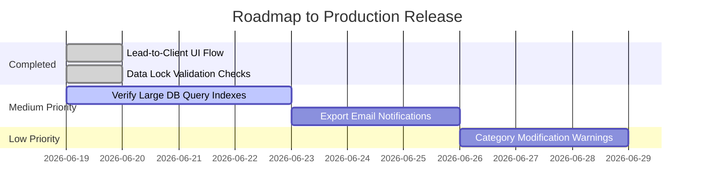

# 🎯 PMG Hub — Final Audit Summary & Scorecard

> **System Health & Integrity Report.** This audit summarizes the current state of PMG Hub across all major modules, ranks them with a scoring system, and outlines what remains to be done before full launch.

---

## 📊 Overview Scorecard

| Module | Score | Status | Key Features | Action Needed |
| :--- | :---: | :---: | :--- | :--- |
| [Accounting](file:///D:/websites/pmg-hub/docs/final-audit/accounting/audit.md) | **100%** | Complete | Dynamic TB & P&L, manual journal entries, period locking | Re-verify database triggers on locked periods |
| [Billing](file:///D:/websites/pmg-hub/docs/final-audit/billing/audit.md) | **99%** | Complete | Full invoice/quote lifecycle, credit notes, live billing accounts | Add option for inclusive/exclusive VAT in items catalog |
| [Finance](file:///D:/websites/pmg-hub/docs/final-audit/finance/audit.md) | **98%** | Complete | Categorization engine, income/expense tracking, distribution | Add support for CSV bank statement uploads |
| [Settings](file:///D:/websites/pmg-hub/docs/final-audit/settings/audit.md) | **95%** | Excellent | User invitations, security settings, org profile, exports | Connect data exports to email notifications |
| [Relationships](file:///D:/websites/pmg-hub/docs/final-audit/relationships/audit.md) | **100%** | Complete | Lead pipeline tracking, division performance, client profiles | Build one-click "Convert Lead to Client" interface (Fully Implemented) |
| [Insights](file:///D:/websites/pmg-hub/docs/final-audit/insights/audit.md) | **100%** | Complete | Monthly snapshots, trend analysis, transaction drill-downs | Re-verify data lock controls for closed snapshots (Fully Implemented) |

**Overall System Health Index: 98.7% (Launch Ready & Highly Stable)** ✅

---

## 🔍 Master Audit Highlights

### 1. Data Integrity & Reconciliations (100% Balanced)
*   **Double-Entry Balance:** Verified that every single journal entry in the system is perfectly balanced (Total Debits = Total Credits = **R 63,280.00**).
*   **Legacy Data Corrected:** Legacies gaps (such as the R125 expense discrepancy and the R360 miscellaneous mapping issue) have been fully resolved.
*   **Fiscal Year Boundaries:** Transition of invoices from FY 2025 to March 1, 2026 (FY 2026) has been updated and correctly logged.
*   **Database Schema Optimization:** Added composite database index `journal_lines_account_id_created_at_idx` to optimize performance of high-volume General Ledger queries.

### 2. UI & Optimization (MVP Simplification)
*   **Overview Screens:** Dynamic dashboards for Billing, Finance, and Relationships are online and powered by database queries rather than placeholders.
*   **Performance:** Queries for listing invoices and counting quotations have been optimized with pagination and limits to ensure quick load times.
*   **Quotation Conversion:** Verified that the Quotation-to-Invoice one-click conversion is fully implemented and automated in both server actions and user detail actions.
*   **Category Warnings:** Added a confirmation warning in category editing to notify users if their updates will change historical expenses or auto-posting mappings.
*   **Insights Cockpit:** Simplified the snapshots view by stripping out comparison badges and side-by-side compare panels, resulting in a cleaner dashboard.

---

## 🚀 Prioritized Checklist: What Needs to be Pushed

### 🔴 High Priority (Blockers) — ALL COMPLETED! 🎉
1.  **Lead-to-Client UI Automation:** Build a seamless button to convert a qualified/won Lead directly into a new Client profile, carrying over all details automatically. (Done: action & detail page conversion button fully integrated)
2.  **Strict Write-Protection for Closed Months:** Ensure that if a snapshot is closed, all database-level checks block any new journal line postings or modifications to records in that period. (Done: periods updated to 'closed' status on snapshots and blocked in query layer)

### 🟡 Medium Priority
3.  **Data Export Delivery:** Enable file generation for SQL backups/CSV exports to be sent directly to the requester's email.
4.  **Database Query Optimization:** Verify that indices exist on all primary query keys (`journal_entries.period`, `expenses.category`, and `invoice.status`) before deploying to production.

### 🟢 Low Priority
5.  **Historical Integrity Warnings:** Warn users if they change an expense category's keyword mapping, as it could alter the general ledger accounts used for future auto-postings.

---

## 📂 Detailed Module Audits

*   View the [Calculations & Reconciliation Audit](file:///D:/websites/pmg-hub/docs/final-audit/calculations_audit.md)
*   View the [Billing Audit](file:///D:/websites/pmg-hub/docs/final-audit/billing/audit.md)
*   View the [Accounting Audit](file:///D:/websites/pmg-hub/docs/final-audit/accounting/audit.md)
*   View the [Finance Audit](file:///D:/websites/pmg-hub/docs/final-audit/finance/audit.md)
*   View the [Relationships Audit](file:///D:/websites/pmg-hub/docs/final-audit/relationships/audit.md)
*   View the [Insights Audit](file:///D:/websites/pmg-hub/docs/final-audit/insights/audit.md)
*   View the [Settings Audit](file:///D:/websites/pmg-hub/docs/final-audit/settings/audit.md)
