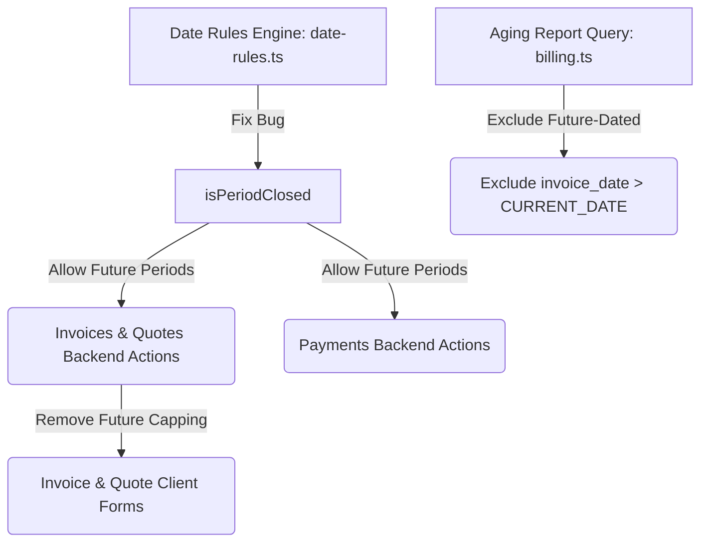

# Date Input Rules Improvement Plan

This document reviews how the system currently handles backdating and future-dating for Invoices, Payments, and Quotes. It identifies a critical period-lock bug affecting future dates and proposes a clean technical plan to allow future-dated Invoices and Quotes while maintaining period-lock integrity.

---

## 1. Current State Analysis

The table below summarizes how back dates (past closed financial periods) and future dates are currently handled across Invoices, Payments, and Quotes.

| Document Type | Back Dates (Closed Periods) | Future Dates (Planned/Scheduled) | Key Implementation Details |
| :--- | :--- | :--- | :--- |
| **Invoices** | 🛑 **Blocked in Backend**<br>⚠️ **Warned in Frontend** | 🛑 **Blocked** | **Backend:** `createInvoice` rejects if `invoiceDate > today` or `isPeriodClosed(invoiceDate)`. `updateInvoice` has no closed period check.<br>**Frontend:** Capped via `max={today}` on the date input. Warning banner shown if `invoiceDate < minDate`. |
| **Payments** | 🛑 **Blocked in Backend**<br>⚠️ **Warned in Frontend** | 🛑 **Blocked (Due to Bug)** | **Backend:** `recordClientPayment` and `adjustClientPayment` reject if `isPeriodClosed(date)`. No explicit future date check.<br>**Frontend:** No `max` attribute. Warning label shown if `paymentDate < minDate`. |
| **Quotes** | 🛑 **Blocked in Backend**<br>❌ **No Warn in Frontend** | 🛑 **Blocked** | **Backend:** `createQuotation` rejects if `quoteDate > today` or `isPeriodClosed(quoteDate)`. `updateQuotation` has no closed period check.<br>**Frontend:** Capped via `max={today}` on the date input. No warning banner shown. |

---

## 2. Identified Bugs & Gaps

### 🐛 Bug A: Future Dates Incorrectly Blocked as "Closed Periods"
The date rule function `isPeriodClosed(date)` in `apps/admin/src/lib/date-rules.ts` contains a logic error. If a date is in a future period (e.g., `2026-06` when today is `2026-05-24`), it falls through the checks:
1. `period === currentPeriod` (false)
2. `period < prevPeriod` (false)
3. `snapshot` check (false - no snapshot exists for future months)
4. `day = now.getDate(); if (day > 5) return true;` (evaluated as **true** because today is the 24th)

As a result, **any future date is incorrectly classified as closed** after day 5 of the current month.

### ⚠️ Gap B: Client Forms Physically Cap Inputs to `max={today}`
In the React forms for invoices and quotes:
- `apps/admin/src/app/(admin)/billing/invoices/new/invoice-form-client.tsx`
- `apps/admin/src/app/(admin)/billing/quotes/new/quote-form-client.tsx`

The `input` elements for `invoiceDate` and `quoteDate` explicitly define `max={today}` attributes, which physically blocks the user from choosing a date beyond today in the browser.

### 🛑 Gap C: Server Actions Reject Future Dates
In server actions:
- `createInvoice` in `apps/admin/src/app/actions/billing-invoices.ts`
- `createQuotation` in `apps/admin/src/app/actions/billing-quotes.ts`

Explicit checks block future dates, e.g.:
```ts
if (invoiceDate > today) {
  return { error: 'Invoice date cannot be in the future.' };
}
```

### 🔓 Gap D: Payment Form Warning is Non-Blocking
In `apps/admin/src/app/(admin)/billing/payments/add/payment-form-client.tsx`, selecting a date prior to the open period (`paymentDate < minDate`) displays a warning banner but **does not block form submission**. It relies entirely on the backend to throw an error, which creates a poor user experience.

### 📊 Gap E: Future-Dated Invoices in the Aging Report
In the query `getAgingReport()` inside `packages/db/src/queries/billing.ts`, outstanding invoices with status `'issued'` or `'partially_paid'` are allocated into aging buckets. Since future-dated invoices have a `due_date >= CURRENT_DATE`, they get classified in the `'current'` bucket. This gives a false perspective that this amount is due this month, even if the invoice itself is scheduled for months or years in the future (e.g., January 2027).

---

## 3. Proposed Changes

We will modify the core date engine, server actions, and frontend forms to support future-dated Invoices and Quotes while keeping Payments constrained appropriately (and fixing the future period lock bug).



---

### Component: Core Date Engine

#### [MODIFY] [date-rules.ts](file:///D:/websites/pmg-hub/apps/admin/src/lib/date-rules.ts)
- Update `isPeriodClosed(date)` to immediately return `false` if `period > currentPeriod`. This fixes Bug A, ensuring that future periods are always considered open.

---

### Component: Invoices

#### [MODIFY] [billing-invoices.ts](file:///D:/websites/pmg-hub/apps/admin/src/app/actions/billing-invoices.ts)
- In `createInvoice`, remove the check that rejects future dates (`invoiceDate > today`).
- *Improvement:* Add a closed period check in `updateInvoice` to ensure historical invoices cannot be modified into a closed period (maintains consistency with `createInvoice`).

#### [MODIFY] [invoice-form-client.tsx](file:///D:/websites/pmg-hub/apps/admin/src/app/%28admin%29/billing/invoices/new/invoice-form-client.tsx)
- Remove `max={today}` attribute from the `Invoice Date` `Input` element.
- Ensure the period warning `isPeriodWarning` handles future dates cleanly (since `invoiceDate < minDate` is already correct, future dates will not show warnings).

---

### Component: Quotes

#### [MODIFY] [billing-quotes.ts](file:///D:/websites/pmg-hub/apps/admin/src/app/actions/billing-quotes.ts)
- In `createQuotation`, remove the check that rejects future dates (`quoteDate > today`).
- *Improvement:* Add a closed period check in `updateQuotation` to ensure consistency with `createQuotation`.

#### [MODIFY] [quote-form-client.tsx](file:///D:/websites/pmg-hub/apps/admin/src/app/%28admin%29/billing/quotes/new/quote-form-client.tsx)
- Remove `max={today}` attribute from the `Issue Date` `Input` element.

---

### Component: Payments

#### [MODIFY] [billing-payments.ts](file:///D:/websites/pmg-hub/apps/admin/src/app/actions/billing-payments.ts)
- Capping payments to `today` is standard accounting practice (you cannot receive payment in the future).
- Add `max={today}` to the payment date `Input` element in the frontend to prevent future-dated payments.
- Add backend check in `recordClientPayment` to reject if `data.date > today`.
- Keep backdating check: Ensure `recordClientPayment` continues to reject if the payment date is in a closed period.

#### [MODIFY] [payment-form-client.tsx](file:///D:/websites/pmg-hub/apps/admin/src/app/%28admin%29/billing/payments/add/payment-form-client.tsx)
- Add `max={today}` attribute to the `Payment Date` `Input` component to block future dates.
- **Enforce Open Period Validation:** In `handleSubmit`, add a blocking validation error if `paymentDate < minDate`, preventing the user from submitting a payment backdated to a closed period. Change the warning banner to a clear, bold error state.

---

### Component: Aging Classification

#### [MODIFY] [billing.ts](file:///D:/websites/pmg-hub/packages/db/src/queries/billing.ts)
- Exclude future-dated invoices from the aging report completely by adding `AND invoice_date <= CURRENT_DATE` in the database query. This ensures scheduled invoices do not artificially inflate the active accounts receivable or the `current` aging bucket.

---

### Component: Unit Tests

#### [MODIFY] [billing-quotes.test.tsx](file:///D:/websites/pmg-hub/apps/admin/src/__tests__/billing-quotes.test.tsx)
- Update the unit test `"createQuotation - block future date & closed period"` to no longer expect future dates to be rejected. Instead, verify that future dates are successfully processed.

#### [MODIFY] [finance-income.test.tsx](file:///D:/websites/pmg-hub/apps/admin/src/__tests__/finance-income.test.tsx) & [finance-expenses.test.tsx](file:///D:/websites/pmg-hub/apps/admin/src/__tests__/finance-expenses.test.tsx)
- Verify tests reflect the correct payment future date constraints and ledger entries.

---

## 4. Verification Plan

### Automated Tests
Run vitest once code modifications are complete to ensure all tests pass and are aligned:
```bash
powershell -ExecutionPolicy Bypass -Command "npm run test"
```

### Manual Verification
1. **Quotes & Invoices:**
   - Navigate to the "New Quote" page. Select a date in the future (e.g., next month). Verify that the calendar picker allows it, and the quote is saved successfully without "future date" errors.
   - Navigate to the "New Invoice" page. Select a date in the future. Verify it saves successfully.
2. **Payments:**
   - Navigate to the "Record Payment" page. Verify that the calendar picker does not allow selecting future dates (capped at `today`).
   - Try to manually type a future date or backdate a payment into a closed period. Verify that clicking "Record Payment" is blocked and displays a clear validation error.
3. **Aging Report:**
   - Create a future-dated invoice (e.g., dated January 2027). Verify that it does **not** appear on the aging report until the current date reaches January 2027, preventing near-term EXPECTED cash views from being distorted.
4. **Period Locking:**
   - Select a back date inside a closed period for Invoices, Quotes, and Payments. Verify that the backend rejects it with the closed financial period message.
