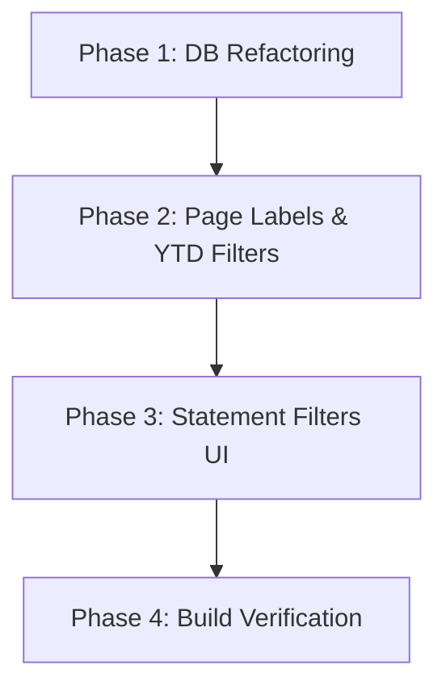

# Implementation Plan: Fiscal Financial Year Transition & Client Statement Enhancements

This document outlines the proposal and implementation phases to transition the **Playhouse Media Group (PMG) Control Center** to a standardized fiscal financial year (**March 1 – February 28/29**) for all year-to-date (YTD) and annual calculations. Additionally, it details the architectural changes required to introduce rolling monthly filter options on client statements.

---

## 1. Goal and Core Requirements

1. **Standardized Fiscal Year Alignment:** 
   - Ensure all calculations grouped or filtered by "year" or "year-to-date" (YTD) utilize the fiscal boundary starting **March 1st** and ending **February 28th (or February 29th in leap years)**.
   - Any transaction falling in January or February will automatically be attributed to the *previous* calendar year's financial year (e.g., January 15, 2026 belongs to the 2025 financial year).
2. **Label Simplification and Rename:**
   - Update standard all-time overview labels that say `"All time"` (signifying inception-to-date aggregates) to `"Year to Date"` (showing statistics for the current financial year).
   - **Strict Label Exclusions:** To preserve standard report labels, **no UI label renamings** (e.g. changing "All time" to "Year to Date") will be performed within the routes:
     - `apps/admin/src/app/(admin)/insights/reports/*`
     - `apps/admin/src/app/(admin)/insights/*`
   - **Calculation Inclusions:** However, **financial year calculations and date-range filters** (March 1 – February 28/29) **will be fully applied** to these routes and their data queries so that insights reports correctly represent fiscal performance rather than calendar-year figures.
3. **Statement Monthly Period Filtering:**
   - Extend client statement querying and UI filters to support rolling monthly periods:
     - **Current Month:** The 1st day of the current month to the last day of the current month.
     - **Previous Month:** The 1st day of the previous calendar month to the last day of the previous calendar month.
     - **Past 3 Months:** A rolling 3-month window from the 1st day of 2 months ago to the last day of the current calendar month (e.g., if current date is May, this covers March 1st – May 31st).

---

## 2. Affected System Components

The transition spans two primary layers of the monorepo: **Database Shared Queries** (`packages/db`) and **Control Center Frontend Pages & Helpers** (`apps/admin`).

### Database Queries (`packages/db`)
- **`packages/db/src/queries/general.ts`**:
  - `getDistinctYears()`: Extracts distinct years from `income` and `expenses`. Needs to subtract `2 months` to correctly group by fiscal year.
  - `getExpensesByCategoryForYear(year)`: Category breakdown for a year. Needs to filter by fiscal year.
  - `getMonthlyFinancials()`: Used for default mom snapshots. Needs to filter by current financial year.
  - `getMonthlyFinancialsForYear(year)`: Monthly timeline. Needs to filter using fiscal year bounds.
  - `getMonthlyRevenueByDivisionForYear(year)`: Division timeline. Needs to filter using fiscal year bounds.
- **`packages/db/src/queries/billing.ts`**:
  - `getAllQuotations()`: Add optional `year?: number` filter to retrieve quotations in a specific financial year.
  - `getAllInvoices()`: Add optional `year?: number` filter to retrieve invoices in a specific financial year.
  - `getClientsWithBillingActivity()`: Add optional `year?: number` parameter to aggregate invoices and income within that financial year.
  - `getClientStatement(clientId, filters)`: Extend `filters` to accept `monthPeriod?: 'current' | 'previous' | 'past3'`. Calculate SQL date conditions dynamically in JS.
- **`packages/db/src/queries/income.ts`**:
  - `getAllIncome()`: Extend `filters` to accept `monthPeriod?: 'current' | 'previous' | 'past3'`. Calculate SQL date conditions dynamically in JS.

### Frontend Routing & Views (`apps/admin`)
- **`apps/admin/src/lib/financial.ts`**:
  - `getYTDLabel()`: Dynamically compute the fiscal start year. Show `"Mar [FY_START_YEAR] - [CURRENT_MONTH]"` instead of `"Jan - [CURRENT_MONTH]"`.
  - Update any default metric dashboard calls to pass the current financial year rather than calendar years.
- **`apps/admin/src/app/(admin)/billing/invoices/page.tsx`**:
  - Rename `"All time"` description to `"Year to Date"`.
  - Pass the current financial year parameter `{ year: currentFY }` to `getAllInvoices()` to ensure values reflect the YTD scope.
- **`apps/admin/src/app/(admin)/billing/quotes/page.tsx`**:
  - Rename `"All time"` description to `"Year to Date"`.
  - Pass the current financial year parameter `{ year: currentFY }` to `getAllQuotations()` to ensure values reflect the YTD scope.
- **`apps/admin/src/app/(admin)/billing/statements/page.tsx`**:
  - Rename `"All time"` description to `"Year to Date"`.
  - Pass the current financial year parameter `{ year: currentFY }` to `getClientsWithBillingActivity()` to ensure main table aggregates align with YTD.
- **`apps/admin/src/app/(admin)/billing/statements/[clientId]/page.tsx`**:
  - Integrate support for `monthPeriod` parameter inside search queries.
  - Upgrade the sidebar view to support Rolling Month period selectors alongside the financial year list.

---

## 3. Proposed Solutions & Technical Implementation

### A. Core Fiscal Date Math (JS & SQL)

#### JavaScript FY Calculator
We can calculate the current financial year dynamically on the server/client:
```typescript
const now = new Date();
const currentFY = now.getMonth() < 2 ? now.getFullYear() - 1 : now.getFullYear();
// If month is Jan (0) or Feb (1), subtract 1 from calendar year. Otherwise, use calendar year.
```

#### SQL PostgreSQL FY Bounds
To isolate transactions matching a given financial year (e.g. `2025`):
```sql
date_column >= '2025-03-01' AND date_column < '2026-03-01'
```
Subtracting 2 months extracts the financial year for grouping:
```sql
EXTRACT(YEAR FROM (date_column - INTERVAL '2 months')) = 2025
```

---

### B. Statement Month Filtering Algorithm
Within `getClientStatement` and `getAllIncome`, we will introduce a date boundary generator:

```typescript
export function getMonthPeriodDates(monthPeriod: 'current' | 'previous' | 'past3') {
  const now = new Date();
  let startDate: string;
  let endDate: string;

  const formatDateISO = (d: Date) => {
    return `${d.getFullYear()}-${String(d.getMonth() + 1).padStart(2, '0')}-${String(d.getDate()).padStart(2, '0')}`;
  };

  if (monthPeriod === 'current') {
    const firstDay = new Date(now.getFullYear(), now.getMonth(), 1);
    const lastDay = new Date(now.getFullYear(), now.getMonth() + 1, 0);
    startDate = formatDateISO(firstDay);
    endDate = formatDateISO(lastDay);
  } else if (monthPeriod === 'previous') {
    const firstDay = new Date(now.getFullYear(), now.getMonth() - 1, 1);
    const lastDay = new Date(now.getFullYear(), now.getMonth(), 0);
    startDate = formatDateISO(firstDay);
    endDate = formatDateISO(lastDay);
  } else {
    // Past 3 months rolling: from 1st of month 3 months ago to end of current month
    const firstDay = new Date(now.getFullYear(), now.getMonth() - 2, 1);
    const lastDay = new Date(now.getFullYear(), now.getMonth() + 1, 0);
    startDate = formatDateISO(firstDay);
    endDate = formatDateISO(lastDay);
  }

  return { startDate, endDate };
}
```

This guarantees timezone-safe date-range lookups, which are injected directly into Drizzle conditions:
```typescript
if (filters?.monthPeriod) {
  const { startDate, endDate } = getMonthPeriodDates(filters.monthPeriod);
  conditions.push(
    sql`date_column >= ${startDate}`,
    sql`date_column <= ${endDate}`
  );
}
```

---

## 4. Phased Implementation Plan

We propose executing this transition in **4 phases** to ensure type safety, avoid compilation blockages, and maintain the application's clean styling.



### Phase 1: Database Refactoring (`packages/db`)
* **Task 1.1:** Add `year?: number` filter support to `getAllQuotations` and `getAllInvoices` in `billing.ts`.
* **Task 1.2:** Update `getClientsWithBillingActivity` in `billing.ts` to accept `filters?: { year?: number }` and inject the conditions in subqueries.
* **Task 1.3:** Update `getDistinctYears` and other calendar-dependent queries in `general.ts` to subtract `INTERVAL '2 months'` where required.
* **Task 1.4:** Extend `getClientStatement` in `billing.ts` and `getAllIncome` in `income.ts` to accept `monthPeriod` filter and dynamically apply JS-based date boundaries.

### Phase 2: Page Labels & YTD Dashboard Alignment (`apps/admin`)
* **Task 2.1:** Modify `apps/admin/src/app/(admin)/billing/invoices/page.tsx`:
  - Change `"All time"` text to `"Year to Date"`.
  - Pass the dynamic `currentFY` parameter to get YTD records.
* **Task 2.2:** Modify `apps/admin/src/app/(admin)/billing/quotes/page.tsx`:
  - Change `"All time"` text to `"Year to Date"`.
  - Pass the dynamic `currentFY` parameter.
* **Task 2.3:** Modify `apps/admin/src/app/(admin)/billing/statements/page.tsx`:
  - Change `"All time"` text to `"Year to Date"`.
  - Pass the dynamic `currentFY` parameter to `getClientsWithBillingActivity`.
* **Task 2.4:** Update the text label formatting logic inside `apps/admin/src/lib/financial.ts:getYTDLabel()` to present dynamic fiscal years starting from March 1st.
* **Task 2.5:** Refactor `getProfitPoolSeriesForYear` in `apps/admin/src/lib/financial.ts` and `resolveYear` in `apps/admin/src/app/(admin)/insights/reports/page.tsx` to fully align with standard fiscal year reporting boundaries.

### Phase 3: Statement Filters UI Integration (`apps/admin`)
* **Task 3.1:** Refactor client statement detail route `apps/admin/src/app/(admin)/billing/statements/[clientId]/page.tsx` to read `monthPeriod` from URL queries in addition to `year`.
* **Task 3.2:** Modify the data fetch block in the statement page to pass `monthPeriod` when available.
* **Task 3.3:** Add the **Rolling Month Filters** component in the statement detail page sidebar, matching standard layouts and border styles.
* **Task 3.4:** Ensure that the generated statement PDF/Print boundaries (`periodFrom`/`periodTo`) match the selected month period accurately.

### Phase 4: Build Verification
* **Task 4.1:** Run full typescript check: `bun run check-types`.
* **Task 4.2:** Build the entire project: `bun run build`.

---

## 5. Verification & Testing Strategy

### Automated Verification
To ensure no API regression and that Drizzle compilation is correct, we will run the typecheck and production build scripts:
```bash
bun run check-types
bun run build
```

### Manual Visual Verification
1. **Invoice/Quotes Dashboard Check:** Confirm that the cards display `"Year to Date"` instead of `"All time"`, and show count data for the current FY.
2. **Statement Month Period Toggles:** Go to a client statement page, click "Current Month", "Previous Month", and "Past 3 Months", and ensure:
   - The transaction list updates to display only matching dates.
   - The print preview dates reflect the selected boundaries.
   - No styling elements overlap or shift.
