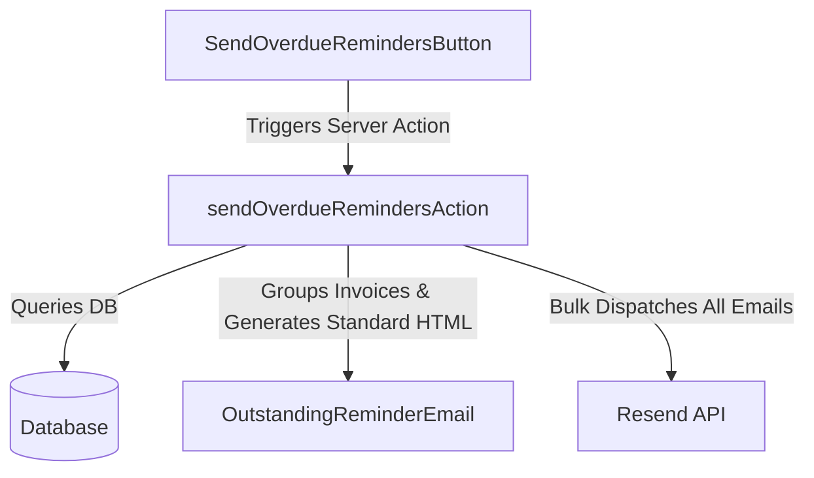
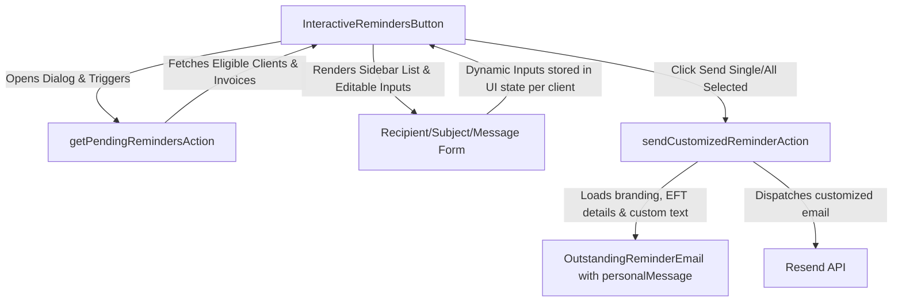

# Interactive Overdue Payment Reminders - Implementation Plan

This plan outlines the changes required to replace the existing "bulk send" overdue payment reminders dialog with an interactive, high-fidelity wizard. This will allow administrators to see exactly who they are sending reminder emails to, customize recipient emails/subjects, and append personalized messages before sending.

---

## 1. Objectives

- **Visibility:** Provide a comprehensive view of all clients with outstanding, overdue balances before sending any emails.
- **Customization:** Allow custom message insertion (personal notes) into individual reminder emails.
- **Control:** Allow editing target emails and custom subject lines on a per-client basis.
- **Granularity:** Allow selective dispatching (e.g., send only to specific clients, skip others, or send individually).

---

## 2. Current State vs. Proposed Architecture

### Current Automated Bulk Flow



### Proposed Interactive Flow



---

## 3. Detailed Component Plan

### 3.1. Email Template Update (`@pmg/emails`)

#### **[MODIFY]** [OutstandingReminderEmail.tsx](file:///d:/websites/pmg-hub/packages/emails/src/templates/OutstandingReminderEmail.tsx)
Add an optional `personalMessage` field to `OutstandingReminderEmailProps` and render it as an elegant block callout at the beginning of the email body.

```typescript
export type OutstandingReminderEmailProps = {
  clientName: string;
  documentNumber: string;
  invoiceDate: string;
  dueDate: string;
  totalAmount: string;
  outstandingAmount: string;
  reminderType: "pre-due" | "due-today" | "overdue";
  personalMessage?: string; // <-- New optional prop
  bankDetails?: {
    bankName: string;
    accountName: string;
    accountNumber: string;
    branchCode: string;
  };
} & BrandingProps;
```

Inside the React render function, insert a dedicated block for `personalMessage` directly after the greeting:

```tsx
{/* Personalized Message Callout */}
{personalMessage && (
  <Section className="mb-[24px] rounded-[6px] border-l-4 border-solid p-[16px] bg-slate-50 border-brand">
    <Text className="m-0 text-[14px] italic leading-[22px] text-slate-700">
      "{personalMessage}"
    </Text>
  </Section>
)}
```

---

### 3.2. Server Actions Update (`apps/admin`)

#### **[NEW]** `getPendingRemindersAction`
Fetch all clients with outstanding overdue invoices, grouped by client, along with default recipient details so they can be loaded into the UI.

```typescript
export type PendingReminderClient = {
  clientId: string;
  clientName: string;
  businessName: string | null;
  email: string;
  outstandingBalance: number;
  invoiceCount: number;
  headlineDocumentNumber: string;
  divisionId: string;
  divisionName: string;
};

export async function getPendingRemindersAction(): Promise<{
  success: boolean;
  data: PendingReminderClient[];
  error?: string;
}> {
  // 1. Fetch overdue invoices matching the criteria
  // 2. Group by client
  // 3. For each client, calculate the exact outstanding balance and invoice count
  // 4. Return grouped items sorted by highest outstanding balance first
}
```

#### **[NEW]** `sendCustomizedReminderAction`
Send an individual customized email containing the overridden recipient email, custom subject line, and personal message.

```typescript
export type SendCustomizedReminderPayload = {
  clientId: string;
  recipientEmail: string;
  subject: string;
  personalMessage?: string;
};

export async function sendCustomizedReminderAction(
  payload: SendCustomizedReminderPayload
): Promise<{ success: boolean; error?: string }> {
  // 1. Authenticate user session
  // 2. Fetch outstanding invoices for this client to compute details (outstanding amount, bank account settings, division branding)
  // 3. Construct OutstandingReminderEmail React node with custom personalMessage
  // 4. Send via emailClient (Resend)
}
```

---

### 3.3. UI Components Update (`apps/admin`)

#### **[MODIFY]** [send-overdue-reminders-button.tsx](file:///d:/websites/pmg-hub/apps/admin/src/components/billing/send-overdue-reminders-button.tsx)
We will replace this component with a modern, high-fidelity **Review & Send Reminders Dialog** using `Dialog` (Shadcn/UI), Tailwind, and Lucide React.

**UI Layout Details:**
1. **Interactive Trigger:** Clicking "Send Reminders" displays a loader while fetching pending reminder candidates.
2. **Two-Pane Layout:**
   - **Left Pane (Recipients List):**
     - A scrollable table or list showing a checkbox, client business name, invoice count, and total outstanding balance.
     - Search input to filter clients.
     - Checkbox at the top to "Select All / Deselect All".
   - **Right Pane (Email Composer & Preview):**
     - When a client is clicked in the left list, load their information into editable states.
     - **Recipient Input:** To modify where the email is sent (default: client's database email).
     - **Subject Input:** Pre-filled default: `Overdue Payment Reminder — [Client Name]: R [Amount] outstanding`.
     - **Personalized Message Textarea:** Text area to type an optional customized paragraph.
     - **Preview Block:** Live, styled text representation showing exactly how the email content will look, reflecting updates to the subject, email, and personal message.
3. **Execution Controls:**
   - **"Send Selected" Button:** Loops through checked clients and dispatches their emails sequentially with their customized messages. Shows individual progress bars or logs (e.g. *"Sending to Client A... Done"*, *"Sending to Client B... Failed"*).
   - **"Send Single" Button:** Conveniently triggers transmission only for the currently active/selected client on the composer screen.

---

## 4. Verification Plan

### Manual Verification Checklist
- [ ] Open the Billing Dashboard and click **Send Reminders**. Ensure a loading state occurs while fetching pending recipients.
- [ ] Verify that a list of clients with actual outstanding overdue invoices is loaded on the left pane.
- [ ] Click a client, modify the recipient email address, and verify it updates the active configuration.
- [ ] Type a custom note in the **Personalized Message** field and check that the live preview updates immediately.
- [ ] Uncheck a client, click **Send Selected**, and verify that they are skipped during transmission.
- [ ] Send a customized reminder to a test client and verify in Resend logs that the email was successfully generated and contains the custom callout box with your exact text.
