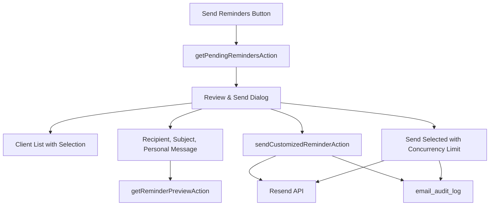

# Interactive Overdue Payment Reminders - Implementation Plan

This plan replaces the current blind "send every overdue client now" action with an interactive review-and-send workflow. The first implementation pass should focus on overdue reminders only: administrators must be able to see who will be emailed, adjust recipient details and message content, preview the email, send selected reminders, and keep an audit trail.

Payment confirmations, Resend cloud templates, and a template editor remain valuable, but they should follow after the core reminder workflow is reliable.

---

## 1. Goal

Build an interactive overdue reminder dialog for the admin billing area.

The workflow should let an administrator:

- Review all clients with overdue outstanding balances before sending.
- Inspect the invoices that make up each client's balance.
- Edit recipient email, subject, and a plain-text personal message per client.
- Preview the actual email before dispatch.
- Select exactly which clients receive reminders.
- Send one reminder or send selected reminders with progress feedback.
- Record every send attempt in an audit table, including failures.
- Prevent accidental duplicate sends through stable idempotency keys.

---

## 2. Current State

The current implementation is a bulk confirmation dialog:

- UI: `apps/admin/src/components/billing/send-overdue-reminders-button.tsx`
- Action: `apps/admin/src/app/actions/send-overdue-reminders.ts`
- Template: `packages/emails/src/templates/OutstandingReminderEmail.tsx`
- Email wrapper: `packages/emails/src/send.ts`

Current behavior:

1. Admin clicks **Send Reminders**.
2. An alert dialog warns that all clients with overdue balances will be emailed.
3. `sendOverdueRemindersAction` finds eligible invoices.
4. It groups invoices by client.
5. It calculates outstanding balances by subtracting `payment_allocations`.
6. It sends one email per client immediately.

Current gaps:

- No recipient review before sending.
- No per-client selection.
- No recipient override.
- No subject override.
- No personal message support in `OutstandingReminderEmail`.
- No live preview.
- No audit table for sent reminders.
- No stable idempotency key.
- No explicit permission check beyond session presence.
- Query work has some N+1 behavior while calculating balances.

Important existing pieces:

- `InvoiceDeliveryEmail` and `QuoteDeliveryEmail` already support `personalMessage`.
- `PaymentThankYouEmail` already exists.
- `recordClientPayment` currently sends `PaymentThankYouEmail` automatically after payment capture.
- The database schema is Drizzle/Postgres, not MySQL.
- The shared email wrapper currently sends React Email components through Resend and does not expose idempotency options.

---

## 3. Target Flow



---

## 4. Phase 1 Scope: Interactive Overdue Reminders

Phase 1 should not include Resend cloud template management, a rich email editor, or a separate payment-confirmation workflow. Those are later phases.

### 4.1 Email Template Update

Modify `packages/emails/src/templates/OutstandingReminderEmail.tsx`.

Add `personalMessage?: string` to `OutstandingReminderEmailProps`.

Render it after the greeting and before the overdue alert block:

```tsx
{personalMessage && (
  <Section className="mb-[24px] rounded-[6px] border-l-4 border-solid border-brand bg-[#F8FAFC] p-[16px]">
    <Text className="m-0 text-[14px] italic leading-[22px] text-[#475569]">
      "{personalMessage}"
    </Text>
  </Section>
)}
```

Notes:

- Treat the message as plain text only.
- React Email escapes text by default, so do not use `dangerouslySetInnerHTML`.
- Enforce the 500-character limit on both client and server.

### 4.2 Shared Email Send Wrapper

Modify `packages/emails/src/send.ts` so callers can pass Resend request options.

Add support for:

- `idempotencyKey`
- Optional pre-rendered `html` later if needed, but Phase 1 can continue using `react`.

Expected shape:

```ts
export interface EmailPayload {
  to: string;
  subject: string;
  react: React.ReactElement;
  replyTo?: string;
  cc?: string | string[];
  attachments?: Attachment[];
  idempotencyKey?: string;
}
```

Send with:

```ts
await resend.emails.send(
  {
    from: config.from,
    to: payload.to,
    subject: payload.subject,
    react: payload.react,
    attachments: payload.attachments,
    replyTo: payload.replyTo,
    cc: payload.cc,
  },
  payload.idempotencyKey ? { idempotencyKey: payload.idempotencyKey } : undefined,
);
```

### 4.3 Database: Email Audit Log

Add a Drizzle/Postgres table to `packages/db/src/schema`.

Recommended table: `emailAuditLog`.

Fields:

- `id`: uuid primary key
- `resendEmailId`: text nullable
- `emailType`: enum or text, initially `overdue_reminder`
- `recipientEmail`: text not null
- `subject`: text not null
- `clientId`: uuid nullable, references clients
- `divisionId`: uuid nullable, references divisions
- `sentBy`: text not null
- `status`: enum or text, values `success`, `failed`, `cancelled`
- `errorMessage`: text nullable
- `idempotencyKey`: text not null unique
- `customizationDetails`: jsonb not null
- `createdAt`: timestamp with timezone default now not null

Add indexes for:

- `clientId`
- `divisionId`
- `status`
- `createdAt`
- `idempotencyKey`

Do not use MySQL syntax such as `ON UPDATE CURRENT_TIMESTAMP`.

### 4.4 Validation Helpers

Create focused helpers in the admin app, for example:

- `apps/admin/src/lib/email-validation.ts`

Required helpers:

```ts
export function validatePersonalMessage(message?: string): {
  valid: boolean;
  sanitized?: string;
  error?: string;
}
```

Rules:

- Empty is valid.
- Max 500 characters after trimming.
- Reject likely HTML input instead of trying to preserve formatting.
- Return a trimmed plain-text value.

```ts
export function validateRecipientEmail(email: string): {
  valid: boolean;
  error?: string;
}
```

Rules:

- Use a pragmatic email check.
- Do not add disposable-domain blocking in Phase 1 unless there is a product reason.

### 4.5 Server Actions

Create or extend actions in:

- `apps/admin/src/app/actions/send-overdue-reminders.ts`

#### `getPendingRemindersAction`

Fetch all clients with real overdue outstanding balances.

Return shape:

```ts
export type PendingReminderClient = {
  clientId: string;
  clientName: string;
  businessName: string | null;
  email: string | null;
  divisionId: string;
  divisionName: string;
  outstandingBalance: number;
  invoiceCount: number;
  headlineDocumentNumber: string;
  headlineInvoiceDate: string;
  headlineDueDate: string | null;
  invoices: {
    id: string;
    documentNumber: string;
    invoiceDate: string;
    dueDate: string | null;
    total: number;
    allocated: number;
    outstanding: number;
  }[];
};
```

Eligibility:

- `clientId IS NOT NULL`
- `status = 'overdue'`, or `status IN ('issued', 'partially_paid')` with `dueDate < today`
- Outstanding amount after allocations must be greater than 0.

Implementation notes:

- Avoid per-invoice allocation queries where possible.
- Use a left join or aggregate subquery against `paymentAllocations`.
- Sort clients by highest outstanding balance first.
- Limit to 100 clients in Phase 1.
- Include clients with missing email in the list, but mark them invalid/unsendable in the UI.

#### `getReminderPreviewAction`

Render the selected client's configured reminder to HTML.

Payload:

```ts
export type ReminderPreviewPayload = {
  clientId: string;
  recipientEmail: string;
  subject: string;
  personalMessage?: string;
};
```

Behavior:

- Authenticate.
- Validate personal message.
- Re-fetch current invoice data for the client.
- Reuse the same email prop builder as the send action.
- Render `OutstandingReminderEmail` with `renderEmailTemplate`.
- Return `{ success: true, html }` or `{ success: false, error }`.

Debounce calls from the client UI.

#### `sendCustomizedReminderAction`

Send one customized reminder.

Payload:

```ts
export type SendCustomizedReminderPayload = {
  clientId: string;
  recipientEmail: string;
  subject: string;
  personalMessage?: string;
  batchId?: string;
};
```

Behavior:

1. Authenticate.
2. Check that the user can manage billing or send billing emails.
3. Validate recipient email, subject, and personal message.
4. Re-fetch current eligible invoices for this client.
5. Recalculate outstanding balance.
6. Resolve division branding and sender details using the existing `@pmg/emails` helpers.
7. Preserve the existing admin CC behavior.
8. Build a stable idempotency key.
9. Send through Resend.
10. Insert an audit row for success or failure.
11. Return Resend email ID or an error.

Stable idempotency key:

```ts
const idempotencyKey = batchId
  ? `overdue-reminder/${batchId}/${clientId}`
  : `overdue-reminder/${clientId}/${today}`;
```

Do not use `Date.now()` in the idempotency key.

### 4.6 UI Component

Replace `apps/admin/src/components/billing/send-overdue-reminders-button.tsx` with a client-side review dialog.

Use existing UI conventions and shadcn components already present in the app.

Dialog layout:

- Trigger button: **Send Reminders**
- Fetch pending reminders when opened.
- Left pane:
  - Search field.
  - Sort by balance.
  - Select all / deselect all.
  - Client rows with business name, invoice count, outstanding amount, and email validity state.
- Right pane:
  - Active client details.
  - Recipient email input.
  - Subject input.
  - Personal message textarea with 500-character counter.
  - Invoice breakdown.
  - Live preview iframe or sandboxed preview area.
- Footer/actions:
  - Send current.
  - Send selected.
  - Cancel/close.
  - Progress text while sending.

Batch send behavior:

- Generate one `batchId` in the UI when sending selected clients.
- Send sequentially or with a small concurrency limit.
- Use max concurrency of 3 in Phase 1. Resend's practical default rate limit is lower than the original plan assumed.
- Show per-client status: pending, sending, sent, failed, skipped.
- Disable send buttons while sending.

Preview behavior:

- Debounce input changes by roughly 300-500ms.
- Show a lightweight loading state.
- If preview fails, show the error without blocking editing.

### 4.7 Permissions

Phase 1 should include a real permission check instead of session-only authorization.

Use the repo's existing auth/role helpers if available. If there is no general helper yet, add a narrowly-scoped helper for billing email actions.

Required rule:

- User must be allowed to manage billing or send billing emails.

Division restriction:

- If the app has division-scoped permissions, enforce that the user can send for the client's division.
- If division-scoped permissions do not exist yet, document that gap and keep the action admin-only.

---

## 5. Phase 1 Verification

Automated checks:

- Unit tests for `validatePersonalMessage`.
- Unit tests for `validateRecipientEmail`.
- Unit or integration test for `getPendingRemindersAction` grouping and outstanding calculation.
- Test that `sendCustomizedReminderAction` writes audit rows for success and failure.
- Test that duplicate idempotency keys are handled cleanly.

Manual checks:

- Open billing dashboard and click **Send Reminders**.
- Confirm overdue clients load before any email is sent.
- Confirm clients with missing email are visible but cannot be sent until corrected.
- Select/deselect clients.
- Edit recipient email and subject.
- Add a personal message and confirm preview updates.
- Try HTML in the personal message and confirm it is rejected.
- Send one reminder to a safe test address.
- Send selected reminders with a small batch.
- Confirm Resend logs show the idempotency key.
- Confirm audit rows exist for success/failure.
- Confirm admin CC still works.

---

## 6. Phase 2: Payment Confirmation Cleanup

This codebase already has `PaymentThankYouEmail` and currently sends it automatically from `recordClientPayment`.

Before building a new payment confirmation UI, decide the desired product behavior:

- Keep automatic thank-you emails after payment capture.
- Add an opt-in/opt-out checkbox to the payment recording form.
- Replace automatic sending with a manual review-and-send confirmation flow.
- Add a resend/send-later confirmation feature.

Recommended Phase 2:

1. Stop using fire-and-forget email sending for payment receipts.
2. Add audit logging for payment thank-you emails.
3. Add an optional checkbox in the payment form: **Send payment receipt email**.
4. Add optional `personalMessage` to `PaymentThankYouEmail`, or rename `paymentDescription` if it is intended to be the custom message.
5. Add idempotency keys for payment receipt emails, for example `payment-receipt/${incomeId}`.

Only build a separate payment-confirmation review dialog if there is a real workflow need for sending receipts after the payment has already been recorded.

---

## 7. Phase 3: Resend Cloud Templates

Do not implement Resend cloud templates in Phase 1.

When this phase starts, first upgrade and verify the Resend SDK version used by the app and shared email package. The current packages use older `resend` versions, while template/webhook work benefits from a newer SDK.

Scope:

- Add Resend template reference storage.
- Store template IDs and aliases, not large HTML blobs.
- Add a template variable registry.
- Add template selection in email composer dialogs.
- Add send support for either `react` or `template`, never both.

Important Resend constraints:

- `html`, `text`, `react`, and `template` are mutually exclusive send modes.
- Template variables are case-sensitive.
- Templates must be published before sending.
- API errors are returned as `{ data, error }`; always check `error`.
- Idempotency keys expire after 24 hours and must be stable across retries.

Suggested schema:

- `emailTemplates`
  - `id`
  - `templateName`
  - `templateType`
  - `resendTemplateId`
  - `resendAlias`
  - `description`
  - `divisionId`
  - `isDefault`
  - `createdBy`
  - `createdAt`
  - `updatedAt`

This should be implemented as Drizzle/Postgres schema, not raw MySQL SQL.

---

## 8. Phase 4: Template Library and Editor

Only after Phase 3 is stable:

- Build an email template library UI.
- Allow selecting saved templates per email type/division.
- Consider a Resend template editor or a guided link-out workflow to the Resend dashboard.
- Add preview support for cloud templates.
- Add template defaults per division.

Avoid building a rich editor until the simpler template-reference workflow proves useful.

---

## 9. Future Enhancements

- Scheduled reminder sends.
- Reminder cadence rules, such as 7/14/30 days overdue.
- Resend webhook ingestion for delivered, bounced, complained, opened, and clicked events.
- Dashboard metrics for reminder success/failure.
- Client communication timeline.
- Suppression list awareness.
- SMS or WhatsApp reminders.
- Multi-language email variants.

---

## 10. Success Criteria

Phase 1 is successful when:

- No overdue reminder is sent without first being visible in the review dialog.
- Admins can select exactly which clients receive reminders.
- Admins can customize recipient email, subject, and personal message per client.
- The preview matches the sent React Email template.
- Every send attempt creates an audit record.
- Retry-safe idempotency keys are used.
- Existing division branding and admin CC behavior are preserved.
- Unauthorized users cannot send reminders.
