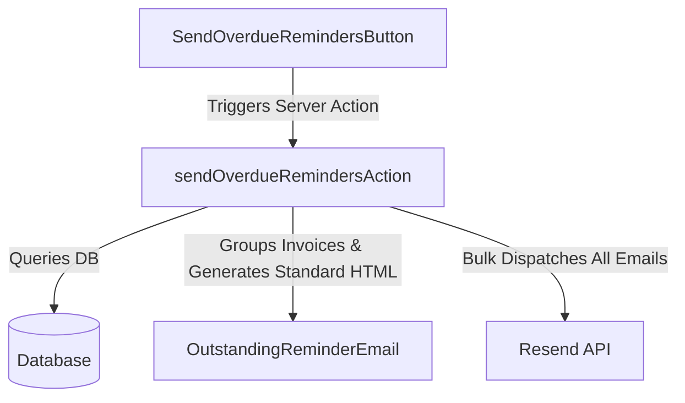
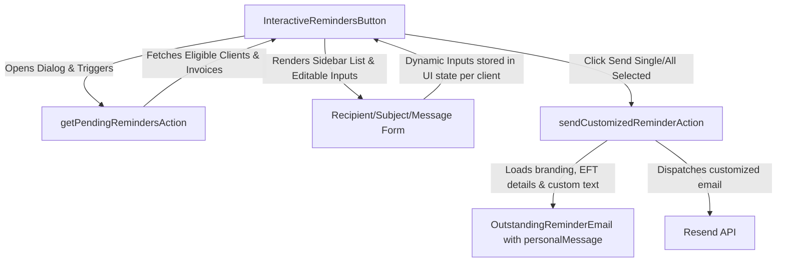
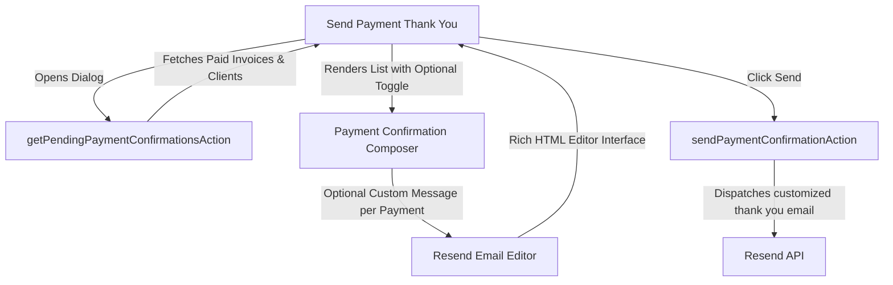

# Interactive Overdue Payment Reminders - Implementation Plan

This plan outlines the changes required to replace the existing "bulk send" overdue payment reminders dialog with an interactive, high-fidelity wizard. This will allow administrators to see exactly what will be sent, customize messages per client, and optionally send thank you payment confirmations.

---

## 1. Objectives

- **Visibility:** Provide a comprehensive view of all clients with outstanding, overdue balances before sending any emails.
- **Customization:** Allow custom message insertion (personal notes) into individual reminder emails.
- **Control:** Allow editing target emails and custom subject lines on a per-client basis.
- **Granularity:** Allow selective dispatching (e.g., send only to specific clients, skip others, or send individually).
- **Optional Payment Confirmations:** Send optional thank you payment emails with custom messages explaining payment details or next steps.
- **Universal Email Editor:** Leverage Resend's editor for composing and editing all outgoing emails (reminders, invoices, quotes, payment confirmations) with a rich, intuitive interface.

---

## 2. Current State vs. Proposed Architecture

### Current Automated Bulk Flow



### Proposed Interactive Flow



### Proposed Payment Confirmation Flow



---

## 3. Detailed Component Plan

### 3.1. Email Template Update (`@pmg/emails`)

#### **[MODIFY]** OutstandingReminderEmail.tsx
Add an optional `personalMessage` field to `OutstandingReminderEmailProps` and render it as an elegant block callout at the beginning of the email body.

```typescript
export type OutstandingReminderEmailProps = {
  clientName: string;
  documentNumber: string;
  invoiceDate: string;
  dueDate: string;
  totalAmount: string;
  outstandingAmount: string;
  reminderType: "pre-due" | "due-today" | "overdue";
  personalMessage?: string; // <-- New optional prop
  bankDetails?: {
    bankName: string;
    accountName: string;
    accountNumber: string;
    branchCode: string;
  };
} & BrandingProps;
```

Inside the React render function, insert a dedicated block for `personalMessage` directly after the greeting:

```tsx
{/* Personalized Message Callout */}
{personalMessage && (
  <Section className="mb-[24px] rounded-[6px] border-l-4 border-solid p-[16px] bg-slate-50 border-brand">
    <Text className="m-0 text-[14px] italic leading-[22px] text-slate-700">
      "{personalMessage}"
    </Text>
  </Section>
)}
```

#### **[NEW]** PaymentConfirmationEmail.tsx
Create a new email template for sending payment confirmation thank you emails.

```typescript
export type PaymentConfirmationEmailProps = {
  clientName: string;
  invoiceNumber: string;
  invoiceDate: string;
  amountPaid: string;
  paymentDate: string;
  referenceNumber?: string;
  personalMessage?: string; // <-- Optional custom message
  bankDetails?: {
    bankName: string;
    accountName: string;
    accountNumber: string;
    branchCode: string;
  };
} & BrandingProps;
```

The template should include:
- A warm greeting and thank you message
- Invoice and payment details
- An optional personalized message block (same styling as reminder emails)
- Next steps or account information (if applicable)

#### **[MODIFY]** All Email Templates (QuoteEmail, InvoiceEmail, etc.)
Add optional `personalMessage` field to all transactional email templates for consistency:
- `QuoteEmail.tsx`
- `InvoiceEmail.tsx`
- `InvoiceReceivedEmail.tsx`
- Any other email templates in `@pmg/emails`

```typescript
export type BaseEmailProps = {
  // ... existing props
  personalMessage?: string; // <-- Add to all templates
} & BrandingProps;
```

---

### 3.2. Server Actions Update (`apps/admin`)

#### **[NEW]** `getPendingRemindersAction`
Fetch all clients with outstanding overdue invoices, grouped by client, along with default recipient details so they can be loaded into the UI.

```typescript
export type PendingReminderClient = {
  clientId: string;
  clientName: string;
  businessName: string | null;
  email: string;
  outstandingBalance: number;
  invoiceCount: number;
  headlineDocumentNumber: string;
  divisionId: string;
  divisionName: string;
};

export async function getPendingRemindersAction(): Promise<{
  success: boolean;
  data: PendingReminderClient[];
  error?: string;
}> {
  // 1. Fetch overdue invoices matching the criteria
  // 2. Group by client
  // 3. For each client, calculate the exact outstanding balance and invoice count
  // 4. Return grouped items sorted by highest outstanding balance first
}
```

#### **[NEW]** `sendCustomizedReminderAction`
Send an individual customized email containing the overridden recipient email, custom subject line, and personal message.

```typescript
export type SendCustomizedReminderPayload = {
  clientId: string;
  recipientEmail: string;
  subject: string;
  personalMessage?: string;
  emailHtml?: string; // <-- Optional: Custom HTML from Resend editor
};

export async function sendCustomizedReminderAction(
  payload: SendCustomizedReminderPayload
): Promise<{ success: boolean; error?: string }> {
  // 1. Authenticate user session
  // 2. If emailHtml is provided, validate and sanitize it
  // 3. Fetch outstanding invoices for this client to compute details
  // 4. If no emailHtml, construct OutstandingReminderEmail React node with custom personalMessage
  // 5. Send via emailClient (Resend)
}
```

#### **[NEW]** `getPendingPaymentConfirmationsAction`
Fetch all recently paid invoices (within the last 7 days) grouped by client, enabling bulk payment confirmation sending.

```typescript
export type PendingPaymentConfirmation = {
  clientId: string;
  clientName: string;
  businessName: string | null;
  email: string;
  invoiceNumber: string;
  invoiceDate: string;
  amountPaid: string;
  paymentDate: string;
  referenceNumber?: string;
  divisionId: string;
  divisionName: string;
};

export async function getPendingPaymentConfirmationsAction(): Promise<{
  success: boolean;
  data: PendingPaymentConfirmation[];
  error?: string;
}> {
  // 1. Fetch invoices marked as paid in the last 7 days
  // 2. Group by client
  // 3. Return with all payment details needed for confirmation email
}
```

#### **[NEW]** `sendPaymentConfirmationAction`
Send an individual payment confirmation thank you email with optional custom message.

```typescript
export type SendPaymentConfirmationPayload = {
  clientId: string;
  invoiceNumber: string;
  recipientEmail: string;
  subject: string;
  personalMessage?: string;
  emailHtml?: string; // <-- Optional: Custom HTML from Resend editor
};

export async function sendPaymentConfirmationAction(
  payload: SendPaymentConfirmationPayload
): Promise<{ success: boolean; error?: string }> {
  // 1. Authenticate user session
  // 2. If emailHtml is provided, validate and sanitize it
  // 3. Fetch payment and invoice details
  // 4. If no emailHtml, construct PaymentConfirmationEmail React node with custom personalMessage
  // 5. Send via emailClient (Resend)
}
```

#### **[NEW]** `saveEmailTemplateAction` (for Resend Editor)
Save custom email templates created in the Resend editor for future reuse.

```typescript
export type SaveEmailTemplatePayload = {
  templateName: string;
  templateType: "reminder" | "payment" | "invoice" | "quote" | "custom";
  emailHtml: string;
  subject: string;
  description?: string;
};

export async function saveEmailTemplateAction(
  payload: SaveEmailTemplatePayload
): Promise<{ success: boolean; templateId?: string; error?: string }> {
  // 1. Authenticate user session
  // 2. Validate HTML content for security
  // 3. Store template in database (new table: email_templates)
  // 4. Return template ID for future reference
}
```

#### **[NEW]** `loadEmailTemplateAction`
Retrieve a previously saved email template.

```typescript
export async function loadEmailTemplateAction(
  templateId: string
): Promise<{ success: boolean; template?: SavedEmailTemplate; error?: string }> {
  // 1. Fetch template from database
  // 2. Return template HTML and metadata
}
```

---

### 3.3. UI Components Update (`apps/admin`)

#### **[MODIFY]** send-overdue-reminders-button.tsx
Replace with a modern, high-fidelity **Review & Send Reminders Dialog** using `Dialog` (Shadcn/UI), Tailwind, and Lucide React.

**UI Layout Details:**
1. **Interactive Trigger:** Clicking "Send Reminders" displays a loader while fetching pending reminder candidates.
2. **Two-Pane Layout:**
   - **Left Pane (Recipients List):**
     - A scrollable table or list showing a checkbox, client business name, invoice count, and total outstanding balance.
     - Search input to filter clients.
     - Checkbox at the top to "Select All / Deselect All".
   - **Right Pane (Email Composer & Preview):**
     - When a client is clicked in the left list, load their information into editable states.
     - **Recipient Input:** To modify where the email is sent (default: client's database email).
     - **Subject Input:** Pre-filled default: `Overdue Payment Reminder — [Client Name]: R [Amount] outstanding`.
     - **Editor Toggle:** Button to open Resend Email Editor for rich HTML composition.
     - **Personal Message Textarea:** Text area for quick custom text (if not using editor).
     - **Preview Block:** Live, styled text representation showing exactly how the email content will look.
3. **Execution Controls:**
   - **"Send Selected" Button:** Loops through checked clients and dispatches their emails sequentially with customized messages.
   - **"Send Single" Button:** Triggers transmission only for the currently active/selected client.

#### **[NEW]** send-payment-confirmation-button.tsx
New component for sending optional payment confirmation thank you emails.

**UI Layout Details:**
1. **Interactive Trigger:** Clicking "Send Payment Confirmations" displays a loader while fetching recently paid invoices.
2. **Toggle for Optional Sending:** Checkbox for each payment to enable/disable sending.
3. **Two-Pane Layout:**
   - **Left Pane (Payment List):**
     - List of recently paid invoices with client names, invoice numbers, and amounts.
     - Search and filter options.
     - Checkbox at the top to "Select All / Deselect All".
   - **Right Pane (Email Composer):**
     - **Recipient Input:** Default pre-filled with client email.
     - **Subject Input:** Default: `Thank You for Your Payment — Invoice [Number]`.
     - **Editor Toggle:** Button to open Resend Email Editor.
     - **Personal Message Textarea:** Optional custom thank you message.
     - **Preview Block:** Live preview of the confirmation email.
4. **Execution Controls:**
   - **"Send Selected" Button:** Sends confirmations for all checked payments.
   - **"Send Single" Button:** Sends confirmation only for the currently active payment.

#### **[NEW]** resend-email-editor-modal.tsx
New modal component that integrates Resend's email editor for composing rich HTML emails.

**Features:**
- **Rich HTML Editor:** Leverage Resend's editor UI for intuitive email composition
- **Template Variables:** Support dynamic variables like `{{clientName}}`, `{{invoiceNumber}}`, `{{amount}}`, etc.
- **Preview Pane:** Live preview showing how the email will render
- **Toolbar:** Formatting options, alignment, and styling controls
- **Template Library:** Access to saved templates and built-in templates
- **Save as Template:** Option to save custom compositions for future use

**Props:**
```typescript
export type ResendEmailEditorModalProps = {
  isOpen: boolean;
  onClose: () => void;
  initialHtml?: string;
  defaultSubject?: string;
  templateType: "reminder" | "payment" | "invoice" | "quote" | "custom";
  onSave: (html: string, subject: string) => void;
  supportedVariables?: string[]; // Dynamic template variables
};
```

#### **[NEW]** email-template-manager.tsx
New component for managing saved email templates.

**Features:**
- View all saved templates
- Edit or delete templates
- Set templates as defaults for specific email types
- Search and filter templates
- Quick preview of template content

---

### 3.4. Database Schema Updates

#### **[NEW]** `email_templates` Table
Store custom email templates created via Resend editor.

```sql
CREATE TABLE email_templates (
  id VARCHAR(36) PRIMARY KEY,
  template_name VARCHAR(255) NOT NULL,
  template_type ENUM('reminder', 'payment', 'invoice', 'quote', 'custom') NOT NULL,
  email_html TEXT NOT NULL,
  subject VARCHAR(255) NOT NULL,
  description TEXT,
  division_id VARCHAR(36),
  created_by VARCHAR(36) NOT NULL,
  created_at TIMESTAMP DEFAULT CURRENT_TIMESTAMP,
  updated_at TIMESTAMP DEFAULT CURRENT_TIMESTAMP ON UPDATE CURRENT_TIMESTAMP,
  FOREIGN KEY (division_id) REFERENCES divisions(id),
  FOREIGN KEY (created_by) REFERENCES users(id)
);
```

#### **[MODIFY]** Email Sending Audit Log
Extend the email audit log to track which templates or editor instances were used.

```typescript
{
  // ... existing fields
  templateId?: string; // Reference to saved template
  usedEditor: boolean; // Whether Resend editor was used
  customization: {
    personalMessage?: string;
    recipientOverride?: string;
    subjectOverride?: string;
  };
}
```

---

## 4. Resend Editor Integration Details

### 4.1. Why Use Resend Editor?

- **Rich HTML Composition:** Professional-grade email editor without manual HTML coding
- **Live Preview:** Instant visual feedback on email design across devices
- **Template Variables:** Dynamic content insertion (client names, amounts, dates, etc.)
- **Consistency:** Same editor interface for all email types across the application
- **Time Savings:** Faster email composition and reduced learning curve
- **Compliance:** Built-in best practices for email deliverability and responsive design

### 4.2. Implementation Strategy

1. **Integrate Resend Editor SDK:** Install and configure Resend's email editor library
2. **Wrap in Modal:** Embed editor within `resend-email-editor-modal.tsx` component
3. **Template Variable System:** Define and inject dynamic variables specific to each email context
4. **Sanitization:** Validate and sanitize HTML output before storing/sending
5. **Fallback Support:** Continue supporting simple message text as fallback for quick edits

### 4.3. Supported Email Types in Editor

- **Overdue Payment Reminders:** With invoice details and payment instructions
- **Payment Confirmations:** With receipt and next steps
- **Invoices:** Full invoice presentation with line items
- **Quotes:** Professional quote formatting
- **Custom Emails:** Generic custom emails without predefined structure

---

## 5. Verification Plan

### Manual Verification Checklist

#### Overdue Reminders
- [ ] Open the Billing Dashboard and click **Send Reminders**. Ensure a loading state occurs while fetching pending recipients.
- [ ] Verify that a list of clients with actual outstanding overdue invoices is loaded on the left pane.
- [ ] Click a client, modify the recipient email address, and verify it updates the active configuration.
- [ ] Type a custom note in the **Personalized Message** field and check that the live preview updates immediately.
- [ ] Click **Open Editor** and compose a rich HTML email using Resend's editor. Verify preview updates.
- [ ] Save the composed email as a template and verify it appears in the template library.
- [ ] Uncheck a client, click **Send Selected**, and verify that they are skipped during transmission.
- [ ] Send a customized reminder to a test client and verify in Resend logs that the email contains your custom message.

#### Payment Confirmations
- [ ] Click **Send Payment Confirmations** button (when available).
- [ ] Verify that recently paid invoices are loaded in the left pane.
- [ ] Uncheck "Send Confirmation" toggle for a payment and verify it's skipped during sending.
- [ ] Click a payment record, modify the recipient email, and compose a custom thank you message.
- [ ] Use Resend editor to compose a rich thank you email with dynamic variables like `{{clientName}}` and `{{amountPaid}}`.
- [ ] Send a payment confirmation and verify in Resend logs that all custom content was included.
- [ ] Verify that optional payment confirmations don't send unless explicitly enabled.

#### Editor and Templates
- [ ] Open Resend editor from multiple email composition contexts (reminders, payments, invoices).
- [ ] Verify that template variables are available and insert correctly into the email.
- [ ] Save multiple custom templates with different names and verify they appear in the template library.
- [ ] Load a saved template and verify all HTML and variables are preserved.
- [ ] Edit a template and verify changes are reflected in future uses.
- [ ] Verify HTML sanitization by attempting to inject malicious scripts (should be rejected).

---

## 6. Implementation Phases

### Phase 1: Core Reminder Enhancements (Current)
- Update OutstandingReminderEmail.tsx with personalMessage support
- Implement getPendingRemindersAction and sendCustomizedReminderAction
- Update send-overdue-reminders-button.tsx UI with basic message customization

### Phase 2: Resend Editor Integration
- Integrate Resend editor SDK
- Create resend-email-editor-modal.tsx component
- Add editor toggle to reminder and payment dialogs
- Implement template save/load functionality
- Create email_templates database table

### Phase 3: Payment Confirmations
- Create PaymentConfirmationEmail.tsx template
- Implement getPendingPaymentConfirmationsAction
- Implement sendPaymentConfirmationAction
- Create send-payment-confirmation-button.tsx UI
- Add optional toggle for payment confirmation sending

### Phase 4: Universal Email Template Support
- Add personalMessage to all email templates (quotes, invoices, etc.)
- Extend all email composition dialogs with editor access
- Create email-template-manager.tsx component
- Implement template presets and defaults per division

---

## 7. Technical Considerations

- **Security:** Sanitize all HTML from Resend editor before storage and sending
- **Performance:** Cache templates and avoid redundant database queries
- **Accessibility:** Ensure editor modal is fully keyboard navigable
- **Internationalization:** Support dynamic variables for multilingual email templates
- **Rate Limiting:** Implement rate limits for bulk email sending to avoid service throttling
- **Error Handling:** Gracefully handle Resend API failures with user-friendly messages
