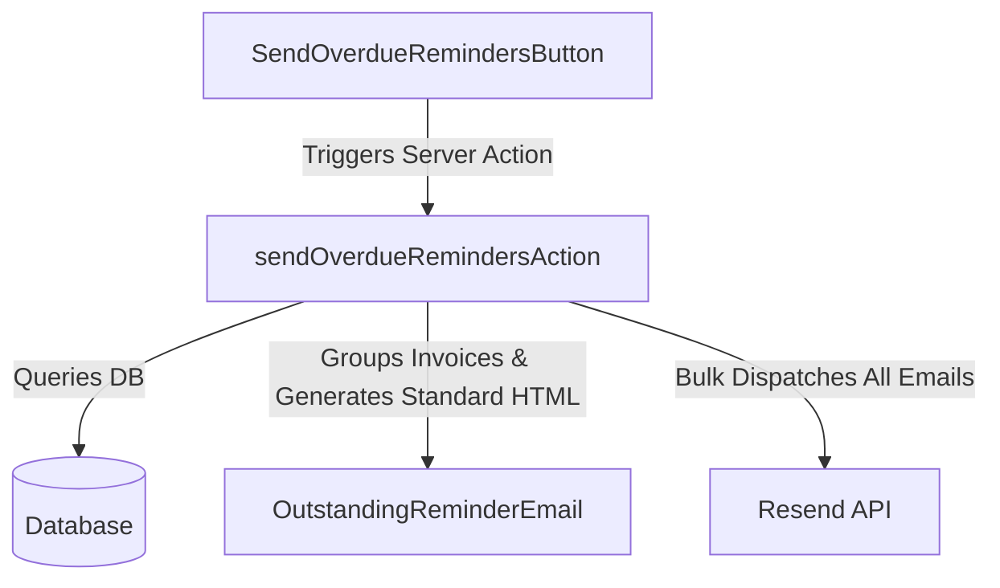
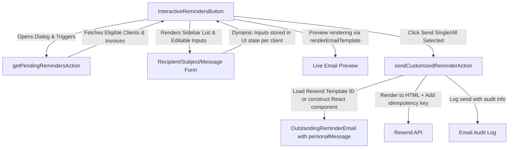
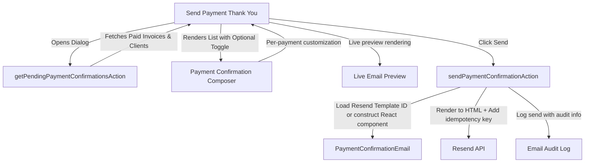
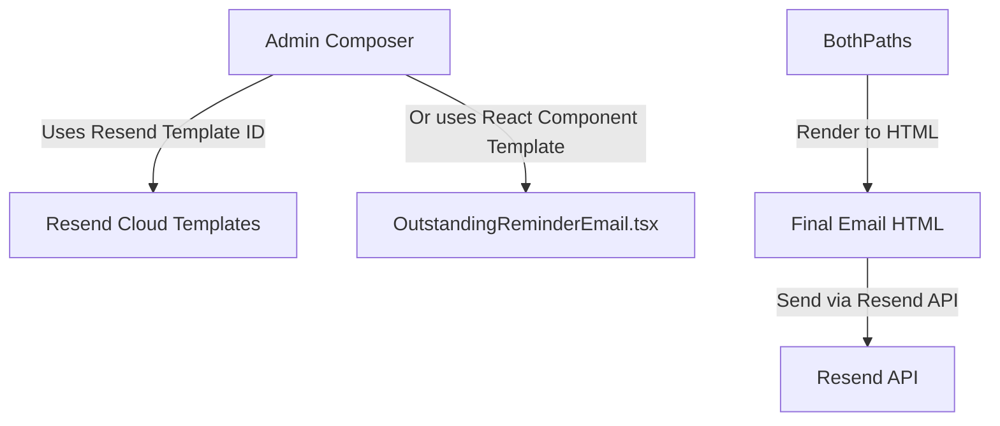

# Interactive Overdue Payment Reminders - Implementation Plan

This plan outlines the changes required to replace the existing "bulk send" overdue payment reminders dialog with an interactive, high-fidelity wizard. This will allow administrators to see exactly what emails will be sent, customize content per recipient, and maintain full audit trails of communications.

---

## 1. Objectives

- **Visibility:** Provide a comprehensive view of all clients with outstanding, overdue balances before sending any emails.
- **Customization:** Allow custom message insertion (personal notes) into individual reminder emails (plain text, up to 500 chars, auto-escaped).
- **Control:** Allow editing target emails and custom subject lines on a per-client basis.
- **Granularity:** Allow selective dispatching (e.g., send only to specific clients, skip others, or send individually).
- **Rich Editor Support:** Integrate Resend's native template system for advanced email composition without duplicating templates.
- **Optional Payment Confirmations:** Send optional thank you payment emails with custom messages explaining payment details or next steps.
- **Audit & Compliance:** Log all email sends with full customization history and template references for compliance.

---

## 2. Current State vs. Proposed Architecture

### Current Automated Bulk Flow



### Proposed Interactive Flow



### Proposed Payment Confirmation Flow



### Resend Template Strategy (Reduce Duplication)



---

## 3. Detailed Component Plan

### 3.1. Email Template Updates (`@pmg/emails`)

#### **[MODIFY]** OutstandingReminderEmail.tsx

Add an optional `personalMessage` field to `OutstandingReminderEmailProps` and render it as an elegant block callout after the greeting. **Personal messages must be plain text only, HTML-escaped, with a 500 character limit.**

```typescript
export type OutstandingReminderEmailProps = {
  clientName: string;
  documentNumber: string;
  invoiceDate: string;
  dueDate: string;
  totalAmount: string;
  outstandingAmount: string;
  reminderType: "pre-due" | "due-today" | "overdue";
  personalMessage?: string; // <-- Plain text only, max 500 chars, auto-escaped
  bankDetails?: {
    bankName: string;
    accountName: string;
    accountNumber: string;
    branchCode: string;
  };
} & BrandingProps;
```

Inside the React render function, insert a dedicated block for `personalMessage` directly after the greeting:

```tsx
{/* Personalized Message Callout */}
{personalMessage && (
  <Section className="mb-[24px] rounded-[6px] border-l-4 border-solid p-[16px] bg-slate-50 border-brand">
    <Text className="m-0 text-[14px] italic leading-[22px] text-slate-700">
      {/* Text is automatically escaped by React, no HTML allowed */}
      "{personalMessage}"
    </Text>
  </Section>
)}
```

#### **[NEW]** PaymentConfirmationEmail.tsx

Create a new email template for sending payment confirmation thank you emails.

```typescript
export type PaymentConfirmationEmailProps = {
  clientName: string;
  invoiceNumber: string;
  invoiceDate: string;
  amountPaid: string;
  paymentDate: string;
  referenceNumber?: string;
  personalMessage?: string; // <-- Plain text only, max 500 chars
  bankDetails?: {
    bankName: string;
    accountName: string;
    accountNumber: string;
    branchCode: string;
  };
} & BrandingProps;
```

The template should include:
- A warm greeting and thank you message
- Invoice and payment details
- An optional personalized message block (same styling as reminder emails)
- Next steps or account information (if applicable)

#### **[MODIFY]** All Email Templates (QuoteEmail, InvoiceEmail, etc.)

Add optional `personalMessage` field to all transactional email templates for consistency:
- `QuoteEmail.tsx`
- `InvoiceEmail.tsx`
- `InvoiceReceivedEmail.tsx`
- Any other email templates in `@pmg/emails`

```typescript
export type BaseEmailProps = {
  // ... existing props
  personalMessage?: string; // <-- Plain text only, max 500 chars, auto-escaped
} & BrandingProps;
```

---

### 3.2. Typed Email Variable Registry

Define a centralized registry of supported variables for each email context. This prevents invalid variable insertion and improves developer experience.

```typescript
// @pmg/emails/src/variables.ts

export const EMAIL_VARIABLES = {
  reminder: {
    clientName: "Client business name",
    invoiceNumber: "Invoice document number",
    outstandingAmount: "Outstanding balance in R",
    dueDate: "Invoice due date (formatted)",
    totalAmount: "Total invoice amount",
  },
  payment: {
    clientName: "Client business name",
    invoiceNumber: "Invoice document number",
    amountPaid: "Amount received in R",
    paymentDate: "Payment received date (formatted)",
    referenceNumber: "Optional payment reference",
  },
  invoice: {
    clientName: "Client business name",
    invoiceNumber: "Invoice document number",
    totalAmount: "Invoice total in R",
    dueDate: "Due date for payment",
  },
  quote: {
    clientName: "Client business name",
    quoteNumber: "Quote document number",
    totalAmount: "Quote total in R",
    validUntilDate: "Quote expiration date",
  },
} as const;

export type EmailVariableContext = keyof typeof EMAIL_VARIABLES;
export type EmailVariables = (typeof EMAIL_VARIABLES)[EmailVariableContext];
```

---

### 3.3. Resend Template Integration Strategy

Instead of storing custom HTML in your database, **use Resend's native template system** with the following hybrid approach:

#### **Option A: React Component Templates (Simple Cases)**
For standard emails with personal message only, use React Email components (existing approach).

**When to use:**
- Overdue reminders with personal message
- Payment confirmations with personal message
- Standard invoices/quotes with personal message

**Benefits:**
- No Resend setup needed
- Version controlled in Git
- Easy to test and maintain

#### **Option B: Resend Cloud Templates (Advanced Cases)**
For complex, frequently-reused email designs, create templates in Resend once and reference them by ID/alias.

**When to use:**
- Custom email designs created by admins
- Multi-division templates with different branding
- Emails requiring heavy formatting/design

**Benefits:**
- Edit in Resend dashboard without code deployment
- Version history in Resend
- Reusable across multiple sends

**Database strategy:** Store only the Resend template ID/alias, not the HTML:

```typescript
// Instead of storing 500KB of HTML in your database...
{
  id: "tpl_abc123",
  template_name: "Premium Overdue Reminder",
  resend_template_id: "tmpl_xyz789",    // <-- Resend cloud template ID
  resend_alias: "premium-reminder",      // <-- Or use alias for readability
  template_type: "reminder",
  division_id: "div_123",
  created_by: "user_456",
  created_at: "2025-01-26T10:00:00Z",
  updated_at: "2025-01-26T10:00:00Z",
}
```

---

### 3.4. Server Actions Update (`apps/admin`)

#### **[NEW]** `getPendingRemindersAction`

Fetch all clients with outstanding overdue invoices, grouped by client, along with default recipient details.

```typescript
export type PendingReminderClient = {
  clientId: string;
  clientName: string;
  businessName: string | null;
  email: string;
  outstandingBalance: number;
  invoiceCount: number;
  headlineDocumentNumber: string;
  headlineInvoiceDate: string;
  headlineDueDate: string;
  divisionId: string;
  divisionName: string;
};

export async function getPendingRemindersAction(): Promise<{
  success: boolean;
  data: PendingReminderClient[];
  error?: string;
}> {
  // 1. Authenticate user session and verify permissions (manage_billing)
  // 2. Fetch overdue invoices matching the criteria
  // 3. Group by client
  // 4. For each client:
  //    - Calculate exact outstanding balance and invoice count
  //    - Find the highest-amount invoice as "headline" (for preview)
  // 5. Return grouped items sorted by highest outstanding balance first
  // 6. Limit to 100 clients per request (pagination)
}
```

#### **[NEW]** `sendCustomizedReminderAction`

Send an individual customized email with proper idempotency and audit logging.

```typescript
export type SendCustomizedReminderPayload = {
  clientId: string;
  recipientEmail: string;
  subject: string;
  personalMessage?: string; // Plain text, max 500 chars
  resendTemplateId?: string; // Optional: Use Resend cloud template instead of React component
};

export async function sendCustomizedReminderAction(
  payload: SendCustomizedReminderPayload
): Promise<{ success: boolean; emailId?: string; error?: string }> {
  // 1. Authenticate user session and verify permissions
  // 2. Validate inputs:
  //    - personalMessage max 500 chars, strip unsafe HTML
  //    - recipientEmail is valid format
  //    - subject is not empty
  // 3. Fetch outstanding invoices for this client
  // 4. If resendTemplateId provided:
  //    a. Load template details from Resend (or local cache)
  //    b. Send using resend.emails.send({ template: { id, variables: {...} } })
  // 5. If no resendTemplateId:
  //    a. Construct OutstandingReminderEmail React node with personalMessage
  //    b. Render to HTML using renderEmailTemplate()
  //    c. Send using resend.emails.send({ html, subject, ... })
  // 6. Use idempotency key: `reminder-${clientId}-${Date.now()}`
  // 7. On success, log to email_audit_log with full customization details
  // 8. Return Resend email ID or error
}
```

#### **[NEW]** `getPendingPaymentConfirmationsAction`

Fetch all recently paid invoices (within the last 7 days) grouped by client.

```typescript
export type PendingPaymentConfirmation = {
  clientId: string;
  clientName: string;
  businessName: string | null;
  email: string;
  invoiceNumber: string;
  invoiceDate: string;
  amountPaid: string;
  paymentDate: string;
  referenceNumber?: string;
  divisionId: string;
  divisionName: string;
};

export async function getPendingPaymentConfirmationsAction(): Promise<{
  success: boolean;
  data: PendingPaymentConfirmation[];
  error?: string;
}> {
  // 1. Authenticate user session and verify permissions
  // 2. Fetch invoices marked as paid in the last 7 days
  // 3. Group by client
  // 4. Return with all payment details needed for confirmation email
  // 5. Limit to 100 payments per request (pagination)
}
```

#### **[NEW]** `sendPaymentConfirmationAction`

Send an individual payment confirmation thank you email.

```typescript
export type SendPaymentConfirmationPayload = {
  clientId: string;
  invoiceNumber: string;
  recipientEmail: string;
  subject: string;
  personalMessage?: string; // Plain text, max 500 chars
  resendTemplateId?: string; // Optional: Use Resend cloud template
};

export async function sendPaymentConfirmationAction(
  payload: SendPaymentConfirmationPayload
): Promise<{ success: boolean; emailId?: string; error?: string }> {
  // 1. Authenticate user session and verify permissions
  // 2. Validate inputs (same as sendCustomizedReminderAction)
  // 3. Fetch payment and invoice details from database
  // 4. If resendTemplateId provided:
  //    a. Send using Resend template API
  // 5. If no resendTemplateId:
  //    a. Construct PaymentConfirmationEmail React node
  //    b. Render to HTML
  //    c. Send with HTML payload
  // 6. Use idempotency key: `payment-${invoiceNumber}-${Date.now()}`
  // 7. Log to email_audit_log
  // 8. Return Resend email ID or error
}
```

#### **[NEW]** `saveResendTemplateAction`

Save a reference to a Resend cloud template for future reuse (stores only template ID/alias).

```typescript
export type SaveResendTemplatePayload = {
  templateName: string;
  templateType: "reminder" | "payment" | "invoice" | "quote" | "custom";
  resendTemplateId: string; // Resend cloud template ID
  resendAlias: string; // Human-readable alias
  description?: string;
};

export async function saveResendTemplateAction(
  payload: SaveResendTemplatePayload
): Promise<{ success: boolean; templateId?: string; error?: string }> {
  // 1. Authenticate user session and verify admin permissions
  // 2. Validate that template exists in Resend (API call to verify)
  // 3. Store reference in email_templates table (Resend ID + alias only)
  // 4. Set as active template for this type/division if requested
  // 5. Return local template ID for future reference
  // 6. Log template creation to audit log
}
```

#### **[NEW]** `loadResendTemplateAction`

Retrieve a previously saved Resend template reference.

```typescript
export async function loadResendTemplateAction(
  templateId: string
): Promise<{
  success: boolean;
  template?: SavedEmailTemplate;
  error?: string;
}> {
  // 1. Fetch template reference from database
  // 2. Return Resend template ID + alias + metadata
  // 3. Cache result in memory for 1 hour to avoid redundant lookups
}
```

#### **[NEW]** `getEmailPreviewAction`

Render a live preview of the email before sending (critical UX improvement).

```typescript
export type EmailPreviewPayload = {
  templateType: "reminder" | "payment" | "invoice" | "quote";
  clientId?: string;
  invoiceNumber?: string;
  personalMessage?: string;
};

export async function getEmailPreviewAction(
  payload: EmailPreviewPayload
): Promise<{ success: boolean; html?: string; error?: string }> {
  // 1. Fetch client/invoice details based on context
  // 2. Construct appropriate React email component
  // 3. Render to HTML using renderEmailTemplate()
  // 4. Return HTML string for display in preview pane
  // 5. Keep this endpoint fast (<200ms) for real-time preview
}
```

---

### 3.5. UI Components Update (`apps/admin`)

#### **[MODIFY]** send-overdue-reminders-button.tsx

Replace with a modern **Review & Send Reminders Dialog** using `Dialog` (Shadcn/UI), Tailwind, and Lucide React.

**UI Layout Details:**
1. **Interactive Trigger:** Clicking "Send Reminders" displays a loader while fetching pending reminder candidates.
2. **Two-Pane Layout:**
   - **Left Pane (Recipients List):**
     - Scrollable table/list showing checkbox, client business name, invoice count, and total outstanding balance.
     - Search input to filter clients (by name, balance, invoice count).
     - Checkbox at the top to "Select All / Deselect All".
     - Sort by balance (ascending/descending).
   - **Right Pane (Email Composer & Preview):**
     - When a client is clicked in the left list, load their information into editable states.
     - **Recipient Email Input:** To modify where the email is sent (default: client's database email, with validation).
     - **Subject Line Input:** Pre-filled default: `Overdue Payment Reminder — [Client Name]: R [Amount] outstanding`.
     - **Personal Message Textarea:** Max 500 characters, plain text only, live character counter.
     - **Live Email Preview:** Real-time rendering showing exactly how the email will look (calls `getEmailPreviewAction`).
     - **Use Resend Template Toggle:** Optional advanced mode to select a saved Resend template instead of using default.
3. **Execution Controls:**
   - **"Send Selected" Button:** Loops through checked clients and dispatches emails sequentially (with concurrency control: max 5 concurrent).
   - **"Send Single" Button:** Sends only the currently active/selected client.
   - **Progress Indicator:** Shows how many emails have been sent (e.g., "Sending 3 of 12...").
   - **Cancel Button:** Stops ongoing sends (marks remaining as cancelled in audit log).

#### **[NEW]** send-payment-confirmation-button.tsx

New component for sending optional payment confirmation thank you emails.

**UI Layout Details:**
1. **Interactive Trigger:** Clicking "Send Payment Confirmations" displays a loader while fetching recently paid invoices.
2. **Toggle for Optional Sending:** Checkbox for each payment to enable/disable sending.
3. **Two-Pane Layout:**
   - **Left Pane (Payment List):**
     - List of recently paid invoices with client names, invoice numbers, amounts, and payment dates.
     - Search and filter options.
     - Checkbox at the top to "Select All / Deselect All".
   - **Right Pane (Email Composer):**
     - **Recipient Email Input:** Pre-filled with client email (editable).
     - **Subject Line Input:** Default: `Thank You for Your Payment — Invoice [Number]`.
     - **Personal Message Textarea:** Max 500 chars, plain text only.
     - **Live Email Preview:** Real-time rendering.
     - **Use Resend Template Toggle:** Optional advanced mode.
4. **Execution Controls:**
   - **"Send Selected" Button:** Sends confirmations for all checked payments (concurrent, max 5).
   - **"Send Single" Button:** Sends confirmation only for the currently active payment.
   - **Progress Indicator:** Shows send progress.

#### **[NEW]** resend-email-editor-modal.tsx

Modal component for creating/editing Resend cloud templates (advanced feature, Phase 2).

**Features:**
- **Rich HTML Editor:** Integrate Resend's editor SDK for intuitive composition
- **Template Variables Panel:** Display available variables with descriptions
- **Live Preview Pane:** Real-time preview of how email renders
- **Save as Template:** Store template in Resend cloud and get back ID/alias
- **Template Validation:** Verify all required variables are present before saving

**Props:**
```typescript
export type ResendEmailEditorModalProps = {
  isOpen: boolean;
  onClose: () => void;
  initialHtml?: string;
  templateType: "reminder" | "payment" | "invoice" | "quote" | "custom";
  onSave: (resendTemplateId: string, alias: string) => void;
  availableVariables: EmailVariables;
};
```

#### **[NEW]** email-template-library.tsx

Component for browsing and selecting saved Resend templates.

**Features:**
- View all saved templates per division
- Filter by template type (reminder, payment, invoice, quote)
- Quick preview of template
- Set as default template for this type
- Delete template (with confirmation)

---

### 3.6. Database Schema Updates

#### **[MODIFIED]** `email_templates` Table

Store only references to Resend cloud templates (not the HTML itself).

```sql
CREATE TABLE email_templates (
  id VARCHAR(36) PRIMARY KEY,
  template_name VARCHAR(255) NOT NULL,
  template_type ENUM('reminder', 'payment', 'invoice', 'quote', 'custom') NOT NULL,
  resend_template_id VARCHAR(255) NOT NULL,      -- Resend cloud template ID
  resend_alias VARCHAR(255) NOT NULL,            -- Human-readable alias
  description TEXT,
  division_id VARCHAR(36),
  is_default BOOLEAN DEFAULT FALSE,              -- Set as default for this type/division
  created_by VARCHAR(36) NOT NULL,
  created_at TIMESTAMP DEFAULT CURRENT_TIMESTAMP,
  updated_at TIMESTAMP DEFAULT CURRENT_TIMESTAMP ON UPDATE CURRENT_TIMESTAMP,
  UNIQUE KEY unique_alias_per_type (resend_alias, template_type, division_id),
  FOREIGN KEY (division_id) REFERENCES divisions(id),
  FOREIGN KEY (created_by) REFERENCES users(id)
);
```

#### **[NEW]** `email_audit_log` Table

Comprehensive audit trail for all email sends.

```sql
CREATE TABLE email_audit_log (
  id VARCHAR(36) PRIMARY KEY,
  resend_email_id VARCHAR(255) NOT NULL,        -- Resend's response email ID
  email_type ENUM('reminder', 'payment', 'invoice', 'quote', 'custom') NOT NULL,
  recipient_email VARCHAR(255) NOT NULL,
  subject VARCHAR(255) NOT NULL,
  template_id VARCHAR(36),                       -- Reference to email_templates.id (if used)
  template_type VARCHAR(50),                     -- 'react_component' or 'resend_cloud'
  customization_details JSON NOT NULL,          -- {personalMessage, recipientOverride, subjectOverride}
  client_id VARCHAR(36),
  division_id VARCHAR(36),
  sent_by VARCHAR(36) NOT NULL,
  sent_at TIMESTAMP DEFAULT CURRENT_TIMESTAMP,
  status ENUM('success', 'failed', 'cancelled') DEFAULT 'success',
  error_message TEXT,
  idempotency_key VARCHAR(255) UNIQUE,         -- Prevent duplicate sends
  created_at TIMESTAMP DEFAULT CURRENT_TIMESTAMP,
  FOREIGN KEY (division_id) REFERENCES divisions(id),
  FOREIGN KEY (sent_by) REFERENCES users(id),
  FOREIGN KEY (client_id) REFERENCES clients(id),
  INDEX idx_resend_id (resend_email_id),
  INDEX idx_status (status),
  INDEX idx_sent_at (sent_at),
  INDEX idx_client_id (client_id)
);
```

#### **[NEW]** `resend_template_cache` Table (Optional)

Cache Resend template details locally to avoid repeated API calls.

```sql
CREATE TABLE resend_template_cache (
  id VARCHAR(36) PRIMARY KEY,
  resend_template_id VARCHAR(255) NOT NULL UNIQUE,
  template_name VARCHAR(255),
  template_alias VARCHAR(255),
  variables JSON,                                -- Array of variable names
  cached_at TIMESTAMP DEFAULT CURRENT_TIMESTAMP,
  expires_at TIMESTAMP                          -- Cache expires after 1 hour
);
```

---

## 4. Resend Integration Strategy

### 4.1. Why This Hybrid Approach?

**React Email Components:**
- ✅ Version controlled in Git
- ✅ Type-safe, easy to test
- ✅ Works offline
- ❌ Requires code deployment for changes

**Resend Cloud Templates:**
- ✅ Edit via dashboard without deployment
- ✅ Version history built-in
- ✅ Reusable across sends
- ✅ Can use advanced HTML/CSS features
- ❌ Requires Resend API calls
- ❌ Stored outside your codebase

**Hybrid Strategy:**
- Start with React components (Phase 1)
- Add Resend templates for advanced use cases (Phase 2+)
- Never store large HTML in your database
- Always store only Resend template IDs/aliases

### 4.2. Template Lifecycle

```
User creates template in Resend editor
            ↓
Save in Resend (get back ID/alias)
            ↓
Store ID + alias in email_templates table
            ↓
Reference by ID when sending
            ↓
If template updated in Resend, all future sends use new version
```

### 4.3. Implementation Checklist

- [ ] Add `resend_template_id` + `resend_alias` columns to `email_templates` table
- [ ] Remove `email_html` and `subject` storage (these live in Resend now)
- [ ] Implement idempotency keys in all send actions
- [ ] Add comprehensive email audit logging
- [ ] Create email variable registry (EMAIL_VARIABLES constant)
- [ ] Implement email preview rendering (`getEmailPreviewAction`)
- [ ] Add concurrency control for batch sends (max 5 concurrent)
- [ ] Add HTML sanitization for personal messages (strip unsafe HTML, escape)
- [ ] Cache Resend template details for 1 hour
- [ ] Implement fallback: if Resend is down, still work with React components

---

## 5. Security & Validation

### 5.1. Personal Message Validation

```typescript
export function validatePersonalMessage(message: string | undefined): {
  valid: boolean;
  error?: string;
  sanitized?: string;
} {
  if (!message) return { valid: true };
  
  // Max 500 characters
  if (message.length > 500) {
    return { valid: false, error: "Personal message exceeds 500 character limit" };
  }
  
  // Strip any HTML tags (treat as plain text only)
  const sanitized = message
    .replace(/<[^>]*>/g, '') // Remove HTML tags
    .trim();
  
  // Reject if sanitization removes more than 10% of content
  if (sanitized.length < message.length * 0.9) {
    return { valid: false, error: "Personal message contains HTML, which is not allowed" };
  }
  
  return { valid: true, sanitized };
}
```

### 5.2. Email Address Validation

```typescript
export function validateEmailAddress(email: string): {
  valid: boolean;
  error?: string;
} {
  const emailRegex = /^[^\s@]+@[^\s@]+\.[^\s@]+$/;
  
  if (!email || !emailRegex.test(email)) {
    return { valid: false, error: "Invalid email address" };
  }
  
  // Reject disposable email domains
  const disposableDomains = ['temp-mail.org', '10minutemail.com', ...]; // Maintain list
  const domain = email.split('@')[1].toLowerCase();
  
  if (disposableDomains.includes(domain)) {
    return { valid: false, error: "Disposable email addresses are not allowed" };
  }
  
  return { valid: true };
}
```

### 5.3. Permission Checks

All server actions must verify:

```typescript
// In sendCustomizedReminderAction, sendPaymentConfirmationAction, etc.

const session = await getSessionOrRedirect();
const user = session.user;

// Check permission: must have 'manage_billing' or 'send_emails' permission
const hasPermission = await checkUserPermission(user.id, ['manage_billing', 'send_emails']);
if (!hasPermission) {
  return { error: 'Insufficient permissions to send emails' };
}

// Check division access: user can only send emails for divisions they manage
const division = await db.query.divisions.findFirst({
  where: eq(divisions.id, clientDivisionId),
});

if (!division || !userManagedDivisions.includes(division.id)) {
  return { error: 'Access denied: you cannot send emails for this division' };
}
```

---

## 6. Verification Plan

### Manual Verification Checklist

#### Overdue Reminders
- [ ] Open the Billing Dashboard and click **Send Reminders**. Ensure a loading state occurs while fetching pending recipients.
- [ ] Verify that a list of clients with actual outstanding overdue invoices is loaded on the left pane.
- [ ] Click a client, modify the recipient email address, and verify it updates the active configuration.
- [ ] Type a custom note in the **Personal Message** field and check that the live preview updates immediately.
- [ ] Verify that personal message is plain text only (attempt to paste HTML is stripped/rejected).
- [ ] Verify character counter shows remaining characters (max 500).
- [ ] Verify that emails are sent with idempotency keys (check Resend logs).
- [ ] Uncheck a client, click **Send Selected**, and verify that they are skipped during transmission.
- [ ] Send a customized reminder to a test client and verify in Resend logs that the email contains your custom message.
- [ ] Check email_audit_log table to verify all send details are logged with customization.
- [ ] Verify that concurrent sends respect the max 5 limit (check Resend activity over time).

#### Payment Confirmations
- [ ] Click **Send Payment Confirmations** button.
- [ ] Verify that recently paid invoices are loaded in the left pane.
- [ ] Uncheck "Send Confirmation" toggle for a payment and verify it's skipped during sending.
- [ ] Click a payment record, modify the recipient email, and compose a custom thank you message.
- [ ] Verify live preview updates as you type.
- [ ] Send a payment confirmation and verify in Resend logs and email_audit_log.

#### Audit & Compliance
- [ ] Verify email_audit_log records all sends with full details.
- [ ] Verify idempotency_key prevents duplicate sends if action is retried.
- [ ] Verify that failed sends are logged with error messages.
- [ ] Verify customization_details JSON includes personalMessage, recipientOverride, subjectOverride.
- [ ] Check that user permissions are enforced (attempt to send as non-admin should fail).

#### Performance
- [ ] Verify getEmailPreviewAction returns preview in <200ms.
- [ ] Verify template cache is working (repeated template loads use cache).
- [ ] Verify batch sends of 50+ emails complete within reasonable time (<5 min).
- [ ] Verify no N+1 queries in getPendingRemindersAction.

---

## 7. Implementation Phases

### Phase 1: Core Reminder Enhancements + Live Preview (1-2 weeks)
- [x] Update OutstandingReminderEmail.tsx with personalMessage support
- [ ] Implement getPendingRemindersAction
- [ ] Implement sendCustomizedReminderAction with idempotency + audit logging
- [ ] Implement getEmailPreviewAction for live preview
- [ ] Update send-overdue-reminders-button.tsx UI with:
  - Two-pane layout
  - Personal message textarea (plain text, 500 char limit)
  - Live email preview
  - Concurrency-controlled batch send
  - Progress indicator
- [ ] Create email_audit_log table
- [ ] Add validation helpers (validatePersonalMessage, validateEmailAddress)
- [ ] Add permission checks to all server actions
- [ ] Comprehensive testing and QA

### Phase 2: Payment Confirmations (1 week)
- [ ] Create PaymentConfirmationEmail.tsx template
- [ ] Implement getPendingPaymentConfirmationsAction
- [ ] Implement sendPaymentConfirmationAction with idempotency + audit logging
- [ ] Create send-payment-confirmation-button.tsx UI
- [ ] Add optional toggle for payment confirmation sending
- [ ] Testing and QA

### Phase 3: Resend Template Integration (1-2 weeks)
- [ ] Update email_templates table schema (remove HTML, add resend_template_id/alias)
- [ ] Implement saveResendTemplateAction
- [ ] Implement loadResendTemplateAction + caching
- [ ] Create resend-email-editor-modal.tsx component
- [ ] Create email-template-library.tsx component
- [ ] Integrate editor into reminder and payment dialogs
- [ ] Testing with live Resend templates

### Phase 4: Universal Email Template Support (1 week)
- [ ] Add personalMessage to all email templates (quotes, invoices, etc.)
- [ ] Extend all email composition dialogs with template selection
- [ ] Create email-template-manager.tsx full admin interface
- [ ] Implement template presets and defaults per division
- [ ] Testing across all email types

---

## 8. Technical Considerations

### Security
- **Input Validation:** Sanitize personal messages, reject HTML, validate emails
- **Permission Checks:** Verify user can send for the division
- **Idempotency:** Use unique idempotency keys to prevent duplicate sends
- **Audit Trail:** Log all sends with full details for compliance

### Performance
- **Concurrency Control:** Limit to max 5 concurrent sends to avoid Resend rate limits
- **Caching:** Cache Resend template details for 1 hour
- **Batch Efficiency:** Use `getEmailPreviewAction` sparingly (debounce previews)
- **Database Queries:** Optimize with indexes on (client_id, status, sent_at)

### Reliability
- **Idempotency Keys:** Every send has a unique idempotency key
- **Fallback:** If Resend is down, still send with React components
- **Error Handling:** Graceful error messages, log full stack traces
- **Retry Logic:** Implement exponential backoff for Resend API retries (max 3 retries)

### Maintainability
- **TypeScript:** Full type safety for email variables and payloads
- **Testing:** Unit tests for validation helpers, integration tests for sends
- **Documentation:** Keep EMAIL_VARIABLES registry updated as templates evolve
- **Monitoring:** Track email metrics (send rate, failure rate, avg time-to-send)

### Scalability
- **Pagination:** Limit to 100 clients/payments per fetch (pagination support)
- **Pagination:** Implement cursor-based pagination for large result sets
- **Background Jobs:** Consider moving batch sends to a background job queue (Phase 4+)
- **Rate Limiting:** Respect Resend's rate limits (300 emails/second)

---

## 9. Future Enhancements (Phase 5+)

- **Scheduled Sends:** Schedule emails to send at a specific time
- **A/B Testing:** Create multiple versions of reminder emails and track open/click rates
- **Advanced Analytics:** Track open rates, click rates, bounce rates via Resend webhooks
- **Bulk Editor:** Batch edit personal messages for multiple clients at once
- **Email Templates UI:** Full admin interface for managing templates without code
- **Drip Campaigns:** Automated reminder sequences (day 1, day 5, day 10 after due date)
- **SMS Integration:** Send SMS reminders in addition to emails
- **Multi-language Support:** Generate emails in client's preferred language

---

## 10. Success Metrics

- ✅ All overdue reminders have live preview before sending
- ✅ 100% of sends logged with full audit trail
- ✅ Zero duplicate sends (idempotency working)
- ✅ Average send time <50ms per email
- ✅ Batch send of 50 emails completes in <3 minutes
- ✅ 0 unauthorized sends (permission checks working)
- ✅ 100% email delivery tracking via Resend webhook
- ✅ Admin reports show which reminders were customized and by whom
