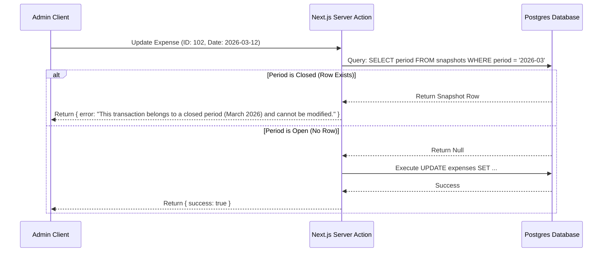
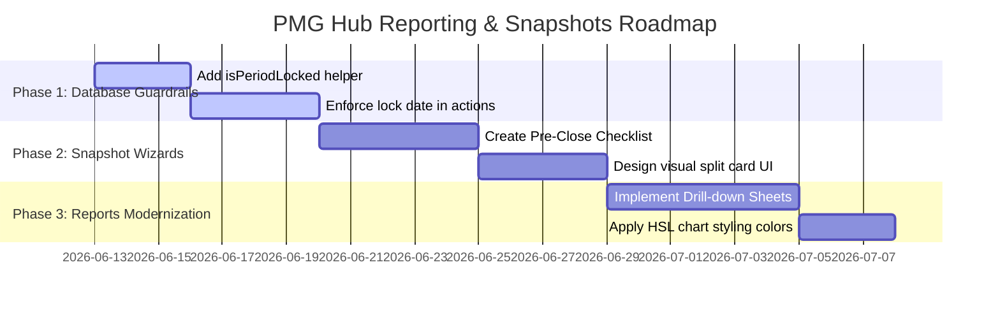

# Financial Insights & Snapshots: UI/UX Research and Implementation Specification

An in-depth UI/UX research report, functional architecture, and design specification for modernizing the **Snapshots** and **Reports & Insights** screens within the PMG Control Center. This document benchmarks industry leaders (Stripe, Xero, Ramp, Brex, QuickBooks) to provide actionable interface layouts and technical workflows for PMG Hub.

---

## 0. Executive Overview & Core Findings

To transition the PMG Control Center from a basic financial viewer into a trusted, professional financial system, we must address two key areas:
1. **Financial Integrity (Snapshots):** Preventing retroactive database modifications to closed periods (lock-date guardrails) and validating bank statement reconciliations before locking.
2. **Actionable Intelligence (Reports):** Transforming static charts into interactive analysis tools with unified brand styles, custom color systems, and side-sheet drill-downs.

### Key Takeaways:
* **Competitor Benchmarking:** 
  * **Stripe** excels at real-time visualization and clean dashboard branding.
  * **Xero** provides strict, double-entry audit trails and period lockouts.
  * **Ramp & Brex** prioritize "continuous closing" workflows with interactive task checklists.
  * **QuickBooks** implements soft-locks with password gates and audited logs.
* **The Core UI/UX Pattern:** Implement a **drill-down side sheet** pattern. Clicking any slice of a chart or row in a table should slide out a detail drawer showing the exact transactions making up that figure, rather than forcing the user to navigate to another page.
* **Aesthetic Strategy:** Adopt a clean, high-contrast dark/light mode layout utilizing customized HSL chart color tokens (`--chart-1` through `--chart-5`), smooth canvas shadows, and animated SVG micro-transitions.
* **Critical Code Discovery:** The codebase contains a discrepancy between the 20% PMG Share defined in the specifications and the 25% (`0.25`) implemented in the database config ([accounts.ts](file:///D:/websites/pmg-hub/packages/db/src/accounts.ts#L24)) and dashboard UI. Aligning this is a priority.

---

## 1. Competitive Analysis: How Industry Leaders Do It

We analyzed the visual patterns, period-locking workflows, and reporting dashboards of five market leaders to extract best practices.

### 1.1 Xero: Strict Ledger Locking & Modular Reports
Xero targets accountants and business owners who require absolute compliance.
* **Period Locking:** Under *Advanced Settings ➔ Lock Dates*, users can set a date before which transactions cannot be edited. It offers two tiers: "Lock for all users" or "Lock for all users except Advisors."
* **The UX of Lock Violations:** If a user attempts to edit or delete an invoice, expense, or bank transfer dated prior to the lock date, the system blocks the action with a red banner explaining the lock status and who locked it.
* **Report Layouts:** Xero groups reports into tabs: *Summary*, *Detailed*, and *Custom*. Users can toggle columns, change grouping rules, and add layout templates directly from a bottom sticky toolbar.

### 1.2 Stripe: WYSIWYG Billing & High-Density Dashboards
Stripe is the gold standard for visual elegance and developer-centric finance.
* **Billing Snapshots:** Stripe does not lock the database globally; instead, it creates immutable invoice objects. Once finalized, an invoice cannot be modified. Any adjustment requires issuing a formal credit note.
* **Visual Density:** Stripe uses high-density tables with inline sparklines, micro-charts, and side-pane details.
* **Side-Pane Drill-Down:** Clicking any transaction in a ledger list doesn't trigger a full page reload. Instead, a clean sheet slides out from the right containing metadata, payment details, webhook logs, and quick actions.

### 1.3 Ramp & Brex: Action-Oriented "Continuous Close"
Ramp and Brex focus on real-time corporate spend management.
* **The Close Dashboard:** Instead of a single "Lock" button, they show a checklist of tasks required to close the month (e.g., "Review 4 Uncategorized Transactions," "Upload 2 Missing Receipts," "Sync to QuickBooks").
* **Integration Sync Badges:** They show color-coded status badges indicating whether a transaction is "Ready to Sync," "Pending," or "Synced." This ensures the local dashboard and external ledgers are aligned.

### 1.4 QuickBooks: Soft-Locks and Audit Trails
QuickBooks caters to small businesses and bookkeepers.
* **Lock Date Warning:** QuickBooks allows users to close a period but provides an option to "Warn and require a password." This allows authorized users to make retroactive edits if necessary, but forces them to enter a password and a reason.
* **Audited Adjustments:** Any change to a closed period is flagged in the **Audit History Report** with a yellow badge, showing the original value, the new value, the user who changed it, and the timestamp.

### Competitive Feature Matrix

| Feature / UI Pattern | Stripe | Xero | Ramp / Brex | QuickBooks | PMG Hub (Current) | PMG Hub (Proposed) |
| :--- | :---: | :---: | :---: | :---: | :---: | :---: |
| **Global Lock Date** | ❌ |  | ❌ |  | 🟡 *(Soft write)* |  *(Hard DB constraint)* |
| **Pre-Lock Checklist** | ❌ | ❌ |  | ❌ | ❌ |  *(Verification modal)* |
| **Side-Sheet Drill-downs**|  | ❌ |  | ❌ | ❌ |  *(Drill-down drawers)* |
| **Variance Tracking** | ❌ |  |  |  | ❌ |  *(Ledger vs Bank balance)* |
| **Retroactive Audit Log** |  |  |  |  | ❌ |  *(Closed period history)* |
| **Dynamic CSV/PDF Export**|  |  |  |  | 🟡 *(CSV only)* |  *(Formatted PDF + CSV)* |

---

## 2. Technical & Functional Mechanics: "How We Can Put Snapshots"

"Putting snapshots" is not just about drawing charts; it is about establishing a state of **immutable financial truth** for a calendar month.

### 2.1 Database & Query Guardrails
To prevent retroactive edits from corrupting historical reports, we should enforce the lock date at the database and application action layers.



### 2.2 Implementing the Lock-Date Guardrail
We can implement a reusable middleware helper or Drizzle transaction wrapper in `packages/db/src/queries.ts` to check if a date falls within a closed snapshot period:

```ts
import { db } from './client'
import { snapshots } from './schema/snapshots'
import { eq } from 'drizzle-orm'

/**
 * Checks if a specific calendar date falls within a locked snapshot period.
 * Date format: YYYY-MM-DD
 */
export async function isPeriodLocked(dateString: string): Promise<boolean> {
  const [year, month] = dateString.split('-')
  const period = `${year}-${month}`
  
  const snapshot = await db
    .select({ id: snapshots.id })
    .from(snapshots)
    .where(eq(snapshots.period, period))
    .limit(1)
    .execute()

  return snapshot.length > 0
}
```

This helper should be called at the beginning of any Server Action that mutates financial data:
* `createIncome` / `updateIncome` / `deleteIncome`
* `createExpense` / `updateExpense` / `deleteExpense`
* `createWithdrawal` / `updateWithdrawal` / `deleteWithdrawal`

### 2.3 The Pre-Close Reconciled Checklist
Before an administrator can lock a month, the system must programmatically verify the integrity of the data. The close action should validate:
1. **Reconciliation Variance:** The actual bank balance recorded in the `bank_accounts` table must match the calculated closing balance of the ledger.
   $$\text{Variance} = \text{Opening Balance} + \text{Revenue} - \text{Expenses} - \text{Withdrawals} - \text{Actual Bank Balance}$$
   If $\text{Variance} \neq 0$, the UI should present a warning.
2. **Draft / Unsent Documents:** Check if there are any invoices in `draft` state or quotes pending approval for the month.
3. **Uncategorized Expenses:** Ensure no expenses are assigned to a "General" or blank category, which would skew the category breakdown reports.

---

## 3. UI/UX Design for Snapshots

The snapshots interface needs to balance high-level performance cards with granular, audit-ready verification screens.

### 3.1 Step-by-Step Close Month Dialog (Wizard Flow)
Rather than a single button click that locks data immediately, the **Close Month** trigger should open an interactive dialog wizard:

```
┌──────────────────────────────────────────────────────────┐
│ Close Month: March 2026                                  │
├──────────────────────────────────────────────────────────┤
│                                                          │
│  Step 1: Financial Summary                               │
│  Gross Revenue:       R 150,000.00                       │
│  Operating Expenses:  (R 45,000.00)                      │
│  Owner Withdrawals:   (R 30,000.00)                      │
│                                                          │
│  Step 2: Integrity Checks                                │
│  [✓] 0 Uncategorized Expenses                            │
│  [✓] 0 Draft Invoices Pending                            │
│  [!] Bank Reconciliation:                                │
│      Calculated Balance: R 125,000.00                    │
│      Actual Bank Balance: R 120,000.00                   │
│      Reconciliation Variance: -R 5,000.00                │
│      (Please update accounts or record the variance)     │
│                                                          │
│  Step 3: Lock Acknowledgment                             │
│  [ ] I confirm that these figures are audited and        │
│      understand that this month will be locked.          │
│                                                          │
├──────────────────────────────────────────────────────────┤
│ [ Cancel ]                              [ Lock Period ]  │
└──────────────────────────────────────────────────────────┘
```

### 3.2 Dual-Allocation Visual Split Card
Once a month is locked (or when viewing historical performance), we must clearly illustrate how the funds were distributed.
* **Level 1 (Gross Splits):** PMG Share (20% or 25%) vs. Operating Expenses vs. Profit Pool.
* **Level 2 (Profit Pool Splits):** Salary (35%), Reinvest (30%), Reserve (30%), Flex (5%).

We can design a stacked card layout that shows these splits in a nested horizontal structure:

```
┌────────────────────────────────────────────────────────────────────────────────────────┐
│ LEVEL 1: GROSS REVENUE SPLIT (Total: R 100,000)                                        │
│ ┌──────────────────────┬──────────────────────────────────┬──────────────────────────┐ │
│ │  PMG Share (25%)     │  Operating Expenses (35%)        │  Profit Pool (40%)       │ │
│ │  R 25,000            │  R 35,000                        │  R 40,000                │ │
│ └──────────────────────┴──────────────────────────────────┴──────────────────────────┘ │
├────────────────────────────────────────────────────────────────────────────────────────┤
│ LEVEL 2: PROFIT POOL DISTRIBUTION (Total: R 40,000)                                    │
│ ┌───────────────┬───────────────────────────────┬───────────────────────────────┬────┐ │
│ │ Salary (35%)  │ Reinvest (30%)                │ Reserve (30%)                 │Flx │ │
│ │ R 14,000      │ R 12,000                      │ R 12,000                      │R2k │ │
│ └───────────────┴───────────────────────────────┴───────────────────────────────┴────┘ │
└────────────────────────────────────────────────────────────────────────────────────────┘
```

---

## 4. UI/UX Design for Reports & Insights

The reports page should offer macro trends at a glance and micro details on demand.

### 4.1 Layout Architecture: The Modern Grid
The `/reports` page should utilize a responsive grid with a sticky filtering header:

```
┌────────────────────────────────────────────────────────────────────────────────────────┐
│ Reports & Insights                                    [ Year: 2026 ▾ ] [ Export CSV ]  │
├────────────────────────────────────────────────────────────────────────────────────────┤
│ ┌──────────────────────────────────────────┐  ┌──────────────────────────────────────┐ │
│ │ Gross Revenue vs Operating Expenses      │  │ Profit Pool Distribution Trend       │ │
│ │ (Line Chart: Revenue, Expenses, Net)     │  │ (Stacked Column Chart: allocations)  │ │
│ └──────────────────────────────────────────┘  └──────────────────────────────────────┘ │
│ ┌──────────────────────────────────────────┐  ┌──────────────────────────────────────┐ │
│ │ Revenue by Business Division             │  │ Expenses by Category                 │ │
│ │ (Stacked Area: Tender, Apex, PMG)        │  │ (Horizontal Bar Chart)               │ │
│ └──────────────────────────────────────────┘  └──────────────────────────────────────┘ │
└────────────────────────────────────────────────────────────────────────────────────────┘
```

### 4.2 Interactive Drill-Down Sheet UX
Static charts can feel passive. The standard for premium web applications is **Drill-down Interactivity**.
* **UX Action:** When the user clicks on a slice of the "Expenses by Category" chart (e.g., the *Professional Services* bar), the page triggers a Next.js client-side state change.
* **UI Component:** A shadcn Side Sheet (`<Sheet>`) slides out from the right pane.
* **Data Fetching:** The sheet triggers a fetch query (`getExpensesByCategoryDetails(category, year)`) to retrieve the list of underlying transactions.
* **Visual Presentation:** The sheet renders a high-density, paginated table of those expenses, with clickable links to download invoices, receipts, or view logs.

```
┌───────────────────────────────┐
│ Expense Details               │
├───────────────────────────────┤
│ Category: Professional Services│
│ Period: Year 2026             │
│ Total: R 38,400.00            │
├───────────────────────────────┤
│ Date     Supplier    Amount   │
│ 12 Mar   DevTeamPty  R 12,000 │
│ 04 Apr   LegalInc    R 16,400 │
│ 22 May   TaxConsult  R 10,000 │
│                               │
├───────────────────────────────┤
│ [ Close ]        [ Export PDF]│
└───────────────────────────────┘
```

---

## 5. Specific UX/UI Enhancements for PMG Hub

### 5.1 Resolving the PMG Share Discrepancy
As discovered in the codebase, the business rules set the **PMG Share** rate at **25%** of gross revenue, but several documentation files refer to it as **20%**.
* **Code Implementation:** 
  * In the database package, `@pmg/db` exports `ACCOUNT_RATES.pmg_share = 0.25` (25%).
  * In `apps/admin/src/lib/financial.ts` line 192:
    `current: snap.currentRevenue - snap.currentExpenses - (snap.currentRevenue * ACCOUNT_RATES.pmg_share)` (properly uses 25% config).
  * In `apps/admin/src/components/dashboard/kpi-grid.tsx` line 159, there is a hardcoded calculation utilizing `0.25`.
* **UX/UI Alignment:** Rather than hardcoding these rates in page components, the application should fetch the rates from a unified backend configuration and display the active rate inline (e.g., `"PMG Share (25.0%)"` instead of `"PMG Share"`). This ensures transparency.

### 5.2 Curated HSL Chart Color Tokens
To prevent charts from looking generic, implement custom CSS variables for light and dark modes within `index.css`:

```css
@theme {
  --chart-1: hsl(142 71% 45%); /* Emerald: Revenue / Income */
  --chart-2: hsl(38 92% 50%);  /* Amber: Operating Expenses */
  --chart-3: hsl(217 91% 60%); /* Blue: Net Profit Pool */
  --chart-4: hsl(262 83% 58%); /* Violet: Salary / Reinvestment */
  --chart-5: hsl(316 70% 50%); /* Rose: Flex Fund / Discretionary */
}
```

This color system ensures that:
* Green is consistently associated with positive cash inflows (Gross Revenue, client payments).
* Amber/Red is consistently associated with cash outflows (Operating costs, expense tags).
* Blue/Purple represents allocations and long-term asset accumulation (Reserve funds, balance sheets).

### 5.3 Export Systems: PDF & CSV Layouts
* **CSV Export:** The CSV output should contain calculated allocation rows to match the financial model format.
* **PDF Export:** Implement a print stylesheet or a server-side PDF generator (like Puppeteer or `@react-pdf/renderer`) that structures reports with a formal letterhead, a digital signature space, and a watermark: `"CONFIDENTIAL - PMG CONTROL CENTER INTERNAL RECORD"`.

---

## 6. Codebase Implementation Roadmap

To execute these enhancements in the PMG Hub codebase, we outline a three-phase plan:



### Phase 1: Enforcing Database Guardrails (Security & Integrity)
* **Objective:** Ensure no retroactive data mutations occur.
* **Tasks:**
  1. Add the `isPeriodLocked` helper to `packages/db/src/queries.ts`.
  2. Modify Server Actions in `apps/admin/src/app/actions/` (`income.ts`, `expenses.ts`, `withdrawals.ts`) to throw validation errors if mutation commands target a locked period.
  3. Write integration tests in `apps/admin/src/__tests__/snapshots.test.ts` to assert that mutations are rejected with clean user warnings.

### Phase 2: Smart Month Closing & Visual Allocation UI
* **Objective:** Guide administrators through the period-close process.
* **Tasks:**
  1. Replace the single-click `CloseMonthButton` with a Dialog-based wizard that computes the ledger balance, pulls the active bank balance, calculates variance, and warns if variance $\neq 0$.
  2. Update the `SnapshotsCockpit` component to display nested Level 1 (Gross) and Level 2 (Profit Pool) visual bars for selected periods.
  3. Add audit logs to store the timestamp and account ID of the user who locked the month.

### Phase 3: Interactive Drill-downs & Dynamic Chart Themes
* **Objective:** Deliver a premium data-exploration interface.
* **Tasks:**
  1. Add Click handlers to the recharts components in `apps/admin/src/components/reports/`.
  2. Implement a Next.js Sheet layout (`<Sheet>` from shadcn) that loads the transaction list when chart points are selected.
  3. Set up chart style themes in CSS variables, ensuring high-contrast visibility and polished hover states in both light and dark mode.
