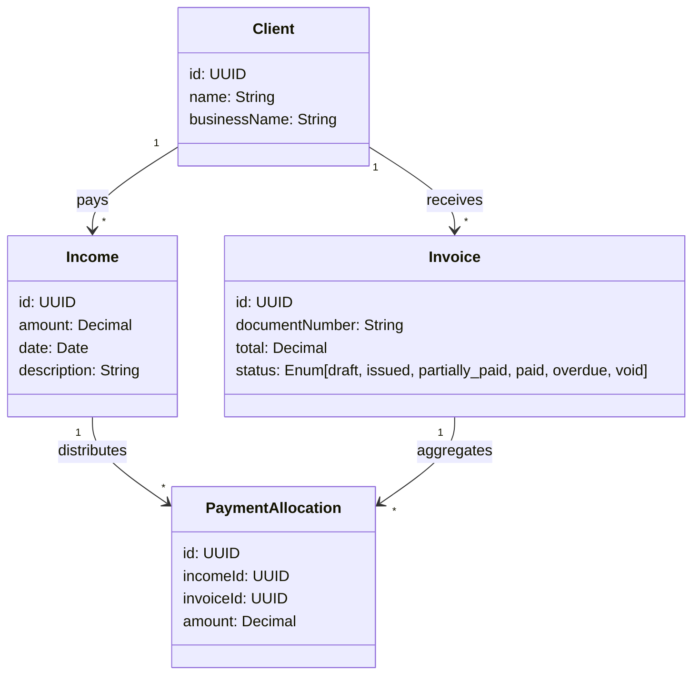

# Implementation Plan: Partial Payments & Auto-Allocation

This implementation plan details the architectural design and implementation details for upgrading the PMG Hub billing system to support **Partial Payments**, **Automated FIFO (First In, First Out) Payment Allocation**, and a **Client Credit Ledger** (overpayments/retainers).

---

## Technical Overview & Core Architecture

Currently, the billing system supports a 1-to-1 relationship between an invoice and an income record (via `invoices.incomeId`). To support partial payments, overpayments, and automatic payment distribution, we will transition to a **many-to-many relationship** governed by a new junction table: `payment_allocations`.



### Business Logic Additions (Value-Added Features)

To make this a highly premium enterprise solution, we will implement the following business logic extensions:

1. **`partially_paid` Invoice Status**
   - We will extend the `invoiceStatusEnum` in PostgreSQL to include a `'partially_paid'` state.
   - An invoice transitions to `'partially_paid'` the moment it receives its first payment allocation that is less than the outstanding balance. It transitions to `'paid'` only when the sum of allocations equals or exceeds the total invoice amount.

2. **Unallocated Client Credits (Retainers / Overpayments)**
   - If a client makes a payment that exceeds their total outstanding invoices, the remaining balance is not lost! It is treated as an **unallocated credit balance** (e.g. a deposit/retainer).
   - This balance is tracked dynamically by querying `sum(income.amount) - sum(payment_allocations.amount)` for the client.
   - **Apply Credit on New Invoices**: The moment a new invoice is created for a client with credit, the UI will display a prompt: `"This client has R[X] in pre-paid credit. [ Apply Credit Now ]"`. Admins can apply this credit in a single click, instantly creating a `payment_allocation` using their credit balance.

3. **Automated FIFO Auto-Spreading Algorithm**
   - The "Add Payment" interface will feature a live **Auto-Allocate Switch** (default: `true`).
   - As the admin types the "Total Amount Paid", a reactive client-side algorithm instantly distributes (spreads) the cash down the list of unpaid invoices starting with the oldest based on `invoiceDate`, showing a live visual feedback of how the payment will be allocated.

4. **Automated LIFO Downward Adjustment Algorithm (Confirmed)**
   - When a payment is edited to reduce its total value, the system automatically uses **LIFO (Last In, First Out)** to reduce the allocations.
   - It strips money from the **newest invoice** (the last one that was allocated money) first. This protects your oldest outstanding debts, keeping their paid/prioritized state intact as much as possible.
   - *Example*: A payment of R5,000 was allocated to Invoice A (Oldest: R3,000) and Invoice B (Newer: R2,000). If you adjust the payment down to R3,500, the system deducts the R1,500 reduction from Invoice B first, leaving it at R500 (partially paid), while keeping Invoice A 100% paid at R3,000.

---

## Proposed Changes

---

### 1. Database Schema & Migration (`packages/db`)

We must introduce the `payment_allocations` table and add the new status value.

#### [MODIFY] [billing.ts](file:///D:/websites/pmg-hub/packages/db/src/schema/billing.ts)
- Extend `invoiceStatusEnum` to support `'partially_paid'`.
- Define the new `paymentAllocations` table:
```typescript
import { pgTable, uuid, numeric, timestamp, index } from "drizzle-orm/pg-core";
import { income } from "./income";

// Extend invoiceStatusEnum:
export const invoiceStatusEnum = pgEnum("invoice_status", [
  "draft",
  "issued",
  "partially_paid",
  "paid",
  "overdue",
  "void",
]);

export const paymentAllocations = pgTable(
  "payment_allocations",
  {
    id: uuid("id").primaryKey().defaultRandom(),
    incomeId: uuid("income_id")
      .notNull()
      .references(() => income.id, { onDelete: "cascade" }), // Cascade delete if the payment record is cleared
    invoiceId: uuid("invoice_id")
      .notNull()
      .references(() => invoices.id, { onDelete: "restrict" }), // Prevent invoice deletion if allocations exist
    amount: numeric("amount", { precision: 12, scale: 2 }).notNull(),
    createdAt: timestamp("created_at", { withTimezone: true }).defaultNow().notNull(),
    updatedAt: timestamp("updated_at", { withTimezone: true }),
  },
  (t) => [
    index("payment_allocations_income_idx").on(t.incomeId),
    index("payment_allocations_invoice_idx").on(t.invoiceId),
  ]
);

export type PaymentAllocation = typeof paymentAllocations.$inferSelect;
export type NewPaymentAllocation = typeof paymentAllocations.$inferInsert;
```

#### [NEW] [000X_payments_migration.sql](file:///D:/websites/pmg-hub/packages/db/src/migrations/000X_payments_migration.sql)
A SQL migration that:
1. Adds `'partially_paid'` to the `invoice_status` enum.
2. Creates the `payment_allocations` table.
3. **Data Backfill Migration**: Loops through all existing `invoices` with `status = 'paid'` and `income_id IS NOT NULL`, inserting a row into `payment_allocations` with `amount = total` to preserve all past payments history with 100% fidelity.

---

### 2. Core Server Actions & Queries (`apps/admin`)

We will create a set of robust actions to calculate outstanding balances, compute auto-allocations, and record multi-invoice payments within transactions.

#### [NEW] [payment-actions.ts](file:///D:/websites/pmg-hub/apps/admin/src/app/actions/billing-payments.ts)
This file will contain critical server actions:
1. **`getClientOutstandingInvoices(clientId: string)`**:
   - Queries all invoices for the client where status is `'issued'`, `'overdue'`, or `'partially_paid'`.
   - Aggregates the sum of all existing `payment_allocations` for each invoice to calculate the exact `amountOutstanding = invoice.total - sum(allocations)`.
   - Sorts the list chronologically by `invoiceDate` (oldest first).

2. **`getClientCreditBalance(clientId: string)`**:
   - Sums all `income.amount` for the client.
   - Sums all `payment_allocations.amount` for the client.
   - Returns the net `creditBalance = totalPaid - totalAllocated` representing their pre-paid deposit.

3. **`recordClientPayment(data: PaymentInput)`**:
   - Runs inside a database transaction (`db.transaction()`).
   - Verifies the payment period is open using `isPeriodClosed(paymentDate)`.
   - Inserts a single `income` record:
     - `amount`: The total cash received (e.g. R5,000).
     - `description`: `"Payment received from [ClientName]"` (along with payment reference).
   - Loops through the provided allocations array. For each allocation where `amount > 0`:
     - Inserts a `payment_allocations` record linking the new `income.id` and the `invoiceId`.
     - Calculates the new total allocations for that invoice.
     - Updates the `invoices` table:
       - If `newTotalAllocated >= invoice.total`, sets status to `'paid'` and updates `paidAt = new Date()`.
       - If `0 < newTotalAllocated < invoice.total`, sets status to `'partially_paid'`.
   - Revalidates the billing, invoices, and ledger paths.

4. **`adjustClientPayment(incomeId: string, newAmount: string)`**:
   - Runs inside a database transaction (`db.transaction()`).
   - Verifies the payment period is open for the original payment date.
   - Fetches all existing `payment_allocations` for this `incomeId` sorted by `invoices.invoiceDate` desc (newest first).
   - If `newAmount` is larger, updates the `income.amount` (the excess automatically goes to the client's credit/retainer balance).
   - If `newAmount` is smaller, calculates the reduction difference (e.g. `R1,500` reduction):
     - Applies a **LIFO reverse-spreading algorithm**: loops through allocations starting from the newest.
     - Deducts the difference from the allocation. If the allocation drops to zero, deletes the allocation row and transitions the invoice status from `paid` back to `issued`/`overdue`.
     - Moves to the next newest allocation if further reduction is needed, transitioning status from `paid` to `partially_paid`.
   - Updates `income.amount` to the new value and commits the transaction.
   - Revalidates all affected routes.

---

## Verification Plan

### Automated Tests
- Test cases verifying the auto-allocation math under standard and edge conditions:
  - Payment amount is less than the oldest invoice.
  - Payment amount perfectly covers multiple invoices.
  - Payment amount exceeds all outstanding invoices (tests client credit creation).
- Validate state updates (`issued` -> `partially_paid` -> `paid`).

### Manual Verification
1. **Adding Partial Payment**:
   - Create an invoice for R10,000.
   - Add a payment of R3,000 for this client.
   - Verify that the invoice status transitions to `partially_paid` and displays an outstanding balance of R7,000.
2. **Auto-Allocation (FIFO) Check**:
   - Create three unpaid invoices for a client:
     - Invoice A: R2,000 (issued Jan 1)
     - Invoice B: R3,000 (issued Jan 15)
     - Invoice C: R4,000 (issued Feb 1)
   - Go to "Add Payment", select the client, and type `R6,500` in "Total Paid".
   - Confirm the live auto-allocation:
     - Invoice A receives R2,000 (Status: Paid)
     - Invoice B receives R3,000 (Status: Paid)
     - Invoice C receives R1,500 (Status: Partially Paid)
     - Client Credit receives R0.
3. **Credit (Overpayment) Creation**:
   - For the same R9,000 total outstanding balance, record a payment of `R10,000`.
   - Verify all invoices are marked `paid`, and a R1,000 credit balance appears on the client's credit ledger.
4. **LIFO Downward Adjustment Check**:
   - Record a payment of R5,000 for a client with Invoice A (Oldest: R3,000) and Invoice B (Newer: R2,000) outstanding.
   - Adjust the payment amount down to R3,500.
   - Verify Invoice B's allocation drops to R500 (transitions to `partially_paid`) and Invoice A stays 100% paid at R3,000.
