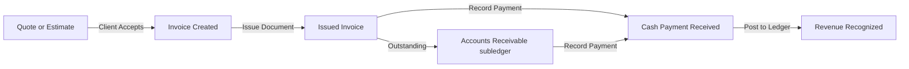

# PMG Manual Bookkeeping MVP — Phase 1: Research & Audit Report

This report presents a technical audit of the **Playhouse Media Group (PMG) Control Center** repository. It evaluates the current codebase against standard accounting and bookkeeping practices to define the minimum viable manual bookkeeping system.

---

## 1. Executive Summary

PMG Control Center is currently structured as a **billing, invoicing, and allocation-tracking tool** rather than a standard bookkeeping platform. While the system possesses robust client management, quote-to-invoice conversion, and period-locking mechanics, it lacks the double-entry accounting backbone required to produce verified financial statements.

### Core Strengths (What PMG Has)
- **Stable Invoicing & Quotes:** Custom line items, document sequence locking, and automated status transitions.
- **Payment Allocation Engine:** Junction table matching client payments (`income`) to one or more outstanding invoices.
- **Period-Locking Rules:** Functional server-side check (`apps/admin/src/lib/date-rules.ts`) blocking backdated entries past the 5-day monthly grace period.
- **Snapshots & Allocation Analytics:** Automated calculations splitting profit pools into salary, reinvest, reserve, and flex buckets.

### Key Gaps (What PMG Needs)
- **No Chart of Accounts (COA):** No Master list of asset, liability, equity, revenue, and expense accounts.
- **No True General Ledger or Journals:** Financial actions record rows in separate `income` or `expenses` tables, but do not post balanced double-entry debits/credits.
- **No Bank/Cash Accounts:** Manual payments are recorded as generic income with no destination bank/cash account specification.
- **VAT Calculation Discrepancies:** A document-level VAT toggle exists in the invoice form, but the Document Preview hardcodes `vatApplicable: false` on line items, leading to total display mismatches.

### Audit Recommendation
The recommended MVP is **not** to build a complex accrual system. We should establish a **Manual Cash-Basis Bookkeeping MVP** that disables VAT by default, ignores bank feeds, and introduces a small Chart of Accounts, journal entry tables, manual bank accounts, and an audit trail to make the reports structurally correct and verifiable.

---

## 2. Industry Research Summary

To align PMG's internal system with mainstream business accounting, we analyzed small-business invoicing and bookkeeping patterns in **QuickBooks, Xero, FreshBooks, Wave, Zoho Books, and Sage**.

### Commercial Document Lifecycle

### Key Bookkeeping Terminology vs. PMG Equivalents
- **Quote/Estimate:** Pre-sale document. No ledger impact. (*Implemented: `quotations` table*).
- **Invoice:** Document stating client obligation. In accrual accounting, it creates a journal entry; in cash-basis, it remains an operational subledger entry. (*Implemented: `invoices` table*).
- **Payment / Cash Receipt:** The movement of cash to settle an invoice. (*Implemented: `income` table, mapped via `payment_allocations`*).
- **Expense:** Outflow of cash for business operations. (*Implemented: `expenses` table*).
- **Journal Entry:** A balanced accounting transaction containing a header and at least one debit and credit line. (*Missing in PMG*).
- **Ledger Entry / General Ledger:** The chronological transaction history grouped by account. (*Missing in PMG; the current `ledger` table tracks internal profit pool shares*).

### Cash-Basis vs. Accrual Accounting
1. **Accrual Basis:** Revenue is recognized when invoiced, and expenses when bills are received. Requires Accounts Receivable and Accounts Payable to be tracked directly on the Balance Sheet.
2. **Cash Basis:** Revenue is recognized only when cash is received, and expenses when paid.
   - **Reports Possible on Cash-Basis:** Profit & Loss, Trial Balance (limited to cash/equity/revenue/expenses), Aged Receivables (operational), and Cash Summary.
   - **What PMG Can Safely Defer:** Balance Sheet (requires full asset/liability tracking), Cash Flow Statement, and Accounts Payable (vendor bills).

---

## 3. Revised MVP Scope

Based on the cash-basis, non-VAT, and no bank-feeds business scope, the features are divided as follows:

### Required for MVP
1. **Clients & Divisions:** tag and filter all transactions.
2. **Quotes & Invoices:** with unique numbering, terms, and line items.
3. **Manual Payment Recording:** partial payments and allocations to multiple invoices.
4. **Income & Expense Registers:** linked to specific accounts.
5. **Chart of Accounts (COA):** Asset, equity, revenue, and expense codes.
6. **Journal Entries & Lines:** double-entry posting of cash receipts, expenses, and draws.
7. **Accounts Receivable & Aging:** operational reporting based on invoice/allocation balances.
8. **Reports:** cash-basis Profit & Loss, General Ledger, Trial Balance, and Cash Summary.
9. **Controls:** Period locking, monthly snapshots, and an immutable `audit_logs` table.
10. **Accountant Export:** CSV journals and invoice details.

### Not Required (Deferred)
- **Bank Feeds / API:** No open banking or bank sync APIs.
- **Accrual Balance Sheet:** No asset depreciation or liability schedules.
- **Accounts Payable Module:** No vendor bills or supplier aging tables.
- **VAT Reports & SARS Filing:** Deferred until VAT registration.
- **Payroll & Inventory:** Out of scope for this service business.

### Future Phase
- VAT registration support (switch to Tax Invoices).
- Bank statement CSV imports and reconciliation matching.
- Vendor bills (Accounts Payable subledger).
- Balance Sheet and Cash Flow Statement.
- Client Self-Service Portal.

---

## 4. PMG Current-State Code Audit

The following table details the implementation status of 45 core features scanned across the codebase:

| # | Feature | Industry Standard | Old Research Status | Actual Repo Status | Evidence from File Paths | MVP Decision | Recommendation |
|---|---|---|---|---|---|---|---|
| 1 | **Clients** | Master client records, history, and status | Not stated | ✅ Good | [clients.ts](file:///D:/websites/pmg-hub/packages/db/src/schema/clients.ts) | Required | Keep as client master; query outstanding amounts. |
| 2 | **Divisions** | Tags/departments for divisional reporting | ✅ Done | ✅ Good | [divisions.ts](file:///D:/websites/pmg-hub/packages/db/src/schema/divisions.ts) | Required | Use as a dimension on all journals. |
| 3 | **Quotes** | Draft, sent, accepted, expired, cancelled | ✅ Done | ✅ Good | [billing.ts](file:///D:/websites/pmg-hub/packages/db/src/schema/billing.ts) (`quotations`) | Required | Ensure accepted quotes convert to invoices. |
| 4 | **Invoices** | Document detailing customer dues | ✅ Done | ✅ Good | [billing.ts](file:///D:/websites/pmg-hub/packages/db/src/schema/billing.ts) (`invoices`) | Required | Keep; invoices act as operational AR. |
| 5 | **Invoice Numbering** | Sequenced, immutable document numbers | Not stated | 🟡 Partial | [billing.ts](file:///D:/websites/pmg-hub/packages/db/src/schema/billing.ts) (`documentSequences`) | Required | Automated via `documentSequences` per division/year. |
| 6 | **Invoice Line Items** | Itemized quantity, rate, and line totals | Implied | ✅ Good | [billing.ts](file:///D:/websites/pmg-hub/packages/db/src/schema/billing.ts) (`billingLineItems`) | Required | Standard polymorphic item table. |
| 7 | **Invoice Statuses** | Draft, issued, partially paid, paid, overdue, void | ✅ Done | ✅ Good | [billing.ts](file:///D:/websites/pmg-hub/packages/db/src/schema/billing.ts) (`invoiceStatusEnum`) | Required | Prevent editing of paid/void documents. |
| 8 | **Invoice PDFs** | Printable/downloadable A4 invoices | Not stated | 🟡 Partial | [document-preview.tsx](file:///D:/websites/pmg-hub/apps/admin/src/components/billing/document-preview.tsx) | Required | Mismatch: client-side calculates VAT as 0, ignoring DB. Fix layout. |
| 9 | **Quote-to-Invoice** | One-click copy quote lines to draft invoice | ✅ Done | ✅ Good | [billing-invoices.ts](file:///D:/websites/pmg-hub/apps/admin/src/app/actions/billing-invoices.ts) | Required | Test conversion path end-to-end. |
| 10 | **Invoice Due Dates** | Auto-calculate due date from issue date | ✅ Done | ✅ Good | [billing.ts](file:///D:/websites/pmg-hub/packages/db/src/schema/billing.ts) | Required | Use due date for AR aging and cron reminders. |
| 11 | **Issue/Void/Paid Flow** | Transition invoice statuses with locks | Implied | ✅ Good | [billing-invoices.ts](file:///D:/websites/pmg-hub/apps/admin/src/app/actions/billing-invoices.ts) | Required | Lock transactions when marked paid or voided. |
| 12 | **Manual Payments** | Record cash payments against invoices | Implied | 🟡 Partial | [billing-payments.ts](file:///D:/websites/pmg-hub/apps/admin/src/app/actions/billing-payments.ts) | Required | Record payment details (date, amount) to `income`. |
| 13 | **Partial Payments** | Partially allocate payments, keep rest open | Implied | ✅ Good | [billing-payments.ts](file:///D:/websites/pmg-hub/apps/admin/src/app/actions/billing-payments.ts) | Required | Supported by calculating allocations vs invoice totals. |
| 14 | **Payment Allocations** | Junction table mapping income to invoices | Not stated | ✅ Good | [billing.ts](file:///D:/websites/pmg-hub/packages/db/src/schema/billing.ts) (`paymentAllocations`) | Required | Cascade deletes of allocations if payment is removed. |
| 15 | **Overpayments** | Track unallocated client cash as a credit | Not stated | 🟡 Partial | [billing-payments.ts](file:///D:/websites/pmg-hub/apps/admin/src/app/actions/billing-payments.ts) | Future | Unallocated cash is computed dynamically, but no credit ledger. |
| 16 | **Credit Notes** | Formal document reducing invoice total | ❌ Missing | 🔴 Missing | None | Future | Defer to later; handle adjustments manually for now. |
| 17 | **Refunds** | Reverse payments and return cash | ❌ Missing | 🔴 Missing | None | Future | Add in later phase when bank accounts exist. |
| 18 | **Accounts Receivable** | Track outstanding client balances | ✅ Done | 🟡 Partial | [billing-payments.ts](file:///D:/websites/pmg-hub/apps/admin/src/app/actions/billing-payments.ts) | Required | Operational AR is tracked, but not posted to general ledger. |
| 19 | **Aged Receivables** | Outstanding totals in 30/60/90+ day buckets | ✅ Done | ✅ Good | [queries/billing.ts](file:///D:/websites/pmg-hub/packages/db/src/queries/billing.ts) (`getAgingReport`) | Required | Ensure aging uses due dates and excludes future invoices. |
| 20 | **Income Table** | Manual register for receipts | Not stated | ✅ Good | [income.ts](file:///D:/websites/pmg-hub/packages/db/src/schema/income.ts) | Required | Record of all incoming money (invoice and non-invoice). |
| 21 | **Expense Table** | Manual register for outgoing payments | ⚠️ Partial | ✅ Good | [expenses.ts](file:///D:/websites/pmg-hub/packages/db/src/schema/expenses.ts) | Required | Store outgoing cash payments. |
| 22 | **Expense Categories** | Group expenses for P&L reporting | ⚠️ Partial | 🟡 Partial | [expense-categories.ts](file:///D:/websites/pmg-hub/packages/db/src/schema/expense-categories.ts) | Required | String-based lookup. Needs mapping to COA accounts. |
| 23 | **Supplier Records** | Supplier master records | ❌ Missing | 🔴 Missing | None | Future | Defer until Accounts Payable module is built. |
| 24 | **Accounts Payable** | Track supplier bills and aging | ❌ Missing | 🔴 Missing | None | Future | Defer to AP phase. |
| 25 | **Cash/Bank Accounts** | Track cash in bank / on hand | Not stated | 🔴 Missing | None | Required | Add internal `bank_accounts` table to track cash sources. |
| 26 | **Bank Reconciliation** | Match bank statement rows to ledger | ❌ Missing | 🔴 Missing | None | Future | Defer; perform manual balance checks in MVP. |
| 27 | **Chart of Accounts** | Categorize assets, liabilities, equity, rev, exp | ❌ Missing | 🔴 Missing | None | Required | Build first; seed default accounting codes. |
| 28 | **Allocation Ledger** | Track internal share distributions | ✅ Done | ✅ Good | [ledger.ts](file:///D:/websites/pmg-hub/packages/db/src/schema/ledger.ts) | Required | Keep for profit-pool calculations, but separate from GL. |
| 29 | **General Ledger** | Central transaction record of debits/credits | ❌ Missing | 🔴 Missing | None | Required | Create from journal entries. |
| 30 | **Journal Entries** | Transaction header (date, description, ref) | ❌ Missing | 🔴 Missing | None | Required | Build now. |
| 31 | **Journal Lines** | Transaction rows (debit/credit amount, account) | ❌ Missing | 🔴 Missing | None | Required | Build now. |
| 32 | **Profit & Loss** | Revenues minus expenses statement | ⚠️ Partial | 🟡 Partial | [queries/general.ts](file:///D:/websites/pmg-hub/packages/db/src/queries/general.ts) | Required | Rebuild cash-basis P&L from journal lines. |
| 33 | **Trial Balance** | Summary statement proving debits = credits | ❌ Missing | 🔴 Missing | None | Required | Build after GL and journals are wired. |
| 34 | **Balance Sheet** | Statement of Assets, Liabilities, and Equity | ❌ Missing | 🔴 Missing | None | Future | Defer; requires accrual double-entry. |
| 35 | **Cash Flow** | Operating, investing, and financing cash | ⚠️ Partial | 🔴 Missing | None | Future | Defer; use manual Cash Summary instead. |
| 36 | **VAT Settings** | VAT number and standard tax rates | ⚠️ Partial | 🟡 Partial | [billing.ts](file:///D:/websites/pmg-hub/packages/db/src/schema/billing.ts) (`divisionBillingSettings`) | Required | No global toggle `isVatRegistered`. Add to settings. |
| 37 | **VAT Invoice Behavior** | Render tax invoices and invoice totals | ⚠️ Partial | 🟡 Partial | [billing-invoices.ts](file:///D:/websites/pmg-hub/apps/admin/src/app/actions/billing-invoices.ts) | Required | Hard-disable VAT calculations when `isVatRegistered` is false. |
| 38 | **Period Locking** | Prevent edits to historical closed months | ✅ Done | ✅ Good | [date-rules.ts](file:///D:/websites/pmg-hub/apps/admin/src/lib/date-rules.ts) | Required | Already enforced in Server Actions for lock protection. |
| 39 | **Financial Snapshots** | Frozen month-end performance totals | ✅ Done | ✅ Good | [snapshots.ts](file:///D:/websites/pmg-hub/packages/db/src/schema/snapshots.ts) | Required | Store monthly snapshots for historical integrity. |
| 40 | **Audit Trail** | Record who edited what and when | Not stated | 🔴 Missing | None | Required | Create an `audit_logs` table for all financial actions. |
| 41 | **User Permissions** | Financial action limitations based on roles | Not stated | 🟡 Partial | [auth.ts](file:///D:/websites/pmg-hub/apps/admin/src/lib/auth.ts) | Required | Auth is checked, but no role permissions (e.g. read-only auditor). |
| 42 | **Accountant Export** | Export journals, income, and invoices to CSV | Not stated | 🔴 Missing | None | Required | Provide simple CSV downloads. |
| 43 | **Reporting Pages** | Financial summaries and interactive charts | ✅ Done | 🟡 Partial | [finance](file:///D:/websites/pmg-hub/apps/admin/src/app/\(admin\)/finance) | Required | Rebuild P&L, AR, and GL on top of the new journal tables. |
| 44 | **Calc Engine** | PMG flex, salary, reserve splits logic | ✅ Done | ✅ Good | [financial.ts](file:///D:/websites/pmg-hub/apps/admin/src/lib/financial.ts) | Required | Keep managerial allocations separate from business expenses. |
| 45 | **Dashboard Metrics** | Charts for revenue, expenses, and profit pool | ✅ Done | ✅ Good | [dashboard](file:///D:/websites/pmg-hub/apps/admin/src/app/\(admin\)/dashboard) | Required | Display metrics powered by accounting data. |

---

## 5. Summary Findings & Key Takeaways

1. **PMG is a Management Billing App, Not a Bookkeeper:** Quotes, invoices, partial payments, and division metrics are excellent. The codebase has high-quality business workflows, but it lacks the basic ledger entries, chart of accounts, and accounting reports that give accountants confidence.
2. **Database Schema is Modular and Extensible:** Drizzle schemas are clean and separated. We can introduce a new file `packages/db/src/schema/accounting.ts` with COA, journals, lines, bank accounts, and audit logs without modifying or breaking the existing billing, income, and expense schemas.
3. **VAT Discrepancy is a Major Risk:** The preview layout hardcodes `vatApplicable: false` which ignores the database state. If a user toggles VAT on, the sidebar total and the PDF preview total will mismatch. Disabling VAT globally via `isVatRegistered` will resolve this immediately.
4. **Existing Allocation Ledger is Managerial, Not Financial:** The `ledger` table is used for division bucket allocations (salary, reserve, etc.). We must ensure this calculation is treated as internal equity allocation or drawings, not double-counted as standard business expenses on the Profit & Loss statement.

---

## 6. Resolved Business Policies

The following business rules have been established by Jacob for the MVP implementation:
1. **Accounts Receivable ledger behavior:** Keep invoice issue operational-only. Do not write journal entries on invoice issue. Post ledger transactions *only* when payment is recorded (`Dr Bank / Cr Revenue`). This preserves the cash-basis P&L model.
2. **Division Tagging on Cash Accounts:** Bank and cash accounts are global to PMG. Division tagging applies to revenue, expenses, allocations, drawings/withdrawals, and profit pool lines, but does not split the actual cash/bank accounts by division.
3. **Chart of Accounts editing:** Restrict the Chart of Accounts to the seeded standard list. No custom accounts can be created by the user for now to prevent accounting errors and keep reporting consistent.
4. **Loan Tracking:** Keep the loan module entirely separate and operational for now. Do not write journal entries for loans or repayments. Automated accounting integration can be deferred to a later phase.
5. **Accountant Export format:** Implement a simple CSV export of all transaction/journal lines including date, reference, division, account code, account name, description, debit, credit, VAT, payment method, and created-by details.
