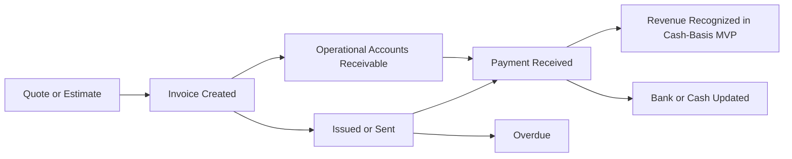
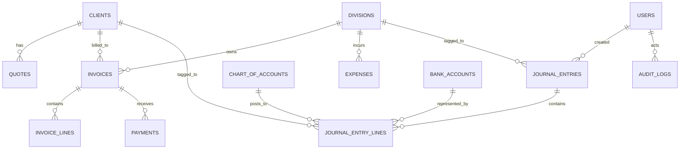

# PMG Manual Bookkeeping MVP Audit

## Executive summary

Your uploaded brief defines the target clearly: PMG Control Center should become a **manual, internal, cash-basis bookkeeping system** built in the app’s existing stack, with **no VAT for now** and **no bank feeds or bank-linking for MVP**. The same brief also identifies the repo areas that should be audited, including the Drizzle schema, query helpers, Server Actions, financial logic, billing, income, expense, reporting, and docs. fileciteturn0file0

The most useful conclusion from the industry research is that modern small-business systems do not treat invoicing, expenses, and reporting as separate products. QuickBooks, Xero, FreshBooks, Wave, Zoho Books, and Sage all package them as one operating flow: customer records, quotes or estimates, invoices, payment tracking, expense capture, and reporting. The difference between a billing tool and a bookkeeping system is the accounting core underneath it: a chart of accounts, journal logic, a ledger, and reports derived from those records. QuickBooks explicitly surfaces chart of accounts, journal entries, expenses/vendors, reports, and year-end cleanup as support topics; Xero emphasizes quote-to-invoice conversion, recurring invoices, payment tracking, reminders, and status visibility; FreshBooks highlights invoices built from time and expenses plus ready-made reports; Wave positions accounting, invoicing, and payments as one unified system; Zoho Books markets end-to-end accounting from quotes/invoicing through reporting, dashboards, and audit trail; and Sage exposes accounts receivable, accounts payable, invoicing, ledger accounting, financial reporting, cash management, and audit trails. citeturn51view0turn51view1turn48view0turn45view0turn45view1turn51view2turn50view0turn51view3

Your earlier PMG accounting gap-analysis reached a similar structural conclusion: PMG appeared to have a good invoicing and reporting foundation, but it still lacked the accounting layer that would make it a real bookkeeping platform. In that document, the major confirmed gaps were a formal chart of accounts, double-entry journal engine, general ledger, trial balance, balance sheet, accounts payable, bank reconciliation, and a formal expense module posted to the ledger. However, that document also said the repo was private and that the implementation assessment was based on development history rather than a live public code audit. In other words, it is a **strong baseline checklist**, but not final proof of the current repo. fileciteturn0file1

The most practical MVP for PMG is therefore **not** “build QuickBooks.” It is: keep the existing billing and management-reporting strengths, then add the minimum accounting backbone needed to make the numbers dependable. In practice, that means: a **small chart of accounts**, **balanced journal entries**, **journal entry lines**, **manual internal bank/cash accounts**, an **operational accounts-receivable register**, a **formal cash-basis P&L**, a **general ledger**, a **trial balance**, **period locking**, and an **audit log**. VAT, bank feeds, bank reconciliation, full AP, balance sheet, and cash flow should move to later phases. That recommendation follows both your stated PMG scope and the way mainstream systems layer invoicing, expenses, journals, and reports. fileciteturn0file0turn0file1turn41view0turn41view1turn48view0turn51view2turn50view0turn51view3

One important limitation shaped this report. I attempted to access the public GitHub repo directly from the available research environment, but I could not retrieve the live GitHub source tree in a way that supported a true line-by-line verification. Because of that, the “repo audit” sections below are intentionally conservative: where the only accessible PMG evidence came from your prior research document, I mark items as **documented only** rather than claiming they are definitively live in code today. That is the strictest and safest interpretation for implementation planning. The local working markdown copies requested in your brief were still prepared in a repo-style directory under `/mnt/data/pmg-hub/docs/...`. fileciteturn0file0turn0file1

## Industry patterns that matter for PMG

Modern SMB systems all converge on a similar operating model. QuickBooks describes one platform spanning books, sales, expenses, pay bills, and tax; Xero’s invoicing feature centers on automated invoices, reminders, recurring invoices, payment options, and turning accepted quotes into invoices; FreshBooks emphasizes invoices, expenses, billing automation, and report-ready data; Wave markets a unified accounting/invoicing/payments stack; Zoho Books pairs quotes, invoicing, bills, expenses, dashboards, and 70+ reports; and Sage makes AR, AP, invoicing, ledger accounting, financial reporting, cash management, and audit trails first-class areas. For PMG, the main lesson is that invoice UX alone is never enough; reliable reporting depends on the records created after each commercial event. citeturn51view0turn48view0turn45view0turn45view1turn51view2turn50view0turn51view3

A useful way to separate the moving parts is this. A **quote** or **estimate** is pre-sale. An **invoice** states what the customer owes. A **payment** settles some or all of that invoice. **Income** on a cash basis is usually recognized when cash is actually received, not when the invoice is sent. A **journal entry** is the accounting event that records what happened. A **ledger entry** is one line of that journal posted to a specific account. QuickBooks support treats chart of accounts and journal entries as part of advanced accounting; Xero’s invoicing pages distinguish quote acceptance, invoice creation, reminders, and payment tracking; FreshBooks describes how invoices, payments, and recorded transactions flow into dashboards and reports. citeturn51view1turn49view3turn45view0turn45view1

The accounting-method choice matters because it changes what your reports mean. The IRS defines the **cash method** as recognizing income when it is actually or constructively received and deducting expenses when they are actually paid. By contrast, under the **accrual method**, income is reported when earned and expenses when incurred, with the goal of matching income and expenses in the correct year. The IRS also notes that many small businesses use the cash method, while larger or inventory-heavy businesses may be pushed toward accrual. citeturn41view0turn41view1turn41view2

For PMG, that leaves two realistic models. The first is **pure cash-basis bookkeeping**: sending an invoice creates an operational receivable but no accounting entry, and revenue is only recognized when payment is received. The second is **accrual bookkeeping**: invoice issue posts receivables and revenue immediately, and payment clears receivables later. Given your current scope, the first model is the better MVP because it is simpler, aligns with your “manual cash-basis” requirement, and avoids overbuilding a formal balance-sheet layer too early. The trade-off is that aged receivables will be an **operational report** first, not a balance-sheet account that fully ties into accrual reporting. That is an inference from the IRS definitions plus the product workflows used by Xero, FreshBooks, and Wave. fileciteturn0file0 citeturn41view0turn41view1turn48view0turn45view0turn51view2

A practical small-business, non-VAT, no-bank-feeds MVP therefore needs fewer features than a full cloud accounting suite. It still needs: customer records, quotes, invoices, line items, due dates, payment recording, expenses, basic categorization, an operational AR register, a journal-backed ledger for cash events, a named chart of accounts, P&L reporting, a trial balance, and controls. It does **not** need VAT calculations, bank feeds, imported bank statements, automated reconciliation, payroll, inventory, or full AP on day one. The vendors all offer those broader capabilities, but your own scope brief explicitly excludes VAT and bank linking from the MVP. fileciteturn0file0 citeturn51view0turn48view3turn30view0turn31view0turn32view0turn33view0

## What PMG appears to have and where the gaps remain

Your brief asks for a deep code audit across schema, queries, Server Actions, financial helpers, billing, income, expenses, reporting, snapshots, ledger logic, and docs. fileciteturn0file0 The earlier PMG accounting-research document claims PMG had already built an invoicing engine, quote-to-invoice flow, AR aging, period locking, a PMG allocation model, division-level P&L stats, loan tracking, and a client financial dashboard, while still missing core accounting pieces like COA, journals, GL, balance sheet, trial balance, AP, bank reconciliation, and formal expense-to-ledger posting. Because I could not live-verify the public repo source in this session, the table below treats those prior PMG claims as **documentation evidence**, not as code-proven facts. fileciteturn0file1

The status legend below is strict:

- **✅ Good enough for MVP** means the prior PMG evidence and current scope make it reasonable to keep.
- **🟡 Partially implemented** means the prior PMG evidence says something exists, but not completely.
- **🔴 Missing / required** means the PMG baseline itself identified the gap or there is no accessible evidence.
- **⚪ Not required for MVP** means intentionally out of scope now.
- **🔵 Future phase** means useful later, but not now.
- **📄 Documented only** means the prior PMG materials say it exists, but it was **not live-verified in source code** during this session. fileciteturn0file1

Industry-standard expectations in the table below are summarized from QuickBooks, Xero, FreshBooks, Wave, Zoho Books, Sage, and the IRS cash-vs-accrual guidance. citeturn51view0turn51view1turn48view0turn45view0turn45view1turn51view2turn50view0turn51view3turn41view0turn41view1

| Feature | Industry standard | Old research status | Actual repo status in this session | Evidence | MVP decision | Recommendation |
|---|---|---:|---:|---|---|---|
| Clients | Customer master records, history, statements | Not stated directly | 📄 | Prior PMG doc references a client financial dashboard. fileciteturn0file1 | Required | Keep client master central to invoices, AR, statements, and reports. |
| Divisions | Tags, departments, or cost centers for reporting | ✅ Done | 📄 | Prior PMG doc says division-level P&L stats and multi-division reporting exist. fileciteturn0file1 | Required | Keep division as a reporting dimension on all finance records and journals. |
| Quotes | Draft, sent, accepted/declined, expiry | ✅ Done | 📄 | Prior PMG doc says quote / estimate system exists. fileciteturn0file1 | Required | Keep; ensure accepted quotes convert cleanly to invoices. |
| Invoices | Full customer invoice lifecycle | ✅ Done | 📄 | Prior PMG doc says invoicing engine exists. fileciteturn0file1 | Required | Keep; make invoices the front-end sales document. |
| Invoice numbering | Stable document sequencing | Not stated directly | 🔴 | No accessible PMG evidence in this session. fileciteturn0file1 | Required | Add or verify unique, immutable invoice numbering. |
| Invoice line items | Itemized services/products and pricing | Implied in invoice engine | 📄 | The prior PMG doc confirms invoicing, but not line-item details explicitly. fileciteturn0file1 | Required | Verify line items, quantity/rate math, and invoice totals. |
| Invoice statuses | Draft / sent / overdue / paid / void equivalents | ✅ Done | 📄 | Prior PMG doc says invoices have due dates and status tracking. fileciteturn0file1 | Required | Preserve status model and make paid/void states harder to edit. |
| Invoice PDFs | Printable/shareable invoice documents | Not stated directly | 🔴 | No accessible PMG evidence in this session. fileciteturn0file1 | Required | Keep invoice PDF export simple; remove any VAT/tax-invoice wording. |
| Quote-to-invoice conversion | One-click conversion from accepted quote | ✅ Done | 📄 | Prior PMG doc says quotes convert to invoices; Xero also treats this as core. fileciteturn0file1 citeturn49view3 | Required | Preserve and test conversion path end-to-end. |
| Invoice due dates | Due date and overdue logic | ✅ Done | 📄 | Prior PMG doc says invoice due dates auto-fill and are tracked. fileciteturn0file1 | Required | Keep due dates; use them in AR aging and reminders. |
| Invoice issue / void / paid flow | Immutable issue, payment, void/reversal flow | Partially implied | 🟡 | Prior PMG doc confirms sent/track status, but not full immutable issue/void workflow. fileciteturn0file1 | Required | Add explicit issue, pay, void, and reversal actions with audit logs. |
| Manual payments | Record payment against invoice | Implied | 🟡 | Prior PMG doc confirms AR and payment-dependent aging, but not the exact action flow. fileciteturn0file1 | Required | Create a first-class “record payment” action with amount/date/account fields. |
| Partial payments | Apply less than full amount and keep balance open | ⚠️ Needs verification | 🟡 | Prior PMG doc explicitly says AR aging should be checked for partial-payment handling. fileciteturn0file1 | Required | Support partials now; they are essential for AR accuracy. |
| Payment allocations | Allocate payment to one or more invoices/lines | Not stated directly | 🔴 | No accessible PMG evidence in this session. fileciteturn0file1 | Required | Add payment-allocation records if not already present. |
| Overpayments | Credit balance or unapplied cash logic | Not stated | 🔴 | No accessible PMG evidence in this session. fileciteturn0file1 | Future | Defer full overpayment credits unless it is already simple to add. |
| Credit notes | Reduce or reverse invoice balances properly | ❌ Missing | 🔴 | Prior PMG doc lists credit-note-style capability as absent from MVP accounting. fileciteturn0file1 | Future | Defer to later unless invoice reversals become urgent. |
| Refunds | Reverse payments and document returns | ❌ Missing | 🔴 | Not present in accessible PMG baseline. fileciteturn0file1 | Future | Add after credit-note model exists. |
| Accounts Receivable | Open invoices and balances by customer | ✅ Done | 📄 | Prior PMG doc says AR module exists. fileciteturn0file1 | Required | Keep AR as an operational subledger from day one. |
| Aged Receivables | 0–30 / 31–60 / 61–90 / 90+ | ✅ Done | 📄 | Prior PMG doc says AR aging exists and bucket logic was corrected. fileciteturn0file1 | Required | Keep and ensure aging uses due date and outstanding balance after partial payments. |
| Income table | Manual income capture / revenue records | Not clearly stated | 📄 | Division P&L and revenue stats imply revenue records, but no live code verification. fileciteturn0file1 | Required | Keep or add a manual income register for non-invoice receipts. |
| Expense table | Record paid expenses | ⚠️ Partial | 🟡 | Prior PMG doc says expense recording may exist informally. fileciteturn0file1 | Required | Make expense capture explicit and journal-backed. |
| Expense categories | Categorized expenses for reporting | ⚠️ Partial | 🟡 | Prior PMG doc says expenses may lack full COA category assignment. fileciteturn0file1 | Required | Link every expense to an expense account. |
| Supplier / vendor records | Vendor master for bills and spend history | ❌ Missing | 🔴 | Prior PMG doc says AP is missing. fileciteturn0file1 | Future | Defer full supplier subledger until AP phase. |
| Accounts Payable | Bills received, unpaid balances, aging | ❌ Missing | 🔴 | Prior PMG doc lists AP as missing. fileciteturn0file1 | Future | Defer for MVP. |
| Manual cash/bank accounts | Named internal cash accounts | Not confirmed | 🔴 | Prior PMG baseline stresses need for bank/cash accounts but does not confirm them. fileciteturn0file1 | Required | Add manual internal bank/cash accounts now. |
| Bank reconciliation | Match ledger to statement data | ❌ Missing | 🔴 | Prior PMG doc lists bank reconciliation as missing. fileciteturn0file1 | Future | Do not build full recon yet; allow simple manual balance checks later. |
| Chart of Accounts | Account list by asset/liability/equity/revenue/expense | ❌ Missing | 🔴 | Prior PMG doc explicitly identifies missing COA. fileciteturn0file1 | Required | Build first. |
| Current ledger / allocation table | Internal profitability / allocation ledger | ✅ Done for allocation model | 📄 | Prior PMG doc says PMG allocation model is done. fileciteturn0file1 | Required, but limited | Keep as management analytics; do **not** treat it as the accounting GL. |
| True accounting General Ledger | Account-by-account history from journals | ❌ Missing | 🔴 | Prior PMG doc explicitly says no central GL is confirmed. fileciteturn0file1 | Required | Build from journal lines. |
| Journal entries | Balanced transaction headers | ❌ Missing | 🔴 | Prior PMG doc explicitly says double-entry journal engine is missing. fileciteturn0file1 | Required | Build now. |
| Journal lines | Debit/credit account lines | ❌ Missing | 🔴 | Same missing double-entry finding. fileciteturn0file1 | Required | Build now. |
| Profit & Loss | Formal period revenue minus expense view | ⚠️ Partial | 🟡 | Prior PMG doc says divisional P&L exists but company-wide formal P&L is partial. fileciteturn0file1 | Required | Build a formal cash-basis P&L from accounts and journals. |
| Trial Balance | Debits equal credits by account | ❌ Missing | 🔴 | Prior PMG doc explicitly lists trial balance as missing. fileciteturn0file1 | Required | Build after journals and GL. |
| Balance Sheet | Assets, liabilities, equity as-of date | ❌ Missing | 🔴 | Prior PMG doc explicitly lists balance sheet as missing. fileciteturn0file1 | Future | Defer until you decide whether to move invoice issue into accrual postings. |
| Cash Flow Statement | Operating / investing / financing movements | ⚠️ Partial | 🟡 | Prior PMG doc says cash flow was designed but incomplete. fileciteturn0file1 | Future | Defer formal statement; keep a simple bank/cash summary for MVP. |
| VAT settings | VAT registration flag and tax configuration | ⚠️ Partial | 🟡 | Prior PMG doc says VAT/tax handling may be partial. fileciteturn0file1 | Required to disable | Add `isVatRegistered = false` and hard-disable VAT behavior. |
| VAT invoice behavior | Tax invoices, VAT amounts, VAT reports | ⚠️ Partial | 🟡 | Prior PMG doc says VAT handling needs work; your brief excludes VAT from MVP. fileciteturn0file1turn0file0 | Not required for active use | Force VAT to zero and hide VAT UI/functions for now. |
| Period locking | Closed periods and override logic | ✅ Done | 📄 | Prior PMG doc says period locking with grace-period override exists. fileciteturn0file1 | Required | Keep, but enforce it in Server Actions, not only UI. |
| Financial snapshots | Frozen month-end views | Not stated directly | 🔴 | No accessible PMG evidence in this session. fileciteturn0file1 | Required | Add simple month-end snapshots once P&L/GL exist. |
| Audit trail | Who changed what and when | Not confirmed as built | 🔴 | Prior PMG roadmap still calls for audit trail work. fileciteturn0file1 | Required | Add audit logs across financial entities and actions. |
| User permissions | Financial access by role | Not stated directly | 🔴 | No accessible PMG evidence in this session. fileciteturn0file1 | Required | Restrict who can issue, pay, void, close periods, and export. |
| Accountant export | CSV/PDF/ledger export for accountant | Not stated directly | 🔴 | No accessible PMG evidence in this session. fileciteturn0file1 | Required | Provide CSV exports for invoices, receipts, expenses, and journal lines. |
| Reporting pages | AR aging, dashboards, divisional summaries | ✅ / ⚠️ Mixed | 📄 | Prior PMG doc says AR aging, division stats, and client dashboard exist; cash flow and full P&L are partial. fileciteturn0file1 | Required | Keep the current reporting layer and rebuild it on top of cleaner accounting data. |
| Financial calculation engine | PMG share / salary / reinvest / reserve / flex logic | ✅ Done | 📄 | Prior PMG doc says PMG allocation model is implemented. fileciteturn0file1 | Required, but separate | Keep it as management logic; do not auto-book it as expense unless cash actually leaves the business. |
| Dashboard metrics | Revenue/expense snapshots and trends | ✅ Done | 📄 | Prior PMG doc says division P&L stats and client financial dashboards exist. fileciteturn0file1 | Required | Keep dashboards, but tie them to journals and formal reports over time. |

The product-level conclusion is straightforward: based on the accessible PMG evidence, PMG is **closer to a billing and management-reporting app than to a bookkeeping system**. The good news is that this is the right starting point. Quotes, invoices, AR aging, divisional views, and period locking are the hard commercial workflows to get right early. The missing work is not “redo everything”; it is to add a minimal accounting backbone under the flows you already have. That is also exactly how the major SMB platforms position their operating model. fileciteturn0file1 citeturn51view0turn48view0turn45view0turn51view2turn50view0turn51view3

## What the PMG MVP should include

The revised MVP should be named exactly as your brief frames it: **PMG Manual Bookkeeping MVP — Cash Basis, Non-VAT, No Bank Feeds**. fileciteturn0file0

The **required** layer is the smallest set of features that will let PMG invoice clients, capture manual receipts and expenses, understand who still owes money, and produce management-ready reports that do not drift out of sync. That means: client and division masters; quotes and invoices; due dates and invoice statuses; manual payment recording; partial-payment handling; operational AR and AR aging; expense capture with categories; a small chart of accounts; journal entries and journal lines for cash events; a general ledger; a trial balance; a cash-basis P&L; manual internal bank/cash accounts; period locking; audit logs; and exportable invoices, statements, and accounting files. This scope is narrower than Zoho Books or Sage, but it covers the irreducible core of a dependable internal bookkeeping system. fileciteturn0file0turn0file1 citeturn50view0turn51view3turn41view0turn41view1

The **not-required** layer should stay out of the MVP on purpose: bank feeds, automatic bank sync, imported bank statements, VAT reports, SARS VAT submission, payroll, inventory, multi-currency, depreciation, and a full AP workflow. Those are valuable features in established platforms, but they are not the bottleneck between PMG’s current state and a working bookkeeping MVP. QuickBooks, Xero, Wave, Zoho, and Sage all expose broader capabilities; your scope brief explicitly says not to. fileciteturn0file0 citeturn51view0turn48view3turn31view0turn32view0turn33view0

The **future** layer should include the heavier accounting extensions once the journal-backed core exists: VAT registration support, CSV bank imports, proper reconciliation, suppliers and bills, accounts payable, credit notes, refunds, balance sheet, cash flow statement, asset and liability schedules, and a more polished accountant portal. Your prior PMG research already pointed in roughly this direction; the only change is that VAT and banking move even further right because they are explicitly out of scope now. fileciteturn0file1turn0file0

A crucial design choice sits in the middle of the MVP: whether receivables should be operational only, or posted into the ledger on invoice issue. My recommendation is to **keep invoice issue operational-only for MVP**, then recognize revenue only on payment receipt. That lets you keep cash-basis P&L honest, avoid premature accrual complexity, and still give yourself AR aging and client statements. The cost is that your trial balance and ledger will not show a formal AR balance from unpaid invoices until you later adopt accrual journaling. For PMG’s current scope, that trade-off is worth it. It is the cleanest way to keep the bookkeeping MVP simple without pretending it is already a full accrual accounting engine. fileciteturn0file0 citeturn41view0turn41view1turn49view3turn45view0

## Recommended accounting model and schema

The minimum accounting schema should be small, explicit, and biased toward correctness. Because your brief calls for Next.js, TypeScript, PostgreSQL, Drizzle ORM, and Server Actions, the right move is not a rewrite; it is to add a compact accounting layer that existing invoice, income, expense, and reporting actions can call. fileciteturn0file0

The five tables I would prioritize immediately are:

| Table | MVP or future | Purpose | Key columns | Relationship notes | Migration notes |
|---|---|---|---|---|---|
| `chart_of_accounts` | MVP | Master list of all accounts | `id`, `code`, `name`, `type`, `subtype`, `parentAccountId`, `divisionId?`, `isActive`, timestamps | Referenced by `journal_entry_lines`; optional `divisionId` only if you truly need account-per-division | Seed once, then edit sparingly; account codes should become stable public identifiers |
| `journal_entries` | MVP | Header row for each accounting event | `id`, `entryDate`, `sourceType`, `sourceId`, `referenceNo`, `description`, `divisionId?`, `createdBy`, timestamps | One-to-many with lines; links back to invoice, payment, expense, income, or draw | Every multi-step financial action should create one accounting event inside a DB transaction |
| `journal_entry_lines` | MVP | Debit/credit detail per account | `id`, `journalEntryId`, `accountId`, `debit`, `credit`, `memo`, `clientId?`, `divisionId?`, `bankAccountId?` | Core reporting table for GL, trial balance, account histories | Add validation so total debits equal total credits per journal entry |
| `bank_accounts` | MVP | Internal manual cash/bank buckets only | `id`, `code`, `name`, `accountType`, `openingBalance`, `openingBalanceDate`, `isActive` | Can map one-to-one to asset accounts in COA or simply reference a linked account id | These are **not** bank feeds; they are named cash accounts for manual postings |
| `audit_logs` | MVP | Immutable trail of create/edit/delete/issue/pay/void/close actions | `id`, `entityType`, `entityId`, `action`, `beforeJson`, `afterJson`, `actorUserId`, timestamp | Used across invoices, payments, expenses, locks, and journals | Add early; retrofitting audit later is harder |

The next wave should wait until the core is stable: `attachments` for receipts and invoice files; `manual_reconciliations` for lightweight bank/cash checks; then, later, `suppliers`, `bills`, `bill_payments`, `credit_notes`, `refunds`, `tax_settings`, `assets`, and `liabilities`. In a minimal PMG MVP, you do **not** need separate `bank_transactions` yet unless you later import CSV statements or bank feeds. fileciteturn0file0turn0file1

A simple starter chart of accounts for PMG should look like this:

| Code | Account | Type | Use now |
|---|---|---|---|
| 1001 | Business Bank Account | Asset | Main operating cash account |
| 1002 | Cash on Hand | Asset | If you ever take or spend physical cash |
| 1100 | Accounts Receivable | Asset | Keep for future accrual mode; operational AR can exist before ledger use |
| 2000 | General Liabilities | Liability | Placeholder for obligations |
| 2300 | Loans Payable | Liability | If PMG loan tracking remains active |
| 3000 | Owner Equity | Equity | Owner capital |
| 3100 | Retained Earnings | Equity | Period close roll-forward |
| 3200 | Owner Drawings | Equity | Withdrawals by owner |
| 4000 | Service Revenue | Revenue | Main service income |
| 4900 | Other Income | Revenue | Non-invoice receipts |
| 5000 | General Expenses | Expense | Safety/default bucket |
| 5100 | Software & Subscriptions | Expense | Tools and SaaS |
| 5200 | Printing & Stationery | Expense | Office consumables |
| 5300 | Transport & Courier | Expense | Travel/courier |
| 5400 | Marketing | Expense | Promotion spend |
| 5500 | Communication | Expense | Phone/data/internet |
| 5600 | Professional Fees | Expense | Contractors, consultants, legal, accounting |
| 5700 | Bank Charges | Expense | Fees on payments or transfers |
| 5800 | Office/Admin Expenses | Expense | Overheads |
| 5900 | Miscellaneous Expenses | Expense | Temporary catch-all, reviewed monthly |

My recommendation is to keep **division as a dimension**, not as the primary way you split accounts. In other words, prefer one `4000 Service Revenue` account plus `divisionId` on invoices, payments, and journal entries, instead of creating a sprawling account tree with separate copies of every revenue and expense account per division. If you later want division-specific revenue accounts for accountant readability, add a small set of subaccounts like `4100 Tender Edge Revenue`, `4200 Apex Revenue`, and `4300 PMG Services Revenue`, but do not duplicate the full expense chart per division at MVP stage. That is an implementation judgment based on the PMG multi-division requirement in your brief and on how systems such as Zoho and Sage support division/cost-center style reporting without forcing every report dimension into the COA itself. fileciteturn0file0 citeturn50view0turn51view3

The posting rules should stay deliberately simple:

| Event | Recommended MVP posting | Notes |
|---|---|---|
| Quote created | No journal | Pre-sale document only |
| Invoice created | No journal in MVP | Keep as operational AR only |
| Invoice payment recorded | Dr `1001 Business Bank` / Cr `4000 Service Revenue` | If money goes to another internal cash account, debit that instead |
| Manual income without invoice | Dr `1001 Bank` or `1002 Cash` / Cr `4900 Other Income` or `4000 Service Revenue` | Choose account based on source |
| Expense paid | Dr relevant `5xxx Expense` / Cr `1001 Bank` or `1002 Cash` | Date is payment date in cash-basis MVP |
| Owner withdrawal | Dr `3200 Owner Drawings` / Cr `1001 Bank` | Never book this as an expense |
| Internal transfer between PMG cash accounts | Dr destination asset / Cr source asset | No P&L impact |
| Loan received | Dr `1001 Bank` / Cr `2300 Loans Payable` | If used |
| Loan repayment principal | Dr `2300 Loans Payable` / Cr `1001 Bank` | Interest, if any, goes to an expense account |

If later you decide to move to accrual, the invoice rule changes cleanly: issue invoice with **Dr Accounts Receivable / Cr Revenue**, then receive payment with **Dr Bank / Cr Accounts Receivable**. That later migration path is one reason to still create an `1100 Accounts Receivable` account now, even if you do not actively post invoice issue into it in the MVP. citeturn41view0turn41view1turn41view2

The PMG allocation model needs special treatment. Your prior PMG research says the system already applies a 20% PMG share and a 35/30/30/5 split across salary, reinvest, reserve, and flex buckets. That is useful management analytics, but it should **not** automatically become expense accounting. Salary is only an expense when it is actually paid or contractually incurred. Reserve and reinvest are usually better treated as internal appropriations, cash sub-allocations, or equity-style management labels until money is actually spent or transferred. Otherwise the same underlying revenue can be reduced once by real expenses and then reduced again by internal allocation math. fileciteturn0file1

## Reports, roadmap, and key risks

The minimum PMG report set should match your cash-basis MVP, not a future IFRS-grade suite. The right report stack is:

| Report | MVP or future | Purpose | Minimum data required | Filters | Route suggestion | Acceptance criteria |
|---|---|---|---|---|---|---|
| Accounts Receivable | MVP | List all issued unpaid/partly paid invoices | Client, invoice date, due date, amount, paid amount, outstanding | Date range, client, division, status | `/reports/accounts-receivable` | Outstanding balances match operational invoice balances |
| Aged Receivables | MVP | Show overdue balances by age bucket | Same as AR plus aging bucket | As-of date, client, division | `/reports/aged-receivables` | Uses due date, not created date; handles partial payments correctly |
| Profit & Loss | MVP | Cash-basis revenue minus paid expenses | Journal lines on revenue and expense accounts | Date range, division, account | `/reports/profit-loss` | Totals tie to journals and match dashboard summaries |
| General Ledger | MVP | Transaction history per account | Journal entries and lines | Account, date range, division, source type | `/reports/general-ledger` | Every line rolls up to valid account totals |
| Trial Balance | MVP | Debit/credit control report | Journal lines grouped by account | Period, division | `/reports/trial-balance` | Total debits equal total credits |
| Manual Bank/Cash Summary | MVP | Opening balance, inflows, outflows, closing balance | Bank account openings plus bank-tagged journal lines | Account, date range | `/reports/cash-summary` | Closing balance ties to journals for selected account |
| Income Report | MVP | Revenue detail by customer/division/source | Revenue journal lines and manual income records | Date, client, division | `/reports/income` | Totals match P&L revenue for same filters |
| Expense Report | MVP | Paid expenses by category/division | Expense records and expense journal lines | Date, vendor, division, account | `/reports/expenses` | Totals match P&L expense for same filters |
| Client Statement | MVP | Customer-facing running balance summary | Invoices, payments, outstanding balance | Client, statement date | `/clients/[id]/statement` | Beginning/ending balances reconcile to client activity |
| Division Performance Report | MVP | Revenue, expenses, margin by division | Division-tagged invoices, payments, expenses, journals | Period, division | `/reports/divisions` | Matches aggregated transaction-level data |
| Balance Sheet | Future | Assets, liabilities, equity as-of date | Full accrual postings and equity roll-forward | As-of date, division if desired | `/reports/balance-sheet` | Must tie to accrual-ready ledger |
| Cash Flow Statement | Future | Operating/investing/financing movement | Tagged cash postings and non-cash adjustments if indirect | Period | `/reports/cash-flow` | Classification logic documented and repeatable |
| Aged Payables | Future | Supplier balances by age | Bills, due dates, bill payments | Supplier, as-of date | `/reports/aged-payables` | Matches AP subledger |
| VAT Report | Future | VAT collected/paid | Tax settings, VAT-coded lines | Period, tax code | `/reports/vat` | Disabled while non-VAT |
| Bank Reconciliation Report | Future | Statement vs ledger match status | Bank statements/imports plus ledger lines | Bank account, statement period | `/reports/reconciliation` | Only after CSV/bank import exists |
| Asset / Liability Schedules | Future | Detailed supporting schedules | Asset or loan subledgers | Period, category | `/reports/assets` and `/reports/liabilities` | Ties to balance sheet |

These recommendations align with vendor norms but are intentionally pared down for your current scope. QuickBooks, Zoho, Wave, and Sage all surface broader reporting capability, yet the shortest path to useful PMG reporting is to get the AR, GL, trial balance, P&L, and cash summary trustworthy first. citeturn51view1turn50view0turn51view2turn51view3

The implementation roadmap should look like this:

| Phase | Objective | Likely files to change | DB changes | UI / Server Action changes | Reports added | Acceptance criteria |
|---|---|---|---|---|---|---|
| Stabilize current financial flow | Verify invoice, payment, income, and expense behavior | Likely current billing/income/expense actions, queries, `apps/admin/src/lib/financial.ts`, relevant report pages from your brief’s scan targets | None or small fixes | Fix totals, statuses, outstanding balances, dates, permissions | None | Existing billing math is stable enough to build on |
| Add explicit non-VAT mode | Make the app behave as non-VAT by default | Likely billing settings schema and invoice/PDF logic from your brief’s target paths | Add or verify `isVatRegistered` setting | Hide VAT UI, force VAT amount `0`, remove “Tax Invoice” wording | None | No VAT appears anywhere unless explicitly enabled later |
| Strengthen AR and payment flow | Make unpaid, partial, and paid states reliable | Billing schema, payments actions, AR queries | Add payment-balance fields if needed | Add “record payment” action, partial-pay support, outstanding logic | AR and aged AR | Open balances are accurate |
| Add accounting foundation | Create journal backbone | New Drizzle files such as `packages/db/src/schema/accounting.ts` and matching queries | Add `chart_of_accounts`, `journal_entries`, `journal_entry_lines`, `bank_accounts`, `audit_logs` | No huge UI required yet; seed accounts and wire helper services | None | Tables exist, seed runs, and balanced-entry validation works |
| Wire postings | Post real cash events | Actions for invoice payments, manual income, expenses, owner draws | None beyond indexes/constraints | Introduce posting helper called from Server Actions | None | Each eligible event produces balanced journal entries |
| Build GL and trial balance | Create financial control reports | Reporting pages and query helpers | None | Add report pages and filters | GL, Trial Balance | Debits equal credits and accounts drill down correctly |
| Build formal cash-basis P&L | Replace informal summaries with a reportable statement | Financial helper and reporting pages | None | Add date/division/account filters | P&L | P&L ties to journal-backed revenue and expenses |
| Add manual cash summary | Give PMG an internal “bank” view without feeds | Cash summary report and bank-account UI | Opening balances if needed | Manual internal account selection and summaries | Cash summary | Closing balance matches posted cash activity |
| Harden controls | Add audit and lock enforcement | All financial Server Actions and period-lock logic | Audit log tuning | Log create/edit/delete/issue/pay/void/close; enforce lock server-side | None | Closed periods cannot be mutated without designed reversal flow |
| Expand later | Add accrual/AP/VAT/bank-import layer | New AP, reconciliation, tax, and reporting modules | Future tables | New UI and workflows | Balance Sheet, Cash Flow, AP, VAT | Only after MVP is stable |

The specific file paths in that roadmap are listed as **likely** because your own scope brief gave the intended scan targets, but I could not confirm the live public tree in this session. The architectural direction still follows the stack and repo layout you specified. fileciteturn0file0

The highest-priority confirmed gaps and high-probability risks are these:

| Risk | Severity | Why it matters | Recommendation | Blocks MVP |
|---|---|---|---|---|
| No live-verified accounting core | High | The accessible PMG baseline itself says COA, journal engine, GL, and trial balance are missing; without them, PMG remains a billing tool, not bookkeeping software. fileciteturn0file1 | Build accounting core before adding more reporting polish | Yes |
| VAT behavior may still be partially active | High | Your scope excludes VAT, but the prior PMG research described VAT/tax handling as partial, which creates a real risk of incorrect tax wording or totals. fileciteturn0file1turn0file0 | Add a hard non-VAT mode immediately | Yes |
| Expense capture may not be fully categorized or posted | High | The prior PMG research called expense recording partial or informal, which means P&L quality will drift. fileciteturn0file1 | Require expense-account assignment and journal posting | Yes |
| AR aging may not fully handle partial payments | High | The prior PMG research explicitly flagged partial-payment handling as something to verify. fileciteturn0file1 | Add payment allocation and outstanding-balance tests now | Yes |
| PMG allocation logic could be double-counted | High | If salary/reinvest/reserve/flex is treated as expense instead of internal allocation, profitability will be understated. This is a design risk inferred from your PMG allocation model. fileciteturn0file1 | Keep allocation logic separate from the accounting ledger unless cash actually moves | Yes |
| Period locking may be UI-heavy rather than action-heavy | Medium | Period locking only works if Server Actions enforce it, not just the UI. The prior PMG doc says locking exists, but its roadmap still implies more control work. fileciteturn0file1 | Enforce lock checks in every mutation path | Yes |
| Audit trail appears incomplete | High | Financial edits without auditability make later reconciliation and accountant review much harder. fileciteturn0file1 | Add `audit_logs` early | Yes |
| Formal P&L and cash flow remain partial | Medium | Management reporting is useful, but not dependable, until it is derived from stable accounts and journals. fileciteturn0file1 | Rebuild dashboards from ledger-backed reports | Yes for trustworthy reporting |
| Balance Sheet and AP are absent | Medium | Not a blocker for this cash-basis MVP, but a blocker for later accrual and formal external-style reporting. fileciteturn0file1 | Defer intentionally and document the boundary | No |
| Repo-verification gap | Medium | Because I could not retrieve the live public GitHub tree, some “implemented” claims remain documentation-level only in this report. | Treat undocumented/live-unverified items as not yet trusted for rollout | Yes for precise code planning |

The first five development tasks I would recommend are very concrete. First, add or verify a **global non-VAT setting** and make VAT impossible to affect invoices, PDFs, or calculations while it is off. Second, create `chart_of_accounts`, `journal_entries`, `journal_entry_lines`, `bank_accounts`, and `audit_logs`. Third, wire invoice payments, manual income, expenses, and owner draws to balanced posting helpers called from Server Actions. Fourth, build or rebuild **AR**, **aged receivables**, **general ledger**, **trial balance**, and **cash-basis P&L** on top of those journals. Fifth, harden period closing, edit restrictions, and accountant exports. That sequence follows your own PMG scope, the prior gap-analysis, and the way the major SMB systems tie workflows to reporting. fileciteturn0file0turn0file1 citeturn51view1turn48view0turn45view1turn50view0

A sensible commit plan for a solo-developer workflow would be:

| Commit theme | Suggested scope |
|---|---|
| `docs: add bookkeeping MVP audit and roadmap` | Save this audit, roadmap, and schema plan |
| `feat(db): add accounting core schema and seeds` | COA, journals, lines, manual bank accounts, audit logs |
| `feat(accounting): add posting helpers for cash-basis events` | Payment, income, expense, owner draw postings |
| `feat(billing): add non-vat mode and tighten payment flow` | Disable VAT, refine due/paid logic, partial payments |
| `feat(reports): add AR, aged AR, GL, TB, P&L, cash summary` | Reporting pages and queries |
| `feat(controls): add audit trail and period-lock enforcement` | Server-side checks, immutable historical behavior |

The open questions I would want you to answer before coding further are: whether you want unpaid invoices to stay **operational-only** or to enter the ledger immediately; whether PMG allocation buckets should remain purely managerial or be backed by separate internal cash accounts; whether loan tracking should become a real liability subledger in the first release; whether division tagging should be mandatory on every financial record; and what exact export format your accountant wants first—CSV journals, invoice/payment exports, or a monthly pack. Those decisions change implementation details, but they do **not** change the overall MVP boundary established in this report. If there is any tax-treatment uncertainty around owner draws, contractor costs, or South African treatment beyond this non-VAT scope, it should be confirmed with an accountant before you treat those postings as final policy.