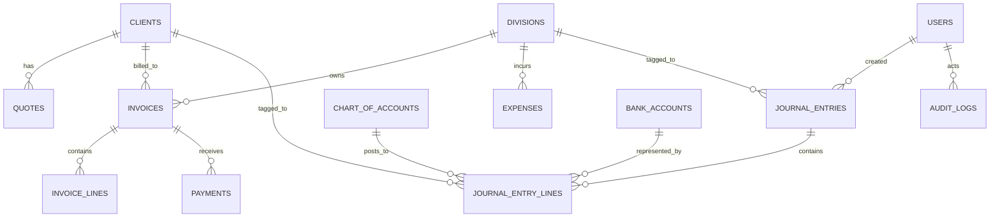

# PMG Manual Bookkeeping MVP — Phase 2: Database Schema Plan

This document details the recommended database schema and Chart of Accounts design for PMG's manual, cash-basis, non-VAT bookkeeping engine.

---

## 1. Schema Architecture Overview

To maintain codebase integrity, we will separate the accounting models from the existing billing, income, and expense tables. The accounting schemas will live in a new database file: `packages/db/src/schema/accounting.ts`.

The following ER diagram shows how the new accounting tables integrate with existing PMG core tables:



---

## 2. Table Evaluations (MVP vs. Future)

The tables below are categorized by whether they are required for the initial **Cash-Basis MVP** or should be deferred to future phases:

| Table Name | Scope | Purpose | Key Columns | Relationships | Reuses Existing? | Migration Risk |
|---|---|---|---|---|---|---|
| `chart_of_accounts` | **MVP** | Master list of all internal ledger accounts | `id`, `code`, `name`, `type`, `isActive` | None | No, new master table | Low |
| `bank_accounts` | **MVP** | Internal manual bank/cash registers (no feeds) | `id`, `code`, `name`, `accountType`, `openingBalance` | Links to `chart_of_accounts` | No, new master table | Low |
| `journal_entries` | **MVP** | Transaction headers representing a business event | `id`, `entryDate`, `sourceType`, `sourceId`, `description` | One-to-Many with lines; tags to `division` | No, new transaction table | Low |
| `journal_entry_lines` | **MVP** | Debit and credit rows representing account changes | `id`, `journalEntryId`, `accountId`, `debit`, `credit` | Many-to-One with headers/accounts | No, new transaction table | Low |
| `audit_logs` | **MVP** | Immutable trail of system changes | `id`, `entityType`, `entityId`, `action`, `actorUserId` | Links to `users` | No, new security table | Low |
| `manual_reconciliations` | **Future** | Reconciling statements with ledger cash entries | `id`, `bankAccountId`, `reconciledDate` | Links to `bank_accounts` | No, future table | Medium |
| `suppliers` | **Future** | Supplier/vendor registry for accounts payable | `id`, `name`, `email`, `phone`, `isActive` | Links to `bills` | No, future table | Low |
| `bills` | **Future** | Supplier bills/invoices received | `id`, `supplierId`, `billDate`, `dueDate`, `total` | Links to `suppliers` | No, future table | Low |
| `bill_payments` | **Future** | Payments made to suppliers for bills | `id`, `billId`, `bankAccountId`, `amount` | Links to `bills`, `bank_accounts` | No, future table | Low |
| `credit_notes` | **Future** | Reductions/adjustments to issued invoices | `id`, `invoiceId`, `amount`, `date` | Links to `invoices` | No, future table | Medium |
| `refunds` | **Future** | Record of client payment reversals | `id`, `incomeId`, `amount`, `date` | Links to `income` | No, future table | Medium |
| `tax_settings` | **Future** | VAT registration details and tax rate configurations | `id`, `isVatRegistered`, `vatNumber`, `effectiveDate` | None | No, future settings table | Low |
| `attachments` | **Future** | Receipts and support documents for invoices/expenses | `id`, `entityType`, `entityId`, `fileUrl` | Dynamic reference | No, future table | Low |

---

## 3. Recommended Chart of Accounts (PMG COA)

The Chart of Accounts is designed for **non-VAT cash-basis operation** supporting multiple divisions.

> [!TIP]
> **Divisions as a Dimension:** We recommend keeping `divisionId` as a separate column on transactions and journal entry lines instead of creating duplicated accounts per division (e.g. creating separate service revenue accounts for each division). This keeps the COA compact and makes reporting easier.

### Assets (1000 - 1999)
- **`1001` - Business Bank Account:** Main operating cash account.
- **`1002` - Cash on Hand:** For small cash transactions.
- **`1100` - Accounts Receivable:** Keep as a placeholder (operational only in cash-basis, used in accrual phase).

### Liabilities (2000 - 2999)
- **`2000` - General Liabilities:** Temporary liabilities placeholder.
- **`2300` - Loans Payable:** Used if loan tracking is wired to accounting.

### Equity (3000 - 3999)
- **`3000` - Owner Equity:** Capital contributions by owners.
- **`3100` - Retained Earnings:** Accumulated net earnings rolled forward.
- **`3200` - Owner Drawings:** Cash withdrawals by owner (P&L unaffected).

### Revenue (4000 - 4999)
- **`4000` - Service Revenue:** Global service income.
- **`4900` - Other Income:** Non-invoice receipts (e.g. interest).

### Expenses (5000 - 5999)
- **`5000` - General Expenses:** Catch-all expense.
- **`5100` - Software & Subscriptions:** SaaS applications and tools.
- **`5200` - Printing & Stationery:** Consumables.
- **`5300` - Transport & Courier:** Deliveries and travel.
- **`5400` - Marketing:** Promotional campaigns.
- **`5500` - Communication:** Telephone and internet.
- **`5600` - Professional Fees:** External contractors, legal, bookkeeping.
- **`5700` - Bank Charges:** Merchant fees and transaction charges.
- **`5800` - Office/Admin Expenses:** General office overheads.
- **`5900` - Miscellaneous Expenses:** Uncategorized monthly spend.

---

## 4. Drizzle ORM Schema Plan (`packages/db/src/schema/accounting.ts`)

```typescript
import {
  boolean,
  date,
  index,
  numeric,
  pgEnum,
  pgTable,
  text,
  timestamp,
  unique,
  uuid,
  jsonb,
} from "drizzle-orm/pg-core";
import { relations, sql } from "drizzle-orm";
import { divisions } from "./divisions";
import { clients } from "./clients";

// ── Enums ─────────────────────────────────────────────────────────────────────

export const accountTypeEnum = pgEnum("account_type", [
  "asset",
  "liability",
  "equity",
  "revenue",
  "expense",
]);

export const bankAccountTypeEnum = pgEnum("bank_account_type", [
  "checking",
  "savings",
  "cash",
  "credit_card",
]);

export const journalSourceEnum = pgEnum("journal_source", [
  "payment",
  "income",
  "expense",
  "draw",
  "transfer",
  "manual",
]);

// ── chart_of_accounts ─────────────────────────────────────────────────────────

export const chartOfAccounts = pgTable(
  "chart_of_accounts",
  {
    id: uuid("id").primaryKey().defaultRandom(),
    code: text("code").notNull().unique(), // e.g. "1001", "4000"
    name: text("name").notNull(),
    type: accountTypeEnum("type").notNull(),
    isActive: boolean("is_active").notNull().default(true),
    createdAt: timestamp("created_at", { withTimezone: true }).defaultNow().notNull(),
    updatedAt: timestamp("updated_at", { withTimezone: true }),
  },
  (t) => [
    index("coa_code_idx").on(t.code),
    index("coa_type_idx").on(t.type),
  ]
);

export type ChartOfAccount = typeof chartOfAccounts.$inferSelect;
export type NewChartOfAccount = typeof chartOfAccounts.$inferInsert;

// ── bank_accounts ─────────────────────────────────────────────────────────────

export const bankAccounts = pgTable(
  "bank_accounts",
  {
    id: uuid("id").primaryKey().defaultRandom(),
    accountId: uuid("account_id")
      .notNull()
      .references(() => chartOfAccounts.id, { onDelete: "restrict" }),
    name: text("name").notNull(),
    accountType: bankAccountTypeEnum("account_type").notNull().default("checking"),
    openingBalance: numeric("opening_balance", { precision: 12, scale: 2 }).notNull().default("0"),
    openingBalanceDate: date("opening_balance_date").notNull(),
    isActive: boolean("is_active").notNull().default(true),
    createdAt: timestamp("created_at", { withTimezone: true }).defaultNow().notNull(),
    updatedAt: timestamp("updated_at", { withTimezone: true }),
  }
);

export type BankAccount = typeof bankAccounts.$inferSelect;
export type NewBankAccount = typeof bankAccounts.$inferInsert;

// ── journal_entries ───────────────────────────────────────────────────────────

export const journalEntries = pgTable(
  "journal_entries",
  {
    id: uuid("id").primaryKey().defaultRandom(),
    entryDate: date("entry_date").notNull(),
    sourceType: journalSourceEnum("source_type").notNull().default("manual"),
    sourceId: uuid("source_id"), // Soft reference to invoiceId, paymentId, etc.
    referenceNo: text("reference_no"),
    description: text("description").notNull(),
    divisionId: uuid("division_id")
      .references(() => divisions.id, { onDelete: "restrict" }),
    createdBy: text("created_by").notNull(), // User text ID from Better Auth
    createdAt: timestamp("created_at", { withTimezone: true }).defaultNow().notNull(),
    updatedAt: timestamp("updated_at", { withTimezone: true }),
  },
  (t) => [
    index("je_date_idx").on(t.entryDate),
    index("je_source_idx").on(t.sourceType, t.sourceId),
    index("je_division_idx").on(t.divisionId),
  ]
);

export type JournalEntry = typeof journalEntries.$inferSelect;
export type NewJournalEntry = typeof journalEntries.$inferInsert;

// ── journal_entry_lines ───────────────────────────────────────────────────────

export const journalEntryLines = pgTable(
  "journal_entry_lines",
  {
    id: uuid("id").primaryKey().defaultRandom(),
    journalEntryId: uuid("journal_entry_id")
      .notNull()
      .references(() => journalEntries.id, { onDelete: "cascade" }),
    accountId: uuid("account_id")
      .notNull()
      .references(() => chartOfAccounts.id, { onDelete: "restrict" }),
    debit: numeric("debit", { precision: 12, scale: 2 }).notNull().default("0"),
    credit: numeric("credit", { precision: 12, scale: 2 }).notNull().default("0"),
    memo: text("memo"),
    clientId: uuid("client_id")
      .references(() => clients.id, { onDelete: "restrict" }),
    divisionId: uuid("division_id")
      .references(() => divisions.id, { onDelete: "restrict" }),
  },
  (t) => [
    index("jel_entry_idx").on(t.journalEntryId),
    index("jel_account_idx").on(t.accountId),
    index("jel_client_idx").on(t.clientId),
    index("jel_division_idx").on(t.divisionId),
  ]
);

export type JournalEntryLine = typeof journalEntryLines.$inferSelect;
export type NewJournalEntryLine = typeof journalEntryLines.$inferInsert;

// ── audit_logs ────────────────────────────────────────────────────────────────

export const auditLogs = pgTable(
  "audit_logs",
  {
    id: uuid("id").primaryKey().defaultRandom(),
    entityType: text("entity_type").notNull(), // e.g. 'invoice', 'payment', 'expense'
    entityId: uuid("entity_id").notNull(),
    action: text("action").notNull(), // e.g. 'create', 'update', 'delete', 'void'
    beforeJson: jsonb("before_json"),
    afterJson: jsonb("after_json"),
    actorUserId: text("actor_user_id").notNull(),
    timestamp: timestamp("timestamp", { withTimezone: true }).defaultNow().notNull(),
  },
  (t) => [
    index("audit_entity_idx").on(t.entityType, t.entityId),
    index("audit_actor_idx").on(t.actorUserId),
  ]
);

export type AuditLog = typeof auditLogs.$inferSelect;
export type NewAuditLog = typeof auditLogs.$inferInsert;

// ── Relations ─────────────────────────────────────────────────────────────────

export const chartOfAccountsRelations = relations(chartOfAccounts, ({ many }) => ({
  lines: many(journalEntryLines),
}));

export const journalEntriesRelations = relations(journalEntries, ({ one, many }) => ({
  lines: many(journalEntryLines),
  division: one(divisions, {
    fields: [journalEntries.divisionId],
    references: [divisions.id],
  }),
}));

export const journalEntryLinesRelations = relations(journalEntryLines, ({ one }) => ({
  entry: one(journalEntries, {
    fields: [journalEntryLines.journalEntryId],
    references: [journalEntries.id],
  }),
  account: one(chartOfAccounts, {
    fields: [journalEntryLines.accountId],
    references: [chartOfAccounts.id],
  }),
  client: one(clients, {
    fields: [journalEntryLines.clientId],
    references: [clients.id],
  }),
  division: one(divisions, {
    fields: [journalEntryLines.divisionId],
    references: [divisions.id],
  }),
}));
```

---

## 5. Posting Rules Reference Card

For the PMG Manual Bookkeeping MVP, all accounting postings are **cash-basis**. Journal entries are generated ONLY on cash transactions.

### 1. Invoice Creation
* **Posting:** None. Invoice remains operational-only in the billing module.
* **AR Subledger:** Unpaid invoices are tracked via client statements and aging reports, but no double-entry ledger entries are created.

### 2. Payment Received against Invoice
* **Trigger:** An invoice is marked paid or a partial payment is recorded.
* **Double-entry post:**
  * **Debit:** `1001 - Business Bank Account` (global cash asset) — amount paid.
  * **Credit:** `4000 - Service Revenue` (revenue, tagged to invoice's client/division) — amount paid.

### 3. Manual Income Recorded (Without Invoice)
* **Trigger:** User manually registers non-invoice income.
* **Double-entry post:**
  * **Debit:** `1001 - Business Bank Account` or `1002 - Cash on Hand` — amount received.
  * **Credit:** `4900 - Other Income` or `4000 - Service Revenue` (revenue, tagged to division) — amount received.

### 4. Expense Paid
* **Trigger:** User records an expense.
* **Double-entry post:**
  * **Debit:** `5xxx - [Expense Account]` (e.g., `5100 - Software & Subscriptions`, tagged to division) — amount spent.
  * **Credit:** `1001 - Business Bank Account` or `1002 - Cash on Hand` — amount spent.

### 5. Owner Withdrawal (Drawings)
* **Trigger:** Owner draws funds from the business bank account.
* **Double-entry post:**
  * **Debit:** `3200 - Owner Drawings` (equity, tagged to PMG global) — amount drawn.
  * **Credit:** `1001 - Business Bank Account` — amount drawn.
* **Warning:** Drawings must not be categorized as an expense and do not affect the P&L.

### 6. PMG Internal Share Allocations
* **Rule:** Internal profit pool allocations (salary, reinvest, reserve, flex) are managerial metrics and should **not** write journal entries or be double-counted as P&L expenses.
* **Spending Allocations:** If cash is actually spent *out* of an allocation (e.g. paying professional fees or buying software), it should be posted as a standard expense (Dr Expense / Cr Bank) and categorized appropriately in the P&L.

---

## 6. Migration & Integrity Plan

### 1. Verification of Transaction Balance
Before inserting any journal entry, verify that:
$$\sum Debits = \sum Credits$$
Any transaction where $\sum Debits \neq \sum Credits$ must throw an error, aborting the write.

### 2. Database Transactions
All postings (creating a payment, recording an expense) must wrap the core write and the journal entry writes inside a single database transaction:
```typescript
await db.transaction(async (tx) => {
  // 1. Write the payment/expense row
  // 2. Write the journal Entry header
  // 3. Write the journal Entry lines (Dr Bank / Cr Revenue)
  // 4. Assert totals balance
});
```

### 3. Migration Risks & Backfill
- **Data Backfill:** Existing historical `income` and `expenses` must be converted to balanced journal entries. We must execute a migration script that queries all historical records and writes matching journal entries.
- **Period Locks:** Disable the `isPeriodClosed` check temporarily during the execution of the backfill migration script.
- **Loans module:** The loans module remains purely operational in the MVP. Repayments and draws will not post journal entries to the ledger for now.

