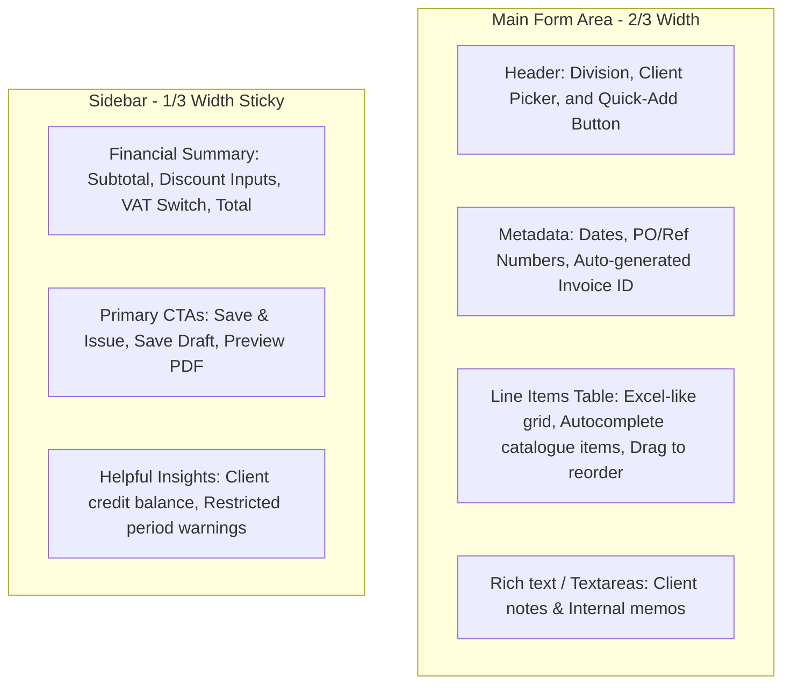

# Quotation & Invoice UI/UX Research Report
An analysis of design patterns, layout architectures, and interactive workflows from leading invoicing systems (Stripe, Xero, FreshBooks, Wave) with actionable recommendations and an implementation plan for **PMG Hub**.

---

## 0. Executive Overview & Summary

This report analyzes UI/UX best practices of industry-leading billing software (**Stripe, Xero, FreshBooks, and Wave**) to guide the modernization of PMG Hub's invoicing and quotation screens. 

### Key Takeaways:
* **The Core Tension:** Professional accountants demand dense, keyboard-driven layouts for high-volume entry, while business clients expect highly visual, brand-aligned documents and payment screens. The ideal system offers an efficient entry form alongside a real-time layout preview.
* **Competitor Strengths:** Stripe excels at frictionless payment integration and live preview templates. Xero is the benchmark for advanced tax rules and keyboard-driven layout options. FreshBooks shows how estimates can be turned into rich, interactive proposals that convert to invoices in one click. Wave showcases clean, minimal data entry for freelancers.
* **The Objective for PMG Hub:** Elevate the current [invoice-form-client.tsx](file:///D:/dev/websites/pmg-hub/apps/admin/src/app/(admin)/billing/invoices/new/invoice-form-client.tsx) and [quote-form-client.tsx](file:///D:/dev/websites/pmg-hub/apps/admin/src/app/(admin)/billing/quotes/new/quote-form-client.tsx) components by introducing inline entity modals, rapid-entry keyboard support, a document layout preview tab, and a seamless quote-to-invoice conversion pipeline.

---

## 1. Design Philosophies of Market Leaders
Designing invoice and quotation software requires balancing the needs of two distinct audiences:
1. **The Creator (Admin/Bookkeeper):** Needs speed, efficiency, keyboard accessibility, clear validation, and reduced cognitive load during data entry.
2. **The Recipient (Client/Payer):** Needs extreme clarity, brand consistency, mobile readability, secure payment portals, and friction-free payment or approval calls-to-action (CTAs).

Below is a high-level comparison of the design philosophies of the market leaders:

| Platform | Core Design Philosophy | Primary UX Strength | Target Audience | Key Differentiator |
| :--- | :--- | :--- | :--- | :--- |
| **Stripe** | Minimalist & API-first | Frictionless payments, live side-by-side preview, unified brand styles. | SaaS, Developers, Modern Tech Startups | Unified brand settings propagate instantly across email, hosted payment page, PDF, and client billing portal. |
| **Xero** | Clean Accounting Rigor | Advanced tax rules, standardized structures, deep accounting audit trails. | Small-to-Medium Businesses (SMBs), Accountants | **Advanced templates** customizable via external files (e.g. DOCX), drag-and-drop file attachments anywhere. |
| **FreshBooks** | Relationship & Service-Led | Beautiful client experience, modular proposal builders with rich content. | Freelancers, Agency Owners, Service Businesses | **Rich content proposals** featuring Executive Summaries, Timelines, and legally-binding E-Signatures that convert to invoices in 1 click. |
| **Wave** | Cost-Effective Simplicity | Simplified workflows, immediate ledger entry, low learning curve. | Solopreneurs, Very Small Businesses (VSBs) | Extremely clean, non-cluttered interface focused solely on essential details, making it incredibly approachable for non-accountants. |

---

## 2. Competitive Deep-Dive & Key UI/UX Patterns

### Stripe Invoicing: The WYSIWYG & Branding Standard
Stripe prioritizes payment speed and developer control. Their invoice editor features a split-pane layout:
* **The Split Screen Editor:** The left side is a streamlined input form, and the right side is an **exact live-preview rendering** of the client's invoice. This removes uncertainty about margins, colors, and layout spacing.
* **Propagation of Brand Assets:** Instead of setting styles per invoice, Stripe utilizes a centralized dashboard style page where you define a primary brand color, accent color, logo, and icon. These flow automatically to:
  * The PDF invoice.
  * The Stripe-hosted payment screen.
  * The client-facing transactional emails.
  * The customer self-service portal.
* **Customer Billing Portal:** Stripe hosts a customer-facing portal where clients can log in, view historical invoices, update their payment details (e.g., credit cards, tax IDs), and download PDF receipts.

### Xero: The Power-User Tension (Classic vs. New)
Xero’s transition from their "Classic Invoicing" UI to "New Invoicing" (completed in early 2025) offers a valuable case study in user behavior:
* **The Keyboard-Centric Workflow:** Early iterations of Xero's new design received pushback from accountants because it introduced a higher visual spacing, larger fonts, and more mouse clicks. Power users who enter 50+ invoices a day rely entirely on keyboard navigation:
  * Using `Tab` and `Shift+Tab` to fly through cells.
  * Autocomplete drop-downs that select items instantly without needing a mouse.
  * Compact grids to fit more lines on-screen.
* **The Resolution:** Xero had to release a **"Compact View"** option for their line-item table and explicitly optimize keyboard shortcuts (e.g., automated row addition upon pressing `Tab` on the final column's unit price) to win back efficiency scores.
* **Drag-and-Drop Attachment:** Xero allows users to drag files (receipts, work logs, signed contracts) directly onto the invoice canvas, attaching supporting documents instantly to the transaction record.

### FreshBooks: Turning Quotes into Sales Proposals
For service businesses, a quote isn't just a list of items; it’s a pitch. FreshBooks excels here:
* **Modular Proposals:** While an estimate is just a cost breakdown, FreshBooks offers "Proposals." These allow creators to write rich-text sections directly on the document, adding sections like:
  * **Executive Summary:** Describing the client's pain points.
  * **Scope of Work:** Detailing deliverables.
  * **Timeline/Milestones:** Showing when work will be completed.
* **Interactive Approvals:** The client receives a link where they can view the proposal, ask questions in a threaded comment section on the page, and sign using an **integrated e-signature block**. Once signed, the creator can click a single button to "Convert to Invoice," transferring all line items, totals, and client records automatically.

---

## 3. Standard Anatomy of an Invoice Creation Page
From analyzing these platforms, a highly efficient invoice editor should adhere to a structured visual hierarchy. The page layout is typically split into a **Main Form Area** (2/3 width) and a **Summary & Actions Sidebar** (1/3 width, sticky).

### Key Anatomy Details:
1. **Client Header:** Standardizing the positioning of Client Name and Sender (Division) details. It is best to display the client's billing address directly beneath their selector so the user can verify it visually without opening a separate tab.
2. **Flexible Line Items Table:** Columns should be ordered logically from left to right:
   `Item Selector` ➔ `Description (expanding textarea)` ➔ `Quantity` ➔ `Unit Price` ➔ `Amount (auto-calculated)`.
3. **Internal Memos vs. Client Notes:** A common UI pitfall is failing to distinguish between notes meant for the client (e.g., bank details, terms) and internal annotations (visible only to administrators). Modern UIs use clearly separated fields: a public "Client Notes" text area and a private "Internal Comments" box.

---

## 4. Interactive UI Patterns & UX Enhancements

To design a premium, "wow" factor invoicing tool, the following micro-interactions and smart default features should be integrated:

### A. Live Side-by-Side PDF Preview
* **UX Benefit:** Prevents layout issues, text overflows, and logo misalignment.
* **Implementation Pattern:** On desktop viewports, split the layout 50/50 or use a sliding sheet. As the user types the client's name or changes an item price, the PDF preview updates in real-time. On mobile devices, replace the side-by-side layout with a prominent floating "Preview" button.

### B. Inline Entity Creation (Modal triggers)
* **UX Benefit:** Saves the user from losing their progress.
* **Implementation Pattern:** Inside client or catalog item drop-down lists, the very first option should be a styled button: `+ Add New Client` or `+ Create New Catalogue Item`. Clicking this opens a small, focused dialog. Upon submission, the new item is selected in the active form row, keeping the creator in their current workflow context.

### C. Keyboard Shortcuts for Power Users
* **UX Benefit:** Rapid data entry without mouse usage.
* **Target Actions:**
  * `Tab` on the unit price of the last row automatically appends a new empty line item.
  * `Alt + N` adds a new row.
  * `Enter` inside form fields proceeds down columns or adds rows.
  * Standard escape keys to close modals.

### D. Audit Logs & Document History
* **UX Benefit:** Transparency in team billing environments.
* **Implementation Pattern:** A chronological feed at the bottom or side of the invoice showing:
  * `June 12, 14:00` - Created by John Doe.
  * `June 12, 14:05` - Converted from Quote #Q-1002.
  * `June 13, 09:12` - Emailed to client (delivered).
  * `June 14, 15:45` - Client viewed invoice.
  * `June 15, 10:00` - Paid via Credit Card (Stripe Gateway).

---

## 5. Contextual Analysis for PMG Hub

Reviewing the current Next.js implementation of [invoice-form-client.tsx](file:///D:/dev/websites/pmg-hub/apps/admin/src/app/(admin)/billing/invoices/new/invoice-form-client.tsx) and [quote-form-client.tsx](file:///D:/dev/websites/pmg-hub/apps/admin/src/app/(admin)/billing/quotes/new/quote-form-client.tsx), here are the existing strengths and proposed high-value enhancements to align PMG Hub with industry leaders:

### Current Strengths of PMG Hub:
* **Retainer Balance Warning:** The inline indicator for `Client Retainer Credit Available` is a fantastic UX pattern that prevents duplicate payments by nudging the admin to apply credit.
* **Smart Defaults:** Dynamically updating the due date based on the chosen division's `paymentTermsDays` simplifies input configuration.
* **Restricted Period Alerts:** Warning the user if the invoice falls in a restricted financial period avoids system errors at submission time.

### PMG Share Allocation Business Rule:
In the PMG Hub ecosystem, billing is directly coupled with the backend financial ledger. Specifically, the system dictates that a portion of gross invoice revenue is allocated to the **PMG Share** account off the top (before profit pool distribution).
* **Code vs. Documentation Discrepancy:** The architecture document ([pmg-financial-model.md](file:///D:/dev/websites/pmg-hub/docs/architecture/pmg-financial-model.md)) and ledger reports define PMG Share as **20%** of gross revenue. However, the backend database config ([accounts.ts](file:///D:/dev/websites/pmg-hub/packages/db/src/accounts.ts#L24)) is currently set to **25%** (`pmg_share: 0.25`), and the dashboard KPI grid ([kpi-grid.tsx](file:///D:/dev/websites/pmg-hub/apps/admin/src/components/dashboard/kpi-grid.tsx#L159)) uses a hardcoded `0.25` calculation. This discrepancy should be aligned.
* **UI/UX Recommendation:**
  1. **Invoice Financial Breakdown:** On the invoice detail screen (for administrators only), include a subtle financial allocation section: `Gross Amount` ➔ `PMG Share (20% / 25%)` ➔ `Net Profit Pool`. This immediately connects invoice actions to the business's overall ledger balance.
  2. **Payment Allocation Feedback:** On the invoice payments log/detail screens, display a visual progress bar or card showing how the received payments are distributed across the respective allocations (PMG Share, Salary, Reinvest, Reserve, Flex).

---

## 6. Development Phases & Implementation Plan

To implement these changes without disrupting the current system or risking regression, the work is divided into four chronological development phases.

### Phase 1: High-Speed Navigation & Validation (Keyboard Optimization)
* **Goal:** Improve the speed and efficiency of data entry for administrative power users.
* **Key Tasks:**
  1. **Keyboard-Driven Row Insertion:** Modify `<BillingLineItemsForm>` to detect `Tab` press on the final input field of the last line-item row. When pressed, automatically trigger `setLineItems([...lineItems, blankRow()])`.
  2. **Row Manipulation Shortcuts:** Add simple keyboard shortcuts (e.g., `Alt + N` for adding rows, `Alt + D` for deleting active rows).
  3. **Visual Button Hierarchy:** Refactor the primary and secondary CTAs in the sidebar. Apply primary color (e.g. emerald/indigo) to "Issue Invoice" / "Save Changes" and clear outline styles to "Save as Draft" so the visual priority is obvious.
* **Success Criteria:** A user can fill out and save an entire multi-row invoice without touching their mouse.

### Phase 2: Inline Dialogs for Fast Data Management (Modal Integrations)
* **Goal:** Allow users to add new clients or catalog items without navigating away from the current form.
* **Key Tasks:**
  1. **Client Select Modal Trigger:** Add a custom item `+ Add New Client` at the top of the client list in the `<Select>` component.
  2. **Catalog Item Modal Trigger:** Inside the catalog item selector, display `+ Add New Product/Service` as an inline trigger.
  3. **Dialog System Integration:** Create reusable modals (`<CreateClientDialog>` and `<CreateItemDialog>`) utilizing the shadcn Dialog component.
  4. **State Handling:** Upon submission of the modal, invoke the respective server action, append the new item/client to the parent state lists, and automatically set the form's active client ID or row item ID to the newly created entity.
* **Success Criteria:** The creator can define a new client and catalog items inline during invoice setup without losing input progress.

### Phase 3: Document Layout & Live WYSIWYG Preview Panel
* **Goal:** Increase user confidence and eliminate formatting errors prior to sending.
* **Key Tasks:**
  1. **Preview Toggle Tab:** Integrate a sliding sheet panel or an editor tab toggle: `[ Edit Details ]` and `[ Preview Invoice ]`.
  2. **Dynamic Preview Canvas:** Build an HTML/CSS layout representation of the invoice/quote PDF. It must dynamically read and render form state inputs, including:
     * Chosen division's business logo, address, and billing details.
     * Selected client details.
     * Computed line-item table calculations (subtotals, VAT, discounts).
     * Populated client notes and payment instructions.
  3. **Mobile Layout Adaptation:** On mobile viewports, collapse the split screen and render the preview inside a floating bottom action sheet.
* **Success Criteria:** Real-time updates on the preview canvas mirror the final issued PDF layout.

### Phase 4: Seamless Workflow Conversions & Activity Feeds (Audit Logging)
* **Goal:** Unify the billing lifecycle and provide clear historical context for transactions.
* **Key Tasks:**
  1. **One-Click Quote Conversion:** Create a route handler/action `convertQuoteToInvoice(quoteId)` that copies line items, billing settings, notes, and references from the quote database table directly into a new invoice form context.
  2. **Interactive Activity Timeline:** Implement a graphical audit trail (Timeline UI) on the invoice and quote details pages showing creation dates, conversion links, email delivery status, client page view timestamp, and payment events.
  3. **Payment Sync Notifications:** Connect stripe webhooks or payment callbacks to trigger status updates instantly in the UI.
* **Success Criteria:** Quotes can be converted to invoices instantly, and all corresponding database actions appear chronologically in an interactive detail panel.

---

## 7. Visual Layout References (Dribbble/Mobbin Style Guide)
For styling the elements using the existing Tailwind/shadcn tokens, implement the following themes:
* **Shadows & Borders:** Use subtle borders (`border-muted/60`) and very light drop shadows (`shadow-sm`) to define container borders, ensuring the document layout mimics a real paper invoice sheet overlay.
* **Micro-animations:** Add a brief scale animation on row deletion (`transition-all duration-200 ease-out scale-95 opacity-0`) and simple hover states on catalog items.
* **Typography:** Bold numeric totals (`font-mono tracking-tight text-lg font-bold`) to ensure financial values stand out cleanly.
