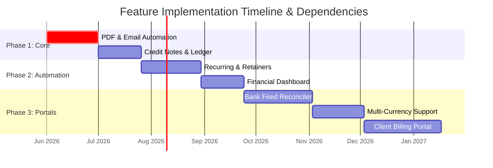

# Product Roadmap: Future Features & Build Order

This roadmap outlines the recommended order of development for future features, structured logically so that each upgrade builds upon stable dependencies, preventing code refactoring and ensuring seamless integrations.

---

## 🗺️ Recommended Build Order Summary

---

## 📋 Detailed Feature Specifications & Roadmap

### 1. Automated PDF Billing & Email Dispatch (via Resend)
* **Priority**: High (Phase 1)
* **Description**: Automatically compiles quotes/invoices into official, styled PDF documents and dispatches them directly to the client's email inbox using your existing **Resend** integration. It also handles polite, automated email reminders for overdue invoices.
* **Why Build First**: You already have Resend configured in your `package.json`. PDF and email delivery represent the absolute core operational necessity of any billing system and bring immediate client-facing value with minimal architectural complexity.

---

### 2. Credit Notes & Ledger Adjustments
* **Priority**: Medium-High (Phase 1)
* **Description**: A formal, audit-compliant module to handle invoice corrections, service cancellations, or overcharges. It introduces a `credit_notes` table to adjust invoice outstanding balances downward without editing historically closed invoice documents.
* **Why Build Second**: This directly expands your Core Billing database schema (`billing.ts`) and hooks cleanly into the **Client Credit Ledger** (overpayments) we just planned, completing your transaction ledger logic.

---

### 3. Recurring Invoices & Retainer Contracts
* **Priority**: Medium (Phase 2)
* **Description**: Automates predictable recurring cycles (e.g. monthly hosting retainers, SLA support fees). Allows you to create "Recurring Templates" that automatically generate, print to PDF, and email the invoice on a set schedule (e.g., the 1st of every month).
* **Why Build Third**: This feature **directly depends** on the automated PDF compiler and Resend email dispatcher (Feature #1) to deliver the generated invoices to the client without manual admin intervention.

---

### 4. Interactive Financial Health & Accounts Receivable (Aging) Analytics
* **Priority**: Medium (Phase 2)
* **Description**: Generates rich interactive charts (using `recharts` which is already in your admin dependencies) showing monthly P&L, expense category breakdowns, division metrics, and an **Accounts Receivable Aging Report** (30-day, 60-day, 90-day overdue buckets).
* **Why Build Fourth**: Business intelligence and charts are only useful when the underlying financial transactions are stable. Building this after Credit Notes and Recurring Invoices are complete ensures your financial stats are 100% accurate.

---

### 5. Bank Feed Reconciler (CSV/OFX Statement Upload)
* **Priority**: Medium-Low (Phase 3)
* **Description**: A visual reconciliation panel where you can drag-and-drop your bank statement exports. The system matches deposit and withdrawal rows against unpaid invoices, clients, or expenses based on reference text and amounts, letting you reconcile your books in seconds.
* **Why Build Fifth**: Reconciling deposits relies heavily on the **Partial Payments & Multi-Invoice Allocation** server actions. Building it now ensures the bank reconciler can safely trigger stable, pre-tested allocation flows.

---

### 6. Multi-Currency Ledger Support (e.g., USD / EUR / ZAR)
* **Priority**: Low (Phase 3)
* **Description**: Allows you to quote and invoice international clients in their home currencies (like USD or EUR) with real-time exchange rate updates, while dynamically converting and posting the South African Rand (ZAR) equivalent to your internal general ledger.
* **Why Build Sixth**: Multi-currency touches almost every table (pricing catalogs, invoices, quotes, snapshots, income). It is best introduced late once the single-currency workflows are completely mature to avoid severe database restructuring.

---

### 7. Client Self-Service Billing Portal
* **Priority**: Low (Phase 3)
* **Description**: A secure, public-facing portal where clients can securely log in using their credentials to view outstanding statements, accept/decline quotations, download PDF documents, and view their unallocated retainer credits.
* **Why Build Last**: The most complex feature. It requires building public/private auth boundaries, secure client login profiles, and public route configurations. It should only be built on top of an administrative core that is already fully mature.
