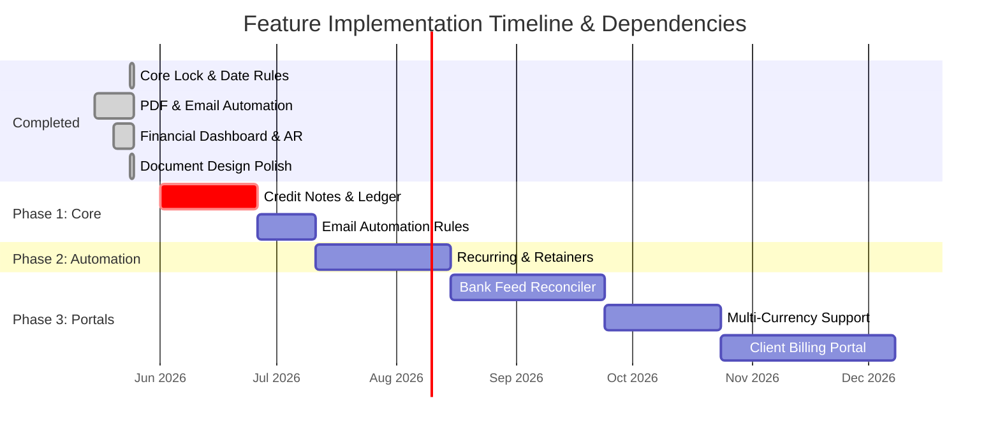

# Product Roadmap: Future Features & Build Order

This roadmap outlines the recommended order of development for future features, structured logically so that each upgrade builds upon stable dependencies, preventing code refactoring and ensuring seamless integrations.

---

## 🗺️ Recommended Build Order Summary

---

## 🚀 Recently Completed (May 2026)

### Core Date Engine, Validation & Layout Polishes
* **Status**: ✅ **100% Completed**
* **Delivered Upgrades**:
  * **Fixed Future Lock Bug:** Resolved `isPeriodClosed` logic where future dates were incorrectly marked closed after day 5 of the current month.
  * **Future-Dated Invoices & Quotes:** Enabled scheduling/planning quotes and invoices in the future. Removed `max={today}` frontend caps and backend validation blocks.
  * **Strict Open-Period Payments:** Restricted payment receipt dates to `<= today` in both backend and frontend. Added blocking frontend validation that prevents recording a payment backdated into closed financial periods.
  * **Invoice Reference Display:** Fixed a visual gap in the invoice document preview, rendering the invoice's reference metadata cleanly below company details.
  * **Aging Report Accuracy:** Filtered out future-dated invoices (`invoice_date <= CURRENT_DATE`) from the outstanding AR aging report to keep near-term cash expectations accurate.
  * **Premium Design Polish:** Added a premium deep-blue (`border-t-blue-700`) brand color accent top-border to Document Previews and implemented `print:break-inside-avoid` CSS rules to banking details, statement aging tables, notes/terms, and document table rows to ensure clean, seamless multi-page PDF prints.

---

## 📋 Detailed Feature Specifications & Roadmap

### 1. Automated PDF Billing & Email Dispatch (via Resend)
* **Priority**: High (Phase 1)
* **Description**: Automatically compiles quotes/invoices into official, styled PDF documents and dispatches them directly to the client's email inbox using your existing **Resend** integration. 
* **Why Build First**: You already have Resend configured in your `package.json`. PDF and email delivery represent the absolute core operational necessity of any billing system and bring immediate client-facing value with minimal architectural complexity.

---

### 2. Credit Notes & Ledger Adjustments
* **Priority**: Medium-High (Phase 1)
* **Description**: A formal, audit-compliant module to handle invoice corrections, service cancellations, or overcharges. It introduces a `credit_notes` table to adjust invoice outstanding balances downward without editing historically closed invoice documents.
* **Why Build Second**: This directly expands your Core Billing database schema (`billing.ts`) and hooks cleanly into the **Client Credit Ledger** (overpayments), completing your transaction ledger logic.

---

### 3. Document Design Polish (Brand Accent & Print Splits)
* **Priority**: High (Phase 1)
* **Description**: Elevates document layout aesthetics and printing resilience:
  * **Brand Color Accent:** Add a subtle 3px top-border accent line using a signature primary brand color (deep navy, slate, or brand teal) to A4 containers inside `DocumentPreview` to establish brand identity.
  * **Page-Fold Safety:** Add `print:break-inside-avoid` CSS rules to `DocumentPreview` banking blocks, notes/terms, and table rows to ensure they never split awkwardly across page breaks in multi-page PDF exports and physical prints.
* **Why Build Third**: A simple visual and CSS polish that brings immediate, professional UI improvements to quotes, invoices, and statements without database impact.

---

### 4. Transactional Emails (Payment "Thank You" & Outstanding Auto-Reminders)
* **Priority**: High (Phase 1)
* **Description**: Implements customer success and collection automation:
  * **Payment Success Email:** Automatically dispatch a beautifully styled "Thank You for Your Business" email with the paid invoice PDF receipt to clients immediately upon recording their payment.
  * **Auto-Reminder Email:** Automatically dispatch polite reminder emails for outstanding invoices to clients at predefined intervals (e.g. 3 days before due, on the due date, and 7 days past due).
* **Why Build Fourth**: Capitalizes on the PDF compilation and Resend email dispatcher engines created in Feature #1 to automate standard business touchpoints.

---

### 5. Recurring Invoices & Retainer Contracts
* **Priority**: Medium (Phase 2)
* **Description**: Automates predictable recurring cycles (e.g. monthly hosting retainers, SLA support fees). Allows you to create "Recurring Templates" that automatically generate, print to PDF, and email the invoice on a set schedule (e.g., the 1st of every month).
* **Why Build Fifth**: This feature **directly depends** on the automated PDF compiler and Resend email dispatcher (Feature #1) to deliver the generated invoices to the client without manual admin intervention.

---

### 6. Interactive Financial Health & Accounts Receivable (Aging) Analytics
* **Priority**: Medium (Phase 2)
* **Description**: Generates rich interactive charts (using `recharts` which is already in your admin dependencies) showing monthly P&L, expense category breakdowns, division metrics, and an **Accounts Receivable Aging Report** (30-day, 60-day, 90-day overdue buckets).
* **Why Build Sixth**: Business intelligence and charts are only useful when the underlying financial transactions are stable. Building this after Credit Notes and Recurring Invoices are complete ensures your financial stats are 100% accurate.

---

### 7. Bank Feed Reconciler (CSV/OFX Statement Upload)
* **Priority**: Medium-Low (Phase 3)
* **Description**: A visual reconciliation panel where you can drag-and-drop your bank statement exports. The system matches deposit and withdrawal rows against unpaid invoices, clients, or expenses based on reference text and amounts, letting you reconcile your books in seconds.
* **Why Build Seventh**: Reconciling deposits relies heavily on the **Partial Payments & Multi-Invoice Allocation** server actions. Building it now ensures the bank reconciler can safely trigger stable, pre-tested allocation flows.

---

### 8. Multi-Currency Ledger Support (e.g., USD / EUR / ZAR)
* **Priority**: Low (Phase 3)
* **Description**: Allows you to quote and invoice international clients in their home currencies (like USD or EUR) with real-time exchange rate updates, while dynamically converting and posting the South African Rand (ZAR) equivalent to your internal general ledger.
* **Why Build Eighth**: Multi-currency touches almost every table (pricing catalogs, invoices, quotes, snapshots, income). It is best introduced late once the single-currency workflows are completely mature to avoid severe database restructuring.

---

### 9. Client Self-Service Billing Portal
* **Priority**: Low (Phase 3)
* **Description**: A secure, public-facing portal where clients can securely log in using their credentials to view outstanding statements, accept/decline quotations, download PDF documents, and view their unallocated retainer credits.
* **Why Build Last**: The most complex feature. It requires building public/private auth boundaries, secure client login profiles, and public route configurations. It should only be built on top of an administrative core that is already fully mature.
