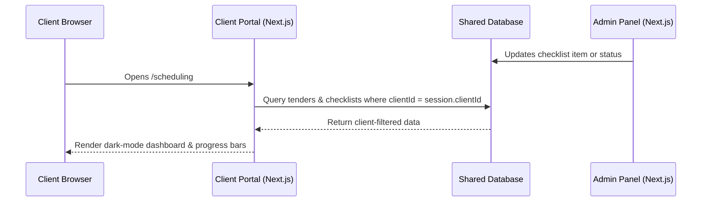

# Product Requirement Document (PRD) — Client Portal Scheduling & Progress View

**Date:** 2026-06-28  
**Status:** Draft  
**Target Module:** `/scheduling` (Client Portal Integration)  
**Author:** Antigravity (AI Coding Assistant)  

---

## 1. Objective & Goal
Expose the **Tender Scheduling & Progress** module to the **Client Portal**. 

The goal is to provide clients with real-time visibility into the preparation of their tenders. By offering transparency on returnable checklist items, milestones, and blockers, we reduce manual status updates (emails/calls) and keep clients actively engaged in providing missing documents.

---

## 2. Key Features & Requirements

### 2.1 Access Control & Security (Critical)
- **Tenant Isolation**: Clients must **only** see tenders belonging to their own `clientId` (derived from their secure portal session).
- **Read-Only Access**: The portal view is strictly read-only. Clients cannot create tenders, reorder the waterfall, modify dates, or check off checklist items.
- **Admin Control**: Only administrators (via the `admin` app) can modify the schedule, add/edit checklist items, and mark tasks as complete.

### 2.2 Client-Facing Dashboard View
Add a new **"Schedules" / "Project Progress"** tab in the client portal navigation.
When clicked, it shows:
1.  **Overview of Active Tenders**: List of active tenders with:
    *   Tender Reference / Name
    *   Overall Status (`Planned` | `In Progress` | `Completed` | `Submitted`)
    *   Dynamic **Progress Bar** (e.g. `75% Complete` based on checklist items)
    *   Target Completion Date & Closing Date
2.  **Interactive Progress Checklist**:
    *   Displays the custom sections (e.g., "Document Progress", "Returnable List Progress") and their checklist items.
    *   Completed items are shown with checkmarks; pending items are shown as empty/waiting.
3.  **Active Blockers Panel**:
    *   If the admin flags a blocker (e.g. "Awaiting company registration certificate from client"), this is highlighted in an amber warning callout at the top of the client's view.

### 2.3 Client-Friendly Timeline (Gantt Chart)
A simplified, dark-themed Gantt timeline showing:
- A horizontal bar representing the working window (Start Date → Target Completion Date).
- A marker representing the final Closing Date.
- A "Today" vertical line marker.
- *Note: Unlike the admin timeline, this will only show the client's own tenders and will not allow status modifications or drag-and-drop.*

---

## 3. UI/UX Design Specifications
- **Aesthetic**: Seamlessly integrates with the portal's premium dark mode theme (`bg-[#080c14]` and card background `bg-[#0a0f1d]`).
- **Responsive Layout**: The checklist and timeline must scale down elegantly to mobile screens. 
  - On mobile, the timeline will support horizontal scrolling (`overflow-x-auto`), and the checklist will stack vertically.
- **Client-Friendly Terminology**:
  - Replace internal terms like "Waterfall Queue" or "Buffer Days" with client-friendly phrases (e.g. "Upcoming Milestones", "Preparation Window").

---

## 4. Technical Architecture

### 4.1 Data Flow

### 4.2 Database Schema Extensions (Shared)
To support the checklist feature (as planned in the future Phase B), the database will use the following tables (which both `admin` and `portal` apps can read):
1.  **`tender_progress_sections`**:
    *   `id` (UUID, PK)
    *   `tenderId` (UUID, FK to `tender_schedule_entries`)
    *   `title` (text, e.g. "Returnable Documents")
    *   `sortOrder` (integer)
2.  **`tender_progress_items`**:
    *   `id` (UUID, PK)
    *   `sectionId` (UUID, FK to `tender_progress_sections`)
    *   `task` (text, e.g. "Pricing Schedule completed")
    *   `isCompleted` (boolean)
    *   `completedAt` (timestamp)
    *   `sortOrder` (integer)

---

## 5. Success Metrics
- **Reduced Communication Overhead**: Drop in client emails/calls asking "What is the status of our tender?".
- **Faster Turnaround**: Clients upload returnables faster due to clear visibility of pending items and active blockers.
