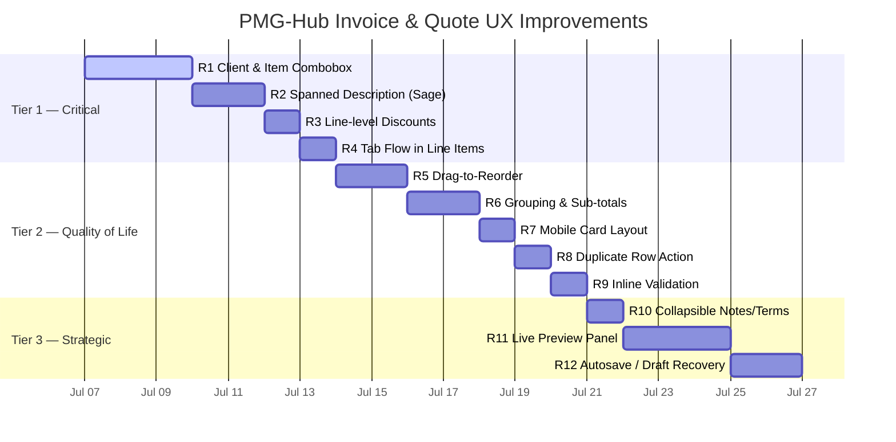

# Invoice & Quote Creation — UX/UI Research & Improvement Plan

> **Author:** Antigravity AI Research  
> **Date:** July 2026  
> **Scope:** PMG-Hub admin app — Quote & Invoice creation forms  
> **Goal:** Identify gaps, compare industry leaders, and propose actionable improvements

---

## 1. Current State — Audit of PMG-Hub Forms

### What we have today

Both `invoice-form-client.tsx` and `quote-form-client.tsx` follow the same structural pattern:

```text
┌─────────────────────────────────────┬─────────────────┐
│  Main Form (2/3 width)              │  Sidebar (1/3)   │
│                                     │                  │
│  [Division Select]  [Client Select] │  Summary Card    │
│  [Invoice Date]     [Due Date]      │   VAT toggle     │
│  [Reference]        [Invoice #]     │   Discount row   │
│  ─────────────────────────────────  │   Totals block   │
│  Line Items Table                   │   ─────────────  │
│   Item | Desc | Qty | Price | Total │  [Save] [Draft]  │
│  ─────────────────────────────────  │                  │
│  [Notes textarea]  [Terms textarea] │  Status card     │
└─────────────────────────────────────┴─────────────────┘
```

### Current Strengths ✅

| Feature | Detail |
|---|---|
| Real-time totals | `calcTotals()` recomputes on every input change |
| Smart due date | Auto-advances from invoice date using division payment terms |
| Credit balance display | Shows unallocated retainer credit inline below client select |
| Division-aware defaults | Notes & payment terms pre-fill from billing settings |
| Dual submit modes | Quote has Save / Save & Send; invoice has Save / Save as Draft |
| Auto-generated invoice # | Shown as read-only "Auto-generated on save" placeholder |
| Period lock warning | Alerts when invoice date falls in restricted financial period |

### Current Gaps / Pain Points ❌

| Area | Gap | Severity |
|---|---|---|
| **Client selection** | Plain `<Select>` dropdown — no search/typeahead for large client lists | 🔴 High |
| **Item search** | Plain `<Select>` for catalogue items — not searchable | 🔴 High |
| **Line-level discounts** | Only global invoice discounts exist. Cannot discount individual line items. | 🔴 High |
| **Description layout** | Description is a narrow column. Complex items with long descriptions wrap awkwardly and break the table layout. | 🟡 Medium |
| **Line items UX** | No drag-to-reorder, no keyboard Tab flow, no row duplication | 🟡 Medium |
| **No live preview** | No way to see what the document looks like while editing | 🟡 Medium |
| **Mobile line items** | Table layout breaks on narrow screens | 🟡 Medium |
| **No inline validation** | Errors shown only on submit, not per-field in real-time | 🟡 Medium |
| **Item grouping** | No way to group line items under headings or add section sub-totals | 🟠 Low-Medium |
| **Discount UX** | Global discount is hidden in the sidebar — easy to miss | 🟠 Low-Medium |
| **Empty state** | New form starts with one blank row, no onboarding hint | 🟠 Low |
| **No autosave/draft** | Form state is lost if you navigate away accidentally | 🟠 Low |

---

## 2. Industry Comparison

### 2.1 FreshBooks
> **Positioning:** Best-in-class for service businesses; known for simplicity and speed.

**What they do well:**
- **Client as a card, not a dropdown** — Surfaces billing address and balance inline.
- **Tab-key flow** — Full keyboard navigation: Tab auto-adds a new row at the end.

### 2.2 Zoho Invoice
> **Positioning:** Free tier, polished UI, part of the Zoho ecosystem.

**What they do well:**
- **Collapsible Notes and Terms** — Hidden by default, revealed with a toggle.
- **Adjustment row** — A dedicated line for rounding/shipping before the total.
- **Per-line tax selector** — Independent tax rates per line.

### 2.3 QuickBooks Online
> **Positioning:** Industry standard for accountant-friendly workflows.

**What they do well:**
- **Auto-recall** — Remembers the last transaction for a customer and pre-fills lines.
- **Progress invoicing** — Bill a percentage of an estimate in stages.

### 2.4 Invoice Ninja
> **Positioning:** Open-source power tool; closest to what PMG-Hub is building.

**What they do well:**
- **Real-time PDF preview split-pane** — Live-updating PDF preview as you type.
- **Drag-to-reorder line items** — Drag handles on the left of each row.

### 2.5 Harvest
> **Positioning:** Simplicity champion; time-tracking-first invoicing.

**What they do well:**
- **Visual status badge** — Always visible in the top-right.
- **Retainer billing** — First-class concept for recurring retainer drawdowns.

### 2.6 Sage (Cloud Accounting)
> **Positioning:** Robust enterprise and SME accounting, handling complex dense invoices.

**What they do well:**
- **Spanned Description Layout** — Instead of cramming the description into a single vertical column, the description field spans full-width *underneath* the primary line item fields (Item, Qty, Rate, Total). This keeps the math columns aligned perfectly while giving massive space for detailed service descriptions.
- **Line-level Discounts** — Supports percentage or fixed-amount discounts per individual line item, updating the line total instantly.

---

## 3. Competitor Feature Matrix

| Feature | PMG-Hub (now) | FreshBooks | Zoho | QuickBooks | Invoice Ninja | Sage |
|---|:---:|:---:|:---:|:---:|:---:|:---:|
| **Client typeahead search** | ❌ | ✅ | ✅ | ✅ | ✅ | ✅ |
| **Item typeahead search** | ❌ | ✅ | ✅ | ✅ | ✅ | ✅ |
| **Line-level discounts** | ❌ | ❌ | ✅ | ❌ | ✅ | ✅ |
| **Spanned descriptions** | ❌ | ❌ | ❌ | ❌ | ❌ | ✅ |
| **Drag-to-reorder lines** | ❌ | ❌ | ✅ | ❌ | ✅ | ✅ |
| **Tab key flow in lines** | ❌ | ✅ | ✅ | ✅ | ✅ | ✅ |
| **Section grouping/sub-totals** | ❌ | ❌ | ❌ | ✅ | ❌ | ✅ |
| **Per-line tax rate** | ❌ | ❌ | ✅ | ✅ | ✅ | ✅ |
| **Live PDF preview** | ❌ | ❌ | ❌ | ❌ | ✅ | ❌ |
| **Collapsible Notes/Terms** | ❌ | ❌ | ✅ | ❌ | ✅ | ❌ |
| **Field-level validation** | ❌ | ✅ | ✅ | ✅ | ✅ | ✅ |

> **Legend:** ✅ Fully supported | ❌ Not supported | ➖ Partial/workaround

---

## 4. Recommendations for PMG-Hub

Recommendations are grouped into three tiers by impact and implementation effort.

---

### 🔴 Tier 1 — High Impact, Manageable Effort (Do First)

#### R1 — Combobox (Typeahead) for Client & Item
Use `shadcn/ui` Combobox pattern for both Client and Item fields. Includes secondary labels (e.g., credit balance for clients) and inline "Add new client" capability.

#### R2 — Spanned Description Layout (Sage-style)
**Problem:** A strict 5-column table squashes the description field, making long text hard to read and breaking layout.
**Solution:** Change the line item structure from a single table row to a visually grouped block:
- **Top Row:** Item Selection | Qty | Unit Price | Line Discount % | Total
- **Bottom Row:** Description `Textarea` spanning the full width below the top row.
This matches Sage's pattern and perfectly accommodates service businesses that write long descriptions for project phases.

#### R3 — Line-level Discounts
Add a Discount input (Percentage or Amount) directly to the line item row. The `calcLineTotal` must immediately reflect this discount, and the global total must aggregate these correctly alongside any global invoice discount.

#### R4 — Keyboard Tab Flow
Add `tabIndex` and an `onKeyDown` handler. Tabbing past the last field in a line item block (the description textarea) should automatically append a new row and focus it.

---

### 🟡 Tier 2 — High Quality-of-Life Impact, Moderate Effort

#### R5 — Drag-to-Reorder Line Items
Use `@dnd-kit/sortable` with a `GripVertical` handle on the left of each line item block so users can reorder their services without deleting and retyping.

#### R6 — Line Item Grouping / Sub-totals (Missed Opportunity)
**Insight:** For long quotes, clients need to see phases (e.g., "Phase 1: Design", "Phase 2: Build").
**Solution:** Allow users to add a "Section Header" instead of a standard line item. The app can then automatically calculate and display a sub-total for all items under that section header. 

#### R7 — Mobile-Responsive Card Layout
Ensure the new spanned layout collapses cleanly on mobile. It naturally lends itself to a card-based approach better than a strict HTML `<Table>`.

#### R8 — Duplicate Row Action
Add a `Copy` icon button on each row block to instantly duplicate an item, useful when modifying similar services.

#### R9 — Inline Per-Field Validation
Show errors immediately on blur using a Zod schema rather than waiting for the final submit click.

---

### 🟠 Tier 3 — Nice to Have, Longer Term

#### R10 — Collapsible Notes & Terms
Collapse Notes and Terms by default, revealing them behind a sleek `+ Add terms & conditions` toggle to save vertical space.

#### R11 — Live Document Preview Panel
Add a collapsible right-panel that renders the existing `<DocumentPreview>` component in real time, driven by form state.

#### R12 — Autosave / Draft Recovery
Persist form state to `localStorage` (e.g., `invoice-draft`) to prevent data loss if the tab is closed.

---

## 5. Prioritised Implementation Roadmap



---

## 6. Specific Component Changes Required

### 6.1 `billing-line-items-form.tsx`
This will require a significant rewrite to move away from a standard `<Table>` to a `div`-based or multi-row table layout:
- **Layout:** Group each line item into a container with the main fields on top and a full-width `Textarea` below.
- **Fields:** Add `discount` (string/number) to the `LineItemFormRow` interface.
- **Actions:** Add `GripVertical` (drag), `Copy` (duplicate), and `Trash2` (delete) to the right edge.
- **Flow:** Hook up `onKeyDown` for seamless tabbing.

### 6.2 `invoice-form-client.tsx` & `quote-form-client.tsx`
- **Totals calculation:** Update `calcTotals` to respect line-item discounts before applying the global invoice discount.
- **Shared logic:** Move the repetitive state management (division, client, dates, lines) into a shared `useBillingForm()` hook to clean up the code.

### 6.3 New Components
- `ClientCombobox`: Searchable popover with credit balance display.
- `ItemCombobox`: Searchable popover that auto-fills description/price.
- `SectionHeaderRow`: A special type of line item that acts as a title and calculates sub-totals for items beneath it.
